# 6. 연결 리스트 1

## 6.1 리스트 추상 데이터 타입

### 리스트의 소개

- **리스트(list)** : 우리들이 자료를 정리하는 방법 중의 하나이다.

  >오늘 해야 할 일 : (청소, 쇼핑, 영화관람)
  >
  >버킷 리스트 : (세계여행하기, 새로운 언어 배우기, 마라톤 뛰기)
  >
  >요일들 : (일요일, 월요일, ... , 토요일)
  >
  >카드 한 벌의 값 : (Ace, 2, 3, ..., King)

  - 리스트의 항목들은 순서 또는 위치를 가진다.

  - 스택과 큐도 넓게 보면 리스트의 일종이다.

    L = (item1, item2, ... , itemx)

  - 리스트는 기호로 다음과 같이 표현한다.
  - 리스트의 기본적인 연산
    - 리스트에 새로운 항목을 추가한다(삽입 연산).
    - 리스트에서 항목을 삭제한다.(삭제 연산).
    - 리스트에서 특정한 항목을 찾는다(탐색 연산).


### 리스트 ADT

- 리스트의 추상 데이터 타입

  ```c
  insert(list, pos, item)		::= pos 위치에 요소를 추가한다.
  insert_last(list, item)		::= 맨 끝에 요소를 추가한다.
  insert_first(list, item)	::= 맨 처음에 요소를 추가한다.
  delete(list, pos)			::= pos 위치에 요소를 제거한다.
  clear(list)					::= 리스트의 모든 요소를 제거한다.
  get_entry(list, pos)		::= pos 위치에 요소를 반환한다.
  get_length(list)			::= 리스트의 길이를 구한다.
  is_empty(list)				::= 리스트가 비었는지를 검사한다.
  is_full(list)				::= 리스트가 꽉 찼는지를 검사한다.
  print_list(list)			::= 리스트의 모든 요소를 표시한다.
  ```


### 리스트의 구현

- 리스트는 배열과 연결 리스트를 이용하여 구현할 수 있다.

  - 배열을 이용하먄 리스트 ADT를 가장 간단하게 구현할 수 있지만 크기가 고정되는 점이 단점이다.
  - 포인터를 이용하여 연결 리스트를 만드는 방법은 필요할 때마다 중간에 속지를 추가해서 사용할 수 있는 바인더 공책과 비슷하다.

  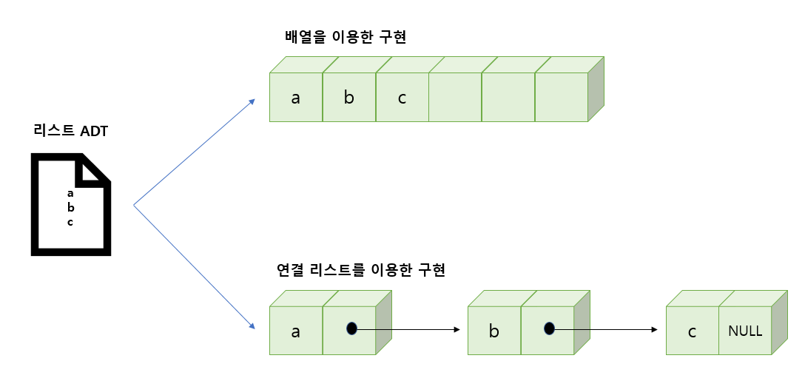

  - 배열을 사용한 리스트 구현
    - 장점은 구현이 간단하고 속도가 빠르다.
    - 단점은 리스트의 크기가 고정된다는 점이다. 즉 배열의 특성상 동적으로 크기를 늘릴거나 줄이는 것이 힘들다. 따라서 만약 데이터를 추가하고 싶은데 더 추가할 공간이 없다면 문제가 발생한다.
    - 더 큰 배열을 만들어 원래 있던 데이터를 복사하여 넣어도 되지만 이것은 CPU 낭비가 된다.
    - 또한 리스트의 중간에 새로운 데이터를 삽입하거나 삭제하기 위해서는 기존의 데이터들을 이동하여야 한다.
  - 연결 리스트를 사용한 리스트 구현
    - 장점은 크기가 제한되지 않고, 중간에 쉽게 삽입하거나 삭제할 수 있는 유연한 리스트를 구현할 수 있다.
    - 단점은 구현이 복잡하고, 임의의 항목(n번쨰)을 추출하려고 할 때는 배열을 사용하는 방법보다 시간이 많이 걸린다.


## 6.2 배열로 구현된 리스트

- 배열을 이용하여 리스트를 구현하면 순차적인 메모리 공간이 할당되므로, 이것을 리스트의 순차적 표현(sequential representation)라고도 한다.


### 리스트의 정의

- 배열로 리스트를 구현하기 위하여 배열과 항목의 개수를 구조체로 묶어서 ArrayListType이라는 새로운 타입을 정의 하도록 하자.

  ```c
  #define MAX_LIST_SIZE 100			//리스트의 최대크기
  
  typedef int element;				// 항목의 크기
  typedef struct{
      element array[MAX_LIST_SIZE];	// 배열 정의
      int size;						// 현재 리스트에 저장된 항목들의 개수
  }ArrayListType;
  ```


### 기초 연산

- 모든 연산은 구조체 포인터를 받는다.

  - 함수 안에서 구조체를 변경할 필요도 있기 때문이다.
  - 포인터를 사용하지 않으면 구조체의 복사본이 전달되어서 원본 구조체를 변경할 수 없다.

  ```c
  // 오류 처리 함수
  void error(char *meassage)
  {
      fprintf(stderr, "%s\n", message);
      exit(1);
  }
  // 리스트 초기화 함수
  void init(ArrayListType *L)
  {
      L->size = 0;
  }
  // 리스트가 비어 있으면 1을 반환
  // 그렇지 않으면 0을 반환
  int is_empty(ArrayListType *L)
  {
      return L->size == 0;
  }
  // 리스트가 가득 차 있으면 1을 반환
  // 그렇지 않으면 0을 반환
  int is_full(ArrayListType *L)
  {
      return L->size == MAX_LIST_SIZE;
  }
  element get_entry(ArrayListType *L, int pos)
  {
      if(pos < 0 || pos >= L->size)
          error("위치 오류");
      return L->array[pos];
  }
  // 리스트 출력
  void print_list(ArrayListType *L)
  {
      int i;
      for(i = 0; i < L->size; i++){
          printf("%d->", L->array[i]);
      }
      printf("\n");
  }
  ```


### 항목 추가 연산

- insert_last() 함수에서는 리스트에 빈공간이 없으면 오류를 발생시킨다.

  ```c
  void insert_last(ArrayListType *L, element item)
  {
      if(L->size >= MAX_LIST_SIZE)
          error("리스트 오버플로우");
      L->array[L->size++] = item;
  }
  ```

- 리스트의 pos 위치에 새로운 항목을 추가하려면 pos부터 마지막 항목까지 한 칸씩 오른쪽으로 이동하여 빈자리를 만든 후에, 새로운 항목을 pos 위치에 저장하여야 한다.

  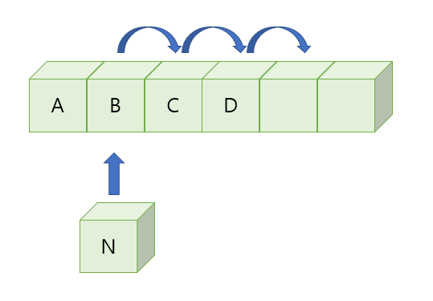

  ```c
  void insert(ArrayListType *L, int pos, element item)
  {
      if(!is_full(L) && (pos >= 0) && (pos <= L->size)){
          for(int i = (L->size-1); L >= pos; i--)
              L->array[i+1] = L->array[i];
          L->array[pos] = item;
          L->size++;
      }
  }
  ```


### 항목 삭제 연산

- pos 위치의 항목을 삭제하는 delete(list, pos) 구현

  - 삽입 연산과 마찬가지로 삭제한 후 array[pos+1] 부터 array[size-1] 까지를 한 칸씩 앞으로 이동해야 한다.

  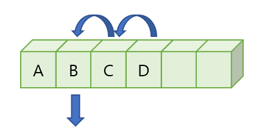

  ```c
  element delete(ArrayListType *L, int pos)
  {
      element item;
      
      if(pos < 0 || pos >= L->size)
          error("위치 오류");
      item = L->array[pos];
      for(int i = pos; i < (L->size-1); i++)
          L->array[i] = L->array[i+1];
      L->size--;
      return item;
  }
  ```


### 실행 시간 분석

- 배열로 구현한 리스트의 시간 복잡도
  - 임의의 항목에 접근하는 연산인 get_entry 연산은 인덱스를 사용하여 항목에 바로 접근할 수 있으므로 명백히 O(1)이다.
  - 삽입이나 삭제 연산은 다른 항목들을 이동하는 경우가 많으므로 최악의 겨우 O(n)이 된다.
  - 하지만 리스트의 맨 끝에 삽입하는 경우는 O(1)이다.


## 6.3 연결 리스트

- **연결된 표현(linked representation)** : 동적으로 크기가 변할 수 있고 삭제나 삽입 시에 데이터를 이동할 필요가 없는 표현

  - 연결된 표현은 포인터를 사용하여 데이터들을 연결한다.
  - 연결된 표현은 널리 사용되며 추상 데이터 타입"리스트"의 구현에만 사용되는 것이 아니고 다른 여러 가지의 자료구조(트리, 그래프, 스택, 큐) 등을 구현하는데도 많이 사용된다.

  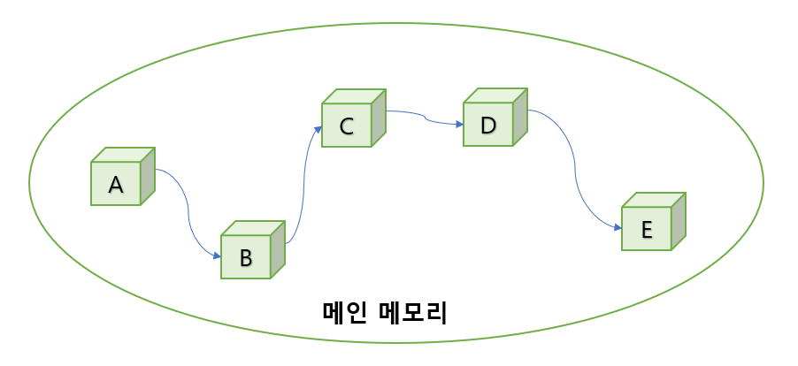

- **연결 리스트(linked list)** : 연결된 표현으로 데이터들은 메인 메모리상의 어디에나 흩어져서 존재하고 물리적으로 흩어져 있는 자료들을 서로 연결하여 하나로 묶는 방법 

  - 연결하는 줄은 **포인터(pointer)**로 구현한다.
  - 삽입 : 연결 리스트에서는 앞뒤에 있는 데이터들을 이동할 필요가 없이 줄만 변경 시켜주면 된다.

  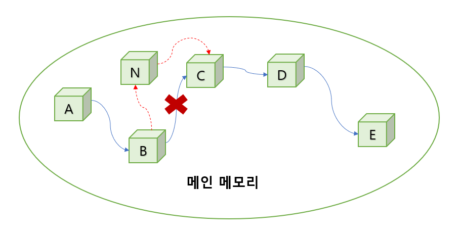

  - 삭제 : 삭제 연산 또한 마찬가지로 데이터들을 옮길 필요가 없이 그냥 데이터들을 연결하는 줄만 수정하면 된다.

  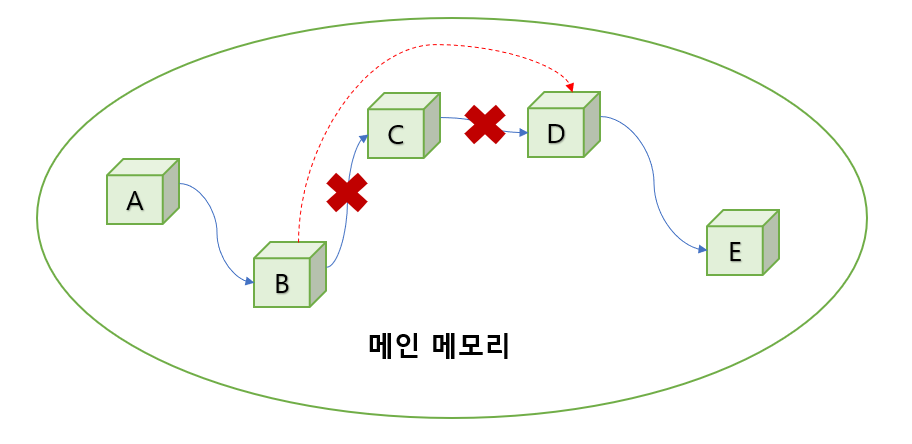

  - 하나의 프로그램 안에 여러개의 연결 리스트가 존재할 때 첫 번째 데이터만 구별하면 다른 데이터들은 줄만 따라가면 얻을 수 있다.
  - 연결 리스트는 데이터를 저장할 공간이 필요할 때마다 동적으로 공간을 만들어서 쉽게 추가할 수 있다.
  - 단점은 배열에 비하여 상대적으로 <span style="color:red">구현이 어렵고 오류가 나기 쉽다</span>. 또 데이터뿐만 아니라 포인터도 저장해야 하므로 <span style="color:red">메모리공간을 많이 사용한다</span>. i번째 데이터를 찾으려면 앞에서부터 <span style="color:red">순차적으로 접근해야 한다</span>.


### 연결 리스트의 구조

- 연결 리스트의 그림에서 상자를 **노드(node)**라고 한다.

  - 연결 리스트는 이들 노드들의 집합이며, 노드들은 메모리의 어떤 위치에나 있을 수 있으며 다른 노드로 가기 위해서는 현재 노드가 가지고 있는 포인터를 이용하면 된다.
  - 노드는 **데이터 필드(data field)**와 **링크 필드(link field)**로 구성되어 있다.

  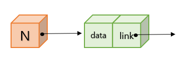

  - 데이터 필드에는 우리가 저장하고 싶은 데이터가 들어간다.
    - 데이터는 정수가 될 수도 있고 구조체와 같은 복잡한 데이터가 될 수도 있다.
  - 링크 필드에는 다른 노드를 가리키는 포인터가 저장된다.
    - 이 포인터를 이용하여 다음 노드로 건너갈 수 있다.
  - 연결 리스트의 첫 번째 노드를 알아야 만이 전체의 노드에 접근할 수 있다.
  - 따라서 연결 리스트마다 첫 번째 노드를 가리키고 있는 변수가 필요한데 이것을 **헤드 포인터(head pointer)**라고 한다.
  - 그리고 마지막 노드의 링크 필드는 NULL로 설정되는데 이는 더 이상 연결된 노드가 없다는 것을 의미한다.
  - 연결 리스트의 노드들은 필요할 때마다 malloc()을 이용하여 동적으로 생성된다.


### 연결 리스트의 종류

- **단순 연결 리스트(singly linked list)** : 하나의 방향으로만 연결되어 있는 연결 리스트이다.

  - 단순 연결 리스트는 체인(chain)이라고도 한다.
  - 단순 연결 리스트에서 마지막 노드의 링크는 NULL값을 가진다.

- **원형 연결 리스트(circular linked list)** : 단순 연결 리스트와 같으나 마지막 노드의 링크가 첫 번째 노드를 가리킨다.

- **이중 연결 리스트(doubly linked list)** : 하나의 링크는 앞에 있는 노드를 가리키고 또 하나의 링크는 뒤에 있는 노드를 가리킨다.

  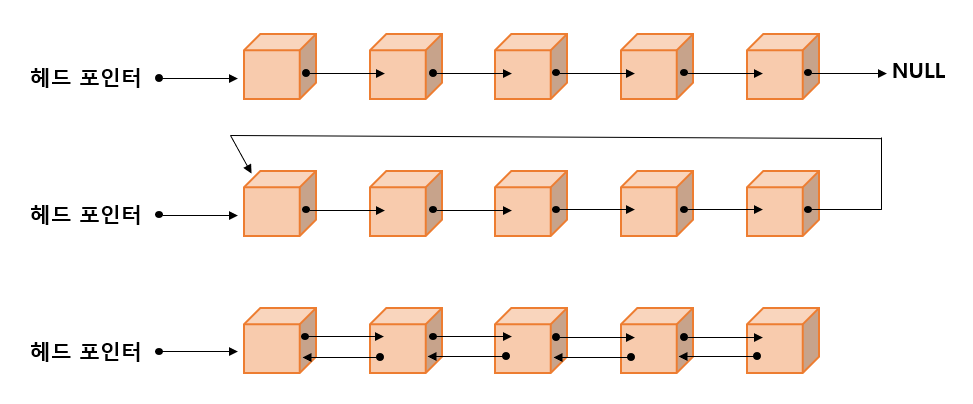


## 6.4 단순 연결 리스트

- **단순 연결 리스트(singly linked list)**
  - 단순 연결 리스트에서는 노드들이 하나의 링크 필드를 가지며 이 링크 필드를 이용하여 모든 노드들이 연결되어 있다.
  - 마지막 노드의 링크 필드 값은 NULL이 된다.

  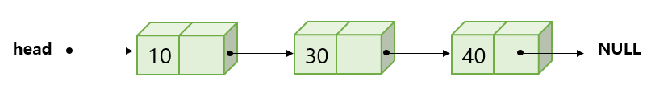


### 노드의 정의

- 노드는 자기 참조 구조체를 이용하여 정의된다.

  - **자기 참조 구조체** : 자기 자신을 참조하는 포인터를 포함하는 구조체이다.
  - 구조체 안에는 데이터를 저장하는 data 필드와 포인터가 저장되어 있는 link 필드가 존재한다.
  - data 필드는 element 타입의 데이터를 저장하고, link 필드는 ListNode를 가리키는 포인터로 정의되며 다음 노드의 주소가 저장된다.

  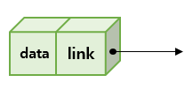

  ```c
  typedef int element;
  typedef struct ListNode{		// 노드 타입을 구조체로 정의한다.
      element data;
      struct ListNode *link;
  }ListNode;
  ```

  - 노드의 구조는 정의하였지만 아직 노드는 생성되지 않았음에 주의해야 한다.


### 공백 리스트의 생성

- 단순 연결 리스트는 헤드 포인터만 있으면 모든 노드를 찾을 수 있다.

  - 따라서 노드를 가리키는 포인터 head를 정의하면 하나의 단순 연결 리스트가 만들어 졌다고 볼 수 있다.
  - head 포인터의 초기화는 NULL로 해준다.

  ```C
  ListNode *head = NULL;
  ```

  - 어떤 리스트가 공백인지 검사하려면 헤드 포인터가 NULL인지를 검사하면 된다.


### 노드의 생성

- 일반적으로 연결 리스트에서는 필요할 때마다 동적 메모리 할당을 이용하여 노드를 동적으로 생성한다.

  

  ```C
  head = (ListNode *)malloc(sizeof(ListNode));
  ```

  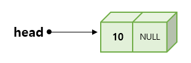

  ```c
  head->data = 10;
  head->link = NULL;
  ```


### 노드의 연결

- 일반적으로 연결 리스트에는 여러 개의 노드가 서로 연결되어 있다 따라서 동일한 방식으로 두 번째 노드를 동적으로 생성한 뒤 첫 번째 노드의 link 필드가 두 번쨰 노드를 가리키게 하면 된다.

  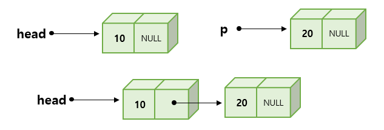

  ```c
  ListNode *p;
  P = (ListNode *)malloc(sizeof(ListNode));
  p->data = 20;
  p->link = NULL;
  
  head->link = p;
  ```


## 6.5 단순 연결 리스트의 연산 구현

- 단순 연결 리스트의 기본 연산

```
insert_first() : 리스트의 시작 부분에 항목을 삽입하는 함수
insert() : 리스트의 중간 부분에 항목을 삽입하는 함수
delete_first() : 리스트의 첫 번째 항목을 삭제하는 함수
delete() : 리스트의 중간 항목을 삭제하는 함수
print_list() : 리스트를 방문하여 모든 항목을 출력하는 함수
```


### 단순 연결 리스트의 정의

- 단순 연결 리스트는 원칙적으로 헤드 포인터만 있으면 된다.

  ```c
  ListNode *head;
  ```


### 삽입 연산 insert_first()

- 단순 연결 리스트의 경우, 리스트의 처음이나 끝에 새로운 노드를 추가하는 경우가 많다.

  - 매개 변수는 head와 새롭게 추가되는 데이터인 value가 필요하다.

  ```c
  ListNode* insert_first(ListNode *head, element value);
  ```

  - 새로운 노드를 하나 생성하고 새로운 노드의 link에 현재의 head 값을 저장한 후에, head를 변경하여 새로 만든 노드를 가리키도록 하면 된다.
  - insert_first()는 변경된 헤드 포인터를 반환한다. 따라서 반환된 값을 헤드포인터에 저장한다.

  .PNG)

  ```c
  ListNode* insert_first(ListNode *head, element value)
  {
      ListNode *p;
      p = (ListNode *)malloc(sizeof(ListNode));
      p->data = value;
      p->link = head;			// (1) 헤드 포인터의 값을 복사
      head = p;				// (2) 헤드 포인터 변경
      return head;			// 변경된 헤드 포인터 반환
  }
  ```


### 삽입 연산 insert()

- insert()는 가장 일반적인 경우로서 연결 리스트의 중간에 새로운 노드를 추가한다.

  - 이때는 반드시 삽입되는 위치의 선행 노드를 알아야 삽입이 가능하기 때문에 pre 포인터 변수가 필요하다.

  .PNG)

  ```c
  // 노드 pre 뒤에 새로운 노드 삽입
  ListNode* insert(ListNode *head, ListNode *pre, int value)
  {
      ListNode *p = (ListNode *)malloc(sizeof(ListNode));
      p->data = value;
      p->link = pre->link;
      pre->link = p;
      return head;
  }
  ```


### delete_first() 함수

- 첫 번째 노드를 삭제하는 함수는 매개 변수로 head만 받으면 된다.

  ```c
  ListNode* delete_first(ListNode *head);
  ```

  .PNG)

  ```c
  ListNode* delete_first(ListNode *head)
  {
      ListNode *removed;
      removed = head->link;
      head = removed->link;
      free(removed);
      return head;
  }
  ```


### 삭제 연산 delete()

- 연결 리스트를 변경할 head와 삭제할 노드의 전에 노드를 매개 변수로 받으면 된다.

  .PNG)

  ```c
  // pre가 가리키는 노드의 다음 노드를 삭제한다.
  ListNode* delete(ListNode *head, ListNode pre)
  {
      ListNode *removed;
      removed = pre->link;
      pre->link = removed->link;
      free(removed);
      return head;
  }
  ```


### print_list() 함수

- 노드를 방문하면서 노드의 데이터를 화면에 출력할 수 있다.

  - 노드의 링크값이 NULL이 아니면 계속 링크를 따라 가면서 노드를 방문한다.
  - 링크값이 NULL이면 연결 리스트의 끝에 도달한 것이므로 반복을 중단한다.

  ```C
  void print_list(ListNode *head)
  {
      for(ListNode *p = head; p != NULL; p = p->link)
          printf("%d->", p->data);
      printf("NULL \n");
  }
  ```