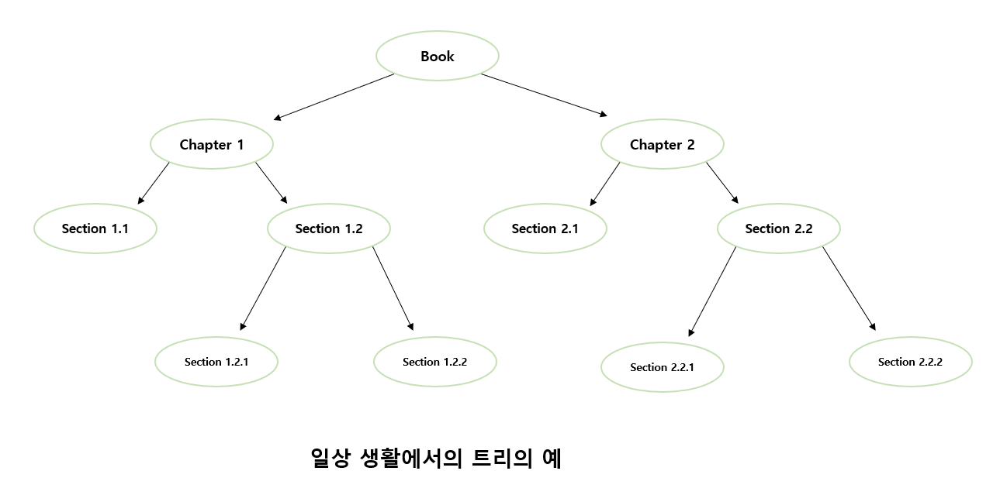
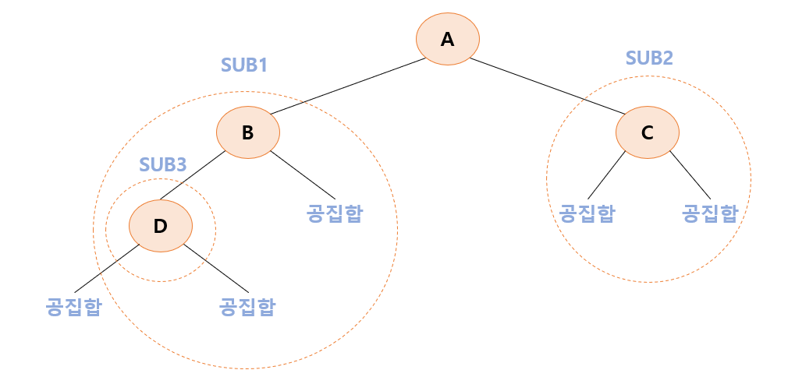
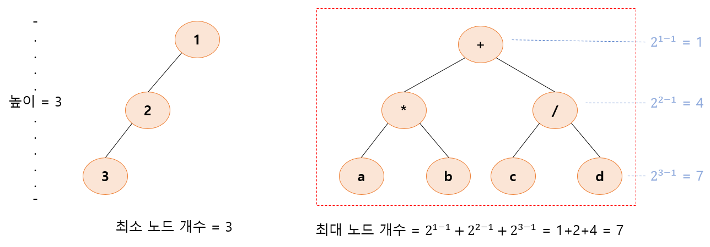
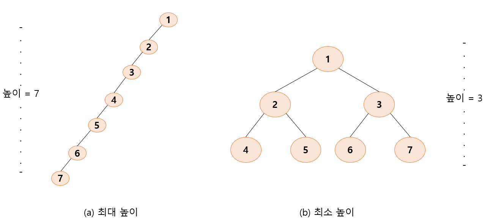
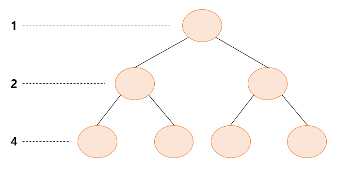
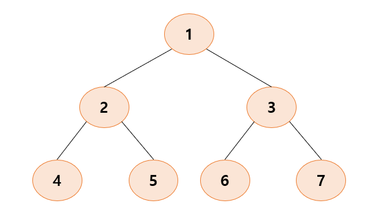
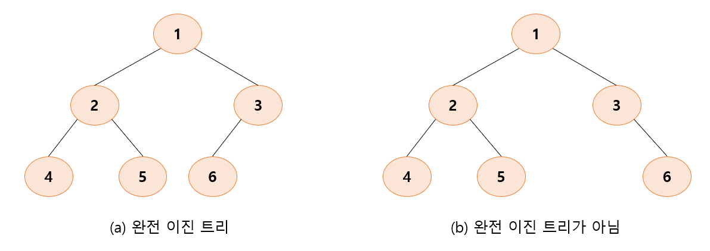

# 8. 트리

## 8.1 트리의 개념

- **선형 자료 구조(linear data structure)** : 자료들이 선형으로 나열되어 있는 구조를 의미한다.

  

- **트리(tree)** : 계층적인 자료를 표현하는데 적합한 자료구조이다.
  
  
  
  - 이러한 구조를 트리라고 부르는 이유는 마치 실제 트리를 거꾸로 엎어놓은 것 같은 모양을 하고 있기 때문이다.
  - 또한 인공 지능 문제에서도 트리가 사용된다.
    - 대표적인 것이 **결정 트리(decision tree)**이다.
    - 결정 트리는 인간의 의사 결정 구조를 표현하는 한 가지 방법이다.
  
  

### 트리의 용어들


- 트리의 구성 요소에 해당하는 A, B, C, D, E, F, G, H, I, J를 노드(node)라 한다.

- 트리는 한 개 이상의 노드로 이루어진 유한 집합이다.

  - 이들 중 하나의 노드는 루트(root) 노드라 불리고 나머지 노드들은 서브 트리(subtree)라고 불린다.
    - 계층적인 구조에서 가장 높은 곳에 있는 노드가 루트가 된다.
    - 전체 노드 집합 {A, B, C, D, E, F, G, H, I, J} 중에서 루트 노드는 A이고 나머지 노드들은 {B, E, F, G}, {C, H}, {D, I, J}로 3개의 집합으로 나누어 지는데 이들을 A의 서브 트리라고 한다.
    - 다시 서브 트리인 {B, E, F, G}의 루트는 B가 되고 나머지 노드들은 다시 3개의 서브 트리, 즉 {E}, {F}, {G}로 나누어진다.
  - 트리에서 루트와 서브 트리는 선으로 연결된다. 이 연결선을 간선(edge)라고 한다.

- 노드들 간에는 부모 관계, 형제 관계, 조상과 자손 관계가 존재한다. 이들은 모두 인간의 관계와 동일하다.

  

  - A는 B의 **부모 노드(parent node)**가 된다.
  - 반대로 B는 A의 **자식 노드(children node)**가 된다.
  - B와 C와 D는 **형제 관계(sibling)**이다.
  - **조상 노드(ancestor node)**란 루트 노드에서 임의의 노드까지의 경로를 이루고 있는 노드들을 말한다.
  - **후손 노드(descendent node)**는 임의의 노드 하위에 연결된 모든 노드들을 의미한다. 즉 어떤 노드의 서브 트리에 속하는 모든 노드들은 후속 노드이다.
  - 자식 노드가 없는 노드를 **단말 노드(terminal node, 또는 leaf node)**라고 한다. 그 반대는 **비단말 노드(nonterminal node)**이다.

  

  - **노드의 차수(degree)**는 어떤 노드가 가지고 있는 자식 노드의 개수를 의미한다.
    - 루트 노드 A의 경우 자식 노드가 3개이기 때문에 차수도 3이 된다.
    - 단말 노드는 차수가 0인 노드이다.
  - 트리의 차수는 트리가 가지고 있는 노드의 차수 중에서 가장 큰 값이다.

  

  - 트리에서의 **레벨(level)**은 트리의 각 층에 번호를 매기는 것으로서 정의에 의하여 루트의 레벨은 1이 되고 한 층씩 내려갈수록 1씩 증가한다.
  - 트리의 **높이(height)**는 트리가 가지고 있는 최대 레벨을 말한다.
  - 트리들의 집합을 **포리스트(forest)**라고 한다.


### 트리의 종류

- 트리를 컴퓨터 메모리상에서 표현하는 방법은 여러가지가 있을 수 있다.

  - 트리를 프로그램 안에서 표현하는 가장 일반적인 방법은 각 노드가 데이터를 저장하는 데이터 필드와 자식 노드를 가리키는 링크 필드를 가지게 하는 것이다.
  - 일반적인 트리에서 각 노드들은 서로 다른 개수의 자식 노드를 가지므로 노드에 따라서 링크 필드의 개수가 달라진다.
  - 이 방법의 문제점은 <span style="color:red">노드의 크기가 고정되지 않는다는 것이다.</span> 즉 노드에 붙어 있는 자식노드의 개수에 따라서 노드의 크기가 커지기도 하고 작아지기도 한다,
  - 노드의 크기가 일정하지 않으면 프로그램이 복잡하게 된다.

  

  - **이진 트리** : 자식 노드의 개수가 2개인 트리

  

## 8.2 이진 트리 소개

### 이진 트리의 정의

- 트리 중에 가장 많이 쓰이는 트리가 이진트리이다.

- **이진 트리(binary tree)** : 모든 노드가 2개의 서브 트리를 가지고 있는 트리

  - 서브 트리는 공집합일 수 있다.
  - 이진 트리의 노드에는  최대 2개까지의 자식 노드가 존재할 수 있고 모든 노드의 차수가 2 이하가 된다.
  - 공집합도 이진 트리라는 점을 주의해야 한다.
  - 이진 트리에는 서브 트리간의 순서가 존재한다. 따라서 왼쪽 서브 트리와 오른쪽 서브 트리는 서로 구별된다.

  

- **이진 트리의 정의**

  > - 공집합
  > - 루트와 왼쪽 서브 트리, 오른쪽 서브 트리로 구성된 노드들의 유한 집합으로 정의된다. 
  > - 이진 트리의 서브 트리들은 모두 이진 트리여야 한다.



```
- SUB3은 하나의 노드 D로만 이루어져 있지만 서브 트리가 공집합이기 때문에 이진 트리이다.
- SUB2는 SUB3과 마찬가지로 서브 트리가 공집합이기 때문에 이진 트리이다.
- SUB1은 SUB3와 공집합으로 서브 트리가 이루어져 있기 때문에 이진 트리이다.
```

- 이진 트리의 모든 노드는 차수가 2 이하이다. 즉 자식 노드의 개수가 2 이하이다. 반면 일반 트리는 자식 노드의 개수에 제한이 없다.

- 일반 트리와는 달리 이진 트리는 노드를 하나도 갖지 않을 수도 있다.

- 서브 트리간에 순서가 존재한다는 점도 다른 점이다. 따라서 왼쪽 서브 트리와 오른쪽 서브 트리를 구별한다.

  

  - 이진 트리의 예로서 수식에서 각 연산자들은 하나 또는 2개의 피연산자를 가지고 있다.
    - 왼쪽 피연산자는 왼쪽 서브 트리가 되고 오른족 피연산자는 오른쪽 서브 트리로 표현된다.


### 이진트리의 성질

- n개의 노드를 가진 이진 트리는 정확하게 n-1의 간선을 가진다.

  - 이진 트리에서의 노드는 루트를 제외하면 정확하게 하나의 부모 노드를 가진다. 부모와 자식 간에는 정확하게 하나의 간선만이 존재한다.

  

  - 높이가 h인 이진 트리의 경우, 최소 h개의 노드를 가지며 최대 2<sup>h</sup>-1 개의 노드를 가진다.

    - 적어도 하나의 노드는 존재해야 하므로 높이가 h인 이진 트리는 적어도 h개의 노드를 가진다.

    - 하나의 노드는 최대 2개의 자식을 가질 수 있으므로 레벨 i에서의 노드의 최대 개수는 2<sup>i-1</sup>이 된다. 따라서 전체 노드 개수는 아래와 같은 수식이 된다.
      $$
      \sum_{i=1}^h 2^{i-1} = 2^h-1
      $$

  

  - n개의 노드를 가지는 이진 트리의 높이는 최대 n이거나 최소 log<sub>2</sub>(n+1)이 된다.
    - 한 레벨 당 최소한 하나의 노드는 있어야 하므로 높이가 n을 넘을 수는 없다.
    - 높이 h의 이진 트리가 가질 수 있는 노드의 최대값은 2<sup>h</sup>-1이다. 따라서 n은 2<sup>h</sup>-1보다 작거나 같은 부등식이 성립하고 양변에 log를 취하여 정리하면 h는 log<sub>2</sub>(n+1)보다 크거나 같은 부등식이 된다.
    - h는 정수이어야 하므로 최소값은 log<sub>2</sub>(n+1)의 절댓값이 된다. 2.4는 올립 연산으로 3이 된다.

  


### 이진 트리의 분류

- 이진 트리는 다음과 같이 형태에 따라 분류할 수 있다.

  - **포화 이진 트리(full binary tree)** : 용어 그대로 트리의 각 레벨에 노드가 꽉 차있는 이진 트리를 의미한다.

    - 높이 k인 포화 이진 트리는 정확하게 2<sup>k</sup>-1개의 노드를 가진다.

    

    - 포화 이진 트리에는 각 노드에 번호를 붙일 수 있다.
      - 노드에 번호를 부여하는 방법은 레벨 단위로 왼쪽에서 오른족으로 번호를 붙이면 된다.

    

  - **완전 이진 트리(complete binary tree)** : 높이가 k일 때 레벨 1부터 k-1까지는 노드가 모두 채워져 있고 마지막 레벨 k에서는 왼쪽부터 오른쪽으로 노드가 순서대로 채워져 있는 이진 트리이다.

    - 마지막 레벨에서는 노드가 꽉차있지 않아도 되지만 중간에 빈곳이 있어서는 안된다.
    - 포화 이진 트리는 항상 완전 이진 트리이지만 그 역은 매번 성립하지는 않는다.
    - 포화 이진 트리의 노드 번호와 완전 이진 트리의 노드 번호는 1대 1로 대응한다.

    

  - 기타 이진 트리


## 8.3 이진 트리의 표현

- 이진 트리를 컴퓨터 프로그램 안에서 표현할 수 있는 방법
  - 배열을 이용하는 방법
  - 포인터를 이용하는 방법


### 배열 표현법

- **배열 표현법** : 주로 포화 이진 트리나 완전 이진 트리의 경우 많이 쓰이는 방법이다.

  - 이진 트리의 깊이가 k이면, 최대 2<sup>k</sup>-1개의 공간을 할당한 다음, 완전 이진 트리의 번호대로 노드들을 저장한다.
    - 여기서 인덱스 0은 사용되지 않는다.
    - 완전 이진 트리가 아닌 일반적인 이진 트리인 경우 배열 표현법을 사용하면 저장할 수는 있지만 기억공간의 낭비가 심해진다.

  

  - 부모 노드와 자식 노드 간의 인덱스 관계

  ```
  - 노드 i의 부모 노드 인덱스 = i/2
  - 노드 i의 왼쪽 자식 인덱스 = 2i
  - 노드 i의 오른쪽 자식 인덱스 = 2i + 1
  ```


### 링크 표현법

- **링크 표현법** : 트리에서의 노드가 구조체로 표현되고, 각 노드가 포인터를 가지고 있어서 포인터를 이용하여 노드와 노드를 연결하는 방법이다.

  - 이진 트리를 링크 표현법으로 표현하면 하나의 노드가 3개의 필드를 가지는데, 데이터를 저장하는 필드, 왼쪽 자식 노드와 오른쪽 자식 노드를 가리키는 2개의 표인터 필드를 가진다.
  - 2개의 포인터를 이용하여 부모 노드와 자식 노드를 연결한다.

  

  

  - 이진 트리를 링크 표현에 의해 나타내기 위해서는 구초제와 포인터 개념을 이용하여야 한다.
    - 구조체를 이용하여 노드의 구조를 정의하고 링크는 포인터의 개념을 이용하여 정의하면 된다.

  ```c
  typedef struct _TreeNode{
      int data;
      struct _TreeNode *left, *right;
  }TreeNode;
  ```

  -  링크법으로 표현된 트리는 루트 노드를 가리키는 포인터만 있으면 트리안의 모든 노드들에 접근할 수 있다.
    - 이것은 연결 리스트와 아주 유사하다. 연결 리스트 또한 포인터에 의해 연결된 구조이기 때문이다.
    - 연결 리스트는 1차원적인 연결된 구조라면 링크법으로 표현된 이진 트리는 2차원적으로 연결된 구조라 할 수 있다.