# 10. 그래프 1

## 10.1 그래프란?

### 그래프의 소개

- **그래프(graph)** : 객체 사이의 연결 관계를 표현할 수 있는 자료구조이다.
  - 그래프의 대표적인 예는 지도인데, 지도를 그래프로 표현하면 지하철의 특정한 역에서 다른 역으로 가는 최단 경로를 쉽게 프로그래밍해서 찾을 수 있다.
  - 전기 소자를 그래프로 표현하게 되면 전기 회로의 소자들이 어떻게 연결되어 있는지를 표현해야 회로가 제대로 동작하는 지 분석할 수 있다.
  - 운영 체제에서는 프로세스와 자원들이 어떻게 연관되는 지를 그래프로 분석하여 시스템의 효율이나 교착상태 유무 등을 알아낼 수 있다.
  - **이러한 많은 문제들은 공통적으로 도시, 소자, 자원, 프로젝트 등의 객체들이 서로 연결되어 있는 구조로 표현 가능하다.** 그래프는 이러한 많은 문제들을 표현할 수 있는 훌륭한 논리적 도구이다.
  - 그래프 구조는 인접 행렬이나 인접 리스트로 메모리에 표현되고 처리될 수 있으므로 광범위한 분야의 다양한 문제들을 그래프로 표현하여 컴퓨터 프로그래밍에 의해 해결할 수 있다.

### 그래프로 표현할 수 있는 것들

- **도로**

  - 도로의 교차점과 일방통행길 등을 그래프로 효과적으로 표현할 수 있다.

  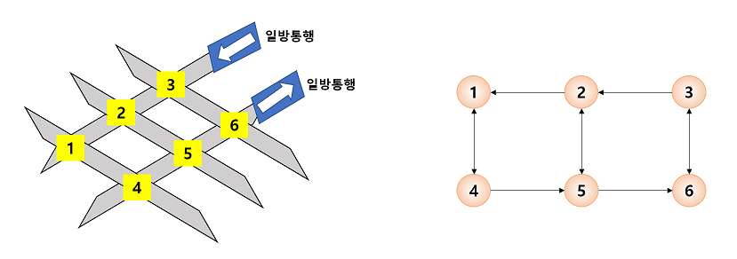

- **미로**

  - 미로도 그래프를 이용하여 효과적으로 표현이 가능하다.

  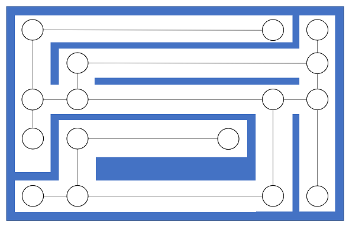

- **선수과목**

  - 대학교에서 전공과목을 수강하기 위해서는 미리 들어야  하는 선수과목들이 있다.
  - 그래프는 이러한 선수과목 관계를 효과적으로 표현할 수 있다.

  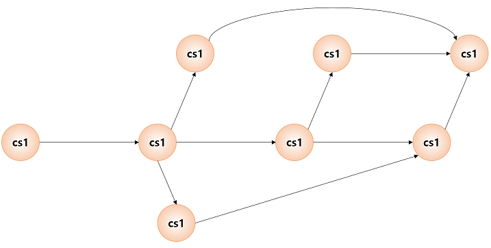


## 10.2 그래프의 정의와 용어

### 그래프의 정의

- 그래프는 정점(vertex)와 간선(edge)들의 유한 집합이라 할 수 있다.

  - 수학적으로 G = (V, E)와 같이 표시한다.
  - V(G)는 그래프 G의 정점들의 집합을, E(G)는 그래프 G의 간선들의 집합을 의미한다.
  - 정점은 여러 가지 특성을 가질 수 있는 객체를 의미하고, 간선은 이러한 정점들 간의 관계를 의미한다.
  - 정점(vertex)는 노드(node)라고도 불리며, 간선(edge)는 링크(link)라고도 불린다.

  

  ```
  V(G1) = {0, 1, 2, 3}
  E(G1) = {(0, 1), (0, 2), (0, 3), (1, 2)}
  ```


### 무방향 그래프와 방향 그래프

- 간선의 종류에 따라 그래프는 **무방향 그래프(undirected graph)**와 **방향 그래프(directed graph)**로 구분된다.

  - 무방향 그래프의 간선은 간선을 통해서 양방향으로 갈 수 있음을 나타내며 정점 A와 정점 B를 연결하는 간선은 (A, B)와 같이 정점의 쌍으로 표현한다.
    - (A, B)와 (B, A)는 동일한 간선이 된다.
  - 방향 그래프는 간선에 방향성이 존재하는 그래프로서 도로의 일방통행길처럼 간선을 통하여 한쪽 방향으로만 갈 수 있음을 나타낸다.
    - 정점 A에서 정점 B로만 갈 수 있는 간선은 <A, B>로 표시된다.
    - 방향 그래프에서 <A, B>와 <B, A>는 서로 다른 간선이다.

  

### 네트워크

- 간선에 가중치를 할당하게 되면, 간선의 역할이 두 정점간의 연결 유무뿐만 아니라 연결 강도까지 나타낼 수 있으므로 보다 복잡한 관계를 표현할 수 있게 된다.

- 이렇게 간선에 비용이나 가중치가 할당된 그래프를 **가중치 그래프(weight graph)** 또는 **네트워크(network)**라 한다.

  - 네트워크는 도시와 도시를 연결하는 도로의 길이, 회로 소자의 용량, 통신망의 사용료 등을 추가로 표현할 수 있으므로 그 응용 분야가 보다 광범위하다.

  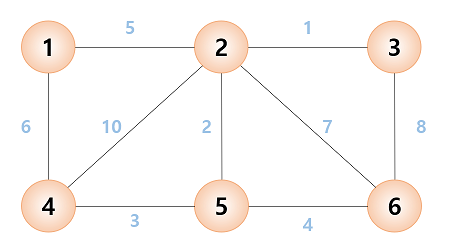

### 부분 그래프

- 그래프의 정점의 일부와 간선의 일부로 이루어진 그래프를 부분 그래프(subgraph)라 한다.

  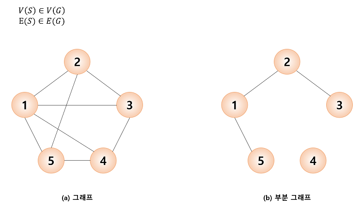

### 정점의 차수

- **인접 정점(adjacent vertex)** : 간선에 의해 직접 연결된 정점을 뜻한다.

- **정점의 차수(degree)** : 그정점에 인접한 정점의 수

  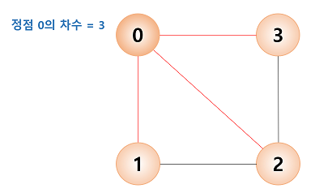

  - 무방향 그래프에서 모든 정점의 차수의 합은 간선 수의 2배가 된다.
    - 하나의 간선이 두 개의 정점에 인접하기 때문이다.
  - 방향 그래프에서는 외부에서 오는 간선의 개수를 진입 차수(in-degree)라 하고 외부로 향하는 간선의 개수를 진출 차수(out-degree)라 한다.

### 경로

- 무방향 그래프에서 정점 s로 부터 정점 e 까지의 경로는 정점의 나열 s, v<sub>1</sub>, v<sub>2</sub>, ... v<sub>k</sub>, e로서, 나열된 정점들 간에는 반드시 간선 (s, v<sub>1</sub>), (v<sub>1</sub>, v<sub>2</sub>), ... , (v<sub>k</sub>, e)가 존재해야 한다.

- 방향 그래프라면 <s, v<sub>1</sub>>, <v<sub>1</sub>, v<sub>2</sub>>, ... , <v<sub>k</sub>, e>가 있어야 한다.

  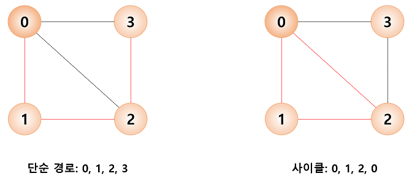

  - 경로 중에서 반복되는 정점이 없을 경우에 이러한 경로를 **단순 경로(simple path)**라 하고, 단순 경로의 시작 정점과 종료 정점이 동일하다면 이러한 경로를 **사이클(cycle)**이라 한다.

### 연결 그래프

- 무방향 그래프 G에 있는 모든 정점쌍에 대하여 항상 경로가 존재한다면 G는 연결되었다고 하며, 이러한 무방향 그래프 G를 **연결 그래프(connected graph)**라 부른다.

  - 트리는 그래프의 특수한 형태로서 사이클을 가지지 않는 연결 그래프이다.

- 그렇지 않은 그래프는 **비연결 그래프(unconnected graph)**라고 한다.

  

### 완전 그래프

- **완전 그래프(complete graph)** : 그래프에 속해있는 모든 정점이 서로 연결되어 있는 그래프

  - 무방향 완전 그래프의 정점 수를 n이라고 하면, 하나의 정점은 n-1개의 다른 정점으로 연결되므로 간선의 수는 n x (n-1) / 2가 된다.

  

### 그래프의 추상 데이터 타입

```
- 객체: 정점의 집합과 간선의 집합
- 연산:
create_graph()		::= 그래프를 생성한다.
init(g)				::= 그래프 g를 초기화한다.
insert_vertex(g, v)	::= 그래프 g에 정점 v를 삽입한다.
insert_edge(g, u, v)::= 그래프 g에 간선(u, v)를 삽입한다.
delete_vertex(g, v)	::= 그래프 g의 정점 v를 삭제한다.
delete_edge(g, u, v)::= 그래프 g의 간선(u, v)를 삭제한다.
is_empty(g)			::= 그래프 g가 공백 상태인지 확인한다.
adjacent(v)			::= 정점 v가 인접한 정점들의 리스트를 반환한다.
destroy_graph(g)	::= 그래프 g를 제거한다.
```


## 10.3 그래프의 표현 방법

- **인접 행렬(adjacency matrix)** : 2차원 배열을 사용하여 그래프를 표현한다.
- **인접 리스트(adjacency list)** : 연결 리스트를 사용하는 그래프를 표현한다.

### 인접 행렬

- 그래프 정점의 수가 n이라면 n x n의 2차원 배열인 인접 행렬(adjacency matrix) M의 각 원소를 다음의 규칙에 의해 할당함으로써 그래프를 메모리에 표현할 수 있다.

  ```
  if(간선 (i, j)가 그래프에 존재)	M[i][j] = 1,
  otherwise					 M[i][j] = 0.
  ```

  - 그래프에서 자체 간선을 허용하지 않는다면 인접 행렬의 대각선 성분은 모두 0으로 표시된다. 따라서 무방향 그래프의 경우 대칭 행렬이 된다.
    - 무방향 그래프에서 (i, j)는 정점 i에서 정점 j로의 연결 뿐만 아니라 정점 j에서 정점 i로의 연결을 동시에 의미하기 때문이다.
  - 하지만 방향 그래프에서는 인접 행렬이 일반적으로 대칭이 아니다.

  

  - n개의 정점을 가지는 그래프를 인접 행렬로 표현하기 위해서는 간선의 수에 무관하게 항상 n<sup>2</sup>개의 메모리 공간이 필요하다.

    - 그래프에 간선이 많이 존재하는 밀집 그래프(dense graph)를 표현하는 경우에는 적합하나, 그래프 내에 적은 숫자의 간선만을 가지는 희소 그래프(sparse graph)의 경우에는 메모리의 낭비가 크므로 적합하지 않다.

  - 인접 행렬을 이용하면 두 정점을 연결하는 간선의 존재 여부를 O(1) 시간 안에 즉시 알 수 있는 장점이 있다. 즉, 정점 u와 정점 v를 연결하는 정점이 있는지를 알려면 행렬 M의 u행 v열의 값을 조사하면 바로 알 수 있다.

  - 정점의 차수는 인접 행렬의 행이나 열을 조사하면 알 수 있으므로 O(n)의 연산에 의해 알 수 있다.

    - 정점 i에 대한 차수는 인접 배열의 i번째 행에 있는 값을 모두 더하면 된다.

    $$
    degree(i) = \sum_{k=0}^{n-1}M[i][k]
    $$

    - 반면에 그래프에 존재하는 모든 간선의 수를 알아내려면 인접 행렬 전체를 조사해야 하므로 n<sup>2</sup>번의 조사가 필요하게 되어 O(n<sup>2</sup>)의 시간이 요구된다.

### 인접 행렬을 이용한 그래프 추상 데이터 타입의 구현

```c
#define MAX_VERTICES 50
typedef struct _GraphType{
    int n;	// 정점의 개수
    int adj_mat[MAX_VERTICES][MAX_VERTICES];
} GraphType;
```

- 이런 식으로 구현하면 한정된 개수의 정점까지만 그래프에 삽입할 수 있다.
  - 만약 동적 배열로 구현한다면 사용자가 정점을 삽입할 때마다 다시 크기를 조정할 수 있을 것이다.
- 정점을 삽입하는 연산은 n을 하나 증가하면 된다.
- 간선을 삽입하는 연산은 adj_mat 행렬에서 start행과 end열 그리고 end행과 start열에 1을 삽입하면 된다.

### 인접 리스트

- 인접 리스트(adjacency list)는 그래프를 표현함에 있어 각각의 정점에 인접한 정점들을 연결 리스트로 표현한 것이다.

  - 각 연결 리스트의 노드들은 인접 정점을 저장하게 된다.
  - 각 연결 리스트들은 헤더 노드를 가지고 있고 이 헤더 노드들은 하나의 배열로 구성되어 있다.
    - 정점의 번호만 알면 이 번호를 배열의 인덱스로 하여 각 정점의 연결 리스트에 쉽게 접근할 수 있다.
  - 무방향 그래프의 경우 정점 i와 정점 j를 연결하는 간선(i, j)는 정점 i의 연결 리스트에 인접 정점 j로서 한번 표현되고, 정점 j의 연결 리스트에 인접 정점 i로 다시 한번 표현된다.
  - 인접 리스트에 정점들이 입력되는 순서에 따라 연결 리스트 내에서 정점들의 순서가 달라질 수 있다.

  

  - 정점의 수가 n개 이고, 간선의 수가 e개인 무방향 그래프를 표시하기 위해서는 n개의 연결 리스트가 필요하고, n개의 헤더 노드와 2e개의 노드가 필요하다.
    - 따라서 인접 리스트 표현은 간선의 개수가 적은 희소 그래프(sparse graph)의 표현에 적합하다.
  - 그래프의 간선(i, j)의 존재 여부나 정점 i의 차수를 알기 위해서는 인접 리스트에서의 정점 i의 연결 리스트를 탐색해야 하므로 연결 리스트에 있는 노드의 수만큼 즉, 정점 차수만큼의 시간이 필요하다.
    - 즉, n개의 정점과 e개의 간선을 가진 그래프에서 전체 간선의 수를 알아내려면 헤더 노드를 포함하여 모든 인접 리스트를 조사해야 하므로 O(n+e)의 연산이 요구된다.

### 인접 리스트를 이용한 그래프 추상 데이터 타입의 구현


## 10.4 그래프의 탐색

- 그래프의 탐색은 가장 기본적인 연산으로서 하나의 정점으로부터 시작하여 차례대로 모든 정점들을 한 번씩 방문하는 것이다.

  - 많은 문제들이 단순히 그래프의 노드를 탐색하는 것으로 해결된다. 대표적으로 특정한 정점에서 다른 정점으로 갈 수 있는지 없는지를 탐색을 통하여 알 수 있다.

  

- 그래프의 탐색 방법은 깊이 우선 탐색과 너비 우선 탐색 두 가지가 있다.

  - **깊이 우선 탐색(depth first search)** : 트리의 경우에서 탐색할 때 시작 정점에서 한 방향으로 계속 가다가 더 이상 갈 수 없게 되면 다시 가장 가까운 갈림길로 돌아와서 다른 방향으로 다시 탐색을 진행하는 방법
  - **너비 우선 탐색(breath first search)** : 시작 정점으로부터 가까운 정점을 먼저 방문하고 멀리 떨어져 있는 정점을 나중에 방문하는 순회 방법

  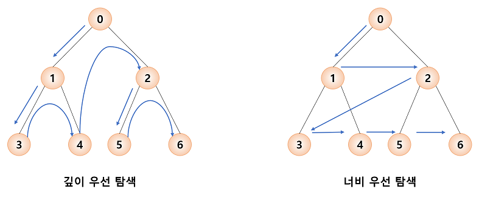


## 10.5 깊이 우선 탐색

- **깊이 우선 탐색**

  > - 깊이 우선 탐색은 그래프의 시작 정점에 출발하여 시작 정점 v를 방문하였다고 표시한다.
  >
  > - v에 인접한 정점들 중에서 아직 방문하지 않은 정점 u를 선택한다.
  >   - 만약 그러한 정점이 없다면 탐색은 종료한다.
  > - 만약 아직 방문하지 않은 정점 u가 있다면 u를 시작 정점으로 하여 깊이 우선 탐색을 다시 시작한다.
  >   - 이 탐색이 끝나게 되면 다시 v에 인접한 정점들 중에서 아직 방문이 안된 정점을 찾는다.
  >   - 만약 없으면 종료하고 있다면 다시 그 정점을 시작 정점으로 하여 깊이 우선 탐색을 시작한다.

  - 깊이 우선 탐색도 자기 자신을 다시 호출하는 순환 알고리즘의 형태를 가지고 있음을 알 수 있다.

  ```
  depth_first_search(v):
  
  	v를 방문되었다고 표시;
  	for all u < (v에 인접한 정점) do
  		if (u가 아직 방문되지 않았으면)
  			then depth_first_search(u)
  ```

  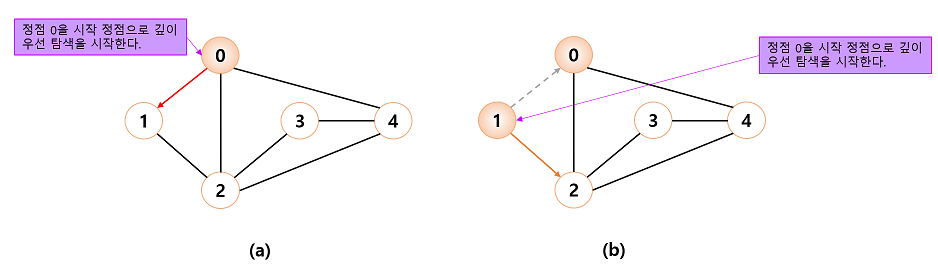

  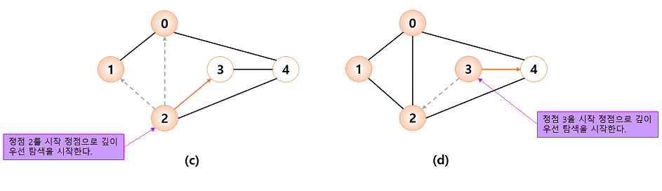

  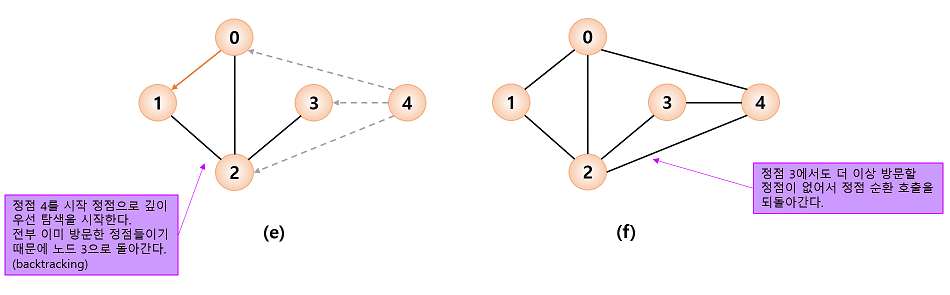

  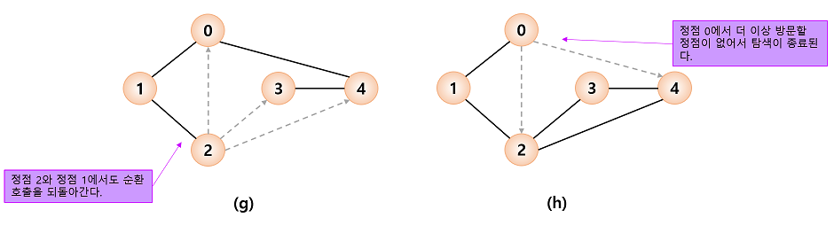

### 깊이 우선 탐색의 구현(인접 행렬)

- 깊이 우선 탐색을 구현하는 데는 2가지 방법이 있는데, 순환 호출을 이용하는 것과 명시적인 스택을 사용하여 인접한 정점들을 스택에 저장하였다가 다시 꺼내어 작업하는 방법이다.
- 순환 호출을 이용하는 방법은 방문 여부를 기록하여야 한다.

[DFS_Adjacency_Matrix](https://github.com/mgstyle97/TIL/blob/master/Data_structure/Graph%201/src/DFS_mat.c)

### 깊이 우선 탐색의 구현(인접 리스트)

- 인접 리스트는 다수의 연결 리스트로 구성되는데, 각 연결 리스트의 노드는 데이터 필드와 링크 필드로 이루어진다.
  - 데이터 필드에는 인접 정점의 번호가 저장되고 링크 필드에는 다음 인접 정점을 가리키는 포인터가 저장된다.
  - 인접 리스트 역시 방문 여부를 기록하여야 한다.

[DFS_Adjacency_List](https://github.com/mgstyle97/TIL/blob/master/Data_structure/Graph%201/src/DFS_list.c)

### 깊이 우선 탐색의 분석

- 깊이 우선 탐색은 그래프의 모든 간선을 조사하므로 정점의 수가 n이고 간선의 수가 e인 그래프인 경우, 그래프가 인접 리스트로 표현되어 있다면, 시간 복잡도가 O(n+e)이다.
- 인접 행렬로 표시되어 있다면 O(n<sup>2</sup>)이다.
  - 희소 그래프인 경우 DFS는 인접 리스트의 사용이 인접 행렬보다 시간적으로 유리함을 뜻한다.


## 10.6 너비 우선 탐색

- **너비 우선 탐색(breath first search)** : 시작 정점으로부터 가까운 정점을 먼저 방문하고 멀리 떨어져 있는 정점을 나중에 방문하는 순회 방법이다.

  

  - 너비 우선 탐색을 위해서는 가까운 거리에 있는 정점들을 차례로 저장한 후 꺼낼 수 있는 자료구조인 큐(queue)가 필요하다.
    - 알고리즘은 큐에서 정점을 꺼내서 정점을 방문하고 인접 정점들을 큐에 추가한다.
    - 큐가 소진될 때까지 동일한 코드를 반복한다.

  ```
  breath_first_search(v):
  
  	v를 방문했다고 표시;
  	큐 Q에 정점 v를 삽입;
  	while(Q가 공백이 아니면) do
  		Q에서 정점 w를 삭제;
  		for all u -> (w에 인접한 정점) do
  			if (u가 아직 방문되지 않았으면)
  				then u를 큐에 삽입;
  					u를 방문되었다고 표시;
  ```

  

  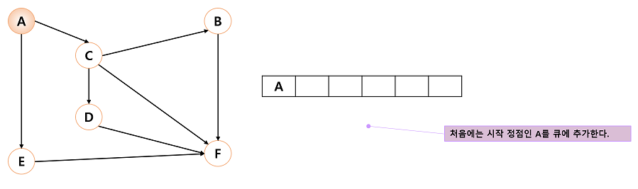

  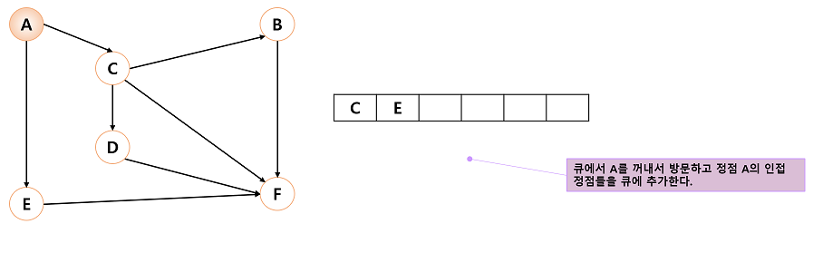

  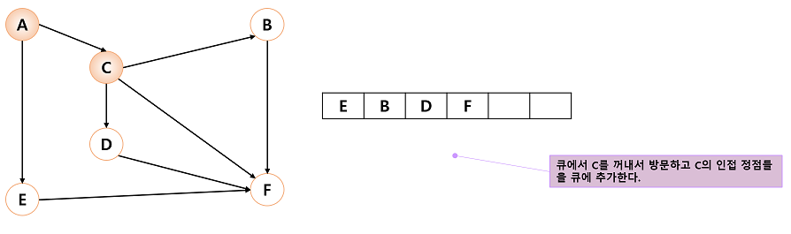

  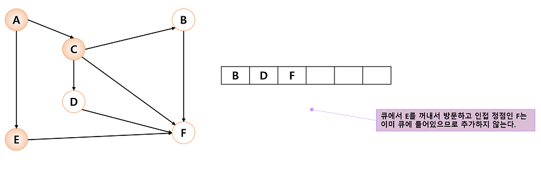

  - 위의 과정을 큐가 공백 상태가 될 때까지 계속한다.
  - 너비 우선 탐색의 특징은 시작 정점으로부터 거리가 가까운 정점의 순서로 탐색이 진행된다는 것이다.

  - 너비 우선 탐색은 거리가 d인 정점을 모두 방문한 후 거리가 d+1인 정점들을 방문해 간다.

### 너비 우선 탐색의 구현(인접 행렬)

- 너비 우선 탐색은 큐를 사용해야 하므로 깊이 우선 탐색보다 코드가 약간 복잡해진다.

[BFS_Adjacency_Matrix](https://github.com/mgstyle97/TIL/blob/master/Data_structure/Graph%201/src/BFS_mat.c)

### 너비 우선 탐색의 구현(인접 리스트)

[BFS_Adjacency_List](https://github.com/mgstyle97/TIL/blob/master/Data_structure/Graph%201/src/BFS_list.c)

### 너비 우선 탐색의 분석

- 너비 우선 탐색은 그래프가 있는 인접 리스트로 표현되어 있으면 전체 수행시간이 O(n+e)이다.
- 인접 행렬로 표현되어 있는 경우는 O(n<sup>2</sup>) 시간이 걸린다.
  - 너비 우선 탐색도 깊이 우선 탐색과 같이 희소 그래프를 사용할 경우 인접 리스트를 사용하는 것이 효율적이다.