# 11. 그래프 2

## 11.1 최소 비용 신장 트리

### 신장 트리

- **신장 트리(spanning tree)** : 그래프 내의 모든 정점을 포함하는 트리이다.

  - 신장 트리는 트리의 특수한 형태이므로 모든 정점들이 연결되어 있어야 하고 또한 사이클을 포함해서는 안 된다.
  - 따라서 신장 트리는 그래프에 있는 n개의 정점을 정확히 (n-1)개의 간선으로 연결하게 된다.
  - 하나의 그래프에는 많은 신장 트리가 존재 가능하다.

  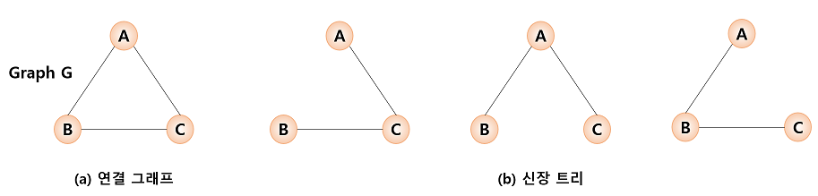

  - 신장 트리는 깊이 우선이나 너비 우선 탐색 도중에 사용된 간선만 모으면 만들 수 있다.
    - 신장 트리를 만들려면 깊이 우선이나 너비 우선 탐색 때 사용한 간선들을 표시하면 된다.

  ```
  depth_first_search(v):
  
  	v를 방문되었다고 표시;
  	for all u => (v에 인접한 정점) do
  		if (u가 아직 방문되지 않았으면)
  			then (v, n)를 신장 트리 간선이라고 표시;
  				depth_first_search(u)
  ```

- 신장 트리는 그래프의 최소 연결 부분 그래프가 된다.

  - 최소의 의미는 간선의 수가 가장 적다는 의미이다.
  - n개의 정점을 가지는 그래프는 최소한 (n-1)개의 간선을 가져야 하며 (n-1)개의 간선으로 연결되어 있으면 필연적으로 트리 형태가 되며 이것은 신장 트리가 된다.
  - 신장 트리는 통신 네트워크 구축에 많이 사용된다.
    - n개의 위치를 연결하는 통신 네트워크를 최소 의 링크를 이용하여 구축하고자 할 경우, 최소 링크 수는 (n-1)이 되고 신장 트리들이 가능한 대안이 된다.

  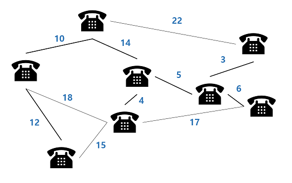

  - 하지만 각 링크의 구축 비용은 똑같지가 않다.
    - 따라서 단순히 가장 적은 링크만을 사용한다고 해서 최소 비용이 얻어지는 것은 아니다.

### 최소 비용 신장 트리

- 통신망, 도로망, 유통망 등은 간선에 가중치가 부여된 네트워크로 표현될 수 있다.

  - 가중치는 길이, 구축 비용, 전송 시간 등을 나타낸다.

- 도로망, 통신망, 유통망을 가장 적은 비용으로 구축하고자 한다면, 네트워크에 있는 모든 정점들을 가장 적은 수의 간선과 비용으로 연결하는 **최소 비용 신장 트리(MST: minimum spanning tree)**가 필요하게 된다.

  - 최소 비용 신장 트리는 신장 트리 중에서 사용된 간선들의 가중치 합이 최소인 신장 트리를 말한다.

  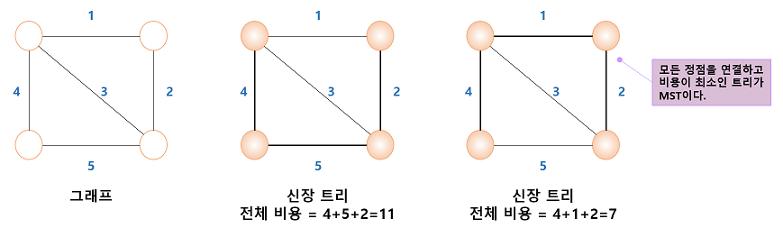

  - 토로 건설 - 도시들을 모두 연결하면서 도로의 길이가 최소가 되도록 하는 문제
  - 전기 회로 - 단자들을 모두 연결하면서 전선의 길이가 가장 최소가 되도록 하는 문제
  - 통신 - 전화선의 길이가 최소가 되도록 전화 케이블 망을 구성하는 문제
  - 배관 - 파이프를 모두 연결하면서 파이프의 총 길이가 최소가 되도록 연결하는 문제

- 최소 비용 신장 트리를 구하는 방법으로는 Kruskal과 Prim이 제안한 알고리즘이 대표적으로 사용되고 있다.

  - 이 알고리즘들은 최소 비용 신장 트리가 간선의 가중치의 합이 최소여야 하며, 반드시 (n-1)개의 간선만 사용해야 하고, 사이클이 포함되서는 안된다는 조건들을 적절히 이용하고 있다.


## 11.2 Kruskal의 MST 알고리즘

- Kruskal의 알고리즘은 탐욕적인 방법(greedy method)을 이용한다.

  - 탐욕적인 방법은 알고리즘 설계에서 있어서 중요한 기법 중의 하나이다.

  > 탐욕적인 방법이란 선택할 때마다 그 순간 가장 좋다고 생각되는 것을 선택함으로써 최종적인 해답에 도달하는 방법이다.
  >
  > - 탐욕적인 알고리즘에서 순간의 선택은 그 당시에는 최적이다.
  >   - 하지만 최적이라고 생각했던 지역적인 해답들을 모으고 최종적인 해답을 만들었다고 해서, 그 해답이 전역적으로 최적이라는 보장은 없다.
  >   - 따라서 최적의 해답을 주는 지를 검증해야 한다.

  - Kruskal의 알고리즘은 최소 비용 신장 트리가 최소 비용의 간선으로 구성됨과 동시에 사이클을 포함하지 않는다는 조건에 근거하여, 각 단계에서 사이클을 이루지 않는 최소 비용 간선을 선택한다.
    - 이러한 과정을 반복함으로써 네트워크의 모든 정점을 최소 비용으로 연결하는 최적 해답을 구할 수 있다.
  - Kruskal의 알고리즘은 먼저 그래프의 간선들을 가중치의 오름차순으로 정렬한다.
  - 정렬된 간선들의 리스트에서 사이클을 형성하지 않는 간선을 찾아서 현재의 최소 비용 신장 트리의 집합에 추가한다.
    - 만약 사이클을 형성하면 그 간선은 집합에서 제외된다.

  ```
  // 최소 비용 신장 트리를 구하는 Kruskal의 알고리즘
  // 입력: 가중치 그래프 G=(V, E), n은 노드의 개수
  // 출력: E, 최소 비용 신장 트리를 이루는 간선들의 집합
  kruskal(G):
  
  	E를 w(e1)<=...<=w(e(e))가 되도록 정렬한다.
  	E <- x; encounter<-()
  	k<-0
  	while encounter<(n-1) do
  		k <- k+1
  		if E U{e(k)}이 사이클을 포함하지 않으면
  			then E<-EU{e(k)}; encounter <- encounter+1
      return E
  ```

  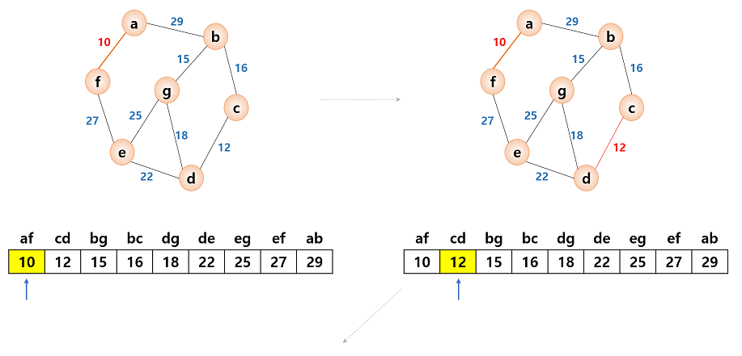

  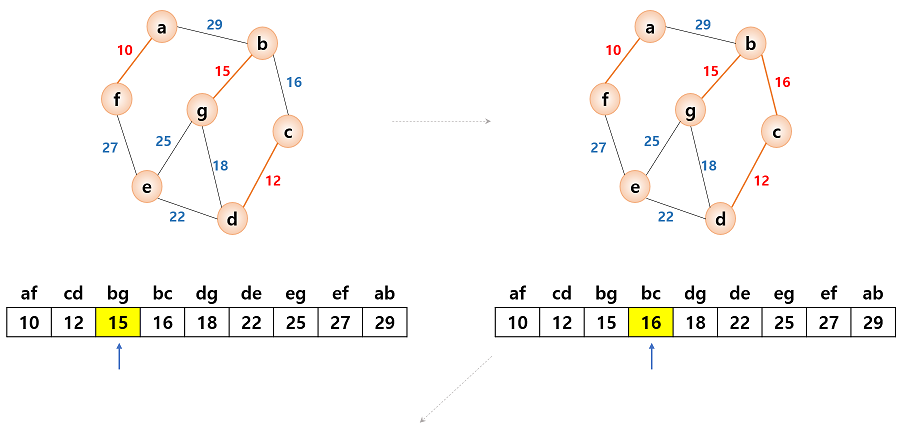

  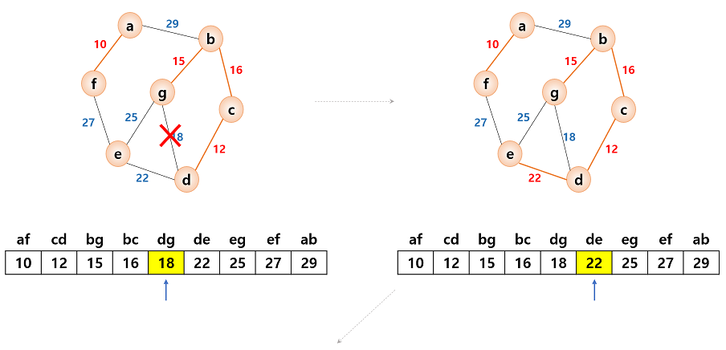

  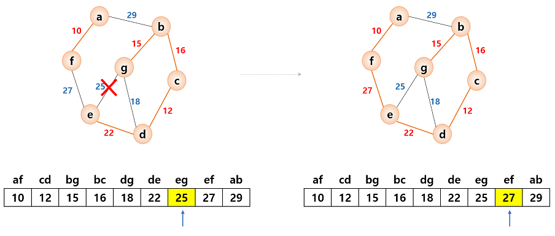

  - Kruskal의 알고리즘은  최소 비용 신장 트리를 구하는 다른 알고리즘보다 간단해 보인다.
    - 하지만 다음 간선을 이미 선택된 간선들의 집합에 추가할 때 사이클을 생성하는 지를 체크하여야 한다.
    - 새로운 간선이 이미 다른 경로에 의하여 연결되어 있는 정점들을 연결할 때 사이클이 형성된다.

  

  - 간선의 양끝 정점이 같은 집합에 속하면 간선을 추가하였을 경우, 사이클이 형성된다.
  - 간선이 서로 다른 집합에 속하는 정점을 연결하면 사이클이 형성되지 않는다.
    - 지금 추가하고자 하는 간선의 양끝 정점이 같은 집합에 속해 있는지를 검사하여야 한다.
    - 검사를 위한 알고리즘을 union-find 알고리즘이라 부른다.

### union-find 연산

- union(x, y) 연산은 원소 x와 y가 속해 있는 집합을 입력으로 받아 2개의 집합의 합집합을 만든다.

  - find(x) 연산은 원소 x가 속해 있는 집합을 반환한다.

  {1}, {2}, {3}, {4}, {5}, {6}

  여기에 union(1, 4)와 union(5, 2)를 하면 다음과 같은 집합으로 변화된다.

  {1, 4}, {5, 2}, {3}, {6}

  이어서 union(4, 5)와 union(3, 6)을 한다면 다음과 같은 결과를 얻을 수 있다.

  {1, 4, 5, 2}, {3, 6}

### union-find 연산의 구현

- 집합을 구현하는 데는 여러 가지 방법이 있다. 즉, 비트 벡터, 배열, 연결 리스트를 이용하여 구현될 수 있다.
  - 그러나 가장 효율적인 방법은 트리 형태를 사용하는 것이다.
  - 부모 노드만 알면 되므로 "부모 포인터 표현"을 사용한다.
    - "부모 포인터 표현"이란 각 노드에 대해 그 노드의 부모에 대한 포인터만 저장하는 것이다.
    - 이것은 일반적인 목적에는 부적합하다. 즉, 노드의 가장 왼쪽 자식 또는 오른쪽 자식을 찾는 것과 같은 중요한 작업에는 부적절하기 때문이다.
  - 부모 노드 포인터표현은 포인터를 사용하지 않고 1차원 배열로 구현이 가능하다.
    - 배열은 부모 노드의 인덱스를 저장한다. 
    - 배열의 값이 -1이면 부모 노드가 없다.
  
  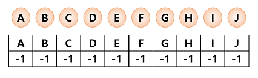
  
  ​		union-find(A, B) 실행
  
  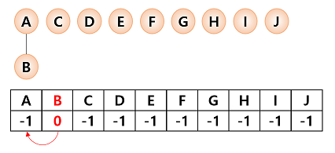
  
  ​	union-find(C, H) 실행
  
  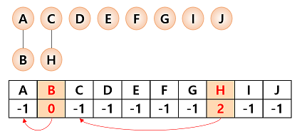
  
  - union-find 알고리즘 유사코드
  
  ````
  UNION(a, b):
  	root1 = FIND(a);	// 노드 a의 루트를 찾는다.
  	root2 = FIND(b);	// 노드 b의 루트를 찾는다.
  	if root1 != root2
  		parent[root1] = root2;
  		
      FIND(curr):		// curr의 루트를 찾는다.
      if (parent[curr] == -1)
      	return curr;	//루트
      while (parent[curr] != -1) curr = parent[curr];
      return curr;
  ````

### 시간 복잡도 분석

- union-find 알고리즘을 이용하면 Kruskal의 알고리즘의 시간 복잡도는 간선들을 정렬하는 시간에 좌우된다.
  - 효율적인 정렬 알고리즘을 사용한다면 Kruskal의 알고리즘의 시간 복잡도는 (|e|log<sub>2</sub>|e|)이다.


## 11.3 Prim의 MST 알고리즘

- Prim의 알고리즘은 시작 정점에서부터 출발하여 신장 트리 집합을 단계적으로 확장해나가는 방법이다.

  - 시작 단계에서는 시작 정점만이 신장 트리 집합에 포함된다.
  - 앞 단계에서 만들어진 신장 트리 집합에, 인접한 정점들 중에서 최저 간선으로 연결된 정점을 선택하여 트리를 확장한다.

  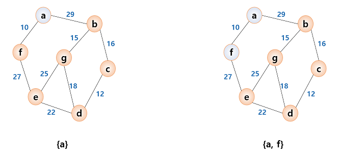

  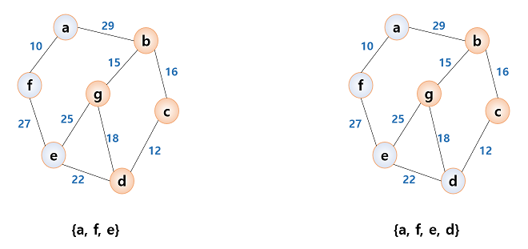

  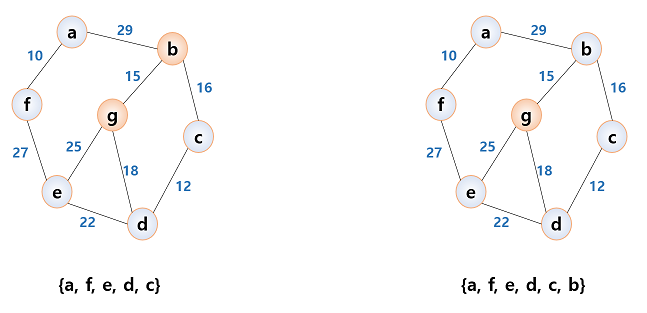

  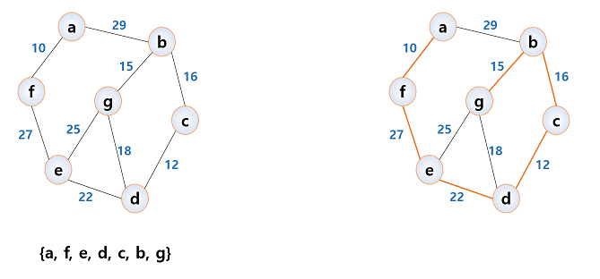

  - Kruskal의 알고리즘과 비교를 해보면 먼저 Kruskal의 알고리즘은 간선을 기반으로 하는 알고리즘인 반면 Prim의 알고리즘은 정점을 기반으로 하는 알고리즘 이다.
    - 또한 Kruskal의 알고리즘에서는 이전 단계에서 만들어진 신장 트리와는 상관없이 무조건 최저 간선만을 선택하는 방법인 반면에 Prim의 알고리즘은 이전 단계에서 만들어진 신장 트리를 확장하는 방식이다.

  ```
  // 최소 비용 신장 트리를 구하는 Prim의 알고리즘
  // 입력: 네트워크 G=(V, E), S는 시작 정점
  // 출력: V, 최소 비용 신장 트리를 이루는 정점등의 집합
  Prim(G, s):
  
  	V <-{s}: vcounter<-1
  	while vcounter < n do
  		(u, v)는 u->V and v !->V인 최저 비용 간선;
  		if(그러한 (u, v)가 존재하면)
  			then V <- (V U v); vcounter <- vcounter + 1
          else 실패
      return V
  ```

  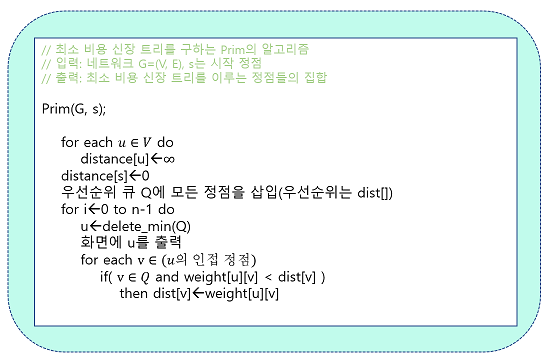

### Prim의 알고리즘 분석

- Prim의 알고리즘은 주 반복문이 정점의 수 n만큼 반복하고, 내부 반복문이 n번 반복하므로 Prim의 알고리즘은 O(n<sup>2</sup>)의 복잡도를 그린다.
- Kruskal의 알고리즘은 복잡도가 O(elog<sub>2</sub>e)이므로 희소 그래프를 대상으로 할 경우에는 Kruskal의 알고리즘이 적합하고, 밀집 그래프의 경우에는 Prim의 알고리즘이 유리하다고 할 수 있다.