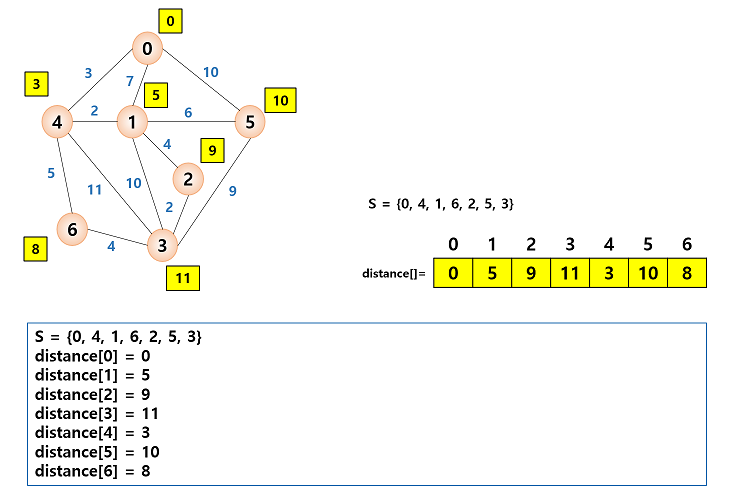

# 11. 그래프 2

## 11.1 최소 비용 신장 트리

### 신장 트리

- **신장 트리(spanning tree)** : 그래프 내의 모든 정점을 포함하는 트리이다.

  - 신장 트리는 트리의 특수한 형태이므로 모든 정점들이 연결되어 있어야 하고 또한 사이클을 포함해서는 안 된다.
  - 따라서 신장 트리는 그래프에 있는 n개의 정점을 정확히 (n-1)개의 간선으로 연결하게 된다.
  - 하나의 그래프에는 많은 신장 트리가 존재 가능하다.

  

  - 신장 트리는 깊이 우선이나 너비 우선 탐색 도중에 사용된 간선만 모으면 만들 수 있다.
    - 신장 트리를 만들려면 깊이 우선이나 너비 우선 탐색 때 사용한 간선들을 표시하면 된다.

  ```
  depth_first_search(v):
  
  	v를 방문되었다고 표시;
  	for all u => (v에 인접한 정점) do
  		if (u가 아직 방문되지 않았으면)
  			then (v, n)를 신장 트리 간선이라고 표시;
  				depth_first_search(u)
  ```

- 신장 트리는 그래프의 최소 연결 부분 그래프가 된다.

  - 최소의 의미는 간선의 수가 가장 적다는 의미이다.
  - n개의 정점을 가지는 그래프는 최소한 (n-1)개의 간선을 가져야 하며 (n-1)개의 간선으로 연결되어 있으면 필연적으로 트리 형태가 되며 이것은 신장 트리가 된다.
  - 신장 트리는 통신 네트워크 구축에 많이 사용된다.
    - n개의 위치를 연결하는 통신 네트워크를 최소 의 링크를 이용하여 구축하고자 할 경우, 최소 링크 수는 (n-1)이 되고 신장 트리들이 가능한 대안이 된다.

  

  - 하지만 각 링크의 구축 비용은 똑같지가 않다.
    - 따라서 단순히 가장 적은 링크만을 사용한다고 해서 최소 비용이 얻어지는 것은 아니다.

### 최소 비용 신장 트리

- 통신망, 도로망, 유통망 등은 간선에 가중치가 부여된 네트워크로 표현될 수 있다.

  - 가중치는 길이, 구축 비용, 전송 시간 등을 나타낸다.

- 도로망, 통신망, 유통망을 가장 적은 비용으로 구축하고자 한다면, 네트워크에 있는 모든 정점들을 가장 적은 수의 간선과 비용으로 연결하는 **최소 비용 신장 트리(MST: minimum spanning tree)**가 필요하게 된다.

  - 최소 비용 신장 트리는 신장 트리 중에서 사용된 간선들의 가중치 합이 최소인 신장 트리를 말한다.

  

  - 토로 건설 - 도시들을 모두 연결하면서 도로의 길이가 최소가 되도록 하는 문제
  - 전기 회로 - 단자들을 모두 연결하면서 전선의 길이가 가장 최소가 되도록 하는 문제
  - 통신 - 전화선의 길이가 최소가 되도록 전화 케이블 망을 구성하는 문제
  - 배관 - 파이프를 모두 연결하면서 파이프의 총 길이가 최소가 되도록 연결하는 문제

- 최소 비용 신장 트리를 구하는 방법으로는 Kruskal과 Prim이 제안한 알고리즘이 대표적으로 사용되고 있다.

  - 이 알고리즘들은 최소 비용 신장 트리가 간선의 가중치의 합이 최소여야 하며, 반드시 (n-1)개의 간선만 사용해야 하고, 사이클이 포함되서는 안된다는 조건들을 적절히 이용하고 있다.


## 11.2 Kruskal의 MST 알고리즘

- Kruskal의 알고리즘은 탐욕적인 방법(greedy method)을 이용한다.

  - 탐욕적인 방법은 알고리즘 설계에서 있어서 중요한 기법 중의 하나이다.

  > 탐욕적인 방법이란 선택할 때마다 그 순간 가장 좋다고 생각되는 것을 선택함으로써 최종적인 해답에 도달하는 방법이다.
  >
  > - 탐욕적인 알고리즘에서 순간의 선택은 그 당시에는 최적이다.
  >   - 하지만 최적이라고 생각했던 지역적인 해답들을 모으고 최종적인 해답을 만들었다고 해서, 그 해답이 전역적으로 최적이라는 보장은 없다.
  >   - 따라서 최적의 해답을 주는 지를 검증해야 한다.

  - Kruskal의 알고리즘은 최소 비용 신장 트리가 최소 비용의 간선으로 구성됨과 동시에 사이클을 포함하지 않는다는 조건에 근거하여, 각 단계에서 사이클을 이루지 않는 최소 비용 간선을 선택한다.
    - 이러한 과정을 반복함으로써 네트워크의 모든 정점을 최소 비용으로 연결하는 최적 해답을 구할 수 있다.
  - Kruskal의 알고리즘은 먼저 그래프의 간선들을 가중치의 오름차순으로 정렬한다.
  - 정렬된 간선들의 리스트에서 사이클을 형성하지 않는 간선을 찾아서 현재의 최소 비용 신장 트리의 집합에 추가한다.
    - 만약 사이클을 형성하면 그 간선은 집합에서 제외된다.

  ```
  // 최소 비용 신장 트리를 구하는 Kruskal의 알고리즘
  // 입력: 가중치 그래프 G=(V, E), n은 노드의 개수
  // 출력: E, 최소 비용 신장 트리를 이루는 간선들의 집합
  kruskal(G):
  
  	E를 w(e1)<=...<=w(e(e))가 되도록 정렬한다.
  	E <- x; encounter<-()
  	k<-0
  	while encounter<(n-1) do
  		k <- k+1
  		if E U{e(k)}이 사이클을 포함하지 않으면
  			then E<-EU{e(k)}; encounter <- encounter+1
      return E
  ```

  

  

  

  

  - Kruskal의 알고리즘은  최소 비용 신장 트리를 구하는 다른 알고리즘보다 간단해 보인다.
    - 하지만 다음 간선을 이미 선택된 간선들의 집합에 추가할 때 사이클을 생성하는 지를 체크하여야 한다.
    - 새로운 간선이 이미 다른 경로에 의하여 연결되어 있는 정점들을 연결할 때 사이클이 형성된다.

  

  - 간선의 양끝 정점이 같은 집합에 속하면 간선을 추가하였을 경우, 사이클이 형성된다.
  - 간선이 서로 다른 집합에 속하는 정점을 연결하면 사이클이 형성되지 않는다.
    - 지금 추가하고자 하는 간선의 양끝 정점이 같은 집합에 속해 있는지를 검사하여야 한다.
    - 검사를 위한 알고리즘을 union-find 알고리즘이라 부른다.

### union-find 연산

- union(x, y) 연산은 원소 x와 y가 속해 있는 집합을 입력으로 받아 2개의 집합의 합집합을 만든다.

  - find(x) 연산은 원소 x가 속해 있는 집합을 반환한다.

  {1}, {2}, {3}, {4}, {5}, {6}

  여기에 union(1, 4)와 union(5, 2)를 하면 다음과 같은 집합으로 변화된다.

  {1, 4}, {5, 2}, {3}, {6}

  이어서 union(4, 5)와 union(3, 6)을 한다면 다음과 같은 결과를 얻을 수 있다.

  {1, 4, 5, 2}, {3, 6}

### union-find 연산의 구현

- 집합을 구현하는 데는 여러 가지 방법이 있다. 즉, 비트 벡터, 배열, 연결 리스트를 이용하여 구현될 수 있다.
  - 그러나 가장 효율적인 방법은 트리 형태를 사용하는 것이다.
  - 부모 노드만 알면 되므로 "부모 포인터 표현"을 사용한다.
    - "부모 포인터 표현"이란 각 노드에 대해 그 노드의 부모에 대한 포인터만 저장하는 것이다.
    - 이것은 일반적인 목적에는 부적합하다. 즉, 노드의 가장 왼쪽 자식 또는 오른쪽 자식을 찾는 것과 같은 중요한 작업에는 부적절하기 때문이다.
  - 부모 노드 포인터표현은 포인터를 사용하지 않고 1차원 배열로 구현이 가능하다.
    - 배열은 부모 노드의 인덱스를 저장한다. 
    - 배열의 값이 -1이면 부모 노드가 없다.
  
  
  
  ​		union-find(A, B) 실행
  
  
  
  ​	union-find(C, H) 실행
  
  
  
  - union-find 알고리즘 유사코드
  
  ````
  UNION(a, b):
  	root1 = FIND(a);	// 노드 a의 루트를 찾는다.
  	root2 = FIND(b);	// 노드 b의 루트를 찾는다.
  	if root1 != root2
  		parent[root1] = root2;
  		
      FIND(curr):		// curr의 루트를 찾는다.
      if (parent[curr] == -1)
      	return curr;	//루트
      while (parent[curr] != -1) curr = parent[curr];
      return curr;
  ````

### 시간 복잡도 분석

- union-find 알고리즘을 이용하면 Kruskal의 알고리즘의 시간 복잡도는 간선들을 정렬하는 시간에 좌우된다.
  - 효율적인 정렬 알고리즘을 사용한다면 Kruskal의 알고리즘의 시간 복잡도는 (|e|log<sub>2</sub>|e|)이다.


## 11.3 Prim의 MST 알고리즘

- Prim의 알고리즘은 시작 정점에서부터 출발하여 신장 트리 집합을 단계적으로 확장해나가는 방법이다.

  - 시작 단계에서는 시작 정점만이 신장 트리 집합에 포함된다.
  - 앞 단계에서 만들어진 신장 트리 집합에, 인접한 정점들 중에서 최저 간선으로 연결된 정점을 선택하여 트리를 확장한다.

  

  

  

  

  - Kruskal의 알고리즘과 비교를 해보면 먼저 Kruskal의 알고리즘은 간선을 기반으로 하는 알고리즘인 반면 Prim의 알고리즘은 정점을 기반으로 하는 알고리즘 이다.
    - 또한 Kruskal의 알고리즘에서는 이전 단계에서 만들어진 신장 트리와는 상관없이 무조건 최저 간선만을 선택하는 방법인 반면에 Prim의 알고리즘은 이전 단계에서 만들어진 신장 트리를 확장하는 방식이다.

  ```
  // 최소 비용 신장 트리를 구하는 Prim의 알고리즘
  // 입력: 네트워크 G=(V, E), S는 시작 정점
  // 출력: V, 최소 비용 신장 트리를 이루는 정점등의 집합
  Prim(G, s):
  
  	V <-{s}: vcounter<-1
  	while vcounter < n do
  		(u, v)는 u->V and v !->V인 최저 비용 간선;
  		if(그러한 (u, v)가 존재하면)
  			then V <- (V U v); vcounter <- vcounter + 1
          else 실패
      return V
  ```

  

### Prim의 알고리즘 분석

- Prim의 알고리즘은 주 반복문이 정점의 수 n만큼 반복하고, 내부 반복문이 n번 반복하므로 Prim의 알고리즘은 O(n<sup>2</sup>)의 복잡도를 그린다.
- Kruskal의 알고리즘은 복잡도가 O(elog<sub>2</sub>e)이므로 희소 그래프를 대상으로 할 경우에는 Kruskal의 알고리즘이 적합하고, 밀집 그래프의 경우에는 Prim의 알고리즘이 유리하다고 할 수 있다.


## 11.4 최단 경로

- **최단 경로(shortest path)** 문제는 네트워크에서 정점 i와 정점 j를 연결하는 경로 중에서 간선들의 가중치 합이 최소가 되는 경로를 찾는 분제이다.

  - 간선의 가중치는 비용, 거리, 시간 등을 나타낸다.
  - 지도를 나타내는 그래프에서 정점은 각 도시들을 나타내고 가중치는 한 도시에서 다른 도시로 가는 거리를 의미힌다.

  

  - 최단 경로 알고리즘에는 2가지 알고리즘이 있다.
    - **Dijkstra** 알고리즘은 하나의 시작 정점에서 다른 정점까지의 최단 경로를 구한다.
    - **Floyd** 알고리즘은 모든 정점에서 다른 모든 정점까지의 최단 경로를 구한다.
  - 가중치는 가중치 인접 행렬에 저장되어 있다고 가정한다.
    - 인접 행렬과 가중치 인접 행렬의 차이점은 인접 행렬애서 간선이 없으면 인접 행렬의 값은 0이었지만, 가중치 인접 행렬에서 간선이 없으면 무한대의 값을 준다.

## 11.5 Dijkstra의 최단 경로 알고리즘

- Dijkstra의 최단 경로 알고리즘은 네트워크에서 하나의 시작 정점으로부터 모든 다른 정점까지의 최단 경로를 찾는 알고리즘이다.

  - 최단 경로는 경로의 길이 순으로 구해진다.

  > 먼저 집합 S를 시작 정점 v로부터의 최단 경로가 이미 발견된 정점들의 집합이라고 하자.
  >
  > Dijkstra의 알고리즘에서는 시작 정점에서 집합 S에 있는 정점만을 거쳐서 다른 정점으로 가는 최단 거리를 기록하는 배열이 있어야 한다. 이 1차원 배열을 distance라고 한다.
  >
  > 시작 정점을 v라 하면 distance[v] = 0이고 다른 정점에 대한 distance 값은 시작 정점과 해당 정점간의 가중치 값이 된다.
  >
  > 가중치는 보통 가중치 인접 행렬에 저장되므로 가중치 인접 행렬을 weight이라 하면 distance[w] = weight v에서 w로의 가중치가 된다.
  >
  > 정점 v에서 정점 w로의 직접 간선이 없을 경우에는 무한대의 값을 저장한다.
  >
  > - 시작 단계에서는 아직 최단 경로가 발견된 정점이 없으므로 S = {v}일 것이다.
  >   - 즉 처음에는 시작 정점 v를 제외하고는 최단거리가 알려진 정점이 없다.
  >   - 알고리즘이 진행되면서 최단 거리가 발견되는 정점들이 S에 추가될 것이다.
  >
  > 
  >
  > - 알고리즘의 각 단계에서 S안에 있지 않은 정점 중에서 가장 distance 값이 작은 정점을 S에 추가한다.
  >   - 현재 S에 들어있지 않은 정점중에서 distance 값이 가장 작은 값을 u라고 했을 때 v에서 u까지의 직접적인 거리가 최단 경로가 된다.
  > - 따라서 매 단계에서 집합 S에 속하지 않는 속하지 않는 정점 중세어 distance 값이 가장 작은 정점들을 추가해나가면 시작 정점에서 모든 정점까지의 최단 거리를 구할 수 있다.
  >
  > - 새로운 정점 u가 S에 추가되면, S에 있지 않은 다른 정점들의 distance 값을 수정한다.
  >   - 새로 추가된 정점 u를 거쳐서 정점까지 가는 거리와 기존의 거리를 비교하여 더 작은 거리로 distance 값을 수정한다.
  >
  > ```
  > distance[w] = min(distance[w], distance[u] + weight[u][w])
  > ```
  >
  > 

  ```
  // 입력: 가중치 그래프 G, 가중치는 음수가 아님.
  // 출력: distance 배열, distance[u]는 v에서 u까지의 최단 거리이다.
  shortest_path(G, v):
  
  	S<-{v}
  	for 각 정점 w => G do
  		distance[w]<-weight[v][w];
      while 모든 정점이 S에 포함되지 않으면 do
      	u<-집합 S에 속하지 않는 정점 중에서 최소 distance 정점;
      	S<-S U {u}
      	for u에 인접하고 S에 있는 각 정점 z do
      		if distacne[u] + weight[u][z] < distacne[z]
      			then distance[z]<-distance[u]+weight[u][z];
  ```

  - **STEP 1**: 집합 S와 distance의 초기값

  

  - **STEP 2**: 시작 정점인 0으로부터 최단 경로에 있는 정점을 찾고 집합 S에 추가한 뒤 distance 배열을 찾아낸 정점을 기준으로 최신화 한다.

  

  - 이후의 단계에서는 앞선 STEP 2의 과정을 반복하여 모든 정점에 최단 경로를 찾을 때 까지 진행한다.
  - **STEP 3**
  
  
  
  - **STEP 4**
  
  
  
  - **STEP 5**
  
  
  
  - **STEP 6**
  
  
  
  - **STEP 7**
  
  

### Dijkstra의 분석

- 네트워크에 n개의 정점이 있다면, 최단 경로 알고리즘은 주 반복문을 n번 반복하고 내부 반복문을 2n번 반복하므로 O(n<sup>2</sup>)의 복잡도를 가진다.

## 11.6 Floyd의 최단 경로 알고리즘

- Floyd의 최단 경로 알고리즘은 그래프에 존재하는 모든 정점 사이의 최단 경로를 한 번에 모두 찾아주는 알고리즘이다.

  - Floyd의 최단 경로 알고리즘은 2차원 배열 A를 이용하여 3중 반복을 하는 루프로 구성되어 있다.
  - 먼저 인접 행렬 weight는 다음과 같이 구성된다.
    - 행과 열 또는 두 개의 정점을 뜻하는 i와 j가 같다면 weight에서 i에서 j까지의 가중치는 0이 된다.
    - 두 개의 정점 i, j사이에 간선이 존재하지 않으면 weight에서 i에서 j까지의 가중치는 무한대가 된다.
    - 정점 i, j 사이에 가중치가 존재한다면 물론 weight에서 i에서 j까지의 가중치는 간선(i, j)의 가중치가 된다.

  ```
  floyd(G):
  
  	for k <- 0 to n-1
  		for i <- 0 to n-1
  			for j <- 0 to n-1
  				A[i][j] = min(A[i][j], A[i][k] + A[k][j])
  ```

  - A는 0부터 k-1까지 존재하게 된다.
    - 여기서 각각의 숫자들이 의미하는 것은 해당 정점을 이용한 경로를 의미한다.
    - 그렇다면 최종적으로 우리가 원하는 최단 경로 알고리즘의 2차원 배열은 A<sup>k-1</sup>이 된다.
      - 왜냐하면 정점의 개수가 k개 이면 정점은 0부터 k-1까지 존재하게 된다. 즉, 0부터 시작하여 마지막 정점은 k-1까지 순차적으로 모든 정점을 이용하게 되는 것이기 때문이다.
  - Floyd 알고리즘의 핵심적인 내용은 A<sup>-1</sup>-> A<sup>0</sup>-> A<sup>1</sup>-> ... A<sup>k-2</sup>-> A<sup>k-1</sup> 이 된다. 여기서 -1일 때의 2차원 배열이 가리키는 것은 초기의 weight 배열을 뜻한다.
  - A<sup>k-1</sup> 까지 완벽한 최단 거리가 구해져서 있다고 가정하였을 때(**이때의 k는 정점의 개수가 아니다.**), k번째 정점이 추가로 고려되는 상황을 생각하면 0부터 k까지의 정점만을 사용하여 정점 i에서 정점 j로 가는 최단 경로는 2가지의 경우로 나누어서 생각할 수 있다.

  

  1. 정점 k를 거쳐서 가지 않는 경우:
     - A<sup>k</sup>에서 정점 i에서 정점 j까지의 가중치는 k보다 큰 정점은 통과하지 않으므로 이 경우 최단 거리는  A<sup>k-1</sup>[i] [j]가 된다.
  2. 정점 k를 통과하는 경우:
     - 이 경우 i에서 k까지의 최단 거리 A<sup>k-1</sup>[i] [k]에다가 k에서 j까지의 최단 거리인 A<sup>k-1</sup>[k] [j]를 더한 값이 될 것이다.

  - 따라서 최종적인 최단 거리는 1과 2중에서 더 작은 값이 될 것이다.

  1. 그래프의 가중치 행렬로 배열 A를 초기화 한다.

  

  2. 정점 0을 거쳐서 가는 경로와 비교하여 최단 경로를 수정한다.

  

  3. 정점 1을 거쳐서 가는 경로와 비교하여 최단 경로를 수정한다.

  

  4. 정점 2를 거쳐서 가는 경로와 비교하여 최단 경로를 수정한다.

  

  5. 정점 3을 거쳐서 가는 경로와 비교하여 최단 경로를 수정한다.

  

  6. 정점 4을 거쳐서 가는 경로와 비교하여 최단 경로를 수정한다.

  

  7. 정점 5을 거쳐서 가는 경로와 비교하여 최단 경로를 수정한다.

  

  8. 정점 6을 거쳐서 가는 경로와 비교하여 최단 경로를 수정한다.

  

### Floyd 최단 경로 알고리즘의 분석

- 두 개의 정점 사이의 최단 경로를 찾는 Dijkstra의 알고리즘은 시간 복잡도가 O(n<sup>2</sup>)이므로, 모든 정점 쌍의 최단 경로를 구하려면 Dijkstra의 알고리즘을 n번 반복해야 하므로 전체 복잡도는 O(n<sup>3</sup>)이 된다.
- 힌 번에 모든 정점 간의 최단 경로를 구하는 Floyd의 알고리즘은 3중 반복문이 실행 되므로 시간 복잡도가 O(n<sup>3</sup>)으로 표현되고, 이는 Dijkstra의 알고리즘과 비교해 차이는 없다고 볼 수 있다.
  - 그러나 Floyd의 알고리즘은 매우 간결한 반복 구문을 사용하므로 Dijkstra의 알고리즘보다 상당히 빨리 모든 정점 간의 최단 경로를 찾을 수 있다.

## 11.7 위상 정렬

- 큰 프로젝트는 많은 작업들을 작은 작업으로 나누어 순차적인 처리방식으로 작업을 처리한다.이 경우 전체 프로젝트는 각각의 작업이 완료되어야만 끝나게 된다.

- 대학에서 전공 과목을 수강하는 것 또한 비슷하다. 성공적으로 학위를 취득하려면 각각의 교과목들을 순서에 따라 성공적으로 수강하여야만 한다.

  

  - 이러한 방향 그래프에서 간선 <u, v>가 있다면 정점 u는 정점 v를 선행한다고 말한다.
    - 방향 그래프에 존재하는 각 정점들의 선행 순서를 위배하지 않으면서 모든 정점을 나열하는 것을 방향 그래프의 **위상 정렬(topological sort)**이라고 한다.
  - 방향 그래프를 대상으로 위상 정렬을 하기 위한 알고리즘

  > 먼저 진입 차수가 0인 정점을 선택하고, 선택된 정점과 여기에 부착된 모든 간선을 삭제한다.
  >
  > 이와 같은 진입 차수 0인 정점을 선택과 삭제 과정을 반복해서 모든 정점이 선택. 삭제 되면 알고리즘이 종료된다.
  >
  > - 진입 차수가 0인 정점이 여러 개 존재할 경우 어느 정점을 선택하여도 무방하다(따라서 하나의 그래프에는 복수의 위상 순서가 있을 수 있다.)
  >   - 이 과정에서 선택되는 정점의 순서를 위상 순서(topological order)라 한다.
  >   - 과정 중에서 그래프에 남아 있는 정점 중에 진입 차수 0인 정점이 없다면, 프로젝트는 실행 불가능한 프로젝트이므로 위상 정렬 알고리즘은 중단된다.

  ```
  // Input: 그래프 G=(V, E)
  // Output: 위상 정렬 순서
  
  topo_sort(G)
  
  for i<-0 to n-1 do
  	if(모든 정점이 선행 정점을 가지면)
  		then 사이클이 존재하고 위상 정렬 불가;
      선행 정점을 가지지 않는 정점 v를 선택;
      v를 출력;
      v와 v에서 나온 모든 간선들을 그래프에서 삭제;
  ```

  

### 위상 정렬 알고리즘의 구현

- 먼저 in_degree라는 1차원 배열을 만든다. 이 배열은 각 정점의 진입 차수를 기록한다. 즉, in_degree[i]는 정점 i로 들어오는 간선들의 개수이다.

  - 정점 i는 in_degree[i]의 값이 0일 경우에 후보 정점이 된다.
  - 알고리즘이 진행되면서 진입 차수가 0인 정점이 그래프에서 제거되면 그 정점에 인접한 정점의 in_degree[i]는 1만큼 감소하게 된다.
  - 후보 정점들은 어딘가에 저장하여야 한다.
    - 여기서는 스택을 사용하여 후보 정점들을 스택에 저장한다.
    - 다음 단계에서 스택에서 하나의 정점을 꺼내어 출력하고 그 정점에 인접해 있는 정점들의 in_degree 배열값을 감소시킨다.
    - 그런 다음 진입 차수가 0인 정점이 있다면 스택에 저장해서 위의 과정을 반복하여 전체 정점이 출력이 될 때까지 계속된다.

  - 만약 전체 정점이 출력되지 못한다면 그래프에 사이클 등이 존재하여 위상 정렬 순서가 존재하지 않는 것이다.