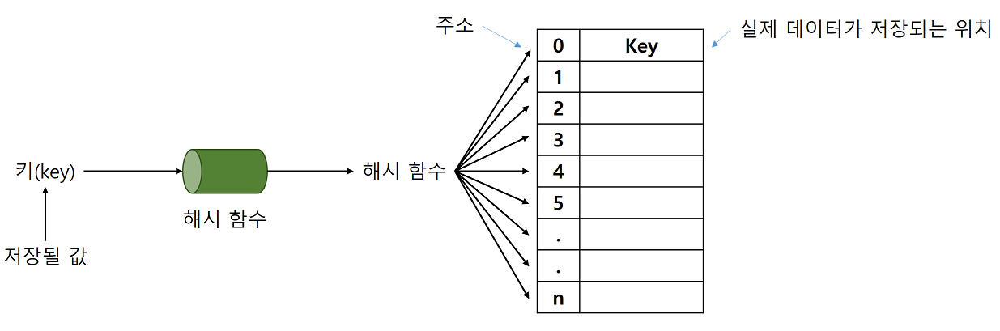

# 14. 해싱

## 14.1 해싱이란?

- 선형 탐색이나 이진 탐색은 모두 키를 저장된 키값과 반복적으로 비교함으로써 탐색하고자 하는 항목에 접근한다.

  - 이런 방법들은 최대 가능한 시간 복잡도가 O(logn)에 그친다.

  

- **해싱** : 키(key)에 산술적인 연산을 적용하여 항목이 저장되어 있는 테이블의 주소를 계산하여 항목에 접근한다.
  - 해시 테이블(hash table) : 키에 대한 연산에 의해 직접 접근이 가능한 구조
  - 해시 테이블을 이용한 탐색을 해싱(hashing)이라고 한다.
  - 해싱은 많은 응용 프로그램에서 사용됩니다.
    - 컴파일러가 사용하는 심볼 테이블, 철자 검사기, 데이터베이스 등에서 해싱을 사용한다.

## 14.2 추상 자료형 사전

### 사전의 개념

- 사전(dictionary) : (키, 값) 쌍의 집합이다.

  - 사전은 키와 관련된 값을 동시에 저장하는 자료구조이다.
  - (키, 값) 쌍을 저장할 수도 있고, (키, 값) 쌍을 삭제할 수도 있으며 키를 가지고 값을 검색할 수도 있다.
  - 사전은 맵(map)이나 테이블(table)로 불리기도 한다.
    - 키(key) : 사전의 단어처럼 항목과 항목을 구별시켜주는 것
    - 값(value) : 단어의 설명에 해당한다.

  

  - 사전은 항목들을 키에 의하여 식별하여 관리한다.
    - 항목들의 위치는 상관없다.
  - 따라서 항목들을 접근하고 삭제하려면 키만 가지고 있으면 된다.
  - 사전에 있는 항목들은 모두 키를 가지고 있다는 점에서 다른 자료구조들과는 구분이 된다.
    - 리스트에도 키를 같이 넣어서 저장할 수 있겠지만 리스트는 근본적으로 위치에 의하여 관리되는 자료구조이다.

### 사전의 연산

```
- 객체: 일련의 (key, value) 쌍의 집합
- 연산:

add(key, value) ::= (key, value)를 사전에 추가한다.
delete(key) ::= key에 해당되는 (key, value)를 찾아서 삭제한다. 관련된 value를 반환한다. 만역 탐색이 실패하면 NULL을 반환한다.
search(key) ::= key에 해당되는 value를 찾아서 반환한다. 만약 탐색이 실패하면 NULL을 반환한다.
```

## 14.3 해싱의 구조

- 해싱의 기본적인 아이디어는 간단하다.

  > 만약 어떤 회사의 직원이 100명이라고 하였을 때, 100명의 직원들은 0에서 99가지의 아이디를 부여받는다. 직원들에 대한 정보를 가장 빠르게 저장하고 탐색하려면 단순히 크기가 100인 배열을 만들면 된다. 자료를 저장하거나 탐색하려면 직원의 아이디를 키(배열의 인덱스)로 생각하고 단지 배열의 특정 요소를 읽거나 쓰면 된다. 이들 연산들의 시간 복잡도는 O(1)이다.

  - 즉 상수 시간안에 종료할 수 있다.
    - 그러나 현실적으로는 탐색 키들이 문자열이거나 매우 큰 숫자이기 때문에 탐색 키를 직접 배열의 인덱스로 사용하기에는 무리가 있으므로 각 탐색 키를 작은 정수로 사상(mapping)시키는 어떤 함수가 필요하다.

  | 키(key) | 값(value)         |
  | ------- | ----------------- |
  | 0       | 직원 #0 인사기록  |
  | 1       | 직원 #1 인사기록  |
  | 2       | 직원 #2 인사기록  |
  | ...     | ...               |
  | 98      | 직원 #98 인사기록 |
  | 99      | 직원 #99 인사기록 |

  - 해싱에서는 자료를 저장하는데 배열을 사용한다.
    - 배열은 단점도 있지만 만약 원하는 항목이 들어 있는 위치를 알고 있다면 매우 빠르게 자료를 삽입하거나 꺼낼 수 있다.
    - 이 경우, 배열의 다른 요소들에는 전혀 접근할 필요가 없다.
  - 해싱이란 어떤 항목의 키만을 가지고 바로 항목이 들어 있는 배열의 인덱스를 결정하는 기법이다.
  - **해시 함수(hash function)** : 키를 입력으로 받아 해시 주소(hash address)를 생성하고 이 해시 주소를 해시 테이블(hash table)의 인덱스로 사용하는 함수를 말한다.
    - 이 배열의 인덱스 위치에 자료를 저장할 수도 있고 거기에 저장된 자료를 꺼낼 수도 있다.

  

  - 키값 k를 입력 받아 해시 함수 h(k)로 연산한 결과인 해시 주소를 인덱스로 사용하여 해시 테이블에 있는 항목에 접근한다.
  - 해시 테이블 ht는 M개의 버킷(bucket)으로 이루어지는 테이블로서 ht[0], ht[1], ..., ht[M-1]의 원소를 가진다.

  

  - 하나의 버킷은 s개의 슬롯(slot)을 가질 수 있으며, 하나의 슬롯에는 하나의 항목이 저장된다.

  - 하나의 버킷에 여러 개의 슬롯을 두는 이유는 서로 다른 두 개의 키가, 해시 함수에 의해 동일한 해시 주소로 변환될 수 있으므로 여러 개의 항목을 동일한 버킷에 저장하기 위함이다.
    - 그러나 대부분의 경우 하나의 버킷은 하나의 슬롯을 가진다.
  - 해시 테이블에 존재하는 버킷의 수가 M이므로 해시 함수 h는 모든 키에 대하여 다음의 범위의 값을 제공해야 한다.

  

  - 대부분의 경우 해시 테이블의 버킷 수는 모든 키의 경우의 수보다 매우 작으므로 여러 개의 서로 다른 키가 해시 함수에 의해 같은 해시 주소로 사상(mapping)되는 경우가 자주 발생한다.
    - **충돌(collision)** : 키 k1과 k2에 대하여 h(k1) = h(k2)인 경우를 말한다.
    - **동의어(synonym)** : 이렇게 충돌이 일어나는 두 개의 k1과 k2를 말한다.
  - 만약 충돌이 발생하면 같은 버킷에 있는 다른 슬롯에 항목을 저장하게 된다.
    - 충돌이 자주 발생하면 버킷 내부에서의 순차 탐색 시간이 길어져서 탐색 성능이 저하될 수 있으므로 해시 함수를 수정하거나 해시 테이블의 크기를 적절하게 조절해 주어야 한다.
  - **오버플로우(overflow)** : 충돌이 버킷에 할당된 슬롯 수보다 많이 발생하게 되었을 때 버킷에 더 이상 항목을 저장할 수 없게 되는 상태
    - 만약 버킷 당 슬롯의 수가 하나(s=1)이면 충돌이 곧 오버플로우를 의미한다.
    - 오버플로우가 발생하면 더 이상 항목을 저장할 수 없게 되므로 오버플로우를 해결하기 위한 방법이 반드시 필요하다.

### 이상적인 해싱

- 어떠한 집단에서 각 사람들에게 부여하는 수가 5자리일 때 이들을 구분하는 숫자는 뒤에 3자리라고 하였을 때,  이 경우 해시 함수는 단순히 5개의 숫자 중에서 뒤의 3자리만 추출하면 된다.

  h(01023) = 23

  
  - 이러한 이상적인 경우에 해싱은 매우 빠르게 자료를 저장하고 탐색할 수 있다.
    - 여기서 자료를 꺼내기 위해 전체 배열을 탐색하지 않는다는 것을 유의하면 된다.

  ```
  add(key, value):
  	index <- hash_function(key)
  	ht[index] = value
  
  search(key):
  	index <- hash_function(key)
  	return ht[index]
  ```

### 실제의 해싱

- 실제로는 해시 테이블의 크기가 제한되어 있으므로 하나의 키당 해시 테이블에서 하나의 공간을 할당할 수가 없다.

  - 보통의 경우에 키는 매우 많고, 해시 테이블의 크기는 상당한 제약을 받는 것이 일반적인 상황이다.

  - 또 일반적으로 키 중에 일부만 사용되기 때문에 전체를 위한 공간을 항상 준비할 필요는 없다.

  - 간단하면서도 강력한 방법은 키를 해시 테이블의 크기로 나누어서 그 나머지를 해시 테이블의 주소로 하는 것이다.

    - i를 해시 테이블 크기 M으로 나누어서 나머지를 취하면 0에서 M-1까지의 숫자가 생성된다.

    - 이 값은 해시 테이블을 위한 유효한 인덱스가 된다.

      ​	h(k) = k mod M

  - 위의 방법은 완벽한 해시 함수가 아니다. 따라서 두 개 이상의 키가 동일한 해시 테이블의 공간으로 사상될 수 있다. 해싱에서는 이러한 충돌을 해결하는 일이 무엇보다도 중요하다.

  

  - 따라서 실제 해싱에서는 충돌과 오버플로우가 빈번하게 발생하므로 시간 복잡도는 이상적인 경우의 O(1)보다는 떨어지게 된다.

## 14.4 해시 함수

- 해싱에서는 키값을 해시 테이블의 주소로 변환하는 해시 함수가 잘 설계되어야만 탐색의 효율이 증대될 수 있다.

  - 충돌이 적어야 한다.
  - 해시 함수 값이 해시 테이블의 주소 영역 내에서 고르게 분포되어야 한다.
  - 계산이 빨라야 한다.

  

  - 해시 테이블의 크기가 M인 경우 해시 함수는 키(주로 정수이거나 문자열)들을 [0, M-1]의 범위의 정수로 변환시켜야 한다.

### 재산 함수

- **재산 함수** : 나머지 연산자(mod)를 사용하여 키를 해시 테이블의 크기로 나눈 나머지를 해시 주소로 하는 방법이다.

  h(k) = k mod M

  - 여기서 M은 해시 테이블의 크기로서 해시 함수의 값의 범위는 0~(M-1)이 된다.
    - 따라서 해시 테이블의 인덱스로 사용하기에는 이상적인 값이 된다.
  - 이는 가장 이상적인 해시 함수로서 해시 테이블의 크기 M는 주로 소수(prime number)로 선택한다.
  - 이 방법은 다양한 응용 분야에 쉽게 적용할 수 있을 뿐만 아니라, 해시 주소를 상당히 고르게 분포시키는 좋은 방법이다.
  - 대부분의 M은 홀수로 한다.
    - 만약 M이 짝수라면 k가 짝수이면 짝수가 되고 k가 홀수라면 홀수가 된다. 즉, 메모리 주소를 가지고 해싱을 한다면 짝수가 될 가능성이 높고(메모리 주소는 보통 2의 배수임을 주의해야 한다.), 이런 식으로 해시 주소가 한쪽으로 편향된다면 해시 테이블은 오버플로우가 발생할 것이다.
    - 만약 M이 소수라면 즉 자기 자신과 1만을 약수로 가지는 수라면 k mod M은 0에서 M-1을 골고루 사용하는 값을 만들어 낸다.
  - 만약 나머지 연산을 수행했을 때 음수가 나올 가능성에도 대비해야 한다.

  ```c
  int hash_function(int key)
  {
      int hash_index = key % M;
      if(hash_index < 0)
          hash_index += M;
      return hash_index;
  }
  ```

### 폴딩 함수

- **폴딩 함수** : 주로 키가 해시 테이블의 크기보다 더 큰 정수일 경우에 사용한다.

  - 키의 일부만 사용하지 않고 키를 몇 개의 부분으로 나누어 이를 더하거나 비트별로 XOR같은 부울 연산을 하는 좋은 방법이다.

  ```c
  hash_index = (short)(key ^ (key >> 16))
  // 32비트 키를 2개의 16비트로 나누어 비트별로 XOR 연산을 하는 코드
  ```

  - 폴딩 함수는 키를 여러 부분으로 나누어 모두 더한 값을 해시 주소로 사용한다.
    - 키를 나누고 더하는 방법에는 이동 폴딩(shift folding)과 경계 폴딩(boundary folding)이 대표적이다.
    - **이동 폴딩** : 키를 여러 부분으로 나눈 값들을 더하여 해시 주소로 하는 방법
    - **경계 폴딩** : 키의 이웃한 부분을 거꾸로 더하여 해시 주소를 얻는 방법
  - 폴딩 방법을 구현할 때는 키 값을 해시 테이블 크기만큼의 수를 가지는 부분으로 분할한 후, 분할된 부분을 합하여 해시 주소를 만들어준다.

  

### 중간 제곱 함수

- **중간 제곱 함수** : 키를 제곱한 다음, 중간의 몇 비트를 취해서 해시 주소를 생성한다.
  - 제곱한 값의 중간 비트들은 대게 키의 모든 문자들과 관련이 있기 때문에 서로 다른 키는 몇 개의 문자가 같을 지라도 서로 다른 해싱 주소를 갖게 된다.
  - 키 값을 제곱한 값의 중간 비트들의 값은 비교적 고르게 분산된다.

### 비트 추출 방법

- **비트 추출 방법** : 해시 테이블의 크기가 M=2<sup>k</sup>일 때 키를 이진수로 간주하여 임의의 위치의 k개의 비트를 해시 주소로 사용하는 것이다.
  - 이 방법은 아주 간단하지만, 키의 일부 정보만을 사용하므로 해시 주소의 집중 현상이 일어날 가능성이 높다.

### 숫자 분석 방법

- **숫자 분석 방법** : 숫자로 구성된 키에서 각각의 위치에 있는 수의 특징을 특징을 미리 알고 있을 때 유용하다.
  - 키의 각각의 위치에 있는 숫자 중에서 편중되지 않는 수들을 해시 테이블의 크기에 적합한 만큼 조합하여 해시 주소로 사용하는 방법이다.

### 탐색키가 문자열일 경우 주의할 점

- 키들이 정수일 때는 비교적 쉽게 해시 주소로 변환할 수 있다. 그러나 많은 경우 키들은 문자열일 수 있다.

  - 따라서 문자열로 부터 좋은 해시 주소를 생성하는 것이 중요하다.

  - 가장 간단한 방법은 첫번째 문자의 아스키 코드값을 해시 주소로 사용하는 것이다.

    - 하지만 첫번째 문자가 같다면 구별이 불가능하다.
    - 따라서 충돌을 막기 위해서는 문자열안의 모든 문자를 골고루 사용해야 할 것이다.

  - 가장 보편적인 방법은 아스키 코드 값을 모두 더하는 것이다.

    - 이 경우 서로 다른 키들이 같은 문자로 이루어져 있지 않는 한, 비교적 잘 동작한다.
    - 그러나 문제점은 키들이 동일한 문자로 이루어져 있지만 위치가 다른 경우 같은 키들은 구분할 수 없을 것이다.
    - 또한 아스키 문자 코드의 범위가 65에서 122이기 때문에 만약 3자리로 이루어진 키의 경우, 195에서 266으로 해시 코드가 집중될 것이다.

  - 더 좋은 방법은 글자들의 아스키 코드 값에 위치에 기초한 값을 곱하는 것이다.

    - 즉 문자열 s가 n개의 문자를 가지고 있다고 가정하고 s안의 i번째 문자가 u<sub>1</sub>라고 하면 해시 주소를 다음과 같이 계산하는 것이다.

    

  ```c
  int hash_function(char *key)
  {
      int hash_index = 0;
      while(*key)
          hash_index = g * hash_index + *key++;
      return hash_index;
  }
  ```

  - 이 방법은 키가 긴 문자열로 되어 있을 경우, 오버플로우를 일으킬 수 있다.
    - 그러나 C언어에서는 오버플로우를 무시하므로 여전히 유효한 해시 주소를 얻을 수 있다.
    - 보통 g의 값으로는 31을 사용한다.
    - 오버플로우가 발생하면 해시 코드의 값이 음수가 될 수도 있으므로 검사를 해야한다.

## 14.5 개방 주소법

### 충돌과 오버플로우

- **충돌(collision)** : 서로 다른 키를 갖는 항목들이 같은 해시 주소를 가지는 현상이다.
  - 충돌이 발생하고, 해시 주소에 더 이상 빈 버킷이 남아 있지 않으면 오버플로우가 발생한다.
    - 오버플로우가 발생하면 해시 테이블에 항목을 더 이상 저장하는 것이 불가능해진다.
    - 따라서 오버플로우를 효과적으로 해결하는 방법이 필요하다.
  - **개방 주소법(open addressing)** : 충돌이 일어난 항목을 해시 테이블의 다른 위치에 저장한다.
    - 선행 조사법(linear probing), 이차 조사법(quadratic probing), 이중 해싱법(double hashing), 임의 조사법(random probing) 등이 있다.
  - **체이닝(chaining)** : 해시 테이블의 하나의 위치가 여러 개의 항목을 저장할 수 있도록 해시 테이블의 구조를 변경한다.

### 선형 조사법

- 개방 조사법은 특정 버킷에서 충돌이 발생하면, 비어있는 버킷을 찾는 방법이다. 이 비어있는 버킷에 항목을 저장하게 된다.

- 해시 테이블에서 비어있는 공간을 찾는 것을 조사(probing)이라고 한다.

- **선형 조사법(linear probing)** : 만약 ht[k]에서 충돌이 발생했다면 ht[k+1]이 비어 있는지를 살펴보는 방법이다.

  - 만약 비어있지 않다면 ht[k+2]를 살펴본다.
  - 이런 식으로 비어있는 공간이 나올 때까지 계속하여 조사하는 방법이다.
    - 만약 테이블의 끝에 도달하게 되면 다시 테이블의 처음으로 간다.
    - 조사를 시작했던 곳으로 되돌아오게 되면 테이블이 가득 찬 것으로 판단한다.

  

### 선형 조사법의 구현

- 먼저 해시 테이블은 1차원 배열로 구현된다.

  - 이 배열은 키필드와 키와 관련된 자료 필드를 가진다.

  ```c
  #define KEY_SIZE 10	// 탐색키의 최대 길이
  #define TABLE_SIZE 13	// 해싱 테이블의 크기 = 소수
  
  typedef struct{
      char key[KEY_SIZE];
      // 다른 필요한 필드들
  } element;
  
  element hash_table[TABLE_SIZE];
  ```

- 해시 테이블의 각 요소들은 초기화 과정을 거쳐야 한다.

  - 초기화 과정이란 각 버킷들을 공백상태로 만드는 것이다.

  ```C
  void init_table(element t[])
  {
      for(int i = 0; i < TABLE_SIZE; i++)
          t[i],key[0] = NULL;
  }
  ```

- 해시 테이블에 키를 삽입하기 위해서는 먼저 키를 정수로 바꾸어주는 해시 함수가 필요하다.

  ```c
  int transform(char *key)
  {
      int number = 0;
      while(*key)
          number = 31 * number + *key++;
      return number;
  }
  // 제산 함수를 사용한 해싱 함수
  int hash_function(char *key)
  {
      // 키를 자연수로 변환한 다음 테이블의 크기로 나누어 나머지를 반환
      return transform(key) % TABLE_SIZE;
  }
  ```

|    키    |        덧셈식 변환과정         | 덧셈합계 | 해싱 주소 |
| :------: | :----------------------------: | :------: | :-------: |
|    do    |            100+111             |   211    |     3     |
|   for    |          102+111+114           |   327    |     2     |
|    if    |            105+102             |   207    |    12     |
|   case   |         99+97+115+101          |   412    |     9     |
|   else   |        101+108+115+101         |   425    |     9     |
|  return  |    114+101+116+117+114+110     |   672    |     9     |
| function | 102+117+110+99+116+105+111+110 |   870    |    12     |

- 버킷 조사는 원형으로 회전함을 기억해야 한다.
  - 테이블의 마지막에 도달하면 다시 처음으로 간다.
  - 한 번 충돌이 시작되면 그 위치에 항목들이 집중되는 현상이 있는데 이를 군집화라 한다.


- 버킷 조사를 하기 위해서는 먼저 그 주소가 비어 있는지를 검사해서 비어 있지 않으면 먼저 그 주소에 저장된 키와 현재 삽입하려고 하는 키가 동일한지를 체크한다.

  - 동일하면 키가 중복되었다는 것을 화면에 출력하고 복귀한다.
  - 저장된 키가 중복되지 않았으면 현재 주소를 나타내는 변수 i를 증가하여 다음 버킷을 가리키도록 한다.
  - 만약 증가된 주소가 시작 주소로 되돌아온 경우에는 다른 모든 버킷을 조사했는데도 빈 버킷이 없는 경우이므로 더 이상 삽입이 불가능한 오류 상태임을 알리고 복귀한다.

  ```c
  #define empty(item) (strlen(item.key) == 0)
  #define equal(item1, item2) (!strcmp(item1.key, item2.key))
  
  // 선형 조사법을 이용하여 테이블에 키를 삽입하고, 테이블이 가득 찬 경우는 종료
  void hash_lp_add(element item, element ht[])
  {
      int i, hash_value;
      hash_value = i = hash_function(item.key);
      
      while(!empty(ht[i])){
          if(equal(item, ht[i])){
              fprintf(stderr, "탐색키가 중복되었습니다.\n");
              exit(1);
          }
          i = (i+1) % TABLE_SIZE;
          if(i == hash_value){
              fprintf(stderr, "테이블이 가득찼습니다.\n");
              exit(1);
          }
      }
      ht[i] = item;
  }
  ```

  - 탐색도 마찬가지로 먼저 키에 해시 함수를 적용시켜서 계산된 주소에서 항목을 찾지 못하면 해당 항목을 찾을 때까지 연속된 버킷을 탐색한다.
    - 탐색하다가 시작 주소로 되돌아오면 해당 항목이 테이블에 없다고 결론 내릴 수 있다.

  ```c
  void hash_lp_search(element item, element ht[])
  {
      int i, hash_value;
      hash_value = i = hash_function(item.key);
      
      while(!empty(ht[i])){
          if(equal(item.key, ht[i])){
              fprintf(stderr, "탐색 %s: 위치 = %d\n", item.key, i);
              return;
          }
          i = (i+1) % TABLE_SIZE;
          if(i == hash_value){
              fprintf(stderr, "찾는 값이 테이블에 없음\n");
              return;
          }
      }
      fprintf(stderr, "찾는 값이 테이블에 없음\n");
  }
  ```

  

