# 9. 우선순위 큐

## 9.1 우선순위 큐 추상 데이터 타입

### 우선순위 큐의 소개

- **우선순위 큐(priority queue)** : 우선 순위의 개념을 큐에 도입한 자료구조이다.

  - 보통의 큐는 선입 선출(FIFO)의 원칙에 의하여 먼저 들어온 데이터가 먼저 나가게 된다. 
  - 우선순위 큐에서는 데이터들이 우선순위를 가지고 있고 우선순위가 높은 데이터가 먼저 나가게 된다.
  - **스택, 큐, 우선순위 큐 비교**

  |  자료구조   |        삭제되는 요소        |
  | :---------: | :-------------------------: |
  |    스택     |  가장 최근에 들어온 데이터  |
  |     큐      |   가장 먼저 들어온 데이터   |
  | 우선순위 큐 | 가장 우선순위가 높은 데이터 |

  - 우선순위 큐는 가장 일반적인 큐라 할 수 있다.
    - 스택이나 큐도 우선순위 큐를 사용하여 얼마든지 구현할 수 있기 때문이다.
    - 즉, 적절한 우선 순위만 부여하면 우선순위 큐는 스택이나 큐로 동작할 것이다.
  - 우선순위 큐는 컴퓨터의 여러 분야에서 이용되는데, 대표적으로 시뮬레이션 시스템, 네트워크 트래픽 제어, 운영 체제에서의 작업 스케줄링, 수치 해석적인 계산 등에 사용된다.

  - 우선순위 큐는 배열,  연결 리스트 등의 여러 가지 방법으로 구현이 가능한데, 가장 효율적인 구조는 히프(heap)이다.

### 우선순위 큐 추상자료형

```
- 객체: n개의 element형의 우선 순위를 가진 요소들의 모임
- 연산:
create()	::= 우선순위 큐를 생성한다.
init(q)		::= 우선순위 큐 q를 초기화 한다.
is_empty(q)	::= 우선순위 큐 q가 비어있는지를 검사한다.
is_full(q)	::= 우선순위 큐 q가 가득 찼는가를 검사한다.
insert(q, x)::= 우선순위 큐 q에 요소 x를 추가한다.
delete(q)	::= 우선순위 큐로부터 가장 우선순위가 높은 요소를 삭제하고 반환한다.
find(q)		::= 우선 순위가 가장 높은 요소를 반환한다.
```

- 우선순위 큐는 0개 이상의 요소의 모임이다.
- 각 요소들은 우선 순위값을 가지고 있다.
- 가장 중요한 연산은 insert 연산(요소 삽입), delete 연산(요소 삭제)이다.
- 우선순위 큐는 2가지로 구분할 수 있다.
  - 최소 우선순위 큐 : 가장 우선 순위가 낮은 요소를 먼저 삭제한다.
  - 최대 우선순위 큐 : 가장 우선 순위가 높은 요소를 먼저 삭제한다.


## 9.2 우선순위 큐의 구현 방법

### 배열을 사용하는 방법

- 정렬되어 있지 않은 배열
  - 정렬이 안 된 배열을 사용하게 되면 삽입은 배열의 맨 끝에 새로운 요소를 추가하면 된다. 시간 복잡도는 O(1)이다.
  - 삭제 연산을 할 때는 가장 우선 순위가 높은 요소를 찾아야 한다.
    - 정렬이 안되어 있으므로 처음부터 끝까지 모든 요소들을 스캔하여야 한다. 따라서 시간 복잡도는 O(n)이다.
    - 요소가 삭재된 다음, 뒤에 있는 요소들을 앞으로 이동시켜야 하는 부담 또한 있다.
- 정렬되어 있는 배열
  - 새로운 요소를 삽입할 때는 다른 요소와 값을 비교하여 적절한 삽입 위치를 결정하여야 한다.
    - 삽입 위치를 찾기 위하여 순차탐색이나 이진탐색과 같은 방법을 이용할 수 있다.
    - 삽입 위치를 찾은 다음에는 삽입 위치 뒤에 있는 요소들을 이동시켜서 빈자리를 만든 다음, 삽입해야 한다. 따라서 시간 복잡도는 O(n)이다.
  - 삭제 시에는 맨 뒤에 위치한 우선 순위가 높은 요소를 삭제하면 된다. 따라서 시간 복잡도는 O(n)이 된다.
  
  


### 연결 리스트를 사용하는 방법

- 정렬되어 있지 않은 연결 리스트
  - 삽입 시에는 첫 번째 노드로 삽입시키는 것이 유리하다.
    - 또한 삽입 시에 배열과 달리 다른 노드를 이동할 필요가 없다. 포인터만 변경하면 된다. 따라서 삽입의 시간 복잡도는 O(1)이다.
  - 삭제 시에는 포인터를 따라서 모든 노드를 확인해봐야 한다. 이 경우 시간 복잡도는 O(n)이 된다.
- 정되어 있는 연결 리스트
  - 이 경우에는 우선  순위가 높은 요소가 앞에 위치하는 것이 유리하다.
  - 삽입시에는 우선 순위값을 기준으로 삽입위치를 찾아야 하므로 시간 복잡도는 O(n)이 된다.
  - 삭제 시에는첫 번째 노드를 삭제하면 되므로 시간 복잡도는 O(1)이다.
  
  

 

### 히프를 사용하는 방법

- **히프(heap)** : 완전 이진 트리의 일종으로 우선순위 큐를 위하여 특별히 만들어진 자료 구조이다.

  - 히프는 일종의 느슨한 정렬 상태를 유지한다. 즉, 완전히 정렬된 것은 아니지만 전혀 정렬이 안 된 것도 아닌 상태를 유지한다.
  - 이러한 느슨한 정렬 상태를 이용하여 우선순위 큐를 구현한다.
  - 히프의 시간 복잡도는 O(log<sub>2</sub>n)으로서 다른 방법보다 상당히 유리하다.

  | 표현 방법             | 삽입                | 삭제                |
  | --------------------- | ------------------- | ------------------- |
  | 순서 없는 배열        | O(1)                | O(n)                |
  | 순서 없는 연결 리스트 | O(1)                | O(n)                |
  | 정렬된 배열           | O(n)                | O(1)                |
  | 정렬된 연결 리스트    | O(n)                | O(1)                |
  | 히프                  | O(log<sub>2</sub>n) | O(log<sub>2</sub>n) |

  

## 9.3 히프

### 히프의 개념

- **히프(heap)** : 컴퓨터 분야에서 완전 이진 트리 기반의 "더미"와 모습이 비슷한 특정한 자료구조를 의미한다.

  - 히프는 여러 개의 값들 중에서 가장 큰 값이나 가장 작은 값을 빠르게 찾아내도록 만들어진 자료 구조이다.
  - 간단히 말해서 부모 노드의 키 값이 자식 노드의 키 값보다 항상 큰 이진 트리를 말한다.
  - 히프 트리에서는 중복된 값을 허용한다.

  $$
  key(부모노드) >= key(자식노드)
  $$

  
  - 히프 안에서 데이터들은 느슨한 정렬 상태를 유지한다.
    - 즉, 큰 값이 상위 레벨에 있고 작은 값이 하위 레벨에 있다는 정도이다.
    - 히프의 목적은 삭제 연산이 수행될 때마다 가장 큰 값을 찾아내기만 하면 되는 것이므로(가장 큰 값은 루트 노드에 있다.) 전체를 정렬할 필요는 없다.
  - 히프는 완전 이진 트리(complete binary tree)이다.

### 히프의 종류

- 히프에는 두 가지 종류의 히프 트리가 존재한다.

  - **최대 히프(max heap)** : 부모 노드의 키 값이 자식 노드보다 큰 히프
  - **최소 히프(min heap)** : 부모 노드의 키 값이 자식 노드보다 작은 히프
  - 두 가지의 히프틑 단지 부등호만 달라지고 나머지는 완전히 동일하다.

  

### 히프의 구현

- 히프는 환전 이진 트리이기 때문에 각각의 노드에 차례대로 번호를 붙일 수 있다.

  - 이 번호를 배열의 인덱스로 생각하면 배열에 히프의 노드들을 저장할 수 있다.

  - 따라서 히프의 표준적인 자료구조는 배열이다.

  - 프로그램 구현을 쉽게 하기 위하여 배열의 첫 번째 인덱스인 0은 사용되지 않는다.

  - 특정 위치의 노드 번호는 새로운 노드가 추가되어도 변하지 않음을 유의해야 한다.

    `루트 노드의 오른쪽 노드의 번호는 항상 3이다.`

  

  - 배열을 이용하여 히프를 저장하면 완전 이진 트리에서처럼 자식 노드와 부모 노드를 쉽게 알 수 있다.

  

  - 왼쪽 자식의 인덱스 = (부모 인덱스) * 2
  - 오른쪽 자식의 인덱스 = (부모 인덱스) * 2 + 1
  - 부모의 인덱스 = (자식의 인덱스) / 2


## 9.4 히프의 구현

### 히프의 정의

- 히프는 1차원 배열로 표현될 수 있기 때문에 히프의 각 요소들을 구조체 element로 정의하고, element의 1차원 배열을 만들어 히프를 구현한다.

  ```c
  #define MAX_ELEMENT 200
  typedef struct{
      int key;
  }element;
  typedef struct{
      element heap[MAX_ELEMENT];
      int heap_size;
  }HeapType;
  ```

### 삽입 연산

- 히프에 새로운 요소가 들어오면, 새로운 노드를 히프의 마지막 노드로 삽입된다.

  - 마지막 노드 다음에 새로운 노드를 위치시키면 히프 트리의 성질이 만족되지 않을 수 있다.
  - 따라서 삽입 후에 새로운 노드를 부모 노드들과 교환해서 히프의 성질을 만족시켜 주어야 한다.

  1. **먼저 번호순으로 가장 마지막 위치에 새로운 요소가 삽입된다.**

     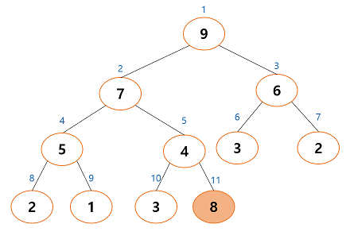

  2. **부모 노드와 비교하여 삽입 노드의 크기가 크면 교환한다.**

     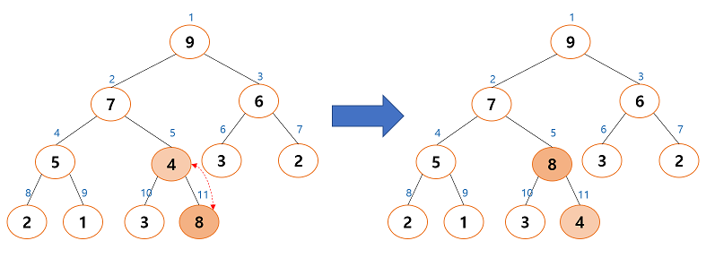

  3. **바뀐 자리에서 또다시 부모 노드와 비교한 후 크면 교환한다.**

  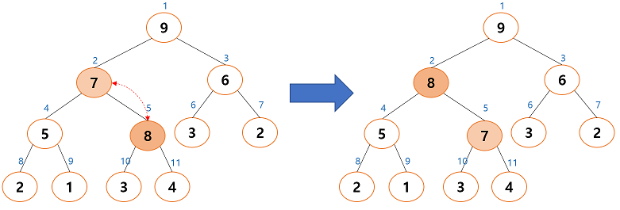

  - **우선순위 큐의 삽입 알고리즘 유사코드**

  ```
  insert_max_heap(A, key):
  
  1. heap_size <- heap_size + 1;	// 히프의 크기를 하나 증가시킨다.
  2. i <- heap_size;	// 증가된 히프 크기 위치에 새로운 노드를 삽입한다.
  3. A[i] <- key;
  4. while i != 1 and A[i] > A[PARENT(i)] do	// i가 루트 노드가 아니고 i번째 노드가 i의 부모 노드보다 크면
  5. 		A[i] <-> A[PARENT];	// i번째 노드와 부모 노드를 교환
  6.		i <- PARENT(i);	//한 레벨 위로 올라간다.
  ```

  ```c
  // 현재 요소의 개수가 heap_size인 히프 h에 item을 삽입한다.
  // 삽입 함수
  void insert_max_heap(HeapType *h, element item)
  {
      int i;
      i = ++(h->heap_size);
      
      // 트리를 거슬러 올라가면서 부모 노드와 비교하는 과정
      while((i != 1) && (item.key > h->heap[i/2].key)){
          h->heap[i] = h->heap[i/2];
          i /= 2;
      }
      h->heap[i] = item;	//새로운 노드를 삽입
  }
  ```

  

### 히프의 삭제 연산

- 히프에서 삭제 연산은 우선순위가 높은 즉, 루트 노드를 삭제하는 것이다.

  - 루트 노드 삭제 후에 히프를 재구성하는 것이 필요하게 된다.
  - 히프의 재구성이란 히프의 성질을 만족하기 위하여, 위, 아래 노드를 교환하는 것이다.

  

  1. **먼저 루트 노드가 삭제된다. 빈 루트 노드 자리에는 히프의 마지막 노드를 가져온다.**

  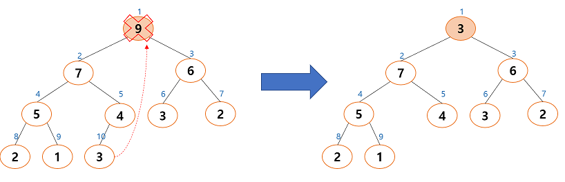

  2. **새로운 루트 노드자식 노드들을 비교하면 자식 노드가 더 크기 때문에 교환이 일어난다. 자식 중에 더 큰 값과 교환이 일어난다.**

  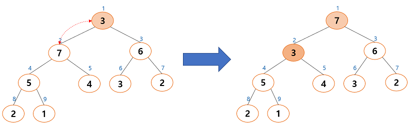

  3. **한번만 비교하는 것이 아닌 자식이 더 크다면 계속해서 교환한다.**

  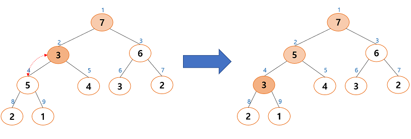

  4. **만약 자식 노드가 부모 노드보다 작다면 더 이상의 교환은 필요없다.**

  - **우선순위 큐의 삭제 알고리즘 유사코드**

  ```
  delete_max_heap(A):
  
  1. item <- A[1];
  2. A[1] <- A[heap_size];
  3. heap_size <- heap_size-1;
  4. i <- 2;
  5. while i <= heap_size do
  6. 	if i < heap_size and A[i+1] > A[i]
  7. 		then largest <- i+1;
  8. 		else largest <- i;
  9. 	if A[PARENT(largest)] > A[largest]
  10. 	then break;
  11. A[PARENT(largest)] <-> A[largest];
  12. i <- CHILD(largest);
  13.
  14. return item;
  ```

  > 1. 루트 노드 값을 반환을 위하여 item 변수로 옮긴다.
  > 2. 말단 노드를 루트 노드로 옮긴다.
  > 3. 히프의 크기를 하나 줄인다.
  > 4. 루트 왼쪽 자식부터 비교를 시작한다.
  > 5.  i가 히프 트리의 크기보다 작으면 (즉, 히프 트리를 벗어나지 않았으면)
  > 6.  오른쪽 자식이 더 크면
  >
  >    7~8.두 개의 자식 노드 중 큰 값의 인덱스를 largest로 옮긴다.
  >
  > 9. largest의 부모 노드가 largest보다 크면
  > 10. 중지
  > 11. 그렇지 않으면 largest와 largest의 부모 노드를 교환한다.
  > 12. 한 레벨 밑으로 내려간다.
  >
  > 14. 최대값을 반환한다.

  ```c
  // 삭제 함수
  element delete_max_heap(HeapType *h)
  {
      int parent, child;
      element item, temp;
      item = h->heap[1];
      temp = h->heap[(heap->heap_size)--];
      parent = 1;
      child = 2;
      while(child <= h->heap_size){
          // 현재 노드의 자식노드 중 더 큰 자식노드를 찾는다.
          if((child < h->heap_size) && h->heap[child+1].key > h->heap[child].key)
              child++;
          if(tmep.key >= h->heap[child].key)
              // 한 단계 아래로 이동
              break;
          h->heap[parent] = h->heap[child];
          parent = child;
          child *= 2;
      }
      h->heap[parent] = temp;
      return item;
  }
  ```


### 히프의 복잡도 분석

- 삽입 연산에서 새로운 요소 히프 트리를 타고 올라가면서 부모 노드들과 교환을 하게 되는데 최악의 경우, 루트 노드까지 올라가야 하므로 거의 트리의 높이에 해당하는 비교 연산 및 이동 연산이 필요하다.
  - 히프 트리가 완전 이진 트리임을 생각하면 히프의 높이는 log<sub>2</sub>n가 되고 따라서 삽입의 시간 복잡도는 O(log<sub>2</sub>n)이 된다.
- 삭제 연산 또한 마찬가지로 마지막 노드를 루트로 가져온 후에 자식 노드들과 비교하여 교환하는 부분이 가장 시간이 걸리는 부분인데 이 역시 최악의 경우, 가장 아래 레벨까지 내려가야 하므로 트리의 높이만큼의 시간이 걸린다.
  - 삭제의 시간 복잡도도 O(log<sub>2</sub>n)이 된다. 


## 9.5 히프의 정렬

- 최대 히프를 사용하면 정렬을 할 수 있다.

  - n개의 요소는 O(nlog<sub>2</sub>n)시간 안에 정렬된다.

  

  - 정렬되지 않는 배열은 차례대로 최대 히프에 추가되여 히프 트리를 생성한다.

  

  - 한 번에 하나씩 요소를 히프에서 꺼내서 배열의 뒤쪽부터 저장하면 된다. 배열 요소들은 값이 증가되는 순서로 정렬되게 된다.

  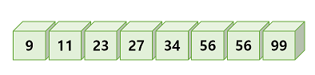

  - 히프를 사용하는 정렬 알고리즘을 히프 정렬(heap sort)이라고 한다.


### 히프 정렬의 구현

```c
void heap_sort(element a[], int n)
{
    int i;
    HeapType *h;
    h = create();
    init(h);
    for(i = 0; i < n; i++){
        insert_max_heap(h, a[i]);
    }
    for(i = (n-1); i >= 0; i--){
        a[i] = delete_max_heap(h);
    }
    free(h);
}
```


### 히프 정렬의 복잡도

- 히프 트리의 전체 높이가 거의 log<sub>2</sub>n이므로(완전 이진 트리 이므로) 따라서 하나의 요소를 히프에 삽입하거나 삭제할 때 히프를 재정비하는 시간이 log<sub>2</sub>n만큼 소요된다.
  - 요소의 개수가 n개이므로 전체적으로 O(nlog<sub>2</sub>n)의 시간이 걸린다.
    - 이 시간 복잡도는 삽입 정렬같은 간단한 정렬 알고리즘이 O(n<sup>2</sup>) 걸리는 것에 비하면 좋은 것이다.
  - 또한 히프 정렬이 최대로 유용한 경우는 전체 자료를 정렬하는 것이 아니라 가장 큰 값 몇 개만 필요할 때이다.


## 9.6 머쉰 스케줄링

>  어떤 공장에 동일한 기계가 m개가 있다고 하자. 우리는 처리해야 하는 작업을 n개 가지고 있다.
>
> 각 작업이 필요로 하는 기계의 사용시간은 다르다고 하자. 우리의 목표는 모든 기계를 풀가동하여 가장 최소의 시간 안에 작업들을 모두 끝내는 것이다. 이것을 **머쉰 스케줄링(machine schedling)**이라고 한다.


- 이 문제는 알고리즘 분야에서 상당히 유서 깊은 문제로 많은 응용 분야를 가지고 있다.

  `서버가 여러 개 있어서 서버에 작업을 분배할 때도 사용할 수 있다.`

  - 최적의 해를 갖는 것은 상당히 어렵다. 하지만 근사의 해를 찾는 방법이 있다. 그 중 한 가지가 LPT(longest processing time first) 방법이다.

    - LPT는 가장 긴 작업을 우선적으로 기계에 할당하는 것이다.

    |  J1  |  J2  |  J3  |  J4  |  J5  |  J6  |  J7  |
    | :--: | :--: | :--: | :--: | :--: | :--: | :--: |
    |  8   |  7   |  6   |  5   |  3   |  2   |  1   |

    - LPT 알고리즘은 각 작업들을 가장 먼저 사용가능하게 되는 기계에 할당하는 것이다.

    

    - 여기서는 최대 히프가 아닌 최소 히프를 사용한다.
      - 최소 히프는 모든 기계의 종료 시간을 저장하고 있다.
      - 처음에는 어떤 기계도 사용되지 않으므로 모든 기계의 종료시간은 0이다.
      - 히프에서 최소의 종료 시간을 가지는 기계를 삭제하여서 작업을 할당한다.
      - 선택된 기계의 종료시간을 업데이트하고 다시 히프에 저장한다.

    > M1이 선택되어서 히프에서 삭제되고 작업 J1이 이 기계에 할당
    >
    > 
    >
    > 다음 작업은 J2로서 7시간을 차지한다. M2와 M3가 비어 있으므로 M2에 할당된다.
    >
    > 
    >
    > 다음 작업은 J3로서 6시간을 차지한다. M3가 비어 있으므로 M3에 할당된다.
    >
    > 
    >
    > 다음 작업은 J4로서 5시간을 차지한다. 가장 먼저 사용가능하게 되는 기계는 M3이므로 M3에 할당된다.
    >
    > 

### LPT 알고리즘의 구현

- 알고리즘 구현에 있어서 기계의 종료 시간이 중요하다.

  - 종료 시간이 최소인 기계가 항상 선택되기 때문이다.

- 기계의 종료 시간을 최소 히프에 넣고 최소 히프에서 기계를 꺼내서 그 기계에 작업을 할당하면 된다.

  - 작업을 할당한 후에는 기계의 종료 시간을 작업 시간만큼 증가시킨 후에 다시 최소 히프에 넣는다.

  


## 9.7 허프만 코드

- 이진 트리는 각 글자의 빈도가 알려져 있는 메시지의 내용을 압축하는데 사용될 수 있다.

  - 이런 특별한 종류의 이진 트리를 허프만 코딩 트리라고 부른다.

    > 영문 신문에 실린 기사를 분석하여 각 글자들의 빈도수를 분석해보면
    >
    > 
    >
    > 테이블의 숫자는 **빈도수(frequencies)**라 불리운다. 각 숫자들은 영문 텍스트에서 해당 글자가 나타나는 회수이다.
    >
    > 빈도수를 이용하여 데이터를 압축할 때 각 글자들을 나타내는 최소길이의 엔코딩 비트열을 만들 수 있다. 데이터를 압축할 때는 우리가 흔히 사용하는 아스키(ASCII) 코드를 사용하지 않는다.
    >
    > 각 글자의 빈도수에 따라서 가장 많이 등장하는 글자에는 짧은 비트열을 사용하고 잘 나오지 않는 글자에는 긴 비트열을 사용하여 전체의 크기를 줄이자느 것이다.
    >
    > 즉, 많이 들장하는 e를 나타내기 위하여 2비트를 사용하고 잘 나오지 않는 z를 나타내기 위하여 15비트를 사용하자는 것이다.
    >
    > 텍스트가 e, t, n, i, s의 5개의 글자로만 이루어졌다고 가정한다.
    >
    > | 글자 | 빈도수 |
    > | :--: | :----: |
    > |  e   |   15   |
    > |  t   |   12   |
    > |  n   |   8    |
    > |  i   |   6    |
    > |  s   |   4    |
    >
    > 텍스트의 길이가 45 글자이므로 한 글자를 3비트로 표시하는 아스키 코드의 경우, 45글자*3비트/글자 = 135비트가 필요하다.
    >
    > 만약 가변길이의 코드를 만들어서 사용했을 경우 더 적은 비트로 표현할 수 있다.
    >
    > | 글자 | 코드 | 코드 길이 | 빈도수 | 비트수  |
    > | :--: | :--: | :-------: | :----: | :-----: |
    > |  e   |  00  |     2     |   15   | 2*15=30 |
    > |  t   |  01  |     2     |   12   | 2*12=24 |
    > |  n   |  10  |     2     |   8    | 2*8=16  |
    > |  i   | 110  |     3     |   6    | 3*6=18  |
    > |  s   | 111  |     3     |   4    | 3*4=12  |
    > | 합계 |      |           |        |   100   |
    >
    > 다음과 같이 88비트만 있으면 된다.
    >
    > 글자를 나타내는 비트열은 서로 간에 혼동을 일으키지 않아야 한다. 해결해야 될 문제는 압축해야할 텍스트가 주어졌을 때 어떻게 그러한 비트코드를 자동으로 생성할 것인가와 압축된 텍스트가 주어져 있을 때 어떻게 복원할 것인지가 문제이다.
    >
    > - 해독하는 문제
    >   - 만약 한 글자당 3비트가 할당된다면 메시지를 해독하는 것은 3비트씩 끊어서 읽으면 된다.
    >   - 가변길이 코드가 사용될 경우 하나의 글자가 3비트까지 가능하므로 코드를 확인하고 코드 테이블에서 있는 코드로 해석을 하면된다.
    >   - 이러한 해독과정을 가능하게 하는 원인은 코드를 관찰하여 보면 모든 코드가 다른 코드의 첫 부분이 아니라는 것이다.
    >   - 따라서 코딩된 비트열을 왼쪽에서 오른쪽으로 조사하여 보면 정확히 하나의 코드만 일치하는 것을 알 수 있다.
    >   - 이러한 특수한 코드를 만들기 위하여 이진 트리를 사용할 수 있는데 이런 종류의 코드를 **허프만 코드(Huffman codes)**라고 한다.

- 허프만 코드를 만드는 절차

  | 글자 | 빈도수 |
  | :--: | :----: |
  |  s   |   4    |
  |  i   |   6    |
  |  n   |   8    |
  |  t   |   12   |
  |  e   |   15   |

  - 빈도수에 따라 5개의 글자를 나열하고 (s(4), i(6), n(8), t(12), e(15)) 여기서 가장 작은 빈도수를 가지는 글자 2개(s(4), i(6))를 추출하여 이들을 단말 노드로 하여 이진 트리를 구성한다.
  - 루트의 값은 각 자식노드의 값을 합한 값이 된다.

  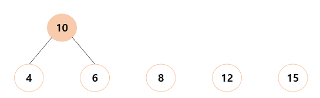

  - 다시 정렬된 글자들의 리스트로 돌아가서 이 합쳐진 값을 글자들의 리스트에 삽입하여(10, 8, 12, 15)를 얻는다.
  - 다시 이중에서 가장 작은 값 2개를 단말노드로 하여 이진 트리를 구성한다.

  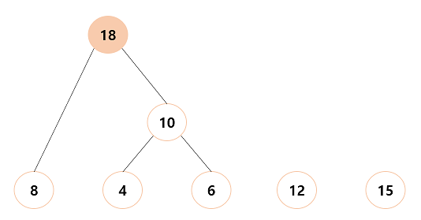

  - 다시 글자들의 정렬된 리스트로 돌아가서 이 합쳐진 값을 글자들의 리스트에 삽입하여(12, 15, 18)을 얻는다.
  - 다시 이중에서 가장 작은 값을 2개를 단말노드로 하여 이진 트리를 구성한다.

  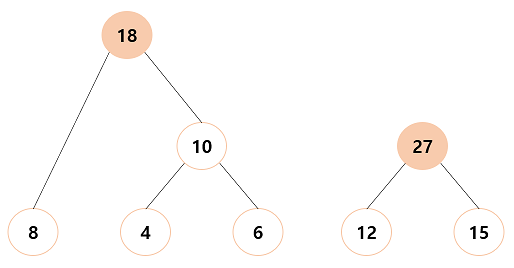

  - 같은 식으로 하여 (18, 27)이 되고 이 두 값을 단말 노드로 하여 이진 트리를 구성하면 된다.
  - 허프만 트리에서 왼쪽 간선은 비트 1을 나타내고 오른쪽 간선은 비트 0을 나타낸다.

  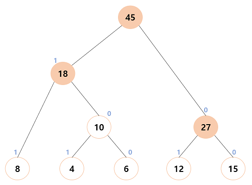

- 허프만 코드 알고리즘에서 가장 작은 2개의 빈도수를 얻는 과정이 있다.
  
  - 이것은 히프 트리를 이용하여 최소 히프를 이용하면 가장 효율적으로 구성될 수 있다.
- 히프에 저장되는 element 타입은 구조체로서 트리를 가리키는 포인터와 그 트리의 weight값을 key값으로 가진다.
  
  - 우선순위는 바로 이 트리의 weight값에 의하여 결정된다.