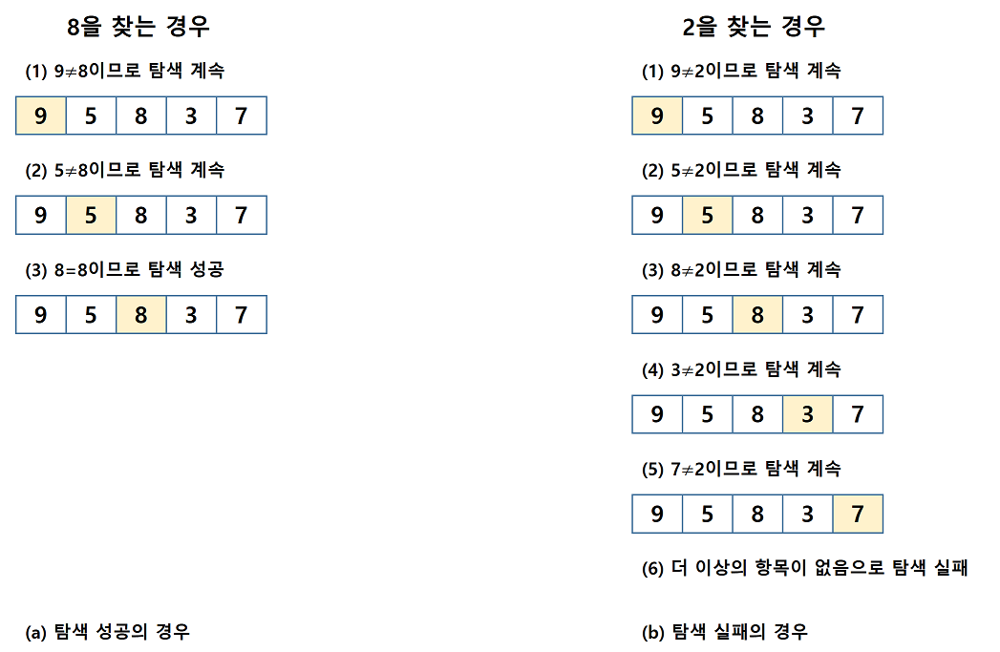
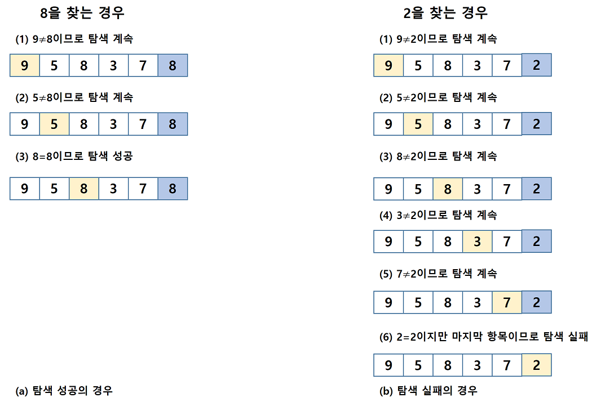
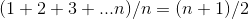
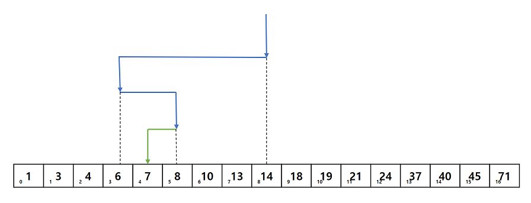
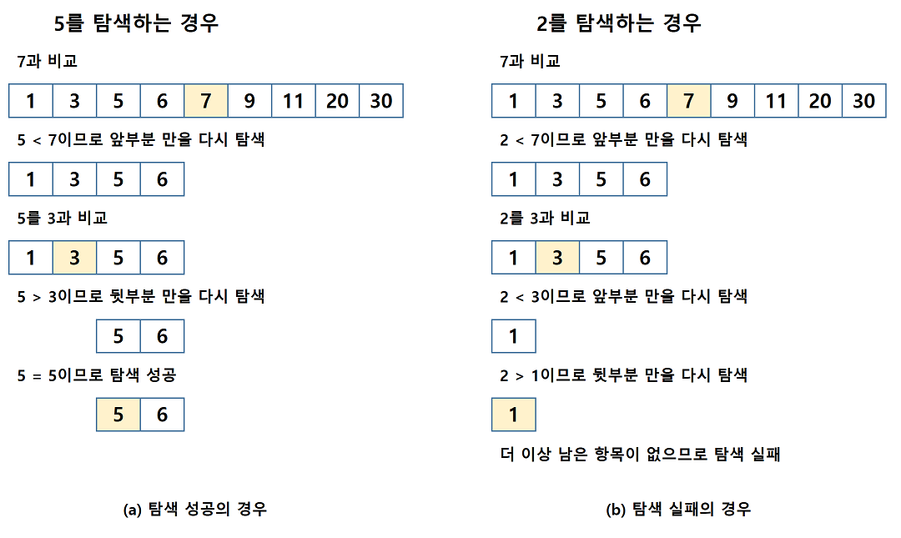
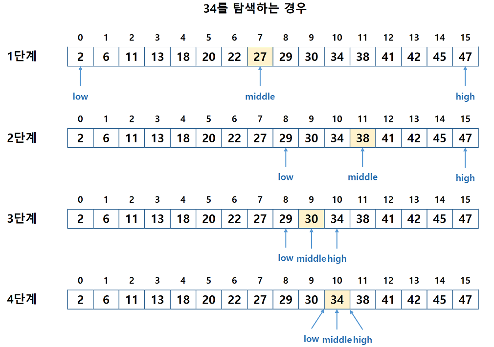
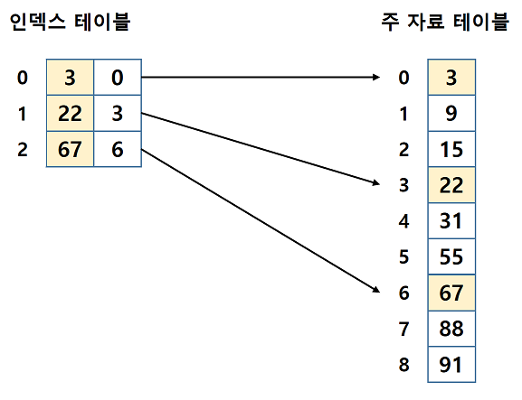
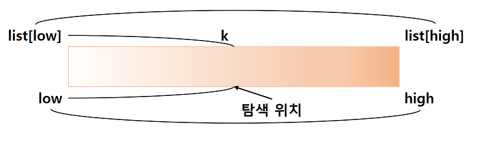
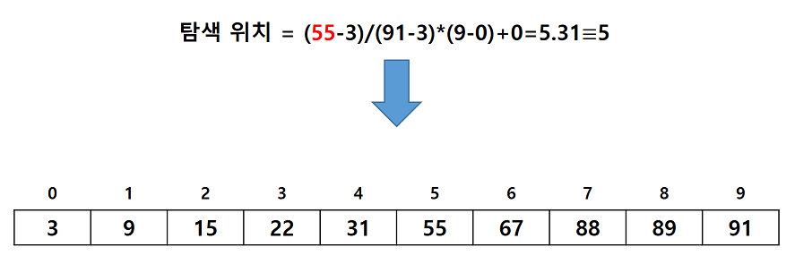
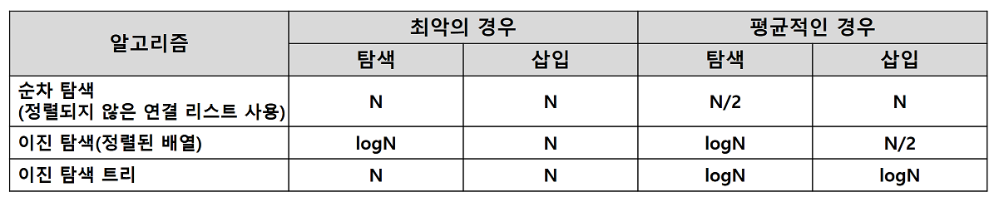

# 13 탐색

## 13.1 탐색이란?

- **탐색(search)** : 탐색키와 데이터로 이루어진 여러 개의 항목 중에서 원하는 탐색키를 가지고 있는 항목을 찾는 것이다.
  - 탐색의 단위는 항목이다.
  - **탐색키(search key)** : 항목 안에서 항목과 항목을 구별시켜주는 키
  - 탐색은 컴퓨터가 가장 많이 하는 작업 중의 하나이다.
    - 가장 많이 사용하는 작업임과 동시에 많은 시간이 요구되므로 탐색을 효율적으로 수행하는 것은 매우 중요하다.
  - 탐색은 기본적으로 여러 개의 자료 중에서 원하는 자료를 찾는 작업이다.
  - 탐색을 위하여 사용되는 자료구조는 매후 다양할 수 있다. 가장 기초적인 방법은 배열을 사용하여 저장하는 것이지만 탐색 성능을 향상하고자 한다면 이진 탐색 트리와 같은 보다 진보된 방법으로 자료를 저장하고 탐색해야 한다.

## 13.2 정렬되지 않은 배열에서의 탐색

### 순차 탐색

- **순차 탐색(sequential search)** : 순차 탐색은 정렬되지 않은 배열의 항목들을 처음부터 마지막까지 하나씩 검사하여 원하는 항목을 찾아가는 방법이다.

  - 탐색 방법 중에서 가장 간단하고 직접적인 탐색 방법이다.

  ```c
  int seq_search(int key, int low, int high)
  {
      int i;
      
      for(i = low; i <= high; i++)
          if(list[i] == key)
              return i;	// 탐색에 성공하면 키 값의 인덱스 반환
      return -1;	// 탐색에 실패하면 -1 반환
  }
  ```

  

### 개선된 순차 탐색

- 앞서 보인 순차 탐색 프로그램을 살펴보면, 리스트 전체를 탐색하기 위한 반복문에서 리스트의 끝을 테스트하는 비교 연산이 있고 반복문 안에 키 값의 비교 연산이 있다.
  
  - 리스트의 끝을 테스트하는 비교 연산을 줄이기 위해 리스트의 끝에 찾고자 하는 키 값을 저장하고 반복문의 탈출 조건을 키 값을 찾을 때까지로 설정한다.
  - 탐색이 성공했을 때는 반복문의 인덱스는 찾은 항목의 위치를 가리키게 되고 이 값을 반환하는 반면에 탐색에 실패했을 경우에는 -1을 반환한다.
  
  ```c
  int seq_search2(int key, int low, int high)
  {
      int i;
      list[high+1] = key;
      for(i = low; list[i] != key; i++)
          ;
      if(i == (high+1)) 
          return -1;
      else
          return i;
  }
  ```
  
  

### 순차 탐색의 시간 복잡도

- 순차 탐색 알고리즘은 리스트의 처음부터 탐색을 시작하여 해당 항목을 찾거나 모든 항목을 검색할 때까지 항목의 키 값을 비교한다. 따라서 순차 탐색 알고리즘은 두 가지 경우로 나누어 볼 수 있다.

  - 탐색이 성공하는 경우에는 리스트에 있는 키의 위치에 따라 비교 횟수가 결정된다. 모든 키가 탐색될 확률이 동일하다고 가정하면 평균 비교 횟수는 다음과 같다.

  

  - 따라서 순차 탐색은 탐색에 성공할 경우 평균(n+1)/2 번 비교하고 탐색이 실패한 경우 n번 비교하므로 순차 탐색의 시간 복잡도는 O(n)이 된다.

## 13.3 정렬된 배열에서의 탐색

- 정렬되어 있지 않은 배열의 순차 탐색은 이해하고 구현하기는 쉽다.
  - 그러나 배열이 많은 항목을 가지는 경우에는 순차 탐색은 너무나 비효율적인 방법이다.
  - 따라서 보다 빠른방법이 요구된다.

### 정렬된 배열에서의 이진 탐색

- 정렬된 배열의 탐색에서는 **이진 탐색(binary search)**이 가장 적합하다.

  - 이진 탐색은 배열의 중앙에 있는 값을 조사하여 찾고자 하는 항목이 왼쪽 또는 오른쪽 부분 배열에 있는지를 알아내어 탐색의 범위를 반으로 줄인다.
  - 이러한 방법에 의해 매 단계에서 검색해야 할 리스트의 크기를 반으로 줄인다.

  
  - 이진 탐색에서는 비교가 이루어질 때마다 탐색 범위가 급격하게 줄어든다.
    - 이는 찾고자하는 항목이 속해있지 않은 부분은 전혀 고려할 필요가 없기 때문이다.
  - 이진 탐색을 적용하려면 탐색하기 전에 배열이 반드시 정렬되어 있어야 한다.
    - 따라서 이진 탐색은 데이터의 삽입이나 삭제가 빈번할 시에는 적합하지 않고, 주로 고정된 데이터에 대한 탐색에 적합하다.

  

```
search_binary(list, low, high):

	middle <- low에서 high사이의 중간 위치
	if(탐색값 == list[middle])
		return middle;
    else if(탐색값 < list[middle])
    	 return list[0]부터 list[middle-1]에서의 탐색;
    else if(탐색값 > list[middle])
    	return list[middle+1]부터 list[high]에서의 탐색;
```

### 이진 탐색 구현(순환 호출 버전)

```c
int search_binary(int key, int low, int high)
{
    int middle;
    
    if(low <= high){
        middle = (low + high) / 2;
        if(key == list[middle])	// 탐색 성공
            return middle;
        else if(key < list[middle])	// 왼쪽 부분리스트 탐색
            return search_binary(key, low, middle-1);
        else	// 오른쪽 부분리스트 탐색
            return search_binary(key, middle+1, high);
    }
    return -1;	// 탐색 실패
}
```

### 이진 탐색 구현(반복적인 버전)

```c
int search_binary2(int key, int low, int high)
{
    int middle;
    
    while(low <= high){	// 아직 숫자들이 남아 있으면
        middle = (low + high) / 2;
        if(key == list[middle])
            return middle;
        else if(key < list[middle])
            high = middle - 1;
        else
            low = middle + 1;
    }
    return -1;	// 발견되지 않음
}
```

​	

- 이진 탐색은 탐색을 반복할 때마다 탐색 범위를 반으로 줄인다. 이러한 탐색 범위가 더 이상 줄일 수 없는 1이 될 때의 탐색 횟수를  k라 하면 마지막 탐색은 n/2<sup>k</sup> = 1이므로, k = log<sub>2</sub>n임을 알 수 있다. 결국 이진 탐색의 시간 복잡도는 O(log<sub>2</sub>n)이 된다.

### 정렬된 배열에서의 색인 순차 탐색

- **색인 순차 탐색(indexed sequential search)** : 인덱스(index)라 불리는 테이블을 사용하여 탐색의 효율을 높이는 방법이다.

  - 인덱스 테이블은 주 자료 리스트에서 일정 간격으로 발췌한 자료를 가지고 있다.
  - 이니덱스 테이블에 m개의 항목이 있고, 주 자료 리스트의 데이터 수가 n이면 각 인덱스 항목은 주 자료 리스트의 각 n/m번째 데이터를 가지고 있다.
  - 이때 주 자료 리스트와 인덱스 테이블은 모두 정렬되어 있어야 한다.

  

  - 색인 순차 탐색 알고리즘의 탐색 성능은 인덱스 테이블의 크기에 좌우된다.
  - 인덱스 테이블의 크기를 줄이면 주 자료 리스트에서의 탐색 시간을 증가시키고, 인덱스 테이블의 크기를 크게하면 인텍스 테이블의 탐색 시간을 증가시킨다.
  - 인덱스 테이블의 크기를 m이라 하고 주 자료 리스트의 크기를 n이라 하면 색인 순차 탐색의 복잡도는 O(m+n/m)이 된다.

### 보간 탐색

- **보간 탐색(interpolation search)** : 사전이나 전화번호부를 탐색하는 방법과 같이 탐색키가 존재할 위치를 예측하여 탐색하는 방법이다.

  - 보간 탐색은 이진 탐색과 유사하나 리스트를 반으로 분할하지 않고 불균등하게 분할하여 탐색한다.
  - k는 찾고자 하는 키 값을 , low와 high는 각각 탐색할 범위의 최소, 최대 인덱스 값을 나타낸다.
    - 탐색 위치를 결정할 때 찾고자 하는 키 값이 있는 곳에 근접하게 되도록 가중치를 주는 것이다.
    - 즉 값과 위치는 비례한다는 가정에서 탐색키에 해당하는 위치를 비례식으로 구한 것이다.

  

  

  

  - 여기서 주의해야 할 점은 계산되어 나오는 값은 일반적으로 실수이며 따라서 이 실수를 정수로 변환하여 주어야 한다.
    - 보통은 소수점 이하를 버리는 방법을 사용한다.
    - 만약 나눗셈을 계산할 때 float로 형변환을 하지 않으면 정수로 계산되어 항상 0이 된다는 점을 주의하여야 한다.
  - 많은 데이터가 비교적 균등하게 분포되어 있을 경우 보간 탐색은 이진 탐색보다 우수한 방법이 될 수 있으며 보간 탐색 알고리즘은 이진 탐색과 비슷한 O(log<sub>2</sub>n)의 복잡도를 가진다.

  ```c
  int interpol_search(int key, int n)
  {
      int low, high, j;
      
      low = 0;
      high = n-1;
      while((list[high] >= key) && (key > list[low])){
          j = ((float)(key-list[low])/(list[high]-list[low])*(high-low))+low;
          if(key > list[j])
              low = j+1;
          else if(key < list[j])
              high = j-1;
          else
              low = j;
      }
      if(list[low] == key)
          return low;
      else
          return -1;
  }
  ```

## 13.4 이진 탐색 트리

- 이진 탐색과 이진 탐색 트리는 근본적으로 같은 원리에 의한 탐색 구조이다.

  - 하지만 이진 탐색은 자료들이 배열에 저장되어 있으므로 삽입과 삭제가 상당히 힘들다.
    - 즉 자료를 삽입하고 삭제할 때마다 앞뒤의 원소들을 이동시켜야 한다.
  - 반면에 이진 탐색 트리는 비교적 빠른 시간 안에 삽입과 삭제를 끝마칠 수 있는 구조로 되어 있다.
  - 따라서 삽입과 삭제가 심하지 않은 정적인 자료를 대상으로 탐색이 이루어지는 경우에는 이진 탐색도 무난한 방법이나 삽입, 삭제가 빈번히 이루어진다면 반드시 이진 탐색 트리를 사용하여야 한다.

  

  - 이진 탐색 트리는 만약 트리가 균형 트리라면 탐색 연산은 O(log<sub>2</sub>n)의 시간 복잡도를 가지고 있다.
    - 이진 탐색 트리에서는 삽입, 삭제 연산을 다루었지만 이들 연산들은 이진 탐색 트리를 유지시키기는 하지만 균형 트리를 보장하지 않는다.
    - 만약 균형 트리가 아닐 경우에는 탐색의 시간 복잡도가 O(n)으로 높아지게 된다.
    - 따라서 이진 탐색 트리가 경사 트리가 되면 탐색 시간은 순차 탐색과 같게 되어 아주 효율이 떨어지게 된다. 그렇기 때문에 이진 탐색 트리에서는 균형울 유지하는 것이 무엇보다 중요하다.

  