# 12.1 정렬이란?

- 정렬(sorting) : 물건을 크기순으로 오름차순(ascending order)이나 내림차순(descending order)으로 나열하는 것을 의미한다.

  - 정렬은 컴퓨터 공학에서 가장 기본적이고 중요한 알고리즘 중의 하나로 일상생활에서 많이 사용된다.
  - 정렬은 자료 탐색에 있어서 필수적이다.
    - 정렬되어 있지 않은 자료가 주어지면 탐색의 효율성이 크게 떨어진다.
  - 레코드(record) : 일반적으로 정렬시켜야 될 대상
    - 레코드는 다시 필드(field)라고 하는 단위로 나누어진다.
    - 여러 필드 중에서 특별히 레코드와 레코드를 식별해주는 역할을 하는 필드를 키(key)라고 한다.
  - 정렬이란 결국 레코드들을 키값의 순서로 재배열하는 것이다.

  

  - 지금까지 개발된 정렬 알고리즘은 매우 많다. 그러나 아직까지도 모든 경우에 있어서 최상의 성능을 보여주는 최적 알고리즘은 존재하지 않는다.
    - 따라서 이들 방법들 중에서 현재의 프로그램 수행환경에서 가장 효율적인 정렬 알고리즘을 선택하여야 한다.
  - 대개 정렬 알고리즘을 평가하는 효율성의 기준으로는 정렬을 위해 필요한 비교 연산의 횟수와 이동 연산의 횟수이다.
    - 이들 횟수를 정확하게 구하기는 힘들기 때문에 이들 횟수를 빅오 표기법을 이용하여 근사적으로 표현한다.
    - 대개 이들 횟수는 자료의 초기화 여부에 의존적이다.
    - 일반적으로 이동 횟수와 비교 횟수가 서로 비례하지 않는다.
      - 즉 어떤 알고리즘은 비교 횟수는 많지만 이동 횟수는 적을 수 있고 또 그 반대도 가능하다.
  - 정렬 알고리즘은 크게 2가지로 나누어진다.
    - 단순하지만 비효율적인 알고리즘 : 삽입 정렬, 선택 정렬, 버블 정렬 등
      - 대개 자료의 개수가 전다면 단순한 정렬 방법을 사용하는 것이 괜찮은 선택이다.
    - 복잡하지만 효율적인 방법 : 퀵 정렬, 히프 정렬, 합병 정렬, 기수 정렬 등
      - 자료의 개수가 일정 개수를 넘어가면 반드시 효율적인 알고리즘을 사용하여야 한다.
  - 정렬 알고리즘은 내부 정렬(internal sorting)과 외부 정렬(external sorting)로 구분할 수도 있다.
    - 내부 정렬 : 정렬하기 전에 모든 데이터가 메인 메모리에 올라와 있는 정렬을 의미한다.
      - 기존의 있던 모든 데이터들을 메인 메모리에 올리고 그 데이터들을 모두 정렬하는 것을 의미한다.
    - 외부 정렬 : 외부 기억 장치에 대부분의 데이터가 있고 일부만 메모리에 올려놓은 상태에서 정렬하는 방법이다.
      - 기존의 있던 모든 데이터들을 분리해서 보관한 뒤 하나씩 정렬을 하는 것을 의미한다.
      - 이와 같은 경우에서는 나누어서 정렬하였기 때문에 나중에 합병하는 작업이 필요하다.
  - 정렬 알고리즘은 안정성(stability)의 측면에서 분류할 수도 있다.
    - 정렬 알고리즘에서 안정성이란 입력 데이터에 동일한 키 값을 갖는 레코드가 여러 개 존재할 경우, 이들 레코드들의 상대적인 위치가 정렬 후에도 바뀌지 않음을 뜻한다.
    - 정렬이 안정성이 필수적으로 요구되는 경우에는 정렬 알고리즘 중에서 안정성을 충족하는 삽입정렬, 버블정렬, 합병정렬 등을 사용해야 한다.

  

# 12.2 선택 정렬

## 선택 정렬의 원리

- **선택 정렬(selection sort)** : 두 개의 리스트를 만들어 왼쪽에는 정렬된 숫자들이, 오른쪽에는 정렬되지 않는 숫자들이 들어있다고 하였을 때 오른쪽 리스트에서 가장 크거나 작은 숫자들을 왼쪽으로 옮겨가며 오른쪽의 리스트가 공백이 될 때까지 이 과정을 되풀이하는 정렬 기법이다.

  |    왼쪽 리스트     |   오른쪽 리스트    |   설명   |
  | :----------------: | :----------------: | :------: |
  |         ()         | (5, 3, 8, 1, 2, 7) | 초기상태 |
  |        (1)         |  (5, 3, 8, 2, 7)   |  1선택   |
  |       (1, 2)       |    (5, 3, 8, 7)    |  2선택   |
  |     (1, 2, 3)      |     (5, 8, 7)      |  3선택   |
  |    (1, 2, 3, 5)    |       (8, 7)       |  5선택   |
  |  (1, 2, 3, 5, 7)   |        (8)         |  7선택   |
  | (1, 2, 3, 5, 7, 8) |         ()         |  8선택   |

  - 이와 같은 방법을 사용하였을 때 입력 배열과 별도로 크기가 같은 배열이 하나 더 필요하다.
    - 메모리를 절약하기 위해 입력 배열외에 추가적인 공간을 사용하지 않는 선택 정렬 알고리즘이 필요하다.
    - **제자리 정렬(in-place sorting)** : 입력 배열 이외에는 다른 추가 메모리를 요구하지 않는 정렬 방법
    - 오른쪽 리스트에서 하나의 최소값 또는 최대값을 선택하고 그 값을 왼쪽 리스트로 이동하면 하나의 빈공간이 생기게 된다. 그렇다면 이 값을 배열의 첫번째 요소와 교환하는 방식을 사용하게 된다면 메모리를 절약하는 제자리 정렬이 가능하게 된다.
      - 이때 첫번째 요소와 교환을 했다면 그 다음 탐색때는 첫번째 요소가 아닌 두번째 요소부터 탐색을 시작해야 한다.

  

## 선택 정렬의 분석

- 비교 횟수 : 두 개의 for 루프의 실행 횟수는 외부 루프는 n-1번 실행될 것이고 내부 루프는 0에서 n-2까지 변하는 i에 대하여 (n-1)-i번 반복될 것이다.

  - 키 값들의 비교가 내부 루프 안에서 이루어지므로 전체 비교 횟수는 다음과 같이 된다.

  

- 교환 횟수 : 외부 루프의 실행 횟수와 같으며 한번 교환하기 위하여 3번의 이동이 필요하므로 전체 이동 횟수는 3(n-1)이 된다.

- 선택 정렬의 장점은 자료 이동 횟수가 미리 결정된다는 점이다.

  - 그러나 이동 횟수는 3(n-1)으로 상당히 큰 편이다.
  - 또한 자료가 정렬된 경우에는 불필요하게 자기 자신과의 이동을 하게 된다. 따라서 이 문제를 개선하려면 if 문을 추가하면 된다.

  ``` c
  if(i != least)
      SWAP(list[i], list[least], temp);
  ```

  - 즉 최소값이 자기 자신이면 자료이동을 하지 않는다.
  - 일반적으로 비교 연산 1개가 이동 연산 3개보다 시간이 적게 걸리므로 효과적이다.

- 선택 정렬의 문제점은 안정성을 만족하지 않는다는 점이다.

  - 즉 값이 같은 레코드가 있는 경우에 상대적인 위치가 변경될 수 있다.

# 12.3 삽입 정렬

- **삽입 정렬(insertion sort)** : 정렬되어 있는 리스트에 새로운 레코드를 적절한 위치에 삽입하는 과정을 반복한다.

  - 선택 정렬과 마찬가지로 입력 배열을 선택 정렬과 유사하게 정렬된 부분과 정렬되지 않는 부분으로 나누어서 사용하면 된다.

  

  -  정렬되어 있지 않은 부분의 첫 번째 숫자가 정렬된 부분의 어느 위치에 삽입되어야 하는가를 판단한 후 해당 위치에 이 숫자를 삽입하게 되면, 정렬된 부분의 크기는 하나 커지게 되고, 정렬되지 않은 부분의 크기는 하나 줄어들게 된다.
     - 이러한 삽입 연산을 정렫되지 않은 부분이 없어질 때까지 반복하게 되면 전체 리스트가 정렬된다.

  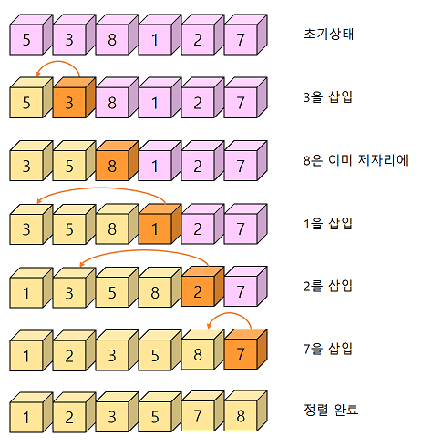

  ```
  insertion_sort(A, n):
  
  1. for i<-1 to n-1 do
  // 인덱스 1부터 시작한다. 인덱스 0은 이미 정렬된 것으로 볼 수 있다.
  2. 	key<-A[i];
  // 현재 삽입될 숫자인 i번째 정수를 key 변수로 복사
  3. 	j<-i-1;
  // 현재 정렬된 배열은 i-1까지 이므로 i-1번째부터 역순으로 조사한다.
  4. 	while j>=0 and A[j]>key do
  // j값이 음수가 아니어야 되고 key값보다 정렬된 배열에 있는 값이 크면
  5. 		A[j+1]<-A[j];
  // j번째를 j+1번째로 이동한다.
  6. 		j<-j-1;
  // j를 하나 감소한다.
  7. 	A[j+1]<-key
  // j번째 정수가 key보다 작으므로 j+1번째가 key값이 들어갈 위치이다.
  ```

  (사진)

## 삽입 정렬의 C언어 구현

```c
void insertion_sort(int list[], int n)
{
    int i, j, key;
    for(i = 1; i < n; i++){
        key = list[i];
        for(j = i-1; i >= 0 && list[j] > key; j--)
            list[j+1] = list[j];
        list[j+1] = key;
    }
}
```

## 삽입 정렬의 복잡도 분석

- 삽입 정렬의 복잡도는 입력 자료의 구성에 따라서 달라진다.

  - 입력 자료가 이미 정렬되어 있는 경우는 가장 빠르다.

    - 삽입 정렬의 외부 루프는 n-1번 실행되고 각 단계에서 1번의 비교와 2번의 이동만 이루어지므로 총 비교 횟수는 n-1번, 총 이동횟수는 2(n-1)번이 되어 알고리즘의 시간 복잡도는 O(n)이다.

  - 최악의 복잡도는 입력 자료가 역순일 경우이다.

    - 각 단계에서 앞에 놓인 자료들은 전부 한 칸씩 뒤로 이동하여야 한다.
    - 따라서 외부 루프안의 각 반복마다 i번의 비교가 수행되므로 총 비교 횟수는 다음과 같다.

    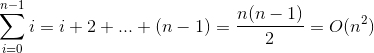

    - 총 이동 횟수는 외부 루프의 각 단계마다 i+2번의 이동이 이루어지므로 다음과 같다.

    

  - 삽입 정렬은 비교적 많은 레코드들의 이동을 포함한다.
    
    - 결과적으로 삽입 정렬은 레코드 양이 많고 레코드 크기가 클 경우에 적합하지 않음을 알 수 있다.
  - 반면에 삽입 정렬은 안정한 정렬 방법으로서 레코드의 수가 적을 경우 알고리즘 자체가 매우 간단하므로 다른 복잡한 정렬 방법보다 유리할 수 있다.
  - 또한 레코드가 이미 정렬되어 있는 경우에 매우 효율적일 수 있다.

# 12.4 버블 정렬

## 버블 정렬의 원리

- **버블 정렬(bubble sort)** : 인접한 2개의 레코드를 비교하여 크기가 순서대로 되어 있지 않으면 서로 교환하는 비교-교환 과정을 리스트의 왼쪽 끝에서 시작하여 오른쪽 끝까지 진행한다.

  - 이러한 리스트의 비교-교환 과정(스캔)이 한번 완료되면 가장 큰 레코드가 리스트의 오른쪽 끝으로 이동된다.
  - 레코드의 이동 과정이 마치 물속에서 거품(bubble)이 보글보글 떠오르는 것과 유사하여 버블 정렬이라 부른다.
  - 스캔은 전체 숫자가 전부 정렬될 때까지 계속된다.

  -  정렬이 안 된 오른쪽 리스트를 한번 스캔하면 오른쪽 리스트의 오른쪽 끝에 가장 큰 레코드가 위치하게 되고, 오른쪽 리스트는 추가된 레코드를 포함하여 정렬된 상태가 된다.
    - 이러한 스캔 과정을 정렬이 안 된 왼쪽 리스트에서 반복하여 적용하면 정렬이 완료된다.

  (사진)

  - 한 번의 스캔에 의해 가장 큰 레코드가 리스트의 오른쪽 끝으로 이동하게 된다. 이러한 과정이 왼쪽 리스트가 없어질 때까지 수행하여 전체 리스트가 정렬되는 정렬될 때 까지 진행한다.

  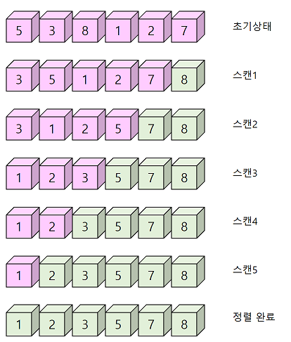

  ```
  BubbleSort(A, n):
  
  for i<-n-1 to 1 do
  	for j<-0 to i-1 do
  		j와 j+1번째의 요소가 크기순이 아니면 교환
  		j++;
      i--;
  ```

  ```c
  #define SWAP(x, y, t) ((t) = (x), (x) = (y), (y) = (x))
  void bubble_sort(int list[], int n)
  {
      int tmp;
      for(int i = n-1; i > 0; i--)
          for(int j = 0; j < i-1; j++)
              if(list[j] > list[j+1])
                  SWAP(list[j], list[j+1], tmp);
  }
  ```

## 버블 정렬의 복잡도 분석

- 비교 횟수는 최선, 평균, 최악의 어떠한 경우에도 항상 일정하다.

  

- 이동 횟수인데 최악의 이동 횟수는 입력 자료가 역순으로 정렬되어 있는 경우에 발생하고 그 횟수는 비교 연산의 횟수에 3을 곱한 값이다.
  
  - 하나의 SWAP 함수가 3개의 이동을 포함하고 있기 때문이다.
- 최선의 경우는 입력 자료가 이미 정렬이 되어 있는 경우이다.
  
  - 이런 경우에는 자료 이동이 한 번도 발생하지 않는다.
- 평균적인 경우에는 자료 이동이 0번에서 i번까지 같은 확률로 일어날 것이다.
  
  - 따라서 이를 기반으로 O(n<sup>2</sup>)의 알고리즘임을 알 수 있다.
- 버블 정렬의 가장 큰 문제점은 순서에 맞지 않은 요소를 인접한 요소와 교환한다는 것이다.
  - 하나의 요소가 가장 왼쪽에서 가장 오른쪽으로 이동하기 위해서는 배열에서 모든 다른 요소들과 교환되어야 한다.
  - 특히 특정 요소가 최종 정렬 위치에 이미 있는 경우라도 교환되는 일이 일어난다.
  - 일반적으로 자료의 교환(swap) 작업이 자료의 이동(move) 작업보다 더 복잡하기 떄문에 버블 정렬은 그 단순성에도 불구하고 거의 쓰이지 않고 있다.

# 12.5 쉘 정렬

## 쉘 정렬의 원리

- **쉘 정렬(shell sort)** : Donald L. Shell이라는 사람이 제안한 방법으로 삽입 정렬이 어느 정도 정렬된 배열에 대해서는 대단히 빠른 것에 착안한 방법이다.
  - 쉘 정렬은 삽입 정렬의 O(n<sup>2</sup>)보다 빠르다.

  - 삽입 정렬의 최대 문제점은 요소들이 삽입될 때, 이웃한 위치로만 이동한다는 것이다.
    
    - 만약 삽입되어야 할 위치가 현재 위치에서 상당히 멀리 떨어진 곳이라면 많은 이동을 해야 만이 제자리로 갈 수 있다.
    
  - 쉘 정렬에서는 멀리 떨어진 위치로도 이동할 수 있다.

  - 삽입 정렬과는 다르게 쉘 정렬은 전체의 리스트를 한번에 정렬하지 않는다.

    - 대신에 먼저 정렬해야할 리스트를 일정한 기준에 따라 분류하여 연속적이지 않은 여러 개의 부분 리스트를 만들고, 각 부분 리스트를 삽입 정렬을 이용하여 정렬한다.
    - 모든 부분 리스트가 정렬 되면 쉘 정렬은 다시 전체 리스트를 더 적은 개수의 부분 리스트로 만든 후에 알고리즘을 되풀이한다.
    - 위의 과정은 부분 리스트의 개수가 1이 될 때까지 되풀이 된다.

    - 부분 리스트를 구성할 때는 주어진 리스트의 각 k번째 요소를 추출하여 만든다.
      - k를 간격(gap)이라고 한다.
    - 쉘 정렬에서는 각 스텝마다 간격 k를 줄여가므로 수행과정이 반복될 때마다 하나의 부분 리스트에 속하는 레코드들의 개수는 증가된다.
    - 마지막 스텝에서는 간격의 값이 1이 된다.

  - 실제로 부분 리스트들이 만들어 지는 것이 아니고 일정한 간격으로 삽입 정렬을 수행하는 것뿐이다.

  - 따라서 추가적인 공간은 필요없다.

  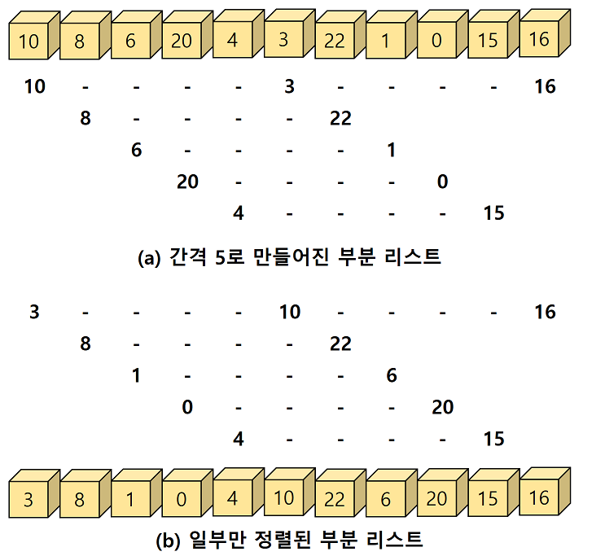

  - 쉘 정렬의 첫 번째 패스가 끝나면 비슷한 방식으로 다시 부분 리스트를 구성하는데 이번에는 간격을 1/2줄여서 입력 배열의 각 2번째 요소를 추출하여 부분 리스트를 만든다.
    - 간격은 처음에 n/2정도로 하고 각 패스마다 간격을 절반으로 줄이는 방식을 많이 사용한다.

  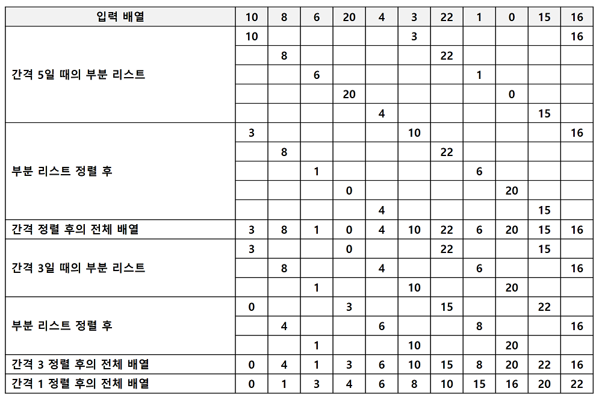

## 쉘 정렬의 구현


## 쉘 정렬의 분석

- 쉘 정렬의 2가지 장점
  - 연속적이지 않은 부분 리스트에서 자료의 교환이 일어나면 더 큰 거리를 이동한다.
    - 반면 삽입 정렬에서는 한 번에 한 칸씩만 이동된다.
    - 따라서 교환되는 아이템들이 삽입 정렬보다는 최종 위치에 더 가까이 있을 가능성이 높아진다.
  - 부분 리스트는 어느 정도 정렬이 된 상태이기 때문에 부분 리스트의 개수가 1이 되게 되면 쉘 정렬은 기본적으로 삽입 정렬을 수행하는 것이지만 빠르게 수행된다.
    - 이것은 삽입 정렬이 거의 정렬된 리스트에 대해서는 빠르게 수행되기 때문이다.
- 시간 복잡도는 대략 최악의 경우에는 O(n<sup>2</sup>)이지만 평균적인 경우에는 O(n<sup>1.5</sup>)로 나타난다.

# 12.6 합병 정렬

## 합병 정렬의 개념

- **합병 정렬(merge sort)** : 하나의 리스트를 두 개의 균등한 크기로 분할하고 분할된 부분 리스트를 정렬한 다음, 두 개의 정렬된 부분 리스트를 합하여 전체가 정렬된 리스트를 얻고자 하는 것이다.

  - 합병 정렬은 분할 정복(divide and conquer) 기법에 바탕을 두고 있다.

  - **분할 정복 기법** : 문제를 작은 2개의 문제로 분리하고 각각을 해결한 다음, 결과를 모아서 원래의 문제를 해결하는 전략이다.

    - 분리된 문제가 아직도 해결하기 어렵다면, 즉 충분히 작지 않다면 분할 정복 방법을 연속하여 다시 적용한다.
    - 분할 정복 기법은 대개 순환 호출을 이용하여 구현된다.

    1. 분할(Divide) :  입력 배열을 같은 크기의 2개의 부분 배열로 분할한다.
    2. 정복(Conquer) : 부분 배열을 정렬한다. 부분 배열의 크기가 충분히 작지 않으면 순환 호출을 이용하여 다시 분할 정복 기법을 적용한다.
    3. 결합(Combine) : 정렬된 부분 배열들을 하나의 배열에 통합한다.

  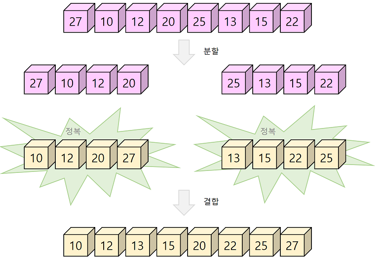

## 합병 정렬 알고리즘

```
merge_sort(list, left, right)

1. if left < right
// 만약 나누어진 구간의 크기가 1이상이면
2. 	mid = (left + right)/2;
// 중간 위치를 계산한다.
3. 	merge_sort(list, left, mid);
// 앞쪽 부분 배열을 정렬하기 위하여 merge_sort 함수를 순환 호출한다.
4. 	merge_sort(list, mid+1, right);
//	뒤쪽 부분 배열을 정렬하기 위하여 merge_sort 함수를 순환 호출한다.
5. 	merge(list, left, mid, right);
// 정렬된 2개의 부분 배열을 통합하여 하나의 정렬된 배열로 만든다.
```

- 합병 정렬에서 실제로 정렬이 이루어지는 시점은 2개의 리스트를 합병(merge)하는 단계이다.

  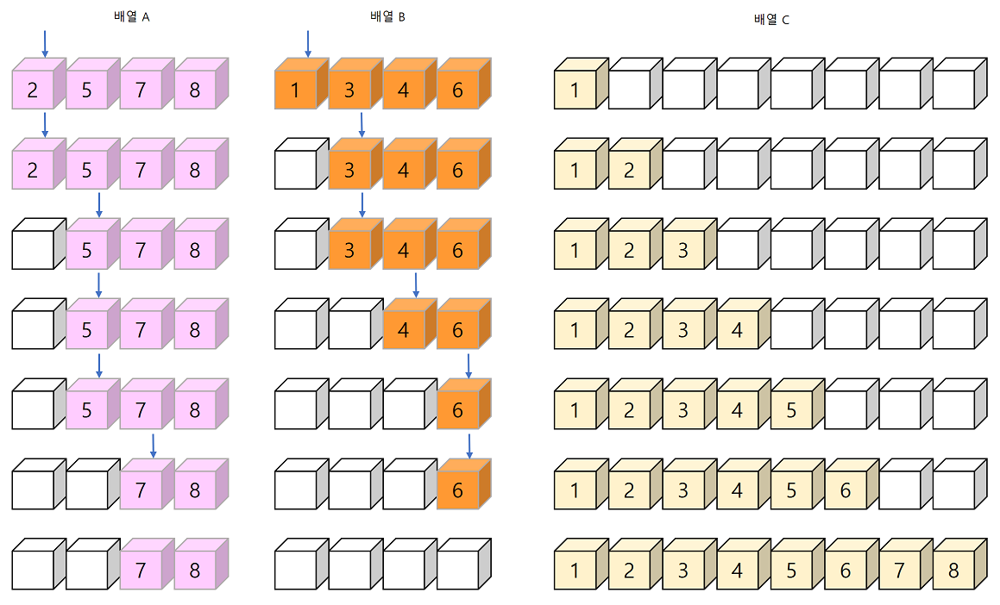

- 합병 알고리즘

  ```
  merge(list, left, mid, right):
  // 2개의 인접한 배열 list[left, mid]와 list[mid+1, right]를 합병
  
  i<-left;
  j<-mid+1;
  k<-left;
  sorted 배열을 생성;
  while i<=mid and j<=right do
  	if(list[i] < list[j])
  		then
  		sorted[k]<-list[i];
  		k++;
  		i++;
  	else
  		sorted[k]<-list[j];
  		k++;
  		j++;
  요소가 남아있는 부분 배열을 sorted로 복사한다.
  sorted를 list로 복사한다.
  ```

  - 합병 알고리즘은 하나의 배열 안에 두 개의 정렬된 부분 리스트가 저장되어 있다고 가정하였다.
    - 즉 첫 번쨰 부분 리스트는 list[left]부터 list[mid]까지 이고, 두 번쨰 부분 리스트는 list[mid+1]부터 list[right]까지이다.
    - 합병된 리스트를 임시로 저장하기 위해서 배열 sorted를 사용한다.

## 합병 정렬의 C언어 구현


## 합병 정렬의 복잡도 분석

- 일반적으로 배열의 크기 n이 n=2<sup>k</sup> 라면 부분 배열의 크기는 2<sup>k</sup>,  2<sup>k-1</sup>, ... , 2<sup>0</sup>이 되어 순환 호출의 깊이가 k가 될 것임을 쉽게 알 수 있다. 따라서 k = log<sub>2</sub>n 임을 알 수 있다.
- 배열이 부분 배열로 나누어지는 단계에서는 비교 연산이나 이동 연산은 수행되지 않는다. 부분 배열이 합쳐지는 함수에서 비교 연산과 이동 연산이 수행되는 것이다.
  - 부분 배열의 크기가 1인 부분 배열 2개를 합병하는데 최대 2개의 비교 연산이 필요하므로 크기가 2인 부분 배열이 4개 있다고 하면 최대 8번의 비교 연산이 필요하다.
  - 따라서 합병 단계에서는 최대 n번의 비교 연산이 필요하다.
  - 합병 단계는 k = log<sub>2</sub>n번 만큼 있으므로 총 비교 연산은 최대 nlog<sub>2</sub>n번 필요하다.
  - 하나의 합병 단계에서 보면 임시 배열에 복사했다가 다시 가져와야 되므로 이동 연산은 총 부분 배열에 들어 있는 요소의 개수가 n인 경우, 레코드의 이동이 2n번 발생하므로 하나의 합병 단계에서 2n개가 필요하다.
    - 따라서 log<sub>2</sub>n개의 합병 단계가 필요하므로 총 2nlog<sub>2</sub>n개의 이동 연산이 필요하다.
  - 결론적으로 합병 정렬은 비교 연산과 이동 연산의 경우 O(nlog<sub>2</sub>n)의 복잡도를 가지는 알고리즘이다.
  - 합병 정렬의 다른 장점은 안정적인 정렬 방법이며 데이터의 분포에 영향을 덜 받는다.
    - 즉 입력 데이터가 무엇이든간에 정렬되는 시간은 동일하다. 그러므로 최악, 평균, 최선의 경우가 다같이  O(nlog<sub>2</sub>n)인 정렬 방법이다.
  - 합병 정렬의 단점은 임시 배열이 필요하다는 것과 만약 레코드들의 크기가 큰 경우에는 이동 횟수가 많으므로 합병 정렬은 매우 큰 시간적 낭비를 초래한다.
    - 그러나 만약 레코드를  연결 리스트로 구성하여 합병 정렬할 경우, 링크 인덱스만 변경되므로 데이터의 이동은 무시할 수 있을 정도로 작아진다.
    - 따라서 크기가 큰 레코드를 정렬할 경우, 만약 연결 리스트를 사용한다면, 합병 정렬은 퀵 정렬을 포함한 다른 어떤 정렬 방법보다 효율적일 수 있다.

# 12.7 퀵 정렬

## 퀵 정렬의 개념

- **퀵 정렬(quick sort)** : 평균적으로 매우 빠른 수행 속도를 자랑하는 정렬 방법이다.

  - 퀵 정렬도 분할 정복(divide and conquer)에 근거한다.

  - 퀵 정렬은 합병 정렬과 비슷하게 전체 리스트를 2개의 부분 리스트로 분할하고, 각각의 부분 리스트를 다시 퀵 정렬하는 전형적인 분할-정복법을 사용한다.

  - 그러나 합병 정렬과는 달리 퀵 정렬은 리스트를 비균등하게 분할한다.

    - 먼저 리스트 안에 있는 한 요소를 피벗(pivot)으로 선택한다.
    - 피벗보다 작은 요소들은 모두 피벗의 왼쪽으로 옮겨지고 피벗보다 큰 요소들은 모두 피벗의 오른쪽으로 옮겨진다.

    - 결과적으로 피벗을 중심으로 왼쪽은 피벗보다 작은 요소들로 구성되고, 오른쪽은 피벗보다 큰 요소들로 구성된다.
    - 이 상태에서 피벗을 제외한 왼쪽 리스트와 오른쪽 리스트를 다시 정렬하게 되면 전체 리스트가 정렬된다.

  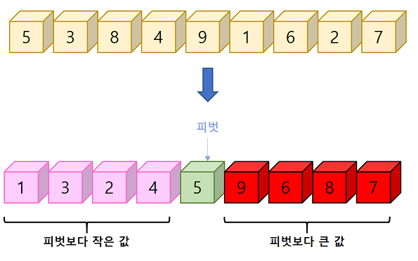

  - 퀵 정렬도 합병 정렬과 마찬가지로 함수가 다시 부분 리스트에 대하여 순환 호출된다.
    - 부분 리스트에서도 다시 피벗을 정하고 비벗을 기준으로 2개의 부분 리스트로 나누는 과정이 되풀이 된다.
    - 부분 리스트들이 더 이상 분할이 불가능할 때까지 나누어 진다.

## 퀵 정렬 알고리즘

```c
// 정렬할 범위가 2개 이상의 데이터이면
void quick_sort(int list[], int left, int right)
{
    if(left < right){
        int q = partition(list, left, right);
// partition 함수를 호출하여 피벗을 기준으로 2개의 리스트로 분할한다. 반환값은 피벗의 위치가 된다.
        quick_sort(list, left, q-1);
// left에서 피벗 위치 바로 앞까지를 대상으로 순환호출한다.(피벗은 제외된다.)
        quick_sort(list, q+1, right);
// 피벗 위치 바로 다음부터 right까지를 대상으로 순환 호출한다,(피벗은 제외된다.)
    }
}
```

​		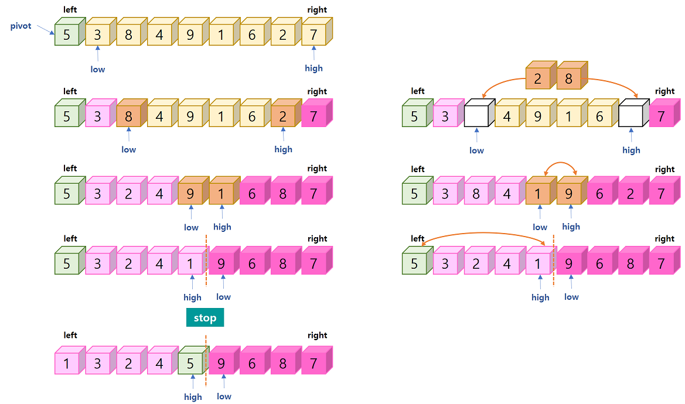

```c
#define SWAP(x, y, t) ((t) = (x), (x) = (y), (y) = (t))

int partition(int list[], int left, int right)
{
    int low, high;
    int pivot, temp;
    
    low = left;
// low는 left+1에서 출발, do-while 루프에서 먼저 증가를 시킴을 주의하라.
    high = right+1;
// high는 right에서 출발, do-while 루프에서 먼저 감소를 시킴을 주의하라.
    pivot = lit[left];
// 정렬할 리스트의 가장 왼쪽 데이터를 피벗으로 선택한다.
    
    do{
        do{
            low++;
        }while(list[low] < pivot);
        // list[low]가 pivot보다 작으면 계속 low를 증가시킨다.
        do{
            high--;
        }while(list[high] > pivot);
        // list[high]가 pivot보다 크면 계속 high를 감소시킨다.
        if(low < high)
            SWAP(list[low], list[high], temp);
        // low와 high가 아직 교차하지 않았으면 list[low]와 list[high]를 교환한다.
    }while(low < high);
    // low와 high가 교차하였으면 반복을 종료한다.
    
    SWAP(list[left], list[high], temp);
    // 피벗을 중앙에 위치시킨다.
    return high;
    // 피벗의 위치를 반환한다.
}
```

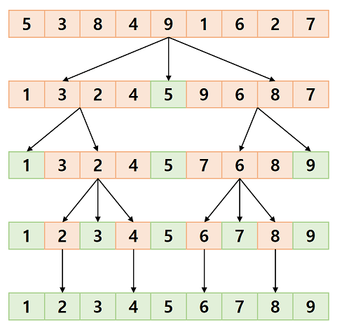

## 퀵 정렬의 복잡도 분석

- n이 2의 거듭제곱이라고 가정하고 만약에 퀵 정렬에서의 리스트 분할이 항상 리스트의 가운데에서 이루어진다고 가정하면 합병 정렬의 복잡도 분석과 마찬가지로 n개의 레코드를 가지는 리스트는 n/2, n/4, n/8...n/2<sup>k</sup>의 크기로 나누어질 것이다.

  - 크기가 1이 될 때까지 나누어지므로 n/2<sup>k</sup> = 1일 때까지 나누어질 것이고 따라서 k = log<sub>2</sub>n개의 패스가 필요하게 된다.
  - 각각의 패스에서는 전체 리스트의 대부분의 레코드를 비교해야 하므로 평균 n번 정도의 비교가 이루어지므로 퀵 정렬은 비교 연산을 총 nlog<sub>2</sub>n번 실행하게 되어 O(nlog<sub>2</sub>n)의 복잡도를 가지는 알고리즘이 된다.

  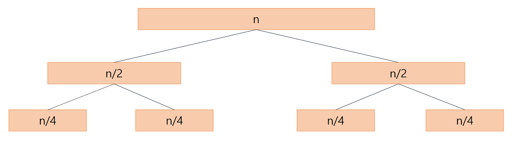

- 퀵 정렬에서의 최악의 경우는 리스트가 계속 불균형하게 나누어지는 것이다.

  - 이런 경우, 퀵 정렬의 패스의 개수는 n이 되고, 한번의 패스에서 평균 n번 정도의 비교 연산이 필요하므로 거의 O(n<sup>2</sup>)의 시간 복잡도가 된다.
  - 특히 이미 정렬된 리스트에 대하여 퀵 정렬을 실행하는 경우 리스트의 첫 번째 레코드를 피벗으로 설정하면, 왼편 리스트가 텅 비게 되는 불균형 분할이 연속해서 이루어진다.
  - 이 경우 레코드의 수만큼 총 n번의 패스가 실행되고, 각 패스에서 n번의 비교가 이루어지게 되므로 비교 연산을 n<sup>2</sup>번 실행하게 된다.
  - 즉, 퀵 정렬은 최악의 경우 O(n<sup>2</sup>)의 시간 복잡도를 가진다.

  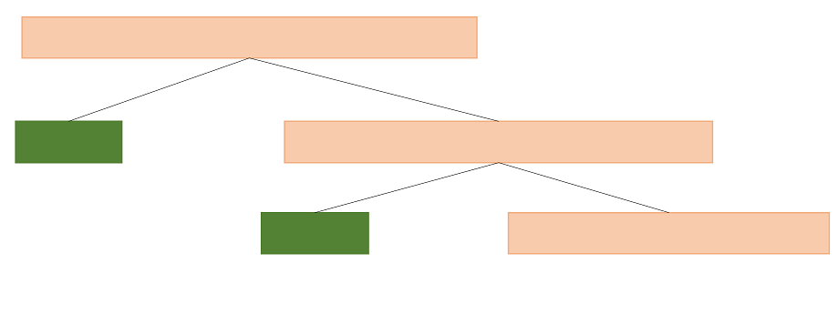

- 퀵 정렬은 불필요한 데이터의 이동을 줄이고 먼 거리의 데이터를 교환할 뿐만 아니라, 한번 결정된 피벗들이 추후 연산에서 제외되는 특성 등에 기인한다고 보인다.

- 퀵 정렬은 속도가 빠르고 추가 메모리 공간을 필요로 하지 않는 등의 장점이 있는 반면에 정렬된 리스트에 대해서는 오히려 수행 시간이 더 많이 걸리는 등의 단점도 가진다.

  - 이러한 불균형 분할을 방지하기 위하여 피벗을 선택할 때 단순히 리스트의 왼쪽 데이터를 사용하는 대신에 보다 리스트의 중앙 부분을 분할할 수 있는 데이터를 선택한다.
  - 많이 사용되는 방법은 리스트 내의 몇개의 데이터 중에서 중간값(median)을 피벗으로 선택하는 것이다.
  - 일반적으로 리스트의 왼쪽, 오른쪽, 중간의 3개의 데이터 중에서 중간 값을 선택하는 방법(median of three)이 많이 사용된다.