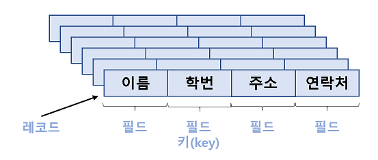
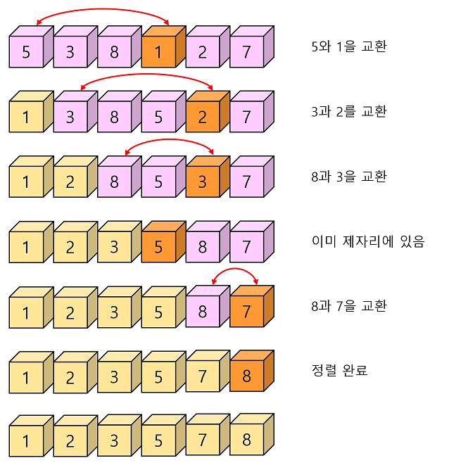
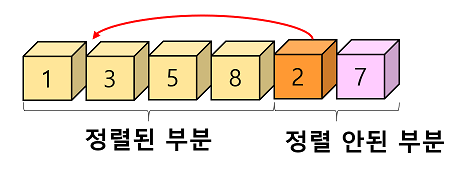

# 12.1 정렬이란?

- 정렬(sorting) : 물건을 크기순으로 오름차순(ascending order)이나 내림차순(descending order)으로 나열하는 것을 의미한다.

  - 정렬은 컴퓨터 공학에서 가장 기본적이고 중요한 알고리즘 중의 하나로 일상생활에서 많이 사용된다.
  - 정렬은 자료 탐색에 있어서 필수적이다.
    - 정렬되어 있지 않은 자료가 주어지면 탐색의 효율성이 크게 떨어진다.
  - 레코드(record) : 일반적으로 정렬시켜야 될 대상
    - 레코드는 다시 필드(field)라고 하는 단위로 나누어진다.
    - 여러 필드 중에서 특별히 레코드와 레코드를 식별해주는 역할을 하는 필드를 키(key)라고 한다.
  - 정렬이란 결국 레코드들을 키값의 순서로 재배열하는 것이다.

  

  - 지금까지 개발된 정렬 알고리즘은 매우 많다. 그러나 아직까지도 모든 경우에 있어서 최상의 성능을 보여주는 최적 알고리즘은 존재하지 않는다.
    - 따라서 이들 방법들 중에서 현재의 프로그램 수행환경에서 가장 효율적인 정렬 알고리즘을 선택하여야 한다.
  - 대개 정렬 알고리즘을 평가하는 효율성의 기준으로는 정렬을 위해 필요한 비교 연산의 횟수와 이동 연산의 횟수이다.
    - 이들 횟수를 정확하게 구하기는 힘들기 때문에 이들 횟수를 빅오 표기법을 이용하여 근사적으로 표현한다.
    - 대개 이들 횟수는 자료의 초기화 여부에 의존적이다.
    - 일반적으로 이동 횟수와 비교 횟수가 서로 비례하지 않는다.
      - 즉 어떤 알고리즘은 비교 횟수는 많지만 이동 횟수는 적을 수 있고 또 그 반대도 가능하다.
  - 정렬 알고리즘은 크게 2가지로 나누어진다.
    - 단순하지만 비효율적인 알고리즘 : 삽입 정렬, 선택 정렬, 버블 정렬 등
      - 대개 자료의 개수가 전다면 단순한 정렬 방법을 사용하는 것이 괜찮은 선택이다.
    - 복잡하지만 효율적인 방법 : 퀵 정렬, 히프 정렬, 합병 정렬, 기수 정렬 등
      - 자료의 개수가 일정 개수를 넘어가면 반드시 효율적인 알고리즘을 사용하여야 한다.
  - 정렬 알고리즘은 내부 정렬(internal sorting)과 외부 정렬(external sorting)로 구분할 수도 있다.
    - 내부 정렬 : 정렬하기 전에 모든 데이터가 메인 메모리에 올라와 있는 정렬을 의미한다.
      - 기존의 있던 모든 데이터들을 메인 메모리에 올리고 그 데이터들을 모두 정렬하는 것을 의미한다.
    - 외부 정렬 : 외부 기억 장치에 대부분의 데이터가 있고 일부만 메모리에 올려놓은 상태에서 정렬하는 방법이다.
      - 기존의 있던 모든 데이터들을 분리해서 보관한 뒤 하나씩 정렬을 하는 것을 의미한다.
      - 이와 같은 경우에서는 나누어서 정렬하였기 때문에 나중에 합병하는 작업이 필요하다.
  - 정렬 알고리즘은 안정성(stability)의 측면에서 분류할 수도 있다.
    - 정렬 알고리즘에서 안정성이란 입력 데이터에 동일한 키 값을 갖는 레코드가 여러 개 존재할 경우, 이들 레코드들의 상대적인 위치가 정렬 후에도 바뀌지 않음을 뜻한다.
    - 정렬이 안정성이 필수적으로 요구되는 경우에는 정렬 알고리즘 중에서 안정성을 충족하는 삽입정렬, 버블정렬, 합병정렬 등을 사용해야 한다.

  

# 12.2 선택 정렬

## 선택 정렬의 원리

- **선택 정렬(selection sort)** : 두 개의 리스트를 만들어 왼쪽에는 정렬된 숫자들이, 오른쪽에는 정렬되지 않는 숫자들이 들어있다고 하였을 때 오른쪽 리스트에서 가장 크거나 작은 숫자들을 왼쪽으로 옮겨가며 오른쪽의 리스트가 공백이 될 때까지 이 과정을 되풀이하는 정렬 기법이다.

  |    왼쪽 리스트     |   오른쪽 리스트    |   설명   |
  | :----------------: | :----------------: | :------: |
  |         ()         | (5, 3, 8, 1, 2, 7) | 초기상태 |
  |        (1)         |  (5, 3, 8, 2, 7)   |  1선택   |
  |       (1, 2)       |    (5, 3, 8, 7)    |  2선택   |
  |     (1, 2, 3)      |     (5, 8, 7)      |  3선택   |
  |    (1, 2, 3, 5)    |       (8, 7)       |  5선택   |
  |  (1, 2, 3, 5, 7)   |        (8)         |  7선택   |
  | (1, 2, 3, 5, 7, 8) |         ()         |  8선택   |

  - 이와 같은 방법을 사용하였을 때 입력 배열과 별도로 크기가 같은 배열이 하나 더 필요하다.
    - 메모리를 절약하기 위해 입력 배열외에 추가적인 공간을 사용하지 않는 선택 정렬 알고리즘이 필요하다.
    - **제자리 정렬(in-place sorting)** : 입력 배열 이외에는 다른 추가 메모리를 요구하지 않는 정렬 방법
    - 오른쪽 리스트에서 하나의 최소값 또는 최대값을 선택하고 그 값을 왼쪽 리스트로 이동하면 하나의 빈공간이 생기게 된다. 그렇다면 이 값을 배열의 첫번째 요소와 교환하는 방식을 사용하게 된다면 메모리를 절약하는 제자리 정렬이 가능하게 된다.
      - 이때 첫번째 요소와 교환을 했다면 그 다음 탐색때는 첫번째 요소가 아닌 두번째 요소부터 탐색을 시작해야 한다.

  

## 선택 정렬의 분석

- 비교 횟수 : 두 개의 for 루프의 실행 횟수는 외부 루프는 n-1번 실행될 것이고 내부 루프는 0에서 n-2까지 변하는 i에 대하여 (n-1)-i번 반복될 것이다.

  - 키 값들의 비교가 내부 루프 안에서 이루어지므로 전체 비교 횟수는 다음과 같이 된다.

  

- 교환 횟수 : 외부 루프의 실행 횟수와 같으며 한번 교환하기 위하여 3번의 이동이 필요하므로 전체 이동 횟수는 3(n-1)이 된다.

- 선택 정렬의 장점은 자료 이동 횟수가 미리 결정된다는 점이다.

  - 그러나 이동 횟수는 3(n-1)으로 상당히 큰 편이다.
  - 또한 자료가 정렬된 경우에는 불필요하게 자기 자신과의 이동을 하게 된다. 따라서 이 문제를 개선하려면 if 문을 추가하면 된다.

  ``` c
  if(i != least)
      SWAP(list[i], list[least], temp);
  ```

  - 즉 최소값이 자기 자신이면 자료이동을 하지 않는다.
  - 일반적으로 비교 연산 1개가 이동 연산 3개보다 시간이 적게 걸리므로 효과적이다.

- 선택 정렬의 문제점은 안정성을 만족하지 않는다는 점이다.

  - 즉 값이 같은 레코드가 있는 경우에 상대적인 위치가 변경될 수 있다.

# 12.3 삽입 정렬

- **삽입 정렬(insertion sort)** : 정렬되어 있는 리스트에 새로운 레코드를 적절한 위치에 삽입하는 과정을 반복한다.

  - 선택 정렬과 마찬가지로 입력 배열을 선택 정렬과 유사하게 정렬된 부분과 정렬되지 않는 부분으로 나누어서 사용하면 된다.

  

  -  정렬되어 있지 않은 부분의 첫 번째 숫자가 정렬된 부분의 어느 위치에 삽입되어야 하는가를 판단한 후 해당 위치에 이 숫자를 