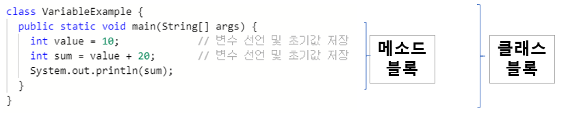
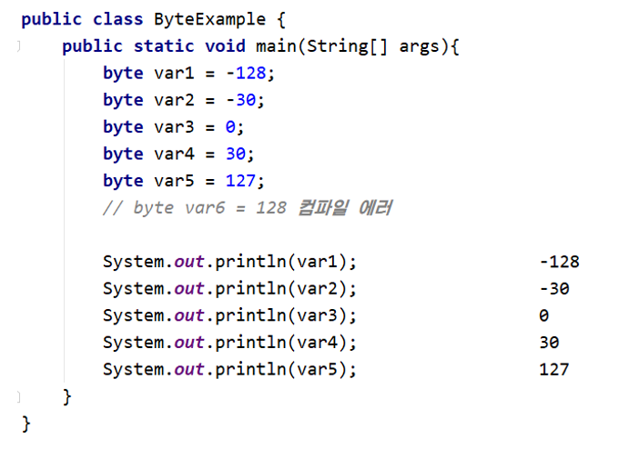
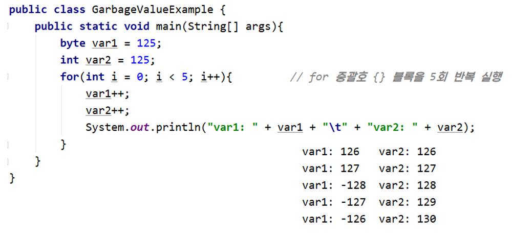

# 2. 변수와 타입

## 2.1 변수

### 2.1.1 변수란?

- 프로그램은 작업을 처리하는 과정에서 필요에 따라 데이터를 메모리에 저장한다.

- **변수(Variable)** : 값을 저장할 수 있는 메모리의 공간을 의미한다.

  - 변수란 이름을 갖게 된 이유는 프로그램에 의해서 수시로 값이 변동될 수 있기 때문이다.
  - 변수에는 복수 개의 값을 저장할 수  없고, 하나의 값만 저장할 수 있다.

  ```
  변수란, 하나의 값을 저장할 수 있는 메모리 공간이다.
  ```

  - 변수에는 다양한 타입의 값을 저장할 수 없고, 한 가지 타입의 값만 저장할 수 있다.


### 2.1.2 변수의 선언

- 변수 선언은 어떤 타입의 데이터를 저장할 것인지 그리고 변수 이름이 무엇인지를 결정한다.

  ```java
  int age;			//정수(int)값을 저장할 수 있는 age 변수 선언
  double value;		//실수(double)값을 저장할 수 있는 value 변수 선언
  ```

  - 타입은 변수에 저장되는 값의 종류와 범위를 결정짓는 요소이기 때문에 어떤 값을 변수에 저장할지 충분히 생각한 다음 결정해야 한다.
  - 같은 타입의 변수는 콤마(,)를 이용해서 한꺼번에 선언할 수도 있다.

  ```java
  int x, y, z;
  ```

  - 변수 이름은 메모리 주소에 붙여진 이름이다.
    - 프로그램은 변수 이름을 통해서 메모리 주소에 접근하고, 그곳에 값을 저장하거나 그곳에 있는 값을 읽는다.
  - 변수 이름은 자바 언어에서 정한 명명 규칙(naming convention)을 따라야 한다.

| 작성 규칙                                                    | 예                                                           |
| ------------------------------------------------------------ | ------------------------------------------------------------ |
| 첫 번째 글자는 문자이거나 '$', '_'이어야 하고 숫자로 시작할 수 없다.(필수) | <p>가능: price, $price, _companyName</p>안됨: 1v, @speed, $#value |
| 영어 대소문자가 구분된다.(필수)                              | firstname과 firstName은 다른 변수                            |
| 첫 문자는 영어 소문자로 시작하되, 다른 단어가 붙을 경우 첫 문자를 대문자로 한다.(관례) | maxSpeed, firstName, carBodyColor                            |
| 문자 수(길이)의 제한은 없다.                                 |                                                              |
| 자바 예약어는 사용할 수 없다.(필수)                          |                                                              |

- 자바는 예약어를 가지고 있는데, 이 예약어들로 변수 이름을 지정하면 컴파일 에러가 발생하기 때문에 주의해야 한다.

| 분류                  | 예약어                                                       |
| :-------------------- | ------------------------------------------------------------ |
| 기본 데이터 타입      | boolean, byte, char, short, int, long, float, double         |
| 접근 지정자           | private, protected, public                                   |
| 클래스와 관련된 것    | class, abstract, interface, extends, implements, enum        |
| 객체와 관련된 것      | new, instanceof, this, super, null                           |
| 메소드와 관련된 것    | void, return                                                 |
| 제어문과 관련된 것    | if, else, switch, case, default, for, do, while, break, continue |
| 논리값                | true, false                                                  |
| 예외 처리와 관련된 것 | try, catch, finally, throw, throws                           |
| 기타                  | transient, volatile, package, import, synchronized, native, final, static, strictfp, assert |

- 개발자는 변수 이름을 보고, 이 변수가 어떤 값을 저장하고 있는지 쉽게 알 수 있도록 의미 있는 변수 이름을 지어주는 것이 좋다.
  - 변수 이름의 길이는 프로그램 실행과는 무관하기 때문에 충분히 길어도 상관없다.
  - 필수적인 것은 아니지만 명명 규칙과 관련된 자바 개발자들 간에 지켜져오는 관례가 있는데, 관례란 필수적인 것은 아니지만 개발자 간의 코드 작성 패턴을 공유하고자 하는 약속이기 때문에 가급적 지켜주는 것이 좋다.
  - 변수 이름에 한글도 사용이 가능하지만 가급적이면 한글을 포함하지 않는 것이 좋다.
    - 한국어를 모르는 다른 사람도 소스 코드를 볼 수 있기 때문이다.


### 2.1.3 변수의 사용

- 변술를 사용한다는 것은 변수에 값을 저장하고 읽는 행위를 말한다.

#### 변수값 저장

- 변수에 값을 저장할 때에는 대입 연산자(=)를 사용한다.

  - 일반 수학에서 =은 같다는 의미지만, 자바 언어에서는 우측의 값을 좌측 변수에 저장한다는 의미를 갖는다.
  - 변수를 선언하고 처음 값을 저장할 경우, 이러한 값을 초기값이라고 한다.
    - 변수에 초기값을 주는 행위를 변수의 초기화라고 한다.

  ```java
  int score;		// 변수 선언
  score = 90;		// 값 저장
  ```

  - 초기값은 변수를 선언함과 동시에 줄 수도 있다.

  ```java
  int score = 90;
  ```

- **리터럴(literal)** : 변수에 초기값은 코드에서 직접 입력하는 경우가 많은데, 소스 코드 내에서 직접 입력된 값

  - 리터럴은 값에 종류에 따라 정수 리터럴, 실수 리터럴, 문자 리터럴, 논리 리터럴로 구분된다.

  - 리터럴은 상수(constant)와 같은 의미지만, 프로그램에서는 상수를 "값을 한 번 저장하면 변경할 수 없는 변수"로 정의하기 때문에 "리터럴"이라는 용어를 사용한다.

  - **정수 리터럴**

    > - 소수점이 없는 정수 리터럴은 10진수로 간주한다.
    >
    > ```
    > 0, 75, -100
    > ```
    >
    > - 0으로 시작되는 리터럴은 8진수로 간주한다.
    >
    > ```
    > 02, -04
    > ```
    >
    > - 0x 또는 0X로 시작하고 0~9 숫자나 A, B, C, D, E, F 또는 a, b, c, d, e, f로 구성된 리터럴은 16진수로 간주된다.
    >
    > ```
    > 0x5, 0xA, 0xB3, 0xAC08
    > ```
    >
    > 정수 리터럴은 저장할 수 있는 타입은 byte, char, short, int, long과 같이 5개가 있다.

  - **실수 리터럴**

    > - 소수점이 있는 리터럴은 10진수 실수로 간주한다.
    >
    > ```
    > 0.25, -3.14
    > ```
    >
    > - 대문자 E 또는 소문자 e가 있는 리터럴은 10진수 지수와 가수로 간주한다.
    >
    > ```
    > 5E7			// 5 x 10^7
    > 0.12E-5		// 0.12 x 10^-5
    > ```
    >
    > 실수 리터럴을 저장할 수 있는 타입은 float, double이 있다.

  - **문자 리터럴**

    > - 작은 따옴표(')로 묶은 텍스트는 하나의 문자 리터럴로 간주한다.
    >
    > ```
    > 'A', '한', '\t', '\n'
    > ```
    >
    > - 역슬래쉬(\\)가 붙은 문자 리터럴은 이스케이프(escape) 문자라고도 한다.
    >
    > | 이스케이프 문자 | 용도                       | 유니코드      |
    > | --------------- | -------------------------- | ------------- |
    > | '\t'            | 수평 탭                    | 0x0009        |
    > | '\n'            | 줄 바꿈                    | 0x000a        |
    > | '\r'            | 리턴                       | 0x000d        |
    > | '\\"'           | "(큰따옴표)                | 0x0022        |
    > | '\\''           | '(작은따옴표)              | 0x0027        |
    > | '\\\\'          | \                          | 0x005c        |
    > | '\u16진수'      | 16진수에 해당하는 유니코드 | 0x0000~0xffff |
    >
    > 문자 리터럴을 저장할 수 있는 타입은 char 하나뿐이다.

  - **문자열 리터럴**

    > - 큰따옴표(")로 묶은 텍스트는 문자열로 간주한다. 큰따옴표 안에는 텍스트가 없어도 문자열 리터럴로 간주된다. 문자열 리터럴 내부에서도 이스케이프 문자를 사용할 수 있다.
    >
    > ```
    > "대한민국"
    > "탭 만큼 이동 \t 합니다."
    > "한줄 내려 쓰기 \n 합니다."
    > ```
    >
    > 문자열 리터럴을 저장할 수 있는 타입은 String 하나뿐이다.

  - **논리 리터럴**

    > true와 false는 논리 리터럴로 간주한다.
    >
    > ```
    > true, false
    > ```
    >
    > 논리 리터럴을 저장할 수 있는 타입은 boolean 하나뿐이다.


#### 변수값 읽기

- 변수는 초기화가 되어야 읽을 수가 있고, 초기화가 되지 않는 변수는 읽을 수가 없다.

  ```java
  int value;					// 변수 value 선언(초기화 안됨)
  int result = value + 10;	// 변수 value 값을 읽고 10을 더한 값을 변수 result에 저장
  ```

  - 변수 value가 선언되었지만, 초기화가 되지 않았기 때문에 산술 연산식 value + 10에서 사용할 수 없다.

  ```java
  int value = 30;					// 변수 value가 30으로 초기화됨
  int result = value + 10;		// 변수 value 값을 읽고 10을 더한 값(40)을 result에 저장
  ```


### 2.1.4 변수의 사용 범위

- 변수는 중괄호 {} 블록 내에서 선언되고 사용된다.

  - 중괄호 블록을 사용하는 곳은 클래스, 생성자, 메소드이다.
  - 메소드 블록 내에서 선언된 변수를 특히 로컬 변수(local variable)라고 부른다.
    - 로컬 변수는 메소드 실행이 끝나면 메모리에서 자동으로 없어진다.

  

  - 변수는 메소드 블록 내 어디에서든 선언할 수 있지만, 변수 사용은 제한이 따른다.

    ```
    변수는 선언된 블록 내에서만 사용이 가능하다.
    ```

  - 메소드 블록내에서도 여러가지 중괄호 {} 블록들이 있을 수 있다.
    - 조건문에 해당하는 if(){}, 반복문에 해당하는 for(){}, while(){} 등이 중괄호를 가질 수 있다.
    - 이러한 if, for, while을 제어문이라고 하는데, 제어문 블록에서 선언된 변수는 해당 제어문 블록 내에서만 사용이 가능하고 블록 밖에서는 사용할 수 없다.

  

  - 변수를 선언할 때에는 어떤 범위에서 사용될 것인지를 생각하고, 선언 위치를 결정해야 한다.

    - 메소드 블록에서 어떤 위치에서건 사용할 수 있도록 한다면 메소드 블록 첫머리에 선언하는 것이 좋다.

    ````java
    public class VariableScopeExample{
        public static void main(String[] args){
            int v1 = 15;
            if(v1 > 10){
                int v2 = v1 - 10;
            }
            int v3 = v1 + v2 + 5;	// v2 변수를 사용할 수 없기 때문에 컴파일 에러가 생김
        }
    }
    ````

    - v2가 선언된 곳은 if 블록 내부이기 때문에 블록 바깥에서 사용할 수 없다.


## 2.2 데이터 타입

- 모든 변수에는 타입이 있으며, 타입에 따라 저장할 수 있는 값의 종류와 범위가 달라진다.
- 변수를 선언할 때 주어진 타입은 변수를 사용하는 도중에 변경할 수 없다.
  - 선언할 때 어떤 타입을 사용할지 충분히 고려해야한다.


### 2.2.1 기본(원시: private) 타입

- 기본(원시) 타입이란 정수, 실수, 문자, 논리 리터럴을 직접 저장하는 타입을 말한다.

  - 정수 타입 : byte, char, short, int, long
  - 실수 타입 : float, double
  - 논리 타입 : boolean

  

- 메모리에는 0과 1을 저장하는 최소 기억 단위인 비트(bit)가 있다. 그리고 8개의 비트를 묶어서 바이트(byte)라고 한다.

- 기본 타입은 정해진 메모리 사용 크기(바이트 크기)로 값을 저장하는데 바이트 크기가 클수록 표현하는 값의 범위가 크다.

  - 정수 타입일 경우 -2<sup>n-1</sup>~2<sup>n-1</sup>-1의 값을 저장할 수 있는데, 여기서 n이 메모리 사용 크기(bit 수)이다.
  - 실수 타입일 경우 가수와 지수 부분에 사용되는 bit 크기에 따라서 값의 범위가 결정된다.


### 2.2.2 정수 타입(byte, char, short, int, long)

- 정수 타입에는 모두 다섯 개의 타입이 있으며 저장할 수 있는 값의 범위가 서로 다르다.

  | 정수 타입 | byte | char | short | int  | long |
  | --------- | ---- | ---- | ----- | ---- | ---- |
  | 바이트 수 | 1    | 2    | 2     | 4    | 8    |

  - 자바는 기본적으로 정수 연산을 int 타입으로 수행한다.
    - 저장하려는 값이 정수 리터럴이라면 특별한 이유가 없는 한 int 타입 변수에 저장하는 것이 좋다.


#### byte 타입

- byte 타입은 색상 정보 및 파일 또는 이미지 등의 이진(바이너리) 데이터를 처리할 때 주로 사용된다.

- byte 타입은 정수 타입 중에서 가장 작은 범위의 수를 저장하는데, 표현할 수 있는 값의 범위는 -128~127(-2<sup>7</sup>~2<sup>7</sup>-1)이다.

  - 만약 -128~127를 초과하는 값이 byte 타입 변수에 저장될 경우 **컴파일 에러("Type mismatch:cannot convert from int to byte")**가 발생한다.
  - byte 타입은 1byte, 즉 8bit 크기를 가지므로 0과 1이 8개로 구성된 이진수로 표현하면 -128~127 범위의 값을 가질 수 있다.
  - byte 타입보다 크기가 큰 short, int, long 타입도 전체 바이트 수만 다를 뿐 동일한 원리로 정수값을 표현한다.

  

- 코드에서 정상적으로 변수에 올바른 값을 저장하더라도 프로그램이 실행하는 도중에 변수의 값은 변경된다.

  - 실행 중에 저장할 수 있는 값의 범위를 초과하면 최소값부터 다시 반복 저장되는데, byte일 경우 -128(최소값)부터 시작해서 127(최대값)을 넘으면 다시 -128부터 시작하게 된다.
    - 다른 정수 타입들 역시 저장할 수 있는 값의 범위를 넘어서면 이와 같은 방식으로 처리된다.
    - 이와 가팅 저장할 수 있는 값의 범위를 초과해서 값이 저장될 경우 엉터리 값이 변수에 저장되는데, 이러한 값을 쓰레기값이라고 한다.

  

  - byte 변수는 127을 넘어서는 순간 최소값인 -128부터 다시 저장되는 것을 볼 수 있다.


#### char 타입

