# 3. 연산자

## 3.1 연산자와 연산식

- **연산(operations)** : 프로그램에서 데이터를 처리하여 결과를 산출하는 것

  - **연산자(operator)** : 연산에 사용되는 표시나 기호
  - **피연산자(operand)** : 연산되는 데이터
  - **연산식(expressions)** : 연산자와 피연산자를 이용하여 연산의 과정을 기술한 것

  ```
  x + y
  x - y
  x * y + z
  x == y
  ```

  - 연산자들은 피연산자를 연산해서 값을 산출하는데, 산출되는 값의 타입은 연산자별로 다르다.
    - 산술 연산자일 경우 숫자 타입(byte, short, int, long, float, double)으로 결과값이 나오고, 비교 연산자와 논리 연산자는 논리(boolean) 타입으로 나온다.

  

  - 연산자는 필요로 하는 피연산자의 수에 따라 단항, 이항, 삼항 연산자로 구분된다.
    - 부호 연산자와 증가/감소 연산자는 피연산자 하나만을 요구하므로 단항 연산자이다. 
    - 조건 연산자는 조건식, A, B와 같이 세 개의 피연산자가 필요하므로 삼항 연산자라고 한다.
    - 그 이외의 연산자는 두 개의 피연산자를 요구하므로 모두 이항 연산자이다.

  ```
  단항 연산자: ++x;
  이항 연산자: x + y;
  삼항 연산자: (sum>90) ? "A" : "B";
  ```

  - 연산식은 반드시 하나의 값을 산출한다.
    - 연산자 수가 아무리 많아도 두 개 이상의 값을 산출하는 연산식은 없다.
    - 하나의 값이 올 수 있는 곳이면 어디든지 값 대신에 연산식을 사용할 수 있다.

  ```java
  int result = x + y;
  ```

  - 연산식은 다른 연산식의 피연산자 위치에도 올 수 있다.

  ```java
  boolean result = (x+y) < 5;
  ```


## 3.2 연산의 방향과 우선순위

- 연산식에는 다양한 연산자가 복합적으로 구성된 경우가 많다.

  - 우선순위가 같은 연산자들끼리 있을 때 대부분의 연산자는 왼족에서부터 오른족으로(->) 연산을 시작한다.

  ```
  100 * 2 / 3 % 5
  ```

  - 하지만 단항 연산자(++, --, ~, !), 부호 연산자(+, -), 대입 연산자(=, +=, -=, ...)는 오른쪽에서 왼쪽(<-)으로 연산된다.

  ```
  a = b = c = 5;
  ```

  


- 우선순위와 연산 방향이 정해져 있다 하더라도 여러 가지 연산자들이 섞여 있다면 어느 연산자가 먼저 처리될지 매우 혼란스러울 것이다.

  - 그래서 괄호()를 사용해서 먼저 처리해야 할 연산식을 묶는 것이 좋다.

  ```java
  int var1 = 1;
  int var2 = 3;
  int var3 = 2;
  int result = var1 + var2 * var3;
  
  ->	int result = (var1 + var2) * var3;
  ```

  ```
  1. 단항, 이항, 삼항 연산자 순으로 우선순위를 가진다.
  2. 산술, 비교, 논리, 대입 연산자 순으로 우선순위를 가진다.
  3. 단항과 대입 연산자를 제외한 모든 연산의 방향은 왼쪽에서 오른쪽이다.(->)
  4. 복잡한 연산식에는 괄호()를 사용해서 우선순위를 정해준다.
  ```

  

## 3.3 단항 연산자

- **단항 연산자** : 피연산자가 단 하나뿐인 연산자를 말하며, 부호 연산자(+, -), 증감 연산자(++, --), 논리 부정 연산자(!), 비트 반전 연산자(~)기 있다.


### 3.3.1 부호 연산자(+, -)

- **부호 연산자** : 양수 및 음수를 표시하는 +, -를 말한다.

  - boolean 타입과 char 타입을 제외한 나머지 기본 타입에 사용할 수 있다.

  

  - **+, -**는 산술 연산자이기도 하고, 부호 연산자이기도 하다.
    - 부호 연산자로 쓰일 때에는 하나의 피연산자만 필요하다.
    - 일반적으로 부호 연산자를 정수 및 실수 리터럴 앞에 붙여 양수 및 음수를 표현한다.

  ```java
  int i1 = +100;
  int i2 = -100;
  double d1 = +3.14;
  double d2 = -10.5;
  ```

  - 부호 연산자를 정수 또는 실수 타입 변수 앞에 붙일 수도 있다.
    - 이 경우 변수를 양수 및 음수로 표현한 것이 아니고, 변수 값의 부호를 유지하거나 바꾸기 위해 사용된다.
    - **+** 연산자는 변수 값의 부호를 유지한다.
    - **-** 연산자는 변수 값의 부호를 양수는 음수로, 음수는 양수로 바꾼다.

  ```java
  int x = -100;
  int result1 = +x;
  int result2 = -x;
  ```

  - 부호 연산자를 사용할 때 주의할 점은 부호 연산자의 산출 타입은 int 타입이 된다는 것이다.
    - short 타입 값을 부호 연산하면 int 타입 값으로 바뀐다.

  ```java
  short s = 100;
  short result = -s;		// 컴파일 에러
  ```

  - 그렇기 때문에 다음과 같이 변경되어야 한다.

  ```java
  short s = 100;
  int result3 = -s;
  ```

  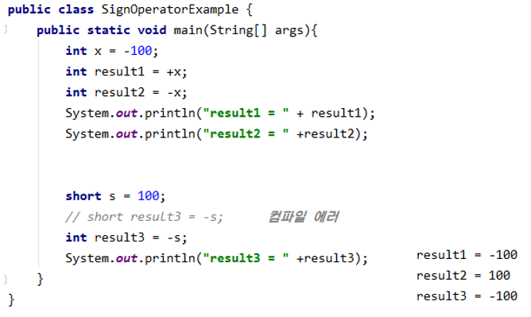

###  

### 3.3.2  증감 연산자(++, --)

- **증감 연산자** : 변수의 값을 1 증가(++)시키거나 1 감소(--)시키는 연산자를 말한다.

  - boolean 타입을 제외한 모든 기본 타입의 피연산자에 사용할 수 있다.

  | 연산자      | 설명                                                 |
  | ----------- | ---------------------------------------------------- |
  | ++ 피연산자 | 다른 연산을 수행하기 전에 피연산자의 값을 1 증가시킴 |
  | -- 피연산자 | 다른 연산을 수행하기 전에 피연산자의 값을 1 감소시킴 |
  | 피연산자 ++ | 다른 연산을 수행한 후에 피연산자의 값을 1 증가시킴   |
  | 피연산자 -- | 다른 연산을 수행한 후에 피연산자의 값을 1 감소시킴   |

  - ++ 연산자는 피연산자의 기존 값에 1을 더해서 그 결과를 다시 피연산자에 저장한다.
    - ++ 연산자를 증가 연산자라 한다.
  - -- 연산자는피연산자의 기존 값에 1을 뺀 후 그 결과를 다시 피연산자에 저장한다. 
    - -- 연산자를 감소 연산자라고 부른다.
  - 증가 연산자와 감소 연산자는 변수의 앞뒤 어디에든 올 수 있다.
  - 연산식에서 증감 연산자만 있는 경우에는 증감 연산자가 변수 앞 또는 뒤 어디든 위치해도 상관없다.

  ```
  ++i, i++		// 모두 i = i + 1로 동일
  --i, i--		// 모두 i = i - 1로 통일
  ```

  - 다른 연산자와 함께 사용하는 연산식에서는 증감 연산자의 위치에 따라 연산식의 결과가 다르게 나오므로 주의해야 한다.
    - 증감 연산자가 변수 앞에 있으면 우선 변수를 1 증가 또는 1 감소시킨 후에 다른 연산자와 계산한다.
    - 증감 연산자가 변수 뒤에 있으면 다른 연산자를 먼저 처리한 후 변수를 1 증가 또는 1 감소시킨다.

  ```java
  int x = 1;
  int y = 1;
  int result1 = ++x + 10;
  int result2 = y++ + 10;
  ```

  - 대부분이 ++i가 i=i+1보다 연산 속도가 빠르다고 알고 있다.
    - i=i+1은 =연산자와 +연산자가 있기 때문에 두 번의 연산이 필요하지만 ++은 하나의 연산만 수행하기 때문이다.
    - 하지만 ++i와 i=i+1은 실제로 컴파일하면 동일한 바이트 코드가 생성된다.


### 3.3.3 논리 부정 연산자(!)

- **논리 부정 연산자** : true를 false로, false를 true로 변경하기 때문에 boolean 타입에만 사용할 수 있다.

  | 연산식     | 설명                                                         |
  | ---------- | ------------------------------------------------------------ |
  | ! 피연산자 | 피연산자가 true이면 false 값을 산출<br>피연산자가 false이면 true값을 산출 |

  - 논리 부정 연산자는 조건문과 제어문에서 사용되어 조건식의 값을 부정하도록 해서 실행 흐름을 제어할 때 주로 사용한다.
  - 두 가지 상태(true/false)를 번갈아가며 변경하는 토글(toggle) 기능을 구현할 때도 주로 사용한다.


### 3.3.4 비트 반전 연산자(~)

- **비트 반전 연산자**는 정수 타입(byte, short, int, long)의 피연산자에만 사용되며, 피연산자를 2진수로 표현했을 때 비트값인 0을 1로, 1은 0으로 반전한다.

  - 연산 후, 부호 비트인 최상위 비트를 포함해서 모든 비트가 반전되기 때문에, 부호가 반대인 새로운 값이 산출된다.

  
  
  - 비트 반전 연산자를 사용할 때 주의할 점은 비트 반전 연산자 산출 타입은 int 타입이 된다는 것이다.
    - 피연산자는 연산을 수행하기 전에 int 타입으로 변환되고, 비트 반전이 일어난다.
  
  ```java
  byte v1 = 10;
  byte v2 = ~v1;	//컴파일 에러
  int v3 = ~v1;
  ```
  
  - 비트 반전 연산자의 결과를 이용하면 부호가 반대인 정수를 구할 수도 있다.
    - 물론 간단하게 부호 연산자인 **-**를 이용해도 되겠지만, 비트 반전 연산자의 산출값에 1을 더하기하면 부호가 반대인 정수를 얻을 수 있다.
  
  ```java
  byte v1 = 10;
  int v2 = ~v1 + 1;	// -10이 v2에 저장
  ```
  
  - 자바는 정수값을 총 32비트의 이진 문자열로 리턴하는 Integer.to.BinaryString() 메소드를 제공한다.
  
  ```java
  String v1BinaryString = Integer.toBinaryString(10);
  ```
  
  - Integer.toBinaryString() 메소드는 앞의 비트가 모두 0이면 0은 생략되고 나머지 뮨자열만 리턴하기 때문에 총 32개의 문자열을 모두 얻기 위해서는 다음과 같은 메소드가 필요하다.
  
  ```java
  public static String toBinaryString(int value) {
      String str = Integer.toBinaryString(value);
      while(str.length() < 32)
          str = "0" + str;
      return str;
  }
  ```
  
  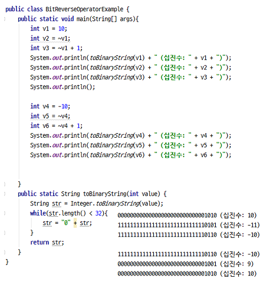

## 3.4 이항 연산자

- 이항 연산자는 피연산자가 두 개인 연산자를 말하며 여기에는 산술 연산자(+, -, *, /, %), 문자열 연결 연산자(+), 대입 연산자(=, +=, -=, *=, /=, %=, &=, ^=, |=, <<=, >>=, >>>=), 비교 연산자(<, <=, >, >=, !=, ==), 논리 연산자(&&, ||, &, |, ^, !), 비트 논리 연산자(&, |, ^), 비트 이동 연산자(<<, >>, >>>) 등이 있다.


### 3.4.1 산술 연산자

- 우리가 일반적으로 말하는 사칙연산인 더하기(+), 빼기(-), 곱하기(*), 나누기(/)와 나머지를 구하는 연산자(%)를 포함해서 산술 연산자는 총 5개이다.

  - 산술 연산자는 boolean 타입을 제외한 모든 기본 타입에 사용할 수 있다.

  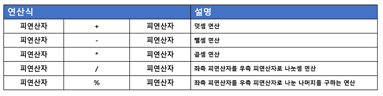
  - 익숙한 산술 연산자지만 주의할 점은 곱셈의 경우 연산자가 x가 아니라 *을 사용하고 나눗셈의 경우 /를 사용한다.
    
  - % 연산자는 나눗셈을 수행하고, 몫이 아닌 나머지를 돌려주는 연산자이다.
    
  - 산술 연산자의 특징은 피연산자들의 타입이 동일하지 않을 경우 다음과 같은 규칙을 사용해서 피연산자들의 타입을 일치시킨 후 연산을 수행한다.

    1. 피연산자들이 모두 정수 타입이고, int 타입(4 byte)보다 크기가 작은 타입일 경우 모두 int 타입으로 변환 후 연산을 수행한다. 따라서 연산의 산출 타입은 int이다.

       `byte + byte -> int +int = int`

    2. 피연산자들이 모두 정수 타입이고, long 타입이 있을 경우 모두 long 타입으로 변환 후, 연산을 수행한다. 따라서 연산의 산출 타입은 long이다.

       `int + long -> long + long = long`

    3. 피연산자 중 실수 타입(float 타입, double 타입)이 있을 경우, 크기가 큰 실수 타입으로 변환 후, 연산을 수행한다. 따라서 연산의 산출 타입은 실수 타입이다.

       `int + double -> double + double = double`

  - 간단히 정리하자면 long을 제외한 정수 타입 연산은 int 타입으로 산출되고, 피연산자 중 하나라도 실수 타입이면 실수 타입으로 산출된다.

  ```java
  byte byte1 = 1;
  byte byte2 = 1;
  byte byte3 = byte1 + byte2;	// 컴파일 에러
  ```

  - long을 제외한 정수 타입의 연산은 산출 타입이 int이므로 에러가 난다.

  ```java
  int result1 = byte1 + byte2;	// 에러가 나지 않음
  ```

  - 정수 타입 연산의 결과가 int 타입으로 나오는 이유는 자바 가상 기계(JVM)가 기본적으로 32비트 단위로 계산하기 때문이다.

  ```JAVA
  int int1 = 10;
  int int2 = 4;
  int result2 = int1 / int2;		// 2
  double result3 = int1 / int2; 	// 2.0
  ```

  - 상식적으로 int1과 int2를 나눗셈하면 2.5가 나오지만 연산 결과는 소수점 이하 부분을 버리고 2만 산출된다.
  - double형 변수 result3의 경우 연산 후의 결과가 2이므로 2를 실수화해서 2.0이 저장된다.
    - 2.5를 산출 결과로 얻고싶다면 피연산자 중 최소한 하나는 실수 타입이어야 한다.

  ```java
  double result3 = (int1 * 1.0) / int2;
  double result4 = (double)int1 / int2;
  double result5 = int1 / (double)int2;
  ```

  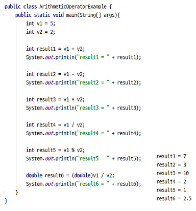

  - char 타입도 정수 타입이므로 산술 연산이 가능하다.
    - 주의할 점은 char 타입이 산술 연산이 될 경우 int 타입으로 변환되므로 산출 타입은 int 타입이다.

  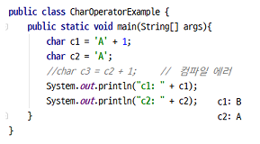

  - 'A' + 1은 리터럴 문자 A에 1을 던한 것인데, 문자 A는 65라는 유니코드를 가지므로 'A' + 1은  66이 된다.

    - 따라서 66인 유니코드는 문자 B이므로 c1에는 문자 B가 저장된다.

  - char형 변수인 c2에 1을 더하면 c2는 int 타입으로 변환되고 1과 연산이 되기 때문에 산출 타입은 int 타입이 된다. 

    - 따라서 char 타입 변수 c3에 대입을 할 수 없어 컴파일 에러가 발생한다.
    - char 형으로 강제 타입 변환(캐스팅)해서 char 타입을 얻는다면 가능하다.

    ```java
    char c3 = (char)(c2 + 1);
    ```

  - 산술 연산은 어렵지 않게 이해할 수 있으나, 몇 가지 주의해야 할 점이 있다.
    - 올바른 계산을 위해 값을 미리 검정해야 한다.
    - 정확한 계산을 위해 실수 타입을 피해야 하며, 특수값 처리에 신경써야 한다.

#### 오버플로우 탐지

- 산술 연산을 할 때 주의할 점은 연산 후의 산출값이 산출 타입으로 충분히 표현 가능한지 살펴봐야 한다.

  - 산출 타입으로 표현할 수 없는 값이 산출되었을 경우, 오버플로우가 발생하고 쓰레기값(엉뚱한 값)을 얻을 수 있기 때문이다.

  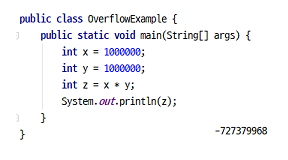

  - 피연산자들의 타입이 int 타입이며 산출 타입인 int형 변수가 값을 저장하니 컴파일 에러는 발생하지 않지만, 변수 z올바른 값이 저장되지 않는다.
    - 10<sup>6</sup> * 10<sup>6</sup> = 10<sup>12</sup>이므로 int 타입에 저장될 수 있는 값의 범위를 초과하게 된다. 그렇기 때문에 쓰레기 값인 -727379968을 얻게 된다.
    - 올바른 값을 얻기 위해서는 변수 x와 y 중 최소 하나라도 long  타입이 되어야 하고, 변수 z다 long 타입이어야 한다.

  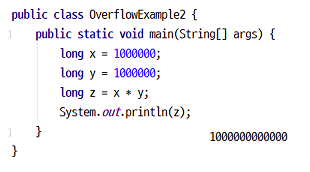

  - 하지만 실제로 코드에서 피연산자의 값을 직접 리터럴로 주는 경우는 드물다.
    - 대부분은 사용자로부터 입력받거나 프로그램 실행 도중에 생성되는 데이터로 산술 연산이 수행된다.
    - 이런 경우 바로 산술 연산자(+, -, *, /, %)를 사용하지 말고 메소드를 이용하는 것이 좋다.
      - 메소드는 산술 연산을 하기 전에 피연산자들의 값을 조사해서 오버플로우를 탐지할 수 있기 때문이다.

  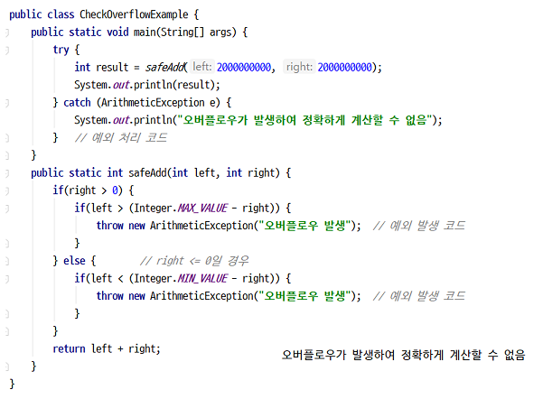

#### 정확한 계산은 정수 사용

- 정확하게 계산해야 할 때는 부동소수점(실수) 타입을 사용하지 않는 것이 좋다.

  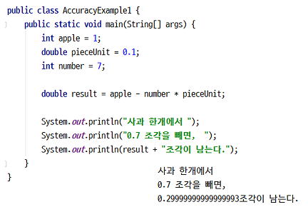

  - 예상한 결과는 0.3이었으나 결과는 0.29999999999999993이 되어 정확히 0.3이 되지 않는다.
    - 이것은 이진 포맷의 가수를 사용하는 부동소수점 타입(float, double)은 0.1을 정확히 표현할 수 없어 근사치로 처리하기 때문이다.
    - 정확한 계산을 위해서는 정수 연산으로 변경해서 하여야 한다.

  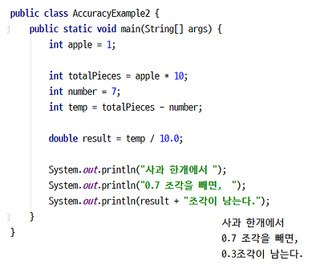

#### NaN과 Infinity 연산

- **/** 또는 **%** 연산자를 사용할 때도 주의할 점이 있다.

  - 좌측 피연산자가 정수 타입인 경우 나누는 수인 우측 피연산자는 0을 사용할 수 없다.
  - 만일 0으로 나누면 컴파일은 정상적으로 되지만, 실행 시 ArithmeticException(예외)이 발생한다.

  ```
  5 / 0 -> ArithmeticException 예외 발생
  5 % 0 -> ArithmeticException 예외 발생
  ```

  - 자바는 프로그램 실행 도중 예외가 발생하면 실행이 즉시 멈추고 프로그램은 종료된다.
    - ArithmeticException이 발생했을 경우 프로그램이 종료되지 않도록 하려면 예외 처리를 해야 한다.
    - 예외 처리는 예외가 발생했을 경우 catch 블록을 실행하도록 하는 것이다.

  ```java
  try {
      // int z = x / y;	y가 0일 경우 ArithmeticException 발생
      int z = x % y;
      System.out.println("z:" + z);
  } catch(ArithmeticException e) {
      System.out.println("0으로 나누면 안됨");
  }
  ```

  - 그러나 실수 타입인 0.0 또는 0.0f로 나누면 ArithmeticException이 발생하지 않고, / 연산의 결과는 Infinity(무한대) 값을 가지며, & 연산의 결과는 NaN(Not a Number)을 가진다.

  ```
  5 / 0.0 -> Infinity
  5 % 0.0 -> NaN
  ```

  - 주의할 점은 /와 % 연산의 결과가 Infinity 또는 NaN이 나오면 다음 연산을 수행해서는 안 된다.
    - 이 값과 산술 연산을 하면 어떤 수와 연산하더라도 Infinity와 NaN이 산출되어 데이터가 엉망이 될 수 있다.

  ```
  Infinity + 2 -> Infinity
  NaN * NaN -> NaN
  ```

  - 프로그램에서 /와 & 연산의 결과가 Infinity 또는 NaN인지 확인하려면 Double.isInfinite()와 Double.isNaN() 메소드를 이용하면 된다.
    - 이 메소드들은 double 타입의 값을 매개값으로 받아서 이 값이 Infinity 또는 NaN이라면 true를 리턴하고, 그렇지 않다면 false를 리턴한다.

  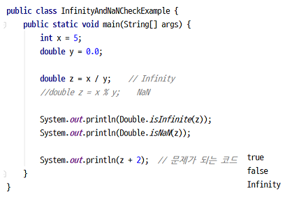