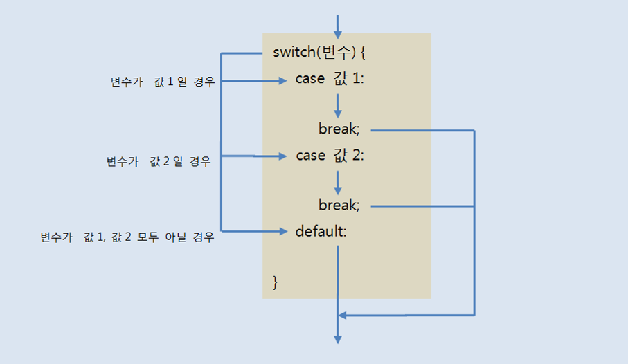
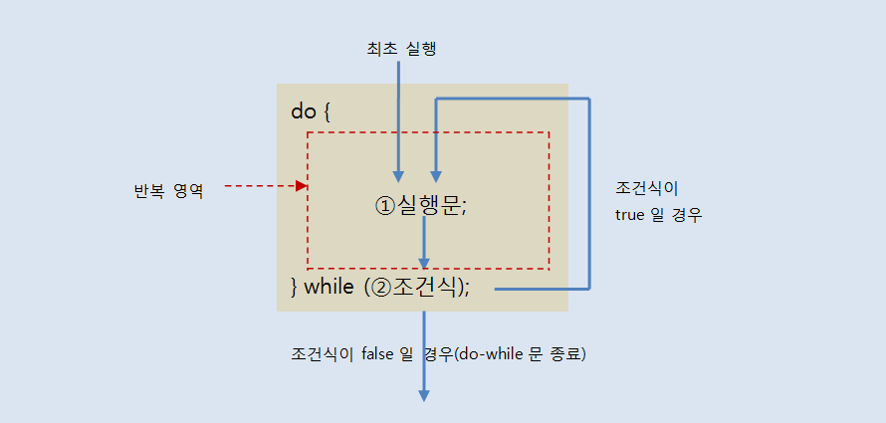
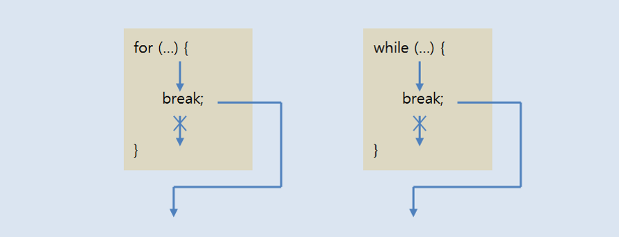

# 4. 조건문과 반복문

## 4.1 코드 실행 흐름 제어

- 자바 프로그램을 시작하면 main() 메소드의 시작 중괄호 { 에서 시작해서 끝 중괄호 } 까지 위에서부터 아래로 실행하는 흐름을 가지고 있다.

  - **제어문** : 실행 흐름을 개발자가 원하는 방향으로 바꿀 수 있도록 해주는 흐름 제어문을 말한다.
    - 제어문은 조건식과 중괄호 {} 블록으로 구성되는데, 조건식의 연산 결과에 따라 블록 내부의 실행 여부가 결정된다.

  

  - 제어문의 종류에는 조건문과 반복문이 있는데, 조건문에는 if문, switch문이 있고 반복문에는 for문,  while문, do-while문이 있다.
    - 조건문을 사용한다면 제어문 블록이 실행 완료되었을 경우 정상 흐름으로 돌아온다.
    - 반복문을 사용한다면 제어문 처음으로 다시 되돌아가 반복 실행한다.
      - 이것을 루핑(looping)이라고 한다.
  - 제어문 블록 내부에도 또 다른 제어문을 사용할 수 있다.

## 4.2 조건문(if문, switch문)

### 4.2.1 if 문

- **if 문** : 조건식의 결과에 따라 블록 실행 여부가 결정되는 제어문

  - 조건식에는 true 또는 false 값을 산출할 수 있는 연산식이나, boolean 변수가 올 수 있다.
  - 조건식이 true이면 블록을 실행하고 false이면 블록을 실행하지 않는다.

  

  - 중괄호 {} 블록은 여러 개의 실행문을 하나로 묶기 위해 작성된다.
    - 만약 조건식 true가 될 때 실행해야 할 문장이 하나 밖에 없다면 생략할 수 있다.
    - 하지만 중괄호 {} 블록을 생략하지 않고 작성하는 것이 좋다.
      - 중괄호 블록을 작성하지 않으면 코드의 가독성(코드 해석)이 좋지 않고, 버그 방생의 원인이 될 수 있다.

### 4.2.2 if-else 문

- if 문은 else 블록과 함께 사용되어 조건식의 결과에 따라 실행 블록을 선택한다.

  - if 조건식이 true이면 if 문의 블록이 실행되고, 조건식이 false이면 else 블록이 실행된다.
  - 조건식의 결과에 따라 이 두 개의 블록 중 어느 한 블록의 내용만 실행하고 전체 if문을 벗어나게 된다.

  

### 4.2.3 if-else if-else 문

- 조건문이 여러 개인 if 문도 있다.

  - 처음 if 문의 조건식이 false일 경우 다른 조건식의 결과에 따라 실행 블록을 선택할 수 있는데, if 블록의 끝에 else if문을 붙이면 된다.
  - else if문의 수는 제한이 없으며 여러 개의 조건식 중 true가 되는 블록만 실행하고 전체 if문을 벗어나게 된다.
  - else if 블록의 마지막에는 else 블록을 추가할 수 있는데, 모든 조건식이 false일 경우 else 블록을 실행하고 if문을 벗어나게 된다.

  

### 4.2.4 중첩 if 문

- if 문의 블록 내부에는 또 다른 if 문을 사용할 수 있다. 이것을 중첩 if 문이라고 부른다.

  - 중첩의 단계는 제한이 없기 때문에 실행 흐름을 잘 판단해서 작성하면 된다.
  - 중첩은 if 문만 되는 것은 아니며, if 문, switch 문, for 문, while 문, do-while 문은 서로 중첩시킬 수 있다.

  

### 4.2.5 switch 문

- switch문은 if문과 마찬가지로 조건 제어문이다.

  - 하지만 if문처럼 조건식이 true일 경우에 블록 내부의 실행문을 실행하는 것이 아니라, 변수가 어떤 값을 갖느냐에 따라 실행문이 선택된다.
  - if문은 조건식의 결과가 true, false 두가지 밖에 없기 때문에 경우의 수가 많아질수록 else-if를 반복적으로 추가해야 하므로 코드가 복잡해진다.
  - 그러나 switch문은 변수의 값에 따라서 실행문이 결정되기 때문에 같은 기능의 if문보다 코드가 간결하다.

  

  - switch문은 괄호 안의 값과 동일한 값을 갖는 case로 가서 실행문을 시킨다.
    - 만약 괄호 안의 값과 동일한 값을 갖는 case가 없으면 default로 가서 실행문을 실행시킨다.
    - default는 생략 가능하다.
  - case 끝에 break가 붙어 잇는 이유는 다음  case를 실행하지 말고 switch문을 빠져나가기 위해서이다.
    - break가 없다면 다음 case가 연달아 실행되는데, 이때에는 case 값과는 상관없이 실행된다.
  - char 타입 변수도 switch문에 사용될 수 있다.
  - 자바 6까지는 switch문의 괄호에는 정수 타입(byte, char, short, int, long) 변수나 정수값을 산출하는 연산식만 올 수 있었다.
    - 자바 7부터는 String 타입의 변수도 올 수 있다.

## 4.3 반복문(for문, while문, do-while문)

- 반복문은 어떤 작업 (코드들)이 반복적으로 실행되도록 할 때 사용되며, 반복문의 종류로는 for문, while문, do-while문이 있다.
  - for문과 while문은 서로 변환이 가능하기 때문에 반복문을 작성할 떄 어느 쪽을 선택해도 좋지만, for문은 반복 횟수를 알고 있을 때 주로 사용하고, while문은 조건에 따라 반복할 때 주로 사용한다.
  - while문과 do-while문의 차이점은 조건을 먼저 검사하느냐 나중에 검사하느냐일 뿐 동작 방식은 동일하다.

### 4.3.1 for문

- 프로그램을 작성하다 보면 똑같은 실행문을 반복적으로 실행해야 할 경우가 많이 발생한다.

  ```java
  int sum = 0;
  sum = sum + 1;
  sum = sum + 2;
  sum = sum + 3;
  sum = sum + 4;
  sum = sum + 5;
  System.out.println("1~5까지의 합: " + sum);
  ```

  - 같은 연산을 실행하는 실행문들은 짧을 경우에는 상관이 없지만 그 수가 매우 커지면 코드양은 엄청 늘어나 가독성도 떨어진다. 이런 경우에 for문을 사용하면 코드를 획기적으로 줄여준다.

  ```java
  int sum = 0;
  for(int i = 1; i <= 100; i++){
  	sum = sum + i;
  }
  System.out.println("1~100까지의 합: " + sum);
  ```

  - 반복문은 한 번 작성된 실행문을 여러 번 반복 실행해주기 때문에 코드를 절감하고 간결하게 만들어 준다,
  - 코드가 간결하면 개발 시간을 줄일 수 있고, 오루가 날 확률도 줄어든다.
  - for문은 주어진 횟수만큼 실행문을 반복 실행할 때 적합한 반복 제어문이다.

  

  > 1. for문이 실행될 때 초기화식이 제일 먼저 실행된다.
  > 2. 조건식을 평가하여 true이면 실행문을 실행시키고, false이면 for문 블록을 실행하지 않고 끝나게 된다.
  > 3. 조건식이 true이면 실행문들을 실행한다.
  > 4. 실행문들이 모두 실행되면 증감식을 실행시키고 다시 조건식을 평가하게 된다.

  - 초기화 식의 역할은 조건식과 실행문, 증감식에서 사용할 변수를 초기화하는 역할을 한다.
    - 초기화식이 필요 없을 경우에는 초기화식을 생략할 수 있다.

  ```java
  int i = 1;
  for(; i <= 100; i++){...}
  ```

  - 어떤 경우에는 초기화식이 둘 이상이 있을 수도 있고, 증감식도 둘 이상이 있을 수 있다. 이런 경우에는 쉼표(,)로 구분해서 작성하면 된다.

  ```java
  for(int i=0, int j=100; i<=50 && j>=50; i++, j--){...}
  ```

  - 초기화식에 선언된 변수는 for문 블록 내부에서 사용되는 로컬 변수이다.
    - 따라서 for문을 벗어나서는 사용할 수 없다.
  - for문을 작성할 때 주의할 점은 초기화식에서 루프 카운트 변수를 선언할 때 부동소수점 타입을 사용하지 말아야 한다.
    - 다음의 예제는 이론적으로 10번을 돌아야 한다.

  ```java
  for(float x = 0.1f; x <= 1.0f; x +=0.1f){
              System.out.println(x);
  }
  ```

  - 하지만 0.1은 float 타입으로 정확하게 표현할 수 없기 때문에 x에 더해지는 실제값은 0.1보다 약간 크다.
    - 결국 루프는 9번만 실행된다.

  - for문 또 다른 for문을 내포할 수 있는데, 이것을 중첩된 for문이라고 한다.
    - 이 경우 바깥쪽 for문이 한 번 실행할 때마다 중첩된 for문은 지정된 횟수만큼 반복해서 돌다가 다시 바깥쪽 for문으로 돌아간다.

### 4.3.2 while문

- for문이 정해진 횟수만큼 반복한다면, while문은 조건식이 true일 경우에 계속해서 반복한다.

  - 조건식에는 비교 또는 논리 연산식이 주로 오는데, 조건식이 false가 되면 반복 행위를 멈추고 while문을 종료한다.

  

  > 1.  while문이 처음 실행될 때 조건식을 평가한다. 평가 결과가 true이면 실행문을 실행한다.
  > 2. 실행문이 모두 실행되면 다시 조건식으로 되돌아가서 조건식을 평가한다.
  >
  > 만약 조건식이 true이면 다시 진행하고, false라면 while문을 종료한다.

  - 조건식에는 boolean 변수나 true / false 값을 산출하는 어떠한 연산식이든 올 수 있다.
    - 만약 조건식이 true를 사용하면 while(true)가 되어서 무한 루프를 돌게 된다.
    - 무한 루프는 무한히 반복하여 실행하기 때문에 언젠가는 while문을 빠져 나가기 위한 코드가 필요하다.
    - 무한 루프를 실행하는 코드 중에는 입력 받은 값을 판단하여 무한 루프를 종료하는 등의 프로그램을 사용할 수 있는데 이때 입력 받은 키의 값을 판단할 수 있도록 키마다 키코드가 있다.
  - 무한 루프는 무한히 반복해서 실행하기 때문에 언젠가는 while문을 빠져나가기 위한 코드가 필요하다.
    - while문을 빠져나가기 위한 또 다른 방법으로 break문을 이용하는 방법도 있다.

### 4.3.3 do-while문

- do-while문은 조건식에 의해 반복 실행한다는 점에서는 while문과 동일하다.

  - while문은 시작할 때부터 조건식을 검사하여 블록 내부를 실행할지 결정하지만, 경우에 따라서는 블록 내부의 실행문을 우선 실행시키고 실행 결과에 따라서 반복 실행을 계속할지 결정하는 경우도 발생한다.
  - 이 때 do-while문을 사용할 수 있다.
  - do-while문을 작성 시 주의할 점은 while() 뒤에 반드시 세미콜론(;)을 붙여야 한다.

  

  > 1. do-while문은 처음 실행될 때 실행문을 우선 실행한다.
  > 2. 실행문이 모두 실행되면 조건식을 평가하는데, 그결과가 true이면 다시 실행문을 반복하게 된다.
  > 3. 조건식의 결과가 false이면 do-while문을 종료한다.

  - System.in.read() 메소드는 하나의 키 코드만 읽기 때문에 콘솔에 입력된 문자열을 한 번에 읽을 수 없다.
  - 그렇기 때문에 Scanner 객체를 생성하고 nextLine() 메소드를 호출하면 콘솔에 입력된 문자열을 한 번에 읽을 수 있다.
    - nextLine() 메소드로 읽은 문자열은 저장할 String 변수가 항상 필요하다.

  ```java
  import java.util.Scanner;
  
  ...
  Scanner scanner = new Scanner(System.in);
  String inputString = scanner.nextLine();
  
  do{
      ...
  }while(!inputString.equals("q"));
  // String 변수는 비교할 때 equals() 메소드를 사용한다.
  ```

### 4.3.4 break문

- **break문** : 반복문인 for문, while문, do-while문을 실행 중지할 때 사용된다. 또한 switch문에서도 break문을 사용하여 switch문을 종료한다.

  

  - break문은 대개 if문과 같이 사용되어 if문의 조건식에 따라 for문과 while문을 종료할 때 사용한다.

  - 만약 반복문이 중첩되어 있을 경우 break문은 가장 가까운 반복문만 종료하고 바깥쪽 반복문은 종료시키지 않는다.
    - 중첩된 반복문에서 가장 바깥쪽 반복문까지 종료시키려면 바깥쪽 반복문에 이름(라벨)을 붙이고, "break 이름;"을 사용하면 된다.

  

### 4.3.5 continue문

- **continue문** : for문, while문, do-while문에서만 사용되는데, 블록 내부에서 continue문이 실행되면 for문의 증감식 또는 while문, do-while문의 조건식으로 이동한다.

  

  - continue문은 반복문을 종료하지 않고 계속 반복을 수행한다는 점이 break문과 다르다.
  - break문과 마찬가지로 continue문도 대개 if문과 같이 사용되는데, 특정 조건을 만족하는 경우에 continue문을 실행해서 그 이후의 문장을 실행하지 않고 다음 반복으로 넘어간다.