# 5. 참조 타입

## 5.1 데이터 타입 분류

- 프로그램이 하는 일은 결국 데이터를 처리하는 것이다.

  - 따라서 데이터를 얼마나 잘 다루느냐가 좋은 프로그램을 작성할 수 있는 관건이 된다.
  - 데이터를 잘 다루기 위해서는 자바에서 지원하는 데이터 타입에 대해서 제대로 이해할 필요가 있다.
  - 자바의 데이터 타입에는 크게 기본 타입(원시 타입: prmitive type)과 참조 타입(reference type)으로 분류된다.
    - **기본 타입** : 정수, 실수, 문자열, 논리 리터럴을 저장하는 타입을 말한다.
    - **참조 타입** : 객체(Object)의 번지를 참조하는 타입으로 배열, 열거, 클래스, 인터페이스 타입을 말한다.

  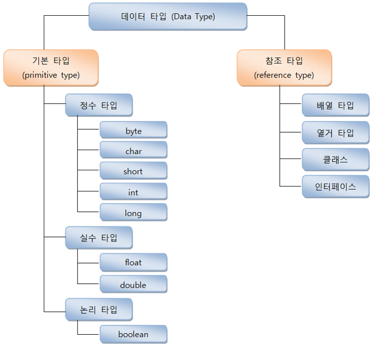

  - 기본 타입으로 선언된 변수와 참조 타입으로 선언된 변수의 차이점은 저장되는 값이 무엇이냐이다.
    - 기본 타입인 byte, char, shor, int, long, float, double, boolean을 이용해서 선언된 변수는 실제 값을 변수 안에 저장한다. 
    - 참조 타입인 배열, 열거, 클래스, 인터페이스를 이용해서 선언된 변수는 메모리의 번지를 값으로 갖는다. 번지를 통해 객체를 참조한다는 뜻에서 참조 타입이라고 부른다.

  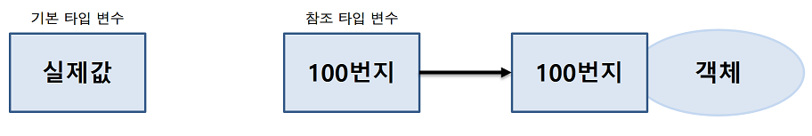

  ```java
  [기본 타입 변수]
  int age = 25;
  double price = 100.5;
  
  [참조 타입 변수]
  String name = "신용권";
  String hobby = "독서";
  ```

  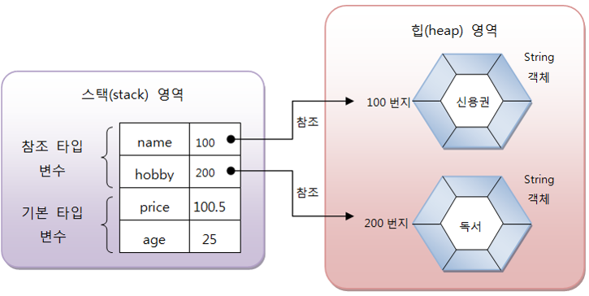

  - 메모리상에서 변수들이 갖는 값에 대해 알아보면 변수는 스택 영역에 생성되고, 객체는 힙 영역에 생성되는 것을 볼 수 있다.

## 5.2 메모리 사용 영역

- java.exe로 JVM이 시작되면 JVM은 운영체제에서 할당받은 메모리 영역(Runtime Data Area)을 세부 영역으로 구분해서 사용한다.

  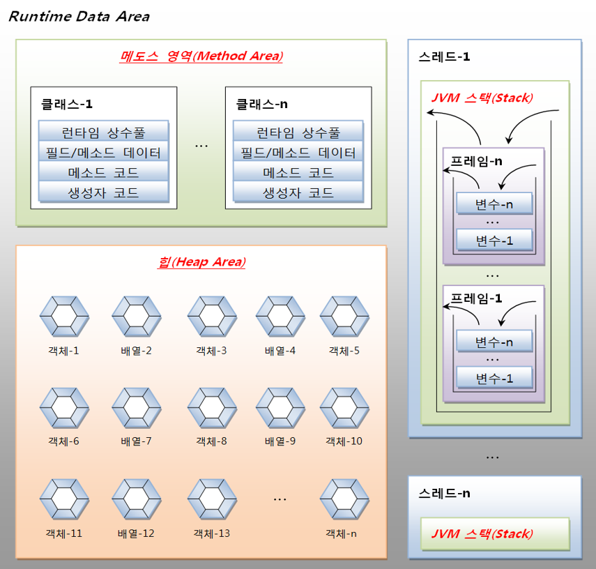

### 5.2.1 메소드(Method) 영역

- 메소드 영역에는 코드에서 사용되는 클래스(~.class)들을 클래스 로더로 읽어 클래스별로 런타임 상수풀(runtime constant pool), 필드(field) 데이터, 메소드(method) 데이터, 메소드 코드, 생성자(constructor) 코드 등을 분류해서 저장한다.
  - 메소드 영역은 JVM이 시작할 때 생성되고 모든 스레드가 공유하는 영역이다.

#### 힙(heap) 영역

- **힙 영역** : 객체와 배열이 생성되는 영역이다.
  - 힙 영역에 생성된 객체와 배열은 JVM 스택 영역의 변수나 다른 객체의 필드에서 참조한다.
  - 참조하는 변수나 필드가 없다면 의미 없는 객체가 되기 때문에 이것을 쓰레기로 취급하고 JVM은 쓰레기 수집기(Garbage Collector)를 실행시켜 쓰레기 객체를 힙 영역에서 자동으로 제거한다.
  - 개발자는 객체를 제거하기 위해 별도의 코드를 작성할 필요가 없다.
    - 사실 자바는 코드로 객체를 직접 제거시키는 방법을 제공하지 않는다고 한다.

#### JVM 스택(Stack) 영역

- JVM 스택 영역은 각 스레드마다 하나씩 존재하며 스레드가 시작될 때 할당된다.

  - 자바 프로그램에서 추가적으로 스레드를 생성하지 않았다면 main 스레드만 존재하므로 JVM 스택도 하나이다.
  - JVM 스택은 메소드를 호출할 때마다 프레임(frame)을 추가(push)하고 메소드가 종료되면 해당 프레임을 제거(pop)하는 동작을 수행한다.
  - 예외 발생 시 printStackTrace() 메소드로 보여주는 Stack Trace의 각 라인은 하나의 프레임을  표현한다.
  - 프레임 내부에는 로컬 변수 스택이 있는데, 기본 타입 변수와 참조 타입 변수가 추가(push)되거나 제거(pop)된다.
    - 변수가 이 영역에 생성되는 시점은 초기화가 될 때, 즉 최초로 변수에 값이 저장될 때이다.
    - 선언된 블록 안에서만 스택에 존재하고 블록을 벗어나면 스택에서 제거된다.

  ```java
  1. char v1 = 'A';
  
  2. if(v1 == 'A'){
  	int v2 = 100;
  	double v3 = 3.14;
  }
  
  3. boolean v4 = true;
  ```

  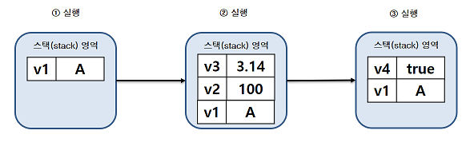
  - 기본 타입 변수는 스택 영역에 직접 값을 가지고 있지만, 참조 타입 변수는 값이 아니라 힙 영역이나 메소드 영역의 객체 주소를 가진다.

  ```java
  int[] scores = {10, 20, 30};
  ```

  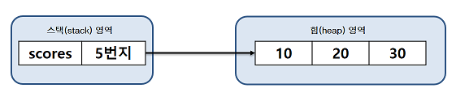

## 5.3 참조 변수의 ==, != 연산

- 기본 타입 변수의 ==, != 연산은 변수의 값이 같은지, 아닌지를 조사하지만 참조 타입 변수들 간의 ==, != 연산은 동일한 객체를 참조하는지, 다른 객체를 참조하는지 알아볼 때 사용된다.

  - 참조 타입 변수 =의 값은 힙 영역의 객체 주소이므로 결국 주소 값을 비교하는 것이 된다.
    - 동일한 주소 값을 갖고 있다는 것은 동일한 객체를 참조한다는 의미이다.
    - 따라서 동일한 객체를 참조하고 있을 경우 == 연산의 결과는 true이고 != 연산의 결과는 false이다.

  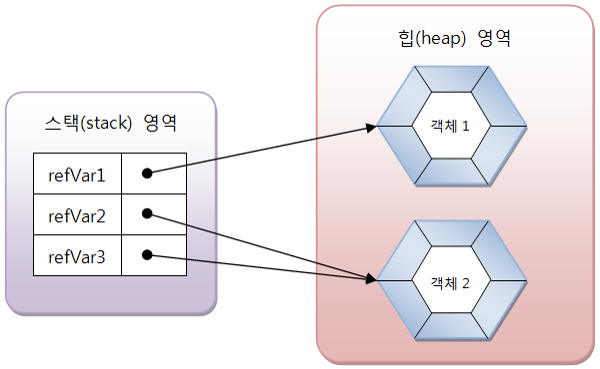

  ```
  refVar1 == refVar2	결과: false
  refVar1 != refVar2	결과: true
  
  refVar2 == refVar3	결과: true
  refVar2 != refVar3	결과: false
  ```

## 5.4 null과 NullPointerException

- 참조 타입 변수는 힙 영역의 객체를 참조하지 않는다는 뜻으로 null(널) 값을 가질 수 있다.

  - null 값도 초기값으로 사용할 수 있기 때문에 null로 초기화된 참조 변수는 스택 영역에 생성된다.

  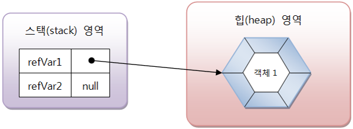

  ```
  refVar1 == null	결과: false
  refVar1 != null	결과: true
  
  refVar2 == null	결과: true
  refVar2 != null	결과: false
  ```

  - 자바 프로그램 실행 도중에 발생하는 오류를 예외(Exception)라고 부른다.
    - 예외는 사용자의 잘못된 입력으로 발생하 수도 있고, 프로그래머가 코드를 잘못 작성해서 발생할 수도 있다.
    - 참조 변수를 사용하면서 가장 많이 발생하는 예외 중 하나로 NullPointerException이 있다.
      - 이 예외는 참조 타입 변수를 잘못 사용하면 발생한다.
  - 참조 타입 변수가 null을 가지고 있을 경우, 참조 타입 변수는 사용할 수 없다.
    - NullPointerException은 사용자가 null을 가지고 있는 참조 타입 변수를 사용하였을 때 발생하는 예외이다.

  ```java
  int[] intArray = null;
  intArray[0] = 10;	//NullPointerException
  ```

  ```java
  String str = null;
  System.out.println("총 문자수: " + str.length());	//NullPointerException
  ```

  - 프로그램 실행 도중 NullPointerException이 발생하면, 예외가 발생된 곳에서 객체를 참조하지 않은 상태로 참조 타입 변수를 사용하고 있음을 알아야 한다.

## 5.5 String 타입

- 자바는 문자열을 String 변수에 저장하기 때문에 String 변수를 선언해야 한다.

  ```java
  String 변수;
  ```

- String 변수에 문자열을 저장하려면 큰 따옴표로 감싼 문자열 리터럴을 대입하면 된다.

  ```java
  변수 = "문자열";
  ```

- 변수 선언과 동시에 문자열을 저장할 수도 있다.

  ```java
  String 변수 = "문자열";
  ```

  ```java
  String name;
  name = "신용권";
  String hobby = "자바";
  ```

  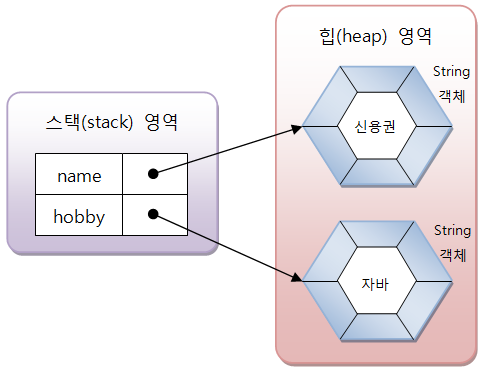

- 사실 문자열을 String 변수에 저장한다는 표현은 틀린 표현이다.

  - 문자열이 직접 변수에 저장되는 것이 아니라, 문자열은 String 객체로 생성되고 변수는 String 객체를 참조한다.
  - 하지만 일반적으로 String 변수에 저장한다는 표현을 사용한다.

- 자바는 문자열 리터럴이 동일하다면 String 갹체를 공유하도록 되어 있다.

  ```java
  String name1 = "신용권";
  String name2 = "신용권";
  ```

  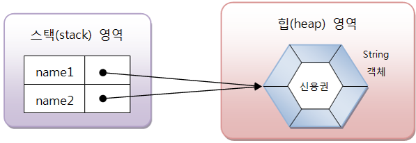

- 일반적으로 변수에 문자열을 저장할 경우에는 문자열 리터럴을 사욯하지만, new 연산자를 사용해서 직접 String 객체를 생성시킬 수도 있다.

  - new 연산자는 힙 영역에 새로운 객체를 만들 때 사용하는 연산자로 객체 생성 연산자라고 한다.

  ```java
  String name1 = new String("신용권");
  String name2 = new String("신용권");
  ```

  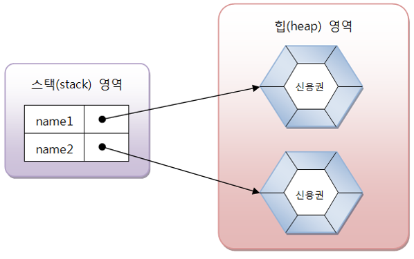

- 문자열 리터럴로 생성하느냐 new 연산자로 생성하느냐에 따라 비교 연산자의 결과가 달라질 수 있다.

  - 동일한 문자열 리터럴로 String 객체를 생성했을 경우 == 연산의 결과는 true가 나오지만, new 연산자로 String 객체를 생성했을 경우 == 연산의 결과는 false가 나온다.
  - == 연산자는 변수에 저장된 객체 번지가 동일한 지를 검사하기 때문이다.

  ```java
  String name1 = "신민철";
  String name2 = "신민철";	// name1 == name2(true)
  String name3 = new String("신민철");	// name1 == name3(false)
  ```

- 동일한 String 객체이건 다른 String 객체이건 상관없이 문자열만을 비교할 때에는 String 객체의 equals() 메소드를 사용해야 한다.

  - equals() 메소드는 원본 문자열과 매개값으로 주어진 비교 문자열이 동일한지 비교한 후 true 또는 false를 리턴한다.

  ```java
  boolean result = str1.equals(str2);
  ```

- String 변수는 참조 타입이므로 초기값으로 null을 대입할 수 있다.

  - null은 String 변수가 참조하는 String 객체가 없다는 뜻이다.

  ```java
  String hobby = null;
  ```

  - String 변수가 객체를 참조하였으나, null을 대입함으로써 더 이상 String 객체를 참조하지 않도록 할 수도 있다.

  ```java
  String hobby = "여행";
  hobby = null;
  ```

  - 참조를 잃은 String 객체는 JVM은 참조되지 않은 객체를 쓰레기 객체로 취급하고 쓰레기 수집기(Garbage Collector)를 구동시켜 메모리에서 자동 제거한다.

## 5.6 배열 타입

### 5.6.1 배열이란?

- 변수는 한 개의 데이터만 저장할 수 있다.

  - 따라서 저장해야 할 데이터의 수가 많아지면 그만큼 많은 변수가 필요하다.

  `30명의 성적을 저장하고 평균 값을 구하는 예제`

  ```java
  int score1 = 83;
  int score2 = 90;
  int score3 = 87;
  ...
  int score30 = 75;
  
  int sum = score1;
  sum += score2;
  ...
  sum += score30;
  int avg = sum / 30;
  ```

  - 일일이 변수를 선언하고 연산을 수행하는 것은 매우 비효율적이고 지루한 코딩이 된다.

- 같은 타입의 많은 양의 데이터를 다루는 프로그램에서는 좀 더 효율적인 방법이 필요한데 이것이 배열이다.

- **배열** : 같은 타입의 데이터를 연속된 공간에 나열시키고, 각 데이터에 인덱스(index)를 부여해 놓은 자료구조이다.

  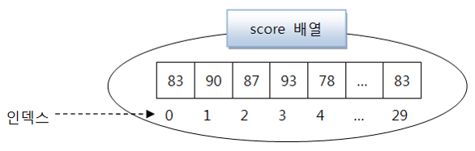

  ```java
  int sum = 0;
  for(int i = 0; i < 30; i++){
  	sum += sum score[i];
  }
  int avg = sum / 30
  ```

- 배열은 같은 타입의 데이터만 저장할 수 있다,

  - int 배열은 int 값만 저장 가능하고, String 배열은 문자열만 저장 가능하다.
  - 배열은 선언과 동시에 저장할 수 있는 데이터 타입이 결정된다.
  - 만약 다른 타입의 값을 저장하려고 하면 타입 불일치(Type mismatch) 컴파일 오류가 발생한다.

- 배열은 한 번 생성된 배열은 길이를 늘리거나 줄일 수 없다.

  `3개의 값을 저장하는 배열을 생성하였을 때 프로그램 실행 도중에 5개의 값을 저장하는 배열로 수정할 수 없고, 반대로 2개의 값만 저장하는 배열로 수정할 수도 없다. 만약 5개의 값을 저장해야 하는 경우가 발생한다면, 길이 5의 새로운 배열을 생성하고, 기존 배열 항목을 새 배열로 복사해야 한다.`

### 5.6.2 배열 선언

- 배열을 사용하기 위해서는 배열 변수를 선언해야 한다.

  ```java
  타입[] 변수;
  타입 변수[];
  ```

  - 대괄호 []는 배열 변수를 선언하는 기호로 사용되는데, 타입 뒤에 붙을 수도 있고 변수 뒤에 붙을 수도 있다.
  - 타입은 배열에 저장될 데이터의 타입을 말한다.

  ```java
  int[] intArray;
  int intArray[];
  ```

- 배열 변수는 참조 변수에 속한다.

  - 배열도 객체이므로 힙 영역에 생성되고 배열 변수는 힙 영역의 배열 객체를 참조하게 된다.
  - 참조된 배열 객체가 없다면 배열 변수는 null 값으로 초기화될 수 있다.

  ```java
  타입[] 변수 = null;
  ```

  - 배열 변수가 null 값을 가진 상태에서 변수[인덱스]로 값을 읽거나 저장하게 되면 NullPointerException이 발생한다.
  - 배열 변수는 배열을 생성하고 참조하는 상태에서 값을 저장하거나 읽어야 한다.

### 5.6.3 값 목록으로 배열 생성

- 배열 항목에 저장될 값의 목록이 있다면, 간단한 배열 객체를 만들 수 있다.

  ```java
  타입[] 변수 = {값0, 값1, 값2, 값3, ...};
  ```

  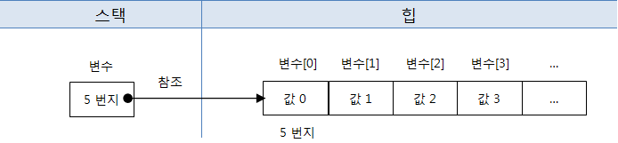
  - 중괄호 {}는 주어진 값들을 항목으로 가지는 배열 객체를 힙에 생성하고, 배열 객체의 번지를 리턴한다.
  - 배열 변수는 리턴된 번지를 저장함으로써 참조가 이루어진다.

  ```java
  String[] names = {"신용권", "홍길도", "감자바"};
  ```

  - 만약 배열 특정 인덱스의 리터럴을 바꾸고 싶다면 대입 연산자를 사용하여 해당 인덱스의 값을 변경하면 된다.

  ```java
  names[1] = "홍삼원"
  ```

- 값의 목록으로 배열 객체를 생성할 때 주의할 점이 있는데, 배열 변수를 이미 선언한 후에 다른 실행문에서 중괄호를 사용한 배열 생성은 허용되지 않는다.

  ```java
  타입[] 변수;
  변수 = {값0, 값1, 값2, ...};	// 컴파일 에러
  ```

  - 배열 변수를 미리 선언한 후, 값 목록들이 나중에 결정되는 상황이라면 new 연산자를 사용해서 값 목록을 지정해주면 된다.
    - new 연산자 바로 뒤에는 배열 변수 선언에서 사용한 "타입[]"를 붙여주고 중괄호{}에는 값들을 나열해주면 된다.

  ```java
  변수 = new 타입[] {값0, 값1, 값2, ...};
  ```

  ```java
  String[] names = null;
  names = new String[] { "신용권", "홍길동", "감자바" };
  ```

  - 메소드의 매개값이 배열일 경우에도 마찬가지다.
    - 반드시 new 연산자를 사용하여야 한다.

  ```java
  int add(int[] scores) {...}
  
  int result = add( {95, 85, 90} );	// 컴파일 에러
  int result = add(new int[] {95, 85, 90});
  ```

### 5.6.4 new 연산자로 배열 생성

- 값의 목록을 가지고 있지 않지만, 향후 값들을 저장할 배열을 미리 만들고 싶다면 new 연산자로 배열 객체를 생성할 수 있다.

  ```java
  타입[] 변수 = new 타입[길이];
  ```

  - 길이는 배열이 저장할 수 있는 값의 수를 말한다.
    - new 연산자로 배열을 생성할 경우에는 이미 배열 변수가 선언된 후에도 가능하다.

  ```java
  타입[] 변수 = null;
  변수 = new 타입[길이];
  ```

  ```java
  int[] intArray = new int[5];
  ```

  - 자바는 변수[0] ~ 변수[길이-1]까지 값이 저장될 수 있는 공간을 확보하고, 배열의 생성 번지를 리턴한다.
    - 리턴 번지는 변수에 저장되고, 각각의 항목 크기는 타입의 크기를 갖는다.

  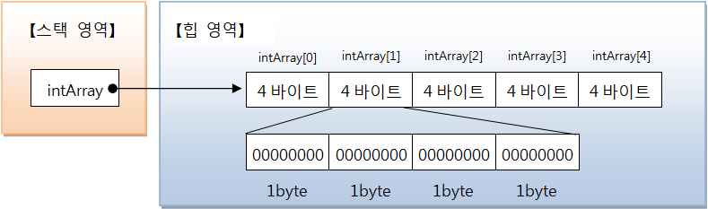

- new 연산자로 배열을 처음 생성할 경우, 배열은 자동적으로 기본값으로 초기화된다.

  - 배열을 초기화하는 기본값들은 타입에 따라 다르다.

  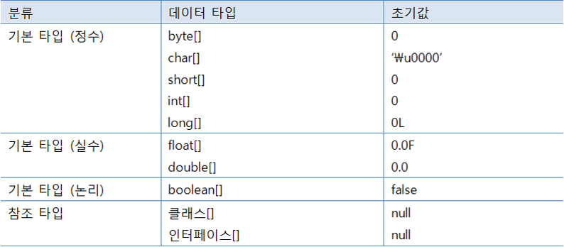

  - 배열이 생성되고 나서 새로운 값을 저장하려면 대입 연산자를 사용하면 된다.

  ```java
  int[] scores = new int[3];
  scores[0] = 83;
  scores[1] = 90;
  scores[2] = 75;
  ```

### 5.6.5 배열 길이

- 배열의 길이란 배열에 저장할 수 있는 전체 항목 수를 말한다. 

  - 코드에서 길이를 얻으려면 배열 객체의 length 필드를 읽으면 된다.
    - 참고로 필드는 객체 내부의 데이터를 말한다.
  - 배열의 length 필드를 읽기 위해서는 배열 변수에 도트(.) 연산자를 붙이고 length를 적어주면 된다.
    - 배열의 length 필드는 for문을 사용해서 배열 전체를 루핑할 때 매우 유용하게 사용할 수 있다.

  ```java
  배열변수.length;
  ```

  ```java
  int[] intArray = {10, 20, 30};
  int num = intArray.length;
  ```

  - length 필드는 일기 전용 필드이기 때문에 값을 바꿀 수 없다.

  ```java
  intArray.length = 10;	// 잘못된 코드
  ```


### 5.6.6 커맨드 라인 입력

- "java 클래스"로 프로그램을 실행하면 JVM은 길이가 0인 String  배열을 먼저 생성하고 main() 메소드를 호출할 때 매개값으로 전달한다.

- "java 클래스" 뒤에 공백으로 구분된 문자열 목록을 주고 실행하면, 문자열 목록으로 구성된 String[] 배열이 생성되고 main() 메소드를 호출할 때 매개밧으로 전달된다.

  ```java
  java 클래스 문자열0 문자열1 문자열2 ... 문자열n-1
  
  String[] args = {문자열0, 문자열1, 문자열2, ..., 문자열n-1};
  
  public static void main(String[] args) {
  ...
  }
  ```

  - main() 메소드는 String[] args 매개 변수를 통해서 커맨드 라인에서 입력된 데이터의 수(배열의 길이)와 입력된 데이터(배열의 항목 값)을 알 수 있게 된다.

### 5.6.7 다차원 배열

- 행과 열로서 구성된 배열을 2차원 배열이라고 한다.

  - 2차원 배열은 수학의 행렬을 떠올리면 되는데, 가로 인덱스와 세로 인덱스를 사용한다.
  - 자바는 2차원 배열을 중첩 배열 방식으로 구현한다.

  ```java
  int[][] scores = new int[2][3];
  ```

  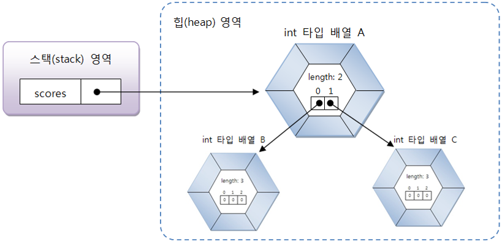

  - 일반적인 배열과 달리 다차원 배열을 생성하게 되면 먼저 변수는 행을 기준으로 가지는 배열의 시작 번지를 가리키고 그 객체 배열은 각 행 별로 그 행에 해당하는 배열을 따로따로 객체를 생성하여 가리킨다.

- 생성 원리는 수학 행렬과는 근복적으로 다르지만 사용 방식은 행렬과 동일하다.

  - 하지만 자바는 일차원 배열이 서로 연결된 구조로 다차원 배열을 구현하기 때문에 수학 행렬 구조가 아닌 계단식 구조를 가질 수 있다.

  ```java
  int[][] scores = new int[2][];
  scores[0] = new int[2];	// 0 1
  scores[1] = new int[3];	// 0 1 2
  ```

  - 이런 형태의 배열에서 주의할 점은 정확한 배열의 길이를 알고 인덱스를 사용해야 한다.
    - 만약 배열의 인덱스를 벗어나는 호출을 했을 때는 ArrayIndexOutBoundsException을 발생시킨다.

- 다차원 배열이 그룹화 된 값 목록을 가지고 있다면 중괄호 안에 다시 중괄호를 사용해서 값 목록을 나열하면 된다.

  ```java
  타입[][] 변수 = { {값1, 값2, ...}, {값1, 값2, ...}, ...};
  ```

  ```java
  int[][] scores = { {95, 80}, {92, 96}};
  ```

### 5.6.8 객체를 참조하는 배열

- 기본 타입(byte, char, short, int, long, float, double, boolean) 배열은 각 항목에 직접 값을 갖고 있지만, 참조 타입(클레스, 인터페이스) 배열은 각 항목에 객체의 번지를 가지고 있다.

  ```java
  String[] strArray = new String[3];
  strArray[0] = "Java";
  strArray[1] = "C++";
  strArray[2] = "C#";
  ```

  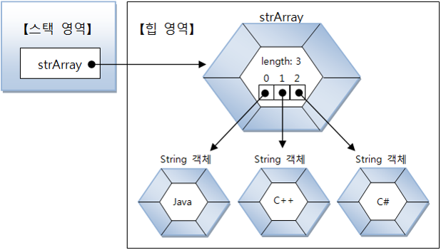

  - 그렇기 때문에 객체 배열의 항목도 객체 변수와 동일하게 취급되어야 한다.

  ```java
  String[] strArray new String[3];
  strArray[0] = "Java";
  strArray[1] = "Java";
  strArray[2] = new String("Java");
  
  strArray[0] == strArray[1];	// true (같은 객체를 참조)
  strArray[0] == strArray[2];	// false (다른 객체를 참조)
  strArray[0].equals(strArray[2)	// true	(문자열이 동일)
  ```

### 5.6.9 배열 복사

- 배열은 한 번 생성하면 크기를 변경할 수 없기 때문에 더 많은 저장 공간이 필요하다면 보다 큰 배열을 새로 만들고 이전 배열로부터 항목 값들을 복사해야 한다.

  - 배열 간의 항목 값들을 목사하려면 for문을 사용하거나 System.arraycopy() 메소드를 사용하면 된다.

  ```java
  System.arraycopy(Object src, int srcPos, Object dest, int destPos, int length);
  ```

  - src 매개값은 원본 배열이고, srcPos는 원본 배열에서 복사할 항목의 시작 인덱스이다.
  - dest 매개값은 새 배열이고, destPos는 새 배열에서 붙여넣을 시작 인덱스이다.
  - 마지막으로 length는 복사할 개수이다.

- 참조 타입 배열일 경우, 배열 복사가 되면 복사되는 값이 객체의 번지이므로 새 배열의 항목은 이전 배열의 항목이 참조하는 객체와 동일하다.
  - 이것을 얕은 복사(shallow copy)라고 한다.
  - 반대로 깊은 복사(deep copy)는 참조하는 객체도 별도로 생성하는 것을 말한다.

### 5.6.10 향상된 for문

- 자바 5부터 배열 및 컬렉션 객체를 좀 더 쉽게 처리할 목적으로 향상된 for문을 제공한다.

- 향상된 for문은 반복 실행을 하기 위해 카운터 변수와 증감식을 사용하지 않는다.

  - 배열 및 컬렉션 항목의 개수만큼 반복하고, 자동적으로 for문을 빠져나간다.

  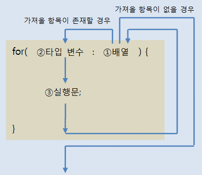

  > for문의 괄호 ()에는 배열에서 꺼낸 항목을 저장할 변수 선언과 콜론 (:) 그리고 배열을 나란히 작성한다.
  >
  > 1. for문이 처음 실행될 때 배얄에서 가져올 첫 번째 값이 존재하는지 평가한다.
  > 2. 가져올 값이 존재하면 해당 값을 변수에 저장한다.
  > 3. 실행문을 실행한다.
  > 4. 블록 내부의 실행문이 모두 실행되면 다시 루프를 돌아 배열에서 가져올 다음 값이 존재하는지 평간한다.
  >
  > 따라서 향상된 for문의 반복 횟수는 배열의 항목 수가 된다.

## 5.7 열거 타입

- 데이터 중에는 몇 가지로 한정된 값만을 갖는 경우가 흔히 있다.

  `요일에 대한 데이터`

  - 이와 같이 한정된 값만을 갖는 데이터 타입이 열거 타입(enumeration type)이다.
  - 열거 타입은 몇 개의 열거 상수(enumeration constant) 중에서 하나의 상수를 저장하는 데이터 타입이다.

### 5.7.1 열거 타입 선언

- 열거 타입을 선언하기 위해서는 먼저 열거 타입의 이름을 정하고 열거 타입 이름으로 소스 파일(.java)을 생성해야 한다.

  - 열거 타입 이름은 관례적으로 첫 문자를 대문자로 하고 나머지는 소문자로 구성한다.
  - 만약 여러 단어로 구성된 이름이라면 단어 첫 문자는 대문자로 하는 것이 관례이다.

  ```java
  Week.java
  MemberGrade.java
  ProductKind.java
  ```

- 소스 파일의 내용으로는 열거 타입 선언이 온다.

  ```java
  public enum Week {
  	MONDAY,
  	TUESDAY,
  	WEDNESDAY,
  	THURSDAY,
  	FRIDAY,
  	SATURDAY,
  	SUNDAY
  }
  ```

  - public enum 키워드는 열거 타입을 선언하기 위한 키워드이다.
    - 반드시 소문자로 작성해야 한다.
  - 열거 타입 이름은 소스 파일명과 대소문자가 모두 일치해야 한다.

  ```java
  public enum 열거타입이름 {...}
  ```

  - 열거 타입을 선언했다면 이제는 열거 상수를 선언하면 된다.
    - 열거 상수는 열거 타입의 값으로 사용되는데, 관례적으로 열거 상수는 모두 대문자로 작성한다.

  ```java
  public enum Week {MONDAY, TUESDAY, WEDNESDAY, ...}
  ```

- 만약 열거 상수가 여러 단어로 구성될 경우에는 단어 사이를 밑줄(_)로 연결하는 것이 관례이다.

  ```java
  public enum LoginResult { LOGIN_SUCCESS, LOGIN_FAILED}
  ```

### 5.7.2 열거 타입 변수

- 열거 타입을 선언했다면 이제 열거 타입을 사용할 수 있다.

  - 열거 타입도 하나의 데이터 타입이므로 변수를 선언하고 사용해야 한다.

  ```java
  열거타입 변수;
  ```

  ```java
  Week today;
  Week reservationDay;
  ```

- 열거 타입 변수를 선언했다면 열거 상수를 저장할 수 있다.

  - 열거 상수는 단독으로 사용할 수는 없고 반드시 "열거 타입.열거 상수"로 사용된다.

  ```java
  열거타입 변수 = 열거타입.열거상수;
  ```

  ```java
  Week today = Week.SUNDAY;
  ```

- 열거 타입 변수는 null 값을 저장할 수 있는데 열거 타입도 참조 타입이기 때문이다.

  ```java
  Week birthday = null;
  ```

- 열거 타입도 참조 타입이기 때문에 열거 타입 내부에 열거 상수는 객체로 생성된다.

- 열거 변수의 값을 열거 상수로 초기화 한다면 같은 객체를 가리키고 있기 때문에 == 연산에서 true가 반환된다.

  ```java
  Week today = Week,SUNDAY;
  
  today == Week.SUNDAY;	// true
  ```

  - 서로 다른 열거 변수들이 같은 객체를 가리킨다면 역시 == 연산을 true 값을 반환한다.

  ```java
  Week week1 = Week.SATURDAY;
  Week week2 = Week.SATURDAY;
  System.out.println(week1 == week2);	//true
  ```

- 자바는 컴퓨터의 날짜 및 요일, 시간을 프로그램에서 사용할 수 있도록 하기 위해 Date, Calender, LocalDate Time 등의 클래스를 제공한다.

  - LocalDateTime은 자바 8부터 지원하는 API이다.

  ```java
  Calendar now = Calendar.getInstance();
  ```

  - Calendar 객체를 얻었다면 get() 메소드를 이용해서 년, 월, 일, 요일, 시간, 분, 초를 얻을 수 있다.
  
  ```java
  int year = now.get(Calendar.YEAR);
  int month = now.get(Calendar.MONTH) + 1;
  int day = now.get(Calendar.DAY_OF_MONTH);
  int week = now.get(Calendar.DAY_OF_WEEK);
  int hour = now.get(Calendar.HOUR);
  int minute = now.get(Calendar.MINUTE);
  int second = now.get(Calendar.SECOND);
  ```

### 5.7.3 열거 객체의 메소드

- 열거 객체의 열거 상수의 문자열을 내부 데이터로 가지고 있다.

- 메소드는 java.lang.Enum 클래스에 선언된 메소드인데, 열거 객체에서 사용할 수 있는 이유는 모든 열거 타입은 컴파일 시에 Enum 클래스를 상속하게 되어 있기 때문이다.

  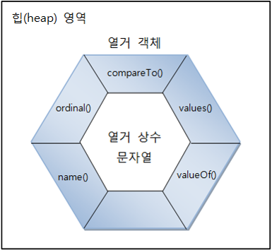

| 리턴 타입 | 메소드(매개 변수)    | 설명                                  |
| --------- | -------------------- | ------------------------------------- |
| String    | name()               | 열거 객체의 문자열을 리턴             |
| int       | ordinal()            | 열거 객체의 순번(0부터 시작)을 리턴   |
| int       | compareTo()          | 열거 객체를 비교해서 순번 차이를 리턴 |
| 열거 타입 | valueOf(String name) | 주어진 문자열의 열거 객체를 리턴      |
| 열거 배열 | values()             | 모든 열거 객체들을 배열로 리턴        |

#### name() 메소드

- **name()** 메소드는 열거 객체가 가지고 있는 문자열을 리턴한다.

  - 이때 리턴되는 문자열은 열거 타입을 정의할 때 사용한 상수 이름과 동일하다.

  ```java
  Week today = Week.SUNDAY;
  String name = today.name();
  ```

#### ordinal() 메소드

- **ordinal()** 메소드는 전체 열거 객체 중 몇 번째 열거 객체인지 알려준다.

  - 열거 객체의 순번은 열거 타입을 정의할 때 주어진 순번을 말하는데, 0부터 시작한다.

  ```java
  Week today = Week.SUNDAY;
  int ordinal = today.ordinal();
  ```

#### compareTo() 메소드

- **compareTo()** 메소드는 매개값으로 주어진 열거 객체를 기준으로 전후로 몇 번째 위치하는 지를 비교한다.

  - 만약 열거 객체가 매개값의 열거 객체보다 순번이 빠르다면 음수가, 순번이 늦다면 양수가 리턴된다.

  ```java
  Week day1 = Week.MONDAY;
  Week day2 = Week.WEDNESDAY;
  int result1 = day1.compareTo(day2);	// -2
  int result2 = day2.compareTo(day1);	// 2
  ```

#### valueOf() 메소드

- **valueOf()** 메소드는 매개값으로 주어지는 문자열과 동일한 문자열을 가지는 열거 객체를 리턴한다.

  - 이 메소드는 외부로부터 문자열을 입력받아 열거 객체로 변환할 때 유용하게 사용할 수 있다.

  ```java
  Week weekDay = Week.valueOf("SATURDAY");
  ```

#### values() 메소드

- **values()** 메소드는 열거 타입의 모든 열거 객체들을 배열로 만들어 리턴한다.

  ```java
  Week[] days = Week.values();
  for(Week day : days) {
  	System.out.println(day);
  }
  ```

  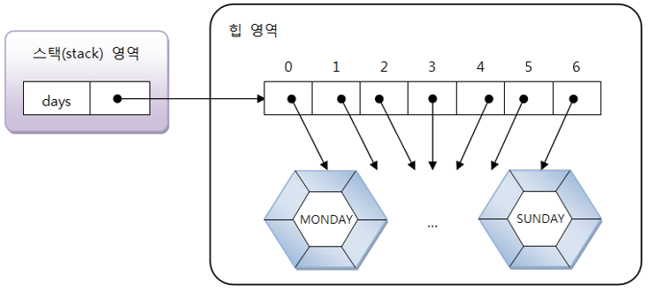