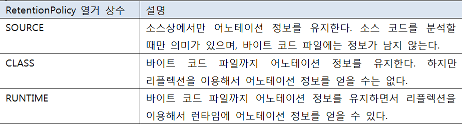

# 6. 클래스

## 6.1 객체 지향 프로그래밍

- **객체 지향 프로그래밍(OOP : Object Oriented Programming)** : 소프트 웨어를 개발할 때 부품에 해당하는 객체들을 먼저 만들고, 이것들을 하나씩 조립해서 완성된 프로그램을 만드는 기법

### 6.1.1 객체란?

- **객체(Object)** : 물리적으로 존재하거나 추상적으로 생각할 수 있는 것 중에서 자신의 속성을 가지고 있고 다른 것과 식별 가능한 것을 말한다.

  - 객체는 속성과 동작으로 구성되어 있다.

  `사람은 이름, 나이 등에 속성과 웃다, 걷다 등의 동작이 있다.`

  - 자바는 이 속성과 동작들을 각각 필드(field)와 메소드(method)라고 부른다.

  

  <br>

- 현실 세계의 객체를 소프트웨어 객체로 설계하는 것을 객체 모델링(Object Modeling)이라고 한다.
  
  - 객체 모델링은 현실 세계 객체의 속성과 동작을 추려내어 소프트웨어 객체의 필드와 메소드로 정의하는 과정이라고 볼 수 있다.

### 6.1.2 객체의 상호작용

- 현실 세계에서 일어나는 모든 현상은 객체와 객체 간의 상호작용으로 이루어져 있다.

  

  <br>

- 소프트웨어에서도 객체들은 각각 독립적으로 존재하고, 다른 객체와 서로 상호작용하면서 동작한다.

  - 객체들 사이의 상호작용 수단은 메소드이다.
  - 객체가 다른 객체의 기능을 이용하는 것이 바로 메소드 호출이다.

  

  <br>

- 메소드 호출은 객체에 도트(.) 연산자를 붙이고 메소드 이름을 기술하면 된다.

  - 도트 연산자는 객체의 필드와 메소드에 접근할 때 사용한다.

  ```java
  리턴값 = 전자계산기객체.메소드(매개값1, 매개값2, ...);
  ```

- 매개값은 메소드를 실행하기 위해 필요한 데이터이다.

  `10과 20을 주고 더하기 기능을 이용할 때 10과 20은 더하기 기능의 매개값이다.`

- 리턴값은 메소드가 실행하고 나서 호출한 곳으로 돌려주는 (리턴하는)값이다.

  

  ```java
  int result = Calculator.add(10, 20);
  // 리턴한 값을 int 변수에 저장
  ```

### 6.1.3 객체 간의 관계

- 객체는 개별적으로 사용될 수 있지만, 대부분 다른 객체와 관계를 맺고 있다. 

- 이 관계의 종류에는 집합 관계, 사용 관계, 상속 관계가 있다.

  - 집합 관계에 있는 객체는 하나는 부품이고 하나는 완성품에 해당한다.

  `자동차는 엔진, 타이어, 핸들 등으로 구성되므로 자동차와 이 부품들은 집합의 관계라고 볼 수 있다.`

  

  <br>

  - 사용 관계는 객체 간의 상호작용을 말한다.

    - 객체는 다른 객체의 메소드를 호출하여 원하는 결과를 얻어낸다.

    `사람은 자동차를 사용하므로 사람과 자동차는 사용의 관계라고 볼 수 있다.`

  - 상속 관계는 상위(부모) 객체를 기반으로 하위(자식) 객체를 생성하는 관계를 말한다.

    - 일반적으로 상위 객체는 종류를 의미하고, 하위 객체는 구체적인 사물에 해당한다.

    `자동차는 기계의 종류이므로, 기계(상위)와 자동차(하위)는 상속 관계이다.`

- 객체 지향 프로그래밍(OOP: Object Oriented Programming)은 만들고자 하는 완성품인 객체를 모델링하고, 집합 관계에 있는 부품 객체와 사용 관계에 있는 객체를 하나씩 설계한 후 조립하는 방식으로 프로그램을 개발하는 기법이다.

### 6.1.4 객체 지향 프로그래밍의 특징

- 객체 지향 프로그램의 특징으로는 캡슐화, 상속, 다형성을 들 수 있다.

#### 캡슐화(Encapsulation)

- **캡슐화** : 객체의 필드, 메소드를 하나로 묶고, 실제 구현 내용을 감추는 것을 말한다.

  - 외부 객체는 객체 내부의 구조를 알지 못하며, 객체가 노출해서 제공하는 필드와 메소드만 이용할 수 있다.

  

<br>

- 필드와 메소드를 캡슐화하여 보호나는 이유는 외부의 잘못된 사용으로 인해 객체가 손상되지 않도록 하는데 있다.

- 자바 언어는 캡슐화된 멤버를 노출시킬 것인지, 숨길 것인지를 결정하기 위해 접근 제한자(Access Modifier)를 사용한다.
  - 접근 제한자는 객체의 필드와 메소드의 사용 범위를 제한함으로써 외부로부터 보호한다.

#### 상속(Inheritance)

- **상속** : 상위 객체가 자기가 가지고 있는 필드와 메소드를 하위 객체에게 물려주어 하위 객체가 사용할 수 있도록 해주는 것을 말한다.

  

<br>

- 상속은 상위 객체를 재사용해서 하위 객체를 쉽고 빨리 설계할 수 있도록 도와주고, 이미 잘 개발된 객체를 재사용해서 새로운 객체를 만들기 떄문에 반복된 코드의 중복을 줄여준다.
- 상속은 상위 객체의 수정으로 모든 하위 객체들의 수정 효과를 가져오므로 유지 보수 시간을 최소화시켜주기도 한다.

#### 다형성(Polymorphism)

- **다형성** : 같은 타입이지만 실행 결과가 다양한 객체를 이용할 수 있는 성질을 말한다.

  - 코드 측면에서 다형성은 하나의 타입에 여러 객체를 대입함으로써 다양한 기능을 이용할 수 있도록 해준다.

- 자바는 다형성을 위해 부모 클래스 또는 인터페이스의 타입 변환을 허용한다.

  - 부모 타입에는 모든 자식 객체가 대입될 수 있고, 인터페이스 타입에는 모든 구현 객체가 대입될 수 있다.

- 다형성의 효과로 객체는 부품화가 가능하다.

  `자동차를 설계할 때 타이어 인터페이스 타입을 적용했다면 이 인터페이스를 구현한 실제 타이어들은 어떤 것이든 상관없이 장착(대입)이 가능하다.`

  

## 6.2 객체와 클래스

- 메모리에서 사용하고 싶은 객체가 있다면 우선 설계도로 해당 객체를 만드는 작업이 필요하다.

  - 자바에서는 설계도가 클래스(class)이다.

- 클래스에는 객체를 생성하기 위한 필드와 메소드가 정의되어 있다.

- 클래스로부터 만들어진 객체를 해당 클래스의 **인스턴스(instance)**라고 한다.

  `자동차 객체는 자동차 클래스의 인스턴스이다.`

  - 클래스로부터 객체를 만드는 과정을 인스턴스화라고 한다.

  - 하나의 클래스로부터는 여러 개의 인스턴스를 만들 수 있다.

  `하나의 동일한 설계도로부터 여러 대의 자동차를 만드는 것과 동일하다.`

  

## 6.3 클래스 선언

- 사용하고자 하는 객체를 구상했다면, 그 객체의 대표 이름을 하나 결정하고 이것을 클래스 이름으로 한다.

  `사람 객체의 클래스는 Person으로, 자동차 객체의 클래스는 Car라는 이름으로 줄 수 있다.`

  - 클래스 이름은 다른 클래스와 식별할 목적으로 사용되므로 자바의 식별자 작성 규칙에 따라서 만들어야 한다.

  | 작성 규칙                                | 예                           |
  | ---------------------------------------- | ---------------------------- |
  | 하나 이상의 문자로 이루어져야 한다.      | Car, SportsCar               |
  | 첫 번째 글자는 숫자가 올 수 없다.        | Car, 3Car(x)                 |
  | '$', '_'외의 특수 문자는 사용할 수 없다. | %Car, _Car, @Car(x), #Car(x) |
  | 자바 키워드는 사용할 수 없다.            | int(x), for(x)               |

  - 클래스 이름은 한글이든 영어든 상관 없지만, 한글로 클래스 이름을 만드는 경우는 거의 없다.

- 자바 언어는 영어 대소문자를 다른 문자로 취급하기 때문에 클래스 이름도 영어 대소문자를 구분한다.

  - 관례적으로 이름이 단일 단어라면 첫 자를 대문자로 하고 나머지는 소문자로 작성한다.
  - 만약 서로 다른 단어가 혼합된 이름을 사용한다면 각 단어의 첫 머리 글자는 대문자로 작성하는 것이 관례이다.

  ```java
  Calculator, Car, Member, ChatClient, ChatServer, Web_Browser
  ```

- 클래스 이름을 정했다면 "클래스이름.java"로 소스 파일을 생성해야 한다.

  - 소스 파일 이름 역시 대소문자를 구분하므로 반드시 클래스 이름과 대소문자가 같도록 해야 한다.

  ```java
  public class ClassName {
  
  }
  ```

  - public class 키워드는 클래스를 선언할 때 사용하며 반드시 소문자로 작성해야 한다.
  - 클래스 이름 뒤에는 반드시 중괄호 {}를 붙여주는데, 중괄호 시작은 {은 클래스 선언의 시작을 알려주고 중괄호 끝 }은 클래스 선언의 끝을 알려준다.

  ```java
  public class Car {
  	...
  }
  ```

- 일반적으로 소스 파일당 하나의 클래스를 선언한다. 하지만 두 개 이상의 클래스 선언도 가능하다.

  ```java
  public class Car {
  
  }
  
  class Tire {
  
  }
  ```

  - 두 개 이상의 클래스가 선언된 소스 파일을 컴파일하면 바이트 코드 파일은(.class) 클래스를 선언한 개수만큼 생긴다.
  - 결국 소스 파일은 클래스 선언을 담고 있는 저장 단위일 뿐, 클래스 자체가 아니다.
  - 여기서 주의할 점은 파일 이름과 동일한 이름의 클래스 선언에만 public 접근 제한자를 붙일 수 있다.

  `만약 파일 이름과 일치하지 않는 클래스 선언에 public 접근 제한자를 붙이면 컴파일 에러가 발생한다.`

  - 가급적이면 소스 파일 하나당 동일한 이름의 클래스 하나를 선언하는 것이 좋다.

## 6.4 객체 생성과 클래스 변수

- 클래스를 선언한 다음, 컴파일을 했다면 객체를 생성할 설계도가 만들어진 셈이다.

- 객체를 생성하는 방법은 new 연산자를 사용하면 된다.

  ```java
  new 클래스();
  ```

  

- new는 클래스로부터 객체를 생성시키는 연산자이다.

  - new 연산자 뒤에는 생성자가 오는데, 생성자는 클래스() 형태를 가지고 있다.

- new 연산자로 생성된 객체는 메모리 힙(heap) 영역에 생성된다.

  - new 연산자는 힙 영역에 객체를 생성시킨 후, 객체의 주소를 리턴하도록 되어 있다.
  - 이 주소를 참조 타입인 클래스 변수에 저장해 두면, 변수를 통해 객체를 사용할 수 있다.

  ```java
  클래스 변수;
  변수 = new 클래스();
  ```

  - 클래스 변수 선언과 객체 생성을 한 개의 실행문으로 작성할 수도 있다.

  ```
  클래스 변수 = new 클래스();
  ```

  

```java
// Student.java
public class Student {

}

// StudentExample.java
public class StudentExample {

    public static void main(String[] args) {

        Student s1 = new Student();
        System.out.println("s1 변수가 Student 객체를 참조합니다.");

        Student s2 = new Student();
        System.out.println("s2 변수가 또 다른 Student 객체를 참조합니다.");

    }
    
}
```

- 클래스의 용도는 두 가지가 용도가 있다.

  - 하나는 라이브러리(API: Application Program Interface)용이고 다른 하나는 실행용이다.

- 프로그램 전체에서 사용되는 클래스가 100개라면 99개는 라이브러리이고 단 하나가 실행 클래스이다.

  - 실행 클래스는 프로그램의 실행 진입점인 main() 메소드를 제공하는 역할을 한다.

  ```java
  public class Student {
  	// 라이브러리로서의 코드(필드, 생성자, 메소드)
      ...
  	// 실행하기 위한 코드
  	public static void main(String[] args) {
  
          Student s1 = new Student();
          System.out.println("s1 변수가 Student 객체를 참조합니다.");
  
          Student s2 = new Student();
          System.out.println("s2 변수가 또 다른 Student 객체를 참조합니다.");
  
      }
      
  }
  ```

- 프로그램이 단 하나의 클래스로 구성되는 것이 좋은 방법일 수 있지만 대부분의 객체 지향 프로그램은 라이브러리(부품 객체 및 완성 객체)와 실행 클래스가 분리되어 있다.

## 6.5 클래스의 구성 멤버

- 클래스에는 객체가 가져야 할 구성 멤버가 선언된다.

  - 구성 멤버에는 필드(Field), 생성자(Constructor), 메소드(Method)가 있다.
  - 이 구성 멤버들은 생략되거나 복수 개가 작성될 수 있다.

  

### 6.5.1 필드

- 필드는 객체의 고유 데이터, 부품 객체, 상태 정보를 저장하는 곳이다.
  - 선언 형태는 변수(variable)와 비슷하지만, 필드를 변수라고 부르지 않는다.
    - 변수는 생성자와 메소드 내에서만 사용되고 생성자와 메소드가 실행 종료되면 자동 소멸된다.
    - 필드는 생성자와 메소드 전체에서 사용되며 객체가 소멸되지 않는 한 객체와 함께 존재한다.

### 6.5.2 생성자

- 생성자는 new 연산자로 호출되는 특별한 중괄호 {}블록이다.
  - 생성자의 역할은 객체 생성 시 초기화를 담당한다.
  - 필드를 초기화하거나, 메소드를 호출해서 객체를 사용할 준비를 한다.
  - 생성자는 메소드와 비슷하게 생겼지만, 클래스 이름으로 되어 있고 리턴 타입이 없다.

### 6.5.3 메소드

- 메소드는 객체의 동작에 해당하는 중괄호 {} 블록을 말한다.
  - 중괄호 블록은 이름을 가지고 있는데, 이것이 메소드 이름이다.
  - 메소드를 호출하게 되면 중괄호 블록에 있는 모든 코드들이 일괄적으로 실행된다.
- 메소드는 필드를 읽고 수정하는 역할도 하지만, 다른 객체를 생성해서 다양한 기능을 수행하기도 한다.
- 메소드는 객체 간의 데이터 전달의 수단으로 사용된다.
  - 외부로부터 매개값을 받을 수도 있고, 실행 후 어떤 값을 리턴할 수도 있다.

## 6.6 필드

- **필드(Field)** : 객체의 고유데이터, 객체가 가져야 할 부품, 객체의 현재 상태 데이터를 저장하는 곳이다.

  `자동차 객체에 제작회사, 모델, 색깔, 최고 속도는 고유 데이터에 해당하고, 현재 속도, 엔진 회전 수는 상태 데이터에 해당한다. 그리고 차체, 엔진, 타이어는 부품에 해당한다.`

  

### 6.6.1 필드 선언

- 필드 선언은 클래스 중괄호 {} 블록 어디서든 존재할 수 있다.

  - 생성자 선언과 메소드 선언 앞과 뒤 어떤 곳에서도 필드 선언이 가능하다.

- 하지만 필드 선언은 생성자와 메소드 중괄호 블록 내부에는 선언될 수 없다.

  - 생성자와 메소드 중괄호 블록 내부에 선언된 것은 모두 로컬 변수가 된다.

- 필드 선언은 변수의 선언 형태와 비슷하다.

  - 일부 사람들은 클래스 멤버 변수라고 부르기도 하는데, 될 수 있으면 필드라는 용어를 그대로 사용하는 것이 좋다.

  ```java
  타입 필드 [= 초기값];
  ```

- 타입은 필드에 저장할 데이터의 종류를 결정한다.

  - 타입에는 기본 타입(byte, short, int, long, float, double, boolean)과 참조 타입(배열, 클래스, 인터페이스)이 모두 올 수 있다.

- 필드의 초기값은 필드 선언 시 주어질 수도 있고, 생략될 수도 있다.

  ```java
  String company = "현대 자동차";
  String model = "그랜저";
  int maxSpeed = 300;
  int productionYear;
  int currentSpeed;
  boolean engineStart;
  ```

  - 초기값은 지정되지 않은 필드들은 객체 생성 시 자동으로 기본 초기값으로 설정된다.

  

### 6.6.2 필드 사용

- 필드를 사용한다는 것은 필드값을 일고, 변경하는 작업을 말한다.

  - 클래스 내부의 생성자나 메소드에서 사용할 경우 단순히 필드 이름으로 읽고 변경하면 되지만, 클래스 외부에서 사용할 경우 우선적으로 클래스로부터 객체를 생성한 뒤 필드를 사용해야 한다.
  - 그 이유는 필드는 객체에 소속된 데이터이므로 객체가 존재하지 않으면 필드도 존재하지 않기 때문이다.

  

  <br>

- 필드와 변수의 차이점은 변수는 자신이 선언된 생성자 또는 메소드 블록 내부에서만 사용할 수 있는 반면 필드는 생성자와 모든 메소드에서 사용이 가능하다.

- 객체에 멤버에 접근하기 위해서는 도트(.) 연산자를 사용한다.
  
  - 도트 (.) 연산자는 객체 접근 연산자로 객체가 가지고 있는 필드나, 메소드를 사용하고자 할 때 사용된다.

## 6.7 생성자

- **생성자(Constructor)** : new 연산자와 같이 사용되어 클래스로부터 객체를 생성할 때 호출되어 객체의 초기화를 담당한다.
  - 객체 초기화란 필드를 초기화하거나, 메소드를 호출해서 객체를 사용할 준비를 하는 것을 말한다.
- 생성자를 실행시키지 않고는 클래스로부터 객체를 만들 수 없다.
  - new 연산자에 의해 생성자가 성공적으로 실행되면 힙(heap) 영역에 객체가 생성되고 객체의 주소가 리턴된다.
  - 리턴된 객체의 주소는 클래스 타입 변수에  저장되어 객체에 접근할 때 이용된다.
    - 만약 생성자가 성공적으로 실행되지 않고 예외(에러)가 발생했다면 객체는 생성되지 않는다.

### 6.7.1 기본 생성자

- 모든 클래스는 생성자가 반드시 존재하며, 하나 이상을 가질 수 있다.

  - 클래스 내부에 생성자 선언을 생략했다면 컴파일러는 중괄호 {} 블록 내용이 비어있는 기본 생성자(Default Constructor)를 바이트 코드에 자동 추가시킨다.

  ```java
  [public] 클래스() {}
  ```

  - 클래스가 public class로 선언되면 기본 생성자에서도 public이 붙지만, 클래스가 public 없이 class로만 선언되면 기본 생성자에도 public이 붙지 않는다.

  

- 클래스에 생성자를 선언하지 않아도 new 연산자 뒤에 기본 생성자를 호출해서 객체를 생성시킬 수 있다.

  ```java
  Car myCar = new Car();
  ```

- 하지만 클래스에 명시적으로 선언한 생성자가 한 개라도 있으면, 컴파일러는 기본 생성자를 추가하지 않는다.

  - 명시적으로 생성자를 선언하는 이유는 객체를 다양하게 초기화하기 위해서이다.

### 6.7.2 생성자 선언

```java
클래스(매개변수선언, ...) {
	// 객체의 초기화 코드
}
```

- 생성자는 메소드와 비슷한 모양을 가지고 있으나, 리턴 타입 없고 클래스 이름과 동일하다.
  
- 생성자 블록 내부에는 객체 초기화 코드가 작성되는데, 일반적으로 필드에 초기값을 저장하거나 메소드를 호출하여 객체 사용 전에 필요한 준비를 한다.
  
- 매개 변수 선언은 생략할 수도 있고, 여러 개를 선언해도 좋다.

  - 매개 변수는 new 연산자로 생성자를 호출할 때 외부의 값을 생성자 블록 내부로 전달하는 역할을 한다.

  ```java
  Car myCar = new Car("그랜저", "검정", 300);
  ```

  ```java
  public class Car {
  	// 생성자
  	Car(String model, String color, int maxSpeed) {...}
  }
  ```

- 클래스에 생성자가 명시적으로 선언되어 있을 경우에는 반드시 선언된 생성자를 호출해서 객체를 생성해야만 한다.

### 6.7.3 필드 초기화

- 클래스로부터 객체가 생성될 때 필드는 기본 초기값으로 자동 설정된다.

- 만약 다른 값으로 초기화를 하고 싶다면 두 가지 방법이 있다.

  - 필드를 선언할 때 초기값을 주는 방법
    - 동일한 클래스로부터 생성되는 개체들은 모두 같은 데이터를 갖게 된다.
    - 객체 생성 후 변경할 수 있지만, 객체 생성 시점에는 필드의 값이 모두 같다.
  - 셍성자에게 초기값을 주는 방법이다.
    - 객체 생성 시점에 외부에서 제공되는 다양한 값들로 초기화되어야 한다면 생성자에서 초기화를 해야한다.
  - 필드를 선언할 떄 초기화를 해주지 않았다면 필드값은 클래스를 작성할 때 초기값을 줄 수 없고 객체 생성 시점에 다양한 값을 가져야 한다.
    - 따라서 생성자의 매개값으로 이 값들을 받아 초기화하는 것이 맞다.

  ```java
  public class Korean {
  	// 필드
      String nation = "대한민국";
      String name;
      String ssn;
      
      // 생성자
      public Korean(String n, String s) {
          name = n;
          ssn = s;
      }
  }
  ```

- 생성자의 매개 변수의 이름이  너무 짧으면 코드의 가독성이 좋지 않기 때문에 가능하면 초기화시킬 필드 이름과 비슷하거나 동일한 이름을 사용하는 것이 좋다.
  
  - 관례적으로 동일한 이름을 갖는 매개 변수를 사용한다.
- 동일한 이름을 갖는 매개 변수를 사용하는 경우 필드와 매개 변수 이름이 동일하기 때문에 생성자 내부에서 해당 필드에 접근할 수 없다.
  - 동일한 이름의 매개 변수가 사용 우선순위가 높기 때문이다.
  - 이 경우 해결 방법은 필드 앞에 "this."를 붙이면 된다.

- **this**는 객체 자신의 참조인데, 객체 자신을 this라고 하여 "this.필드"는 this라는 참조 변수로 필드를 사용하는 것과 동일하다.

  ```java
  public Korean(String name, String ssn) {
  	this.name = name;
  	this.ssn = ssn;
  }
  ```

- 객체의 필드는 하나가 아니라 여러 개가 있고, 이 필드들을 모두 생성자에서 초기화한다면 생성자의 매개 변수의 수는 객체의 필드 수만큼 선언되어야 한다.
  - 그러나 실제로는 중요한 몇 개 필드만 매개 변수를 통해 초기화 되고 나머지 필드들은 필드 선언 시에 초기화하거나 생성자 내부에서 임의의 값 또는 계산된 값으로 초기화한다.
  - 객체 생성 후에 필드값을 별도로 저장하기도 한다.

### 6.7.4 생성자 오버로딩(Overloading)

- **생성자 오버로딩(Overloading)** : 매개 변수를 달리하는 생성자를 여러 개 선언하는 것을 말한다.

  - 외부에서 제공되는 다양한 데이터들을 이용해서 객체를 초기화하려면 생성자도 다양화될 필요가 있다.

    > 하나의 객체를 생성할 때 외부에서 제공되는 데이터가 없다면 기본 생성자로 객체를 생성해야 한다.
    >
    > 외부에서 하나의 필드를 초기화 하는 데이터가 제공되거나 둘 이상의 필드를 초기화하는 데이터가 제공될 경우에도 객체를 생성할 수 있어야 한다.

  ```java
  public class 클래스{
  	클래스 ([타입 매개변수, ...]) {
          
      }
      클래스 ([타입 매개변수, ...]) {
          
      }
  
  }
  ```

  ```java
  public class Car {
      Car() {...}
      Car(String model) {...}
      Car(String model, String color) {...}
      Car(String model, String color, int maxSpeed) {...}
  }
  ```

- 생성자 오버로딩 시 주의할 점은 매개 변수의 타입과 개수 그리고 선언된 순서가 똑같을 경우 매개 변수 이름만 바꾸는 것은 오버로딩이라고 볼 수 없다.

  ```java
  Car(String model, String color) {...}
  Car(String color, String model) {...}	// 오버로딩이 아님
  ```

- 생성자가 오버로딩되어 있을 경우, new 연산자로 생성자를 호출할 때 제공되는 매개값의 타입과 수에 의해 호출될 생성자가 결정된다.

  ```java
  Car car1 = new Car();
  Car car2 = new Car("그랜저");
  Car car3 = new Car("그랜저", "흰색");
  Car car4 = new Car("그랜저", "흰색", 300);
  ```

### 6.7.5 다른 생성자 호출(this())

- 생성자 오버로딩이 많아질 경우 생성자 간의 중복된 코드가 발생할 수 있다.

  - 매개 변수의 수만 달리 하고 필드 초기화 내용이 비슷한 생성자에서 이러한 현상을 많이 볼 수 있다.
  - 이 경우 필드 초기화 내용은 한 생성자에만 집중적으로 작성하고 나머지 생성자는 초기화 내용을 가지고 있는 생성자를 호출하는 방법으로 개선할 수 있다.
  - **this()** : 생성자에서 다른 생성자를 호출할 때 사용하는 코드이다.

  ```java
  클래스([매개변수선언, ...]) {
      this(매개변수, ... , 값, ...);
      실행문;
  }
  ```

- this()는 자신의 다른 생성자를 호출하는 코드로 반드시 생성자의 첫줄에서만 허용된다.

  - this()의 매개값은 호출되는 생성자의 매개 변수 타입에 맞게 제공해야 한다.
  - this() 다음에는 추가적인 실행문들이 올 수 있다.
    - 호출되는 생성자의 실행이 끝나면 원래 생성자로 돌아와서 다음 실행문을 진행한다.

  ```java
  Car(String model) {
      this.model = model;
      this.color = "은색";
      this.maxSpeed = 250;
  }
  Car(String model, String color) {
      this.model = model;
      this.color = color;
      this.maxSpeed = 250;
  }
  Car(String model, String color, int maxSpeed) {
      this.model = model;
      this.color = color;
      this.maxSpeed = maxSpeed;
  }
  // 세 개의 생성자가 내용이 비슷하여 중복된 코드가 있다.
  ```

  ```java
  Car(String model) {
  	this(model, "은색", 250);
  }
  Car(String model, String color) {
      this(model, color, 250);
  }
  Car(String model, String color, int maxSpeed) {
      this.model = model;
      this.color = color;
      this.maxSpeed = maxSpeed;
  }
  ```

## 6.8 메소드

- 메소드는 객체의 동작에 해당하는 중괄호 {} 블록을 말한다.
  - 중괄호 블록은 이름을 가지고 있는데, 이것이 메소드 이름이다.
  - 메소드를 호출하게 되면 중괄호 블록에 있는 모든 코드들이 일괄적으로 실행된다.
- 메소드는 필드를 읽고 수정하는 역할도 하지만, 다른 객체를 생성해서 다양한 기능을 수행하기도 한다.
  - 메소드는 객체 간의 데이터 전달의 수단으로 사용된다.
  - 외부로부터 매개 값을 받을 수도 있고, 어떤 값을 리턴할 수도 있다.

### 6.8.1 메소드 선언

- 메소드 선언은 선언부(리턴타입, 메소드이름, 매개변수선언)와 실행 블록으로 구성된다.

  - 메소드 선언부를 메소드 시그너처(signature)라고도 한다.

  

#### 리턴 타입

- **리턴 타입** : 메소드가 실행 후 리턴하는 값의 타입을 말한다.

  - 메소드는 리턴값이 있을 수도 있고 없을 수도 있다.
  - 메소드가 실행 후 결과를 호출한 곳에 넘겨줄 경우에는 리턴값이 있어야 한다.

  `전자계산기 객체에서 전원을 켜는 powerOn() 메소드와 두 수를 나누는 기능인 divide() 메소드가 있을 때 divide() 메소드는 나눗셈의 결과를 리턴해야 하지만 powerOn() 메소드는 전원만 켜면 되기 때문에 리턴값이 없어도 된다.`

  ```java
  void powerOn() {...}
  double divide(int x, int y) {...}
  ```

- 리턴값이 있느냐 없느냐에 따라 메소드를 호출하는 방법이 조금 다르다.

  ```java
  powerOn();
  double result = divide(10, 20);
  ```

  - 리턴값이 있을 때는 리턴값의 타입에 맞게 변수에 저장하지 않으면 컴파일 에러가 발생한다.

  ```java
  int result = divide(10, 20);	// 컴파일 에러
  ```

  - 리턴값이 있다고 해서 반드시 리턴값을 변수에 저장할 필요는 없다.
    - 리턴값이 중요하지 않고, 메소드 실행이 중요할 경우에는 변수 선언 없이 메소드를 호출할 수도 있다.

  ```java
  divide(10, 20);
  ```

#### 메소드 이름

- 메소드 이름은 자바 식별자 규칙에 맞게 작성해야 한다.

  > - 숫자로 시작하면 안 되고, $와 _를 제외한 특수 문자를 사용하지 말아야 한다.
  > - 관례적으로 메소드명은 소문자로 작성한다.
  > - 서로 다른 단어가 혼합된 이름이라면 뒤이어 오는 단어의 첫머리 글자는 대문자로 작성한다.

  ```java
  void run() {...}
  void startEngine() {...}
  String getName() {...}
  int[] getScores() {...}
  ```

- 메소드 이름은 이 메소드가 어떤 기능을 수행하는지 쉽게 알 수 있도록 기능 이름으로 지어주는 것이 좋다.
  
  - 메소드명의 길이는 프로그램 실행과는 무관하니, 너무 짧게 주지 않도록 한다.

#### 매개 변수 선언

- 매개 변수는 메소드가 실행할 때 필요한 데이터를 외부로부터 받기 위해 사용된다.

  - 매개 변수도 필요한 경우가 있고 필요 없는 경우가 있다.

  `powerOn() 메소드는 전원만 켜면 그만이지만, divide() 메소드는 나눗셈할 두 수가 필요하다.`

  ```java
  double divide(int x, int y) {...}
  ```

- 매개값은 반드시 매개 변수의 타입에 부합되는 값이어야 한다.

  `divide() 메소드가 int 타입 매개 변수를 가지고 있다면 호출 시 매개값으로 int 값이나 int 타입으로 변환될 수 있는 값을 넘겨주어야 한다.`

  ```java
  double result = divide(10.5, 20.0);	//컴파일 오류
  byte b1 = 10;
  byte b2 = 20;
  double result = divide(b1, b2);
  ```

#### 매개 변수의 수를 모를 경우

- 메소드의 매개 변수는 개수가 이미 정해져 있는 것이 일반적이지만, 경우에 따라서는 메소드를 선언할 때 매개 변수의 개수를 알 수 없는 경우가 있다.

  - 여러 개의 수를 모두 합산하는 메소드를 선언해야 한다면, 몇 개의 매개 변수가 입력될 지 알 수 없기 때문에 매개 변수의 개수를 결정할 수 없을 것이다.
  - 해결책은 매개 변수를 배열 타입으로 선언하는 것이다.

  ```java
  int sum1(int[] values) {...}
  ```

  ```java
  int[] values = {1, 2, 3};
  int result = sum1(values);
  int result = sum1(new int[] {1, 2, 3, 4, 5});
  ```

- 매개 변수를 배열 타입으로 선언하면, 메소드를 호출하기 전에 배열을 생성해야 하는 불편한 점이 있다.

  - 배열을 생성하지 않고 값의 리스트만 넘겨주는 방법도 있다.
  - 메소드의 매개 변수를 "..."를 사용해서 선언하게 되면, 메소드 호출 시 넘겨준 값의 수에 따라 자동으로 배열이 생성되고 매개값으로 사용된다.

  ```java
  int sum2(int ... values) {...}
  ```

  ```java
  int result = sum2(1, 2, 3);
  int result = sum2(1, 2, 3, 4, 5);
  ```

  - "..."로 선언된 매개 변수는 배열 타입이므로 배열을 직접 매개값으로 사용해도 좋다.

  ```java
  int[] values = {1, 2, 3};
  int result = sum2(values);
  int result = sum2(new int[] {1, 2, 3, 4, 5});
  ```

### 6.8.2 리턴(return)문

#### 리턴값이 있는 메소드

- 메소드 선언에 리턴 타입이 있는 메소드는 반드시 리턴(return)문을 사용해서 리턴값을 지정해야 한다.

  - 만약 return문이 없다면 컴파일 오류가 발생한다.
  - return문이 실행되면 메소드는 즉시 종료된다.

  ```java
  return 리턴값;
  ```

- return문의 리턴값은 리턴 타입이거나 리턴 타입으로 변환될 수 있어야 한다.

  `리턴 타입이 int인 plus() 메소드에서 byte, short, int 타입의 값이 리턴되어도 상관없다.`

- return문을 사용할 때 주의할 점은 return문 이후에 실행문이 오면 "Unreachable code"라는 컴파일 오류가 발생한다.

  - return문 이후의 실행문은 결코 실행되지 않기 때문이다.

  ```java
  int plus(int x, int y) {
  	int result = x + y;
      return result;
      System.out.println(result);	// Unreachable code
  }
  ```

#### 리턴값이 없는 메소드(void)

- void로 선언된 리턴값이 없는 메소드에서도 return문을 사용할 수도 있다.

  - 이때에 return문은 리턴값을 반환하는 것이 아니라 메소드를 종료하는 역할을 한다.

  ```java
  return;
  ```

  ```java
  void run() {
  	while(true) {
          if(gas > 0) {
              System.out.println("달립니다.(gas잔량:" + gas + ")");
              gas -= 1;
          } else {
              System.out.println("멈춥니다.(gas잔량:" + gas + ")");
              return;
          }
      }
  }
  ```

### 6.8.3 메소드 호출

- 메소드는 클래스 내-외부의 호출에 의해 실행된다.

  - 클래스 내부의 다른 메소드에서 호출할 경우에는 단순한 메소드 이름으로 호출하면 된다.
  - 클래스 외부에서 호출할 경우에는 우선 클래스로부터 객체를 생성한 뒤, 참조 변수를 이용해서 메소드를 호출해야 한다.
    - 객체가 존재해야 메소드도 존재하기 때문이다.

  

#### 객체 내부에서 호출

- 클래스 내부에서 다른 메소드를 호출할 경우 일반적인 메소드 호출의 형태처럼 호출하면 된다.

  - 메소드가 매개 변수를 가지고 있을 때에는 매개 변수의 타입과 수에 맞게 매개값을 제공한다.

  ```java
  메소드(매개값, ...);
  ```

- 리턴값이 있는 메소드를 호출하여 리턴값을 받고 싶다면 변수를 선언하고 대입하면 된다.

  ```java
  타입 변수 = 메소드(매개값, ...);
  ```

  - 주의할 점은 변수 타입은 메소드 리턴 타입과 동일하거나, 타입 변환이 될 수 있어야 한다.

  ```java
  public class ClassName {
      int method1(int x, int y) {
          int result = x + y;
          return result;
      }
      
      void method2() {
          int result1 = method1(10, 20);	// result1에는 30이 저장
          double result2 = method1(10, 20);	// result2에는 30.0이 저장
      }
  }
  ```

#### 객체 외부에서 호출

- 외부 클래스에서 메소드를 호출하려면 클래스로부터 객체를 생성해야 한다.

  - 메소드는 객체에 소속된 멤버이므로 객체가 존재하지 않으면 메소드도 존재하지 않기 때문이다.

  ```java
  클래스 참조변수 = new 클래스(매개값, ...);
  ```

- 객체가 생성되었다면 참조 변수와 함께 도트(.) 연산자를 사용해서 메소드를 호출할 수 없다.

  - 도트(.) 연산자는 객체 접근 연산자로 객체가 가지고 있는 필드나 메소드에 접근할 때 사용된다.

  ```java
  참조변수.메소드(매개값, ...);	// 리턴값이 없거나, 있어도 리턴값을 받지 않을 경우
  타입 변수 = 참조변수.메소드(매개값, ...);	// 리턴값이 있고, 리턴값을 받고 싶을 경우
  ```

  ```java
  Car myCar = new Car();
  myCar.keyTurnOn();
  myCar.run();
  int speed = myCar.getSpeed();
  ```

### 6.8.4 메소드 오버로딩

- 클래스 내에 같은 이름의 메소드를 여러 개 선언하는 것을 메소드 오버로딩(overloading)이라고 한다.

  - 오버로딩의 사전적 의미는 많이 싣는 것을 뜻한다.
  - 하나의 메소드 이름으로 여러 기능을 담는다 하여 붙여진 이름이라 생각할 수 있다.
  - 메소드 오버로딩의 조건은 매개 변수의 타입, 개수, 순서 중 하나가 달라야 한다.

  

- 메소드 오버로딩이 필요한 이유는 매개값을 다양하게 받아 처리할 수 있도록 하기 위해서이다.

  - 만약 매개 변수의 타입 또는 리턴하는 타입을 달리 하고 싶다면 같은 이름의 다른 매개 변수 또는 리턴 타입을 가지는 다른 메소드를 생성한다.
  - 오버로딩된 메소드를 호출할 경우 JVM은 매개값의 타입을 보고 메소드를 선택한다.

  ```java
  int plus(int x, int y) {
  	int result = x + y;
      return result;
  }
  double plus(double x, double y) {
      double result = x + y;
      return result;
  }
  
  plus(10, 20);	// int plus(int x, int y)
  plus(10.5, 20.3);	// double plus(double x, double y)
  ```

- 예외의 경우

  ```java
  int x = 10;
  double y = 20.3;
  plus(x, y);
  ```

  - 위와 같은 경우에 두 가지 타입 모두 받는 메소드가 없기 때문에 컴파일 오류가 날 것 같지만 plus(double x, double y) 메소드가 실행된다.
    - JVM은 일차적으로 매개 변수 타입을 보지만, 매개 변수의 타입이 일치하지 않을 경우, 자동 타입 변환이 가능한지를 검사한다.

- 메소드를 오버로딩할 때 주의할 점은 매개 변수의 타입과 개수, 순서가 똑같을 경우 매개 변수 이름만 바꾸는 것은 메소드 오버로딩이라고 볼 수 없다.

- 리턴 타입만 다르고 매개 변수가 동일하다면 이것은 오버로딩이 아니다.

  - 리턴 타입은 JVM가 메소드를 선택할 때 아무런 도움을 주지 못하기 때문이다.

  ```java
  int divide(int x, int y) {...}
  double divide(int boonja, int boonmo) {...}
  // 잘못된 오버로딩이므로 컴파일 오류가 발생한다.
  ```

- 메소드 오버로딩의 가장 대표적인 예는 System.out.println() 메소드 이다.

  - println() 메소드는 호출할 때 주어진 매개값의 타입에 따라서 오버로딩된 println() 메소드를 호출한다.

  ```java
  void println() {..}
  void println(boolean x) {..}
  void println(char x) {..}
  ...
  ```

## 6.9 인스턴스 멤버와 this

- **인스턴스(instance) 멤버** : 객체(인스턴스)를 생성한 후 사용할 수 있는 필드와 메소드를 말하는데, 이들을 각각 인스턴스 필드, 인스턴스 메소드라고 부른다.

  - 인스턴스 필드와 메소드는 객체에 소속된 멤버이기 때문에 객체 없이는 사용할 수 없다.

  ```java
  public class Car {
  	// 필드
      int gas;
      
      // 메소드
      void setSpeed(int speed) {...}
  }
  ```

  ```java
  Car myCar = new Car();
  myCar.gas = 10;
  myCar.setSpeed(60);
  
  Car yourCar = new Car();
  yourCar.gas = 20;
  yourCar.setSpeed(80);
  ```

  

  <br>

- 객체 외부에서 인스턴스 멤버에 접근하기 위해 참조 변수를 사용하는 것과 마찬가지로 내부에서도 인스턴스 멤버에 접근하기 위해 this를 사용할 수 있다.

  - this는 주로 생성자와 메소드의 매개 변수 이름이 필드와 동일한 경우, 인스턴스 멤버인 필드임을 명시하고자 할 때 사용된다.

  ```java
  Car(String model) {
      this.model = model;
  }
  void setModel(String model) {
      this.model = model;
  }
  ```

- 인스턴스 메소드는 인스턴스 필드와 달리 메소드 영역에 존재한다.
  - 메소드는 코드 블록이므로 객체마다 동일한 코드 블록을 가지고 있을 필요가 없기 때문이다.
  - 인스턴스 용어가 붙은 이유는 메소드 블록 내부에 인스턴스 필드 등이 사용되는 경우가 있기 때문입니다.
  - 인스턴스 필드가 사용되면 메소드 역시 객체 없이 실행될 수 없습니다.

## 6.10 정적 멤버와 static

- **정적(static)** : '고정된'이란 의미를 가지고 있다.
  - 정적 멤버는 클래스에 고정된 멤버로서 객체를 생성하지 않고 사용할 수 있는 필드와 메소드를 말한다.
    - 이들을 각각 정적 필드, 정적 메소드라고 부른다.
  - 정적 멤버는 객체(인스턴스)에 소속된 멤버가 아니라 클래스에 소속된 멤버이기 때문에 클래스 멤버라고도 한다.

### 6.10.1 정적 멤버 선언

- 정적 필드와 정적 메소드를 선언하는 방법은 필드와 메소드 선언 시 static 키워드를 추가적으로 붙이면 된다.

  ```java
  public class 클래스 {
  	// 정적 필드
      static 타입 필드 [= 초기값];
      
      // 정적 메소드
      static 리턴 타입 메소드(매개변수선언, ...) {...}
  }
  ```

- 정적 필드와 정적 메소드는 클래스에 고정된 멤버이므로 클래스 로더가 클래스(바이트 코드)를 로딩해서 메소드 메모리 영역에 적재할 때 클래스별로 관리된다.

  - 따라서 클래스 로딩이 끝나면 바로 사용할 수 있다.

  

  <br>

- 필드를 선언할 때 인스턴스 필드로 선언할 것인가, 아니면 정적 필드로 선언할 것인가의 판단 기준은 다음과 같다.

  - 객체마다 가지고 있어야 할 데이터라면 인스턴스 필드로 선언해야 한다.
  - 객체마다 가지고 있을 필요성이 없는 공용적인 데이터하면 정적 필드로 선언하는 것이 좋다.

  `Calculator 클래스에서 원의 넓이나 둘레를 구할 때 필요한 파이(π)는 Calculator 객체마다 가지고 있을 필요가 없는 변하지 않는 공용적인 데이터이므로 정적 필드로 선언하는 것이 좋다.`

  ```java
  public class Calculator {
      String color;	// 계산기별로 색깔
      static double pi = 3.14159;	// 계산기에서 사용하는 파이(π) 값은 동일하다.
  }
  ```

- 메소드의 경우, 인스턴스 메소드로 선언할 것인가 아니면 정적 메소드로 선언할 것인가의 판단 기준은 다음과 같다.

  - 인스턴스 필드를 이용해서 실행해야 한다면 인스턴스 메소드로 선언해여 한다.
  - 인스턴스 필드를 이용하지 않는다면 정적 메소드로 선언한다.

  `Calculator 클래스의 덧셈과 뺄셈 기능은 인스턴스 필드를 이용하기 보다는 외부에서 주어진 매개값들을 가지고 덧셈과 뺄셈을 수행하므로 정적 메소드로 선언하는 것이 좋다.`

  ```java
  public class Calculator {
      String color;	// 인스턴스 필드
      
      void setColor(String color) {	// 인스턴스 메소드
          this.color = color;
      }
      
      static int plus(int x, int y) {	// 정적 메소드
          return x + y;
      }
      
      static int minus(int x, int y) {	//정적 메소드
          return x - y;
      }
  }
  ```

### 6.10.2 정적 멤버 사용

- 클래스가 메모리로 로딩되면 정적 멤버를 바로 사용할 수 있는데, 클래스 이름과 함께 도트(.) 연산자로 접근한다.

  ```java
  클래스.필드;
  클래스.메소드(매개값, ...);
  ```

  ```java
  public class Calculator {
      static double pi = 3.14159;
      static int plus(int x, int y) {...}
      static int minus(int x, int y) {...}
  }
  ...
      
  public static void main(String[] args) {
      double result1 = 10 * 10 * Calculator.pi;
      int result2 = Calculator.plus(10, 5);
      int result3 = Calculator.minus(10, 5);
  }
  ```

- 정적 필드와 정적 메소드는 원칙적으로 클래스 이름으로 접근해야 하지만 객체 참조 변수로도 접근이 가능하다.

  ```java
  Calculator myCalcu = new Calculator();
  double result1 = 10 * 10 * myCalcu.pi;
  int result2 = myCalcu.plus(10, 5);
  int result3 = myCalcu.minus(10, 5);
  ```

  - 하지만 정적 요소는 클래스 이름으로 접근하는 것이 좋다.

### 6.10.3 정적 초기화 블록

- 정적 필드는 필드 선언과 동시에 초기값을 주는 것이 보통이다.

  ```java
  static double pi = 3.14159;
  ```

- 그러나 계산이 필요한 초기화 작업이 있을 수 있다.

  - 인스턴스 필드는 생성자에서 초기화하지만, 정적 필드는 객체 생성 없이도 사용해야 하므로 생성자에서 초기화 작업을 할 수 없다.
  - 생성자는 객체 생성 시에만 실행되기 때문이다.

- 자바는 정적 필드의 복잡한 초기화 작업을 위해서 정적 블록(static block)을 제공한다.

  ```java
  static {
  	...
  }
  ```

- 정적 블록은 클래스가 메모리로 로딩될 때 자동적으로 실행된다.
  - 정적 블록은 클래스 내부에 여러 개가 선언되어도 상관없다.
  - 클래스가 메모리로 로딩될 때 선언된 순서대로 실행된다.

### 6.10.4 정적 메소드와 블록 선언 시 주의할 점

- 정적 메소드와 정적 블록을 선언할 때 주의할 점은 객체가 없어도 실행된다는 특징 때문에, 이들 내부에 인스턴스 필드나 인스턴스 메소드를 사용할 수 없다.

  - 객체 자신의 참조인 this 키워드도 사용이 불가능하다.

  ```java
  public class ClassName {
      
      // 인스턴스 필드와 메소드
      int field1;
      void method1() {...}
      
      // 정적 필드와 메소드
      static int field2;
      static void method2() {...}
      
      // 정적 블록
      static {
          field1 = 10;	// (x)
          method1();	// (x)	
          field2 = 10;	// (o)
          method2();	// (o)
      }
      
      static void Method3 {
          this.field1 = 10;	// (x)
          this.method1();	// (x)
          field2 = 10;	// (o)
          method2();	// (o)
      }
  }
  ```

- 정적 메소드와 정적 블록에서 인스턴스 멤버를 사용하고 싶다면 객체를 먼저 생성하고 참조 변수로 접근해야 한다.

  ```java
  static void Method3() {
  	ClassName obj = new ClassName();
      obj.field1 = 10;
      obj.method1();
  }
  ```

- main() 메소드도 동일한 규칙이 적용된다.

  - main() 메소드도 정적(static) 메소드이므로 객체 생성 없이 인스턴스 필드와 인스턴스 메소드를 main() 메소드에서 바로 사용할 수 없다.

  ```java
  public class Car {
  	int speed;
      
      void run() {...}
      
      public static void main(String[] args) {
          speed = 60;	// (x)
          run();	// (x)
      }
  }
  // 인스턴스 필드와 메소드를 사용하였기 때문에 컴파일 에러가 발생한다.
  ```

  - main() 메소드를 올바르게 수정한 결과

  ```java
  public static void main(String[] args) {
  	Car myCar = new Car();
      myCar.speed = 60;
      myCar.run();
  }
  ```

### 6.10.5 싱글톤(Singleton)

- **싱글톤(Singleton)** : 가끔 전체 프로그램에서 단 하나의 객체만 만들도록 보장해야 하는 경우가 있는데, 단 하나만 생성된 객체를 뜻한다.

  - 싱글톤을 만들려면 클래스 외부에서 new 연산자로 생성자를 호출할 수 없도록 막아야 한다.
    - 생성자를 호출한 만큼 객체가 생성되기 때문이다.

  - 생성자를 외부에서 호출할 수 없도록 하려면 생성자 앞에 private 접근 제한자를 붙여주면 된다.
  - 자신의 타입인 정적 필드를 하나 선언하고 자신의 객체를 생성해 초기화한다.
    - 클래스 내부에서는 new 연산자로 생성자 호출이 가능하다.
    - 정적 필드도 private 접근 제한자를 붙여 외부에서 필드값을 변경하지 못하도록 막는다.
  - 외부에서 호출할 수 있는 정적 메소드인 getInstance()를 선언하고 정적 필드에서 참조하고 있는 자신의 객체를 리턴해준다.

  ```java
  public class 클래스 {
  	// 정적 필드
      private static 클래스 singleton = new 클래스();
      
      // 생성자
      private 클래스() {}
      
      // 정적 메소드
      static 클래스 getInstance() {
          return singleton;
      }
  }
  ```

- 외부에서 객체를 얻는 유일한 방법은 getInstance() 메소드를 호출하는 방법이다.

  - getInstance() 메소드는 단 하나의 객체만 리턴하기 때문에 서로 다른 변수가 getInstance()를 통해 객체를 참조 한다면 동일한 객체를 참조하는 것이다.

  ```java
  클래스 변수1 = 클래스.getInstance();
  클래스 변수2 = 클래스.getInstance();
  ```

  

## 6.11 final 필드와 상수

### 6.11.1 final 필드

- final의 의미는 최종적이란 뜻을 가지고 있다.

- final 필드는 초기값이 저장되면 이것이 최종적인 값이 되어서 프로그램 실행 도중에 수정할 수 없다는 것이다.

  ```java
  final 타입 필드 [= 초기값];
  ```

- final 필드의 초기값을 줄 수 있는 방법은 두 가지가 있다.
  - 필드 선언시에 주는 방법
    - 단순 값이라면 필드 선언 시에 주는 것이 제일 간단하다.
  - 생성자에서 주는 방법
    - 복잡한 초기화 코드가 필요하거나 객체 생성 시에 외부 데이터로 초기화해야 한다면 생성자에서 초기값을 지정해야 한다.
- 만약 초기화되지 않은 final 필드를 그대로 남겨두면 컴파일 에러가 발생한다.

### 6.11.2 상수(static final)

- **상수** : 불변의 값

  - 불변의 값은 수학에서 사용되는 원주율 파이(π)나 지구의 무게, 및 둘레 등이 해당된다.
  - 이런 불변의 값을 저장하는 필드를 자바에서는 상수(constant)라고 한다.

- final 필드는 한 번 초기화되면 수정할 수 없는 필드라고 한다.

  - final 필드를 상수라고 부르지는 않는다.
    - 불변의 값은 객체마다 저장할 필요가 없는 공용성을 띠고 있으며, 여러 가지 값으로 초기화 될 수 없기 때문이다.
    - final 필드는 객체마다 저장되고, 생성자의 매개값을 통해서 여러 가지 값을 가질 수 있기 때문에 상수가 될 수 없다.

- 상수는 static이면서 final이어야 한다.

  - static final 필드는 객체마다 저장되지 않고, 클래스에만 포함된다.
  - 한 번 초기값이 저장되면 변경할 수 없다.

  ```java
  static final 타입 상수 [= 초기값];
  ```

- 초기값이 단순 값이라면 선언 시에 주는 것이 일반적이지만, 복잡한 초기화일 경우 정적 블록에서도 할 수 있다.

  ```java
  static final 타입 상수;
  static {
  	상수 = 초기값;
  }
  ```

- 상수 이름은 모두 대문자로 작성하는 것이 관례이다.

  - 만약 서로 다른 단어가 혼합된 이름이라면 언더바(_)로 단어들을 연결해준다.

  ```java
  static final double PI = 3.14159;
  static final double EARTH_SURFACE_AREA;
  ```

## 6.12 패키지

> 프로젝트를 개발하다 보면 적게는 수십 개, 많게는 수백개의 클래스를 작성한다.
>
> 클래스를 체계적으로 관리하지 않으면 클래스 간의 관계가 뒤엉켜서 복잡하고 난해한 프로그램이 되어 유지보수가 어렵게 된다.

- 자바에서는 클래스를 체계적으로 관리하기 위해 패키지(pakage)를 사용한다.

  - 폴더를 만들어 파일을 저장 관리하듯이 패키지를 만들어 클래스를 저장 관리한다.
  - 패키지의 물리적인 형태는 파일 시스템의 폴더이다.

  

  <br>

- 패키지는 단순히 파일 시스템의 폴더 기능만 하는 것이 아니라 클래스의 일부분이다.

  - 패키지는 클래스를 유일하게 만들어 주는 식별자 역할을 한다.
    - 클래스 이름이 동일하더라도 패키지가 다르면 다른 클래스로 인식한다.
  - 클래스의 전체 이름은 "패키지명 + 클래스명"인데 패키지가 상-하위로 구분되어 있다면 도트(.)를 사용해서 표현한다.

  ```java
  상위패키지.하위패키지.클래스
  ```

- 패키지가 중요한 이유는 클래스만 따로 복사해서 다른 곳으로 이동하면 클래스는 사용할 수 없기 때문이다.

  

### 6.12.1 패키지 선언

- 패키지는 클래스를 컴파일하는 과정에서 자동적으로 생성되는 폴더이다.

  - 컴파일러는 클래스에 포함되어 있는 패키지 선언을 보고 파일 시스템의 폴더로 자동 생성시킨다.

  ```java
  pakage 상위패키지.하위패키지;
  
  public class ClassName {...}
  ```

- 패키지 이름은 개발자가 임의대로 지어주면 되지만, 몇 가지 규칙이 있다.

  > - 숫자로 시작해서는 안 되고, _, $를 제외한 특수 문자를 사용해서는 안 된다.
  > - java로 시작하는 패키지는 자바 표준 API에서만 사용하므로 사용해서는 안 된다.
  > - 모두 소문자로 작성하는 것이 관례이다.

- 여러 개발 회사가 함께 참여하는 대규모 프로젝트나, 다른 회사의 패키지를 이용해서 개발할 경우, 패키지 이름이 중복될 가능성이 있다.

  - 회사들 간에 피키지가 서로 중복되지 않도록 흔히 회사의 도메인 이름으로 패키지를 만든다.
  - 도메인은 등록 기관에서 유일한 이름이 되도록 검증되었기 때문에, 도메인 이름으로 패키지를 만들면 다른 회사의 패키지와 중복되는 경우가 발생하지 않는다.
  - 도메인 이름으로 패키지 이름을 만들 경우, 도메인 이름 역순으로 패키지 이름을 지어준다.
    - 포괄적인 이름이 상위 패키지가 되도록 하기 위해서 이ㅣ다.
    - 마지막에는 프로젝트 이름을 붙여주는 것이 관례이다.

  ```java
  com.samsung.projectname
  com.hyndai.projectname
  com.lg.projectname
  com.apache.projectname
  ```

### 6.12.2 import문

- 같은 패키지에 속하는 클래스들은 아무런 조건 없이 다른 클래스를 사용할 수 있지만 다른 패키지에 속하는 클래스를 사용하려면 두 가지 방법 중 하나를 선택해야 한다.

1. 패키지와 클래스를 모두 기술하는 것이다.

   ```java
   pakage com.mycompany;
   
   public class Car {
       com.hankook.Tire tire = new com.hankook.Tire();
   }
   ```

   - 이름이 짧을 경우에는 불편함이 없겠지만, 패키지 이름이 길거나 이렇게 사용해야 할 클래스 수가 많다면 패키지 이름을 붙인다는 것은 전체 코드를 난잡해 보이게 할 수 있다.

2. import문 사용(주로 이 방법을 사용한다.)

   - 사용하고자 하는 패키지를 import문으로 선언하고, 클래스를 사용할 때에는 패키지를 생략하는 것이다.

   ```java
   pakage com.mycompany;
   
   import com.hankook.Tire;
   // 또는 import com.hankook.*;
   
   public class Car {
       Tire tire = new Tire();
   }
   ```

   - import문이 작성되는 위치는 패키지 선언과 클래스 선언 사이다.
   - 패키지에 포함된 다수의 클래스를 사용해야 한다면 클래스별로 import문을 작성할 필요 없이 클래스 이름을 생략하고 대신 *를 사용해서 import문을 한 번 작성하면 된다.
     - *는 패키지에 속하는 모든 클래스들을 의미한다.
   - import문의 개수는 제한이 없고 필요한 패키지가 있다면 얼마든지 추가할 수 있다.
   - 주의할 점은 import문으로 지정된 패키지의 하위 패키지는 import 대상이 아니다.
     - 만약 하위 패키지에 있는 클래스들도 사용하고 싶다면 import문을 하나 더 작성해야 한다.

   ```java
   import com.mycompany.*;
   import com.mycompany.project.*;
   ```

- 패키지 이름 전체를 기술하는 첫 번째 방법이 꼭 필요한 경우가 있다.
  - 서로 다른 패키지에 동일한 클래스 이름이 존재하고, 두패키지가 모두 import 되어 있을 경우이다.
  - 자바 컴파일러는 어떤 패키지에서 클래스를 로딩할지 결정할 수 없기 때문에 컴파일 에러가 발생한다.
  - 이 경우 정확하게 패키지 이름 전체를 기술해야 한다.

## 6.13 접근 제한자

- main() 메소드를 가지지 않는 대부분의 클래스는 외부 클래스에서 이용할 목적으로 설계된 라이브러리 클래스이다.

- 라이브러리 클래스를 설계할 때에는 외부 클래스에서 접근할 수 있는 멤버와 접근할 수 없는 멤버로 구분해서 필드, 생성자, 메소드를 설계하는 것이 바람직하다.

  - 객체 생성을 막기 위해 생성자를 호출하지 못하게 하거나 객체의 특정 데이터를 보호하기 위해 해당 필드에 접근하지 못하도록 막아야 한다.
  - 특정 메소드를 호출할 수 없도록 제한할 필요가 있다.

- 자바는 이러한 기능을 구현하기 위해 접근 제한자(Access Modifier)를 제공하고 있다.

- 접근 제한자는 public, protected, default, private와 같이 네 가지 종류가 있다.

  - **public** 접근 제한자는 단어의 뜻 그대로, 공개한다는 의미를 가지고 있다.
  - **protected** 접근 제한자는 같은 패키지 또는 자식 클래스에서 사용할 수 있는 멤버를 만든다.
  - **private** 접근 제한자는 단어의 뜻 그대로 개인적인 것이라 외부에 노출되지 않는 멤버를 만든다.
  - **default** 접근 제한자는 위의 세 가지 접근 제한자가 적용되지 않은 멤버들이 가진다.
    - default 접근 제한자는 같은 패키지에 소속된 클래스에서만 사용할 수 있는 멤버를 만든다.

  

### 6.13.1 클래스의 접근 제한

- 클래스를 선언할 때 고려해야 할 사항은 같은 패키지 내에서만 사용할 것인지, 다른 패키지에서도 사용할 수 있도록 할 것인지를 결정해야 한다.

  - 클래스에 적용할 수 있는 접근 제한은 public과 default 두 가지이다.

  ```java
  // default 접근 제한
  class 클래스 {...}
  
  // public 접근 제한
  public class 클래스 {...}
  ```

#### default 접근 제한

- 클래스를 선언할 때 public을 생략했다면 클래스는 default 접근 제한을 가진다.

  - 클래스가 default 접근 제한을 가지게 되면 같은 패키지에서는 아무런 제한 없이 사용할 수 있지만 다른 패키지에서는 사용할 수 없도록 제한된다.

  

#### public 접근 제한

- 클래스를 선언할 때 public 접근 제한자를 붙였다면 클래스는 public 접근 제한을 가지낟.

  - 클래스가 public  접근 제한을 가졌다면 같은 패키지뿐만 아니라 다른 패키지에서도 아무런 제한 없이 사용할 수 있다.
  - 클래스를 다른 개발자가 사용할 수 있도록 라이브러리 클래스로 개발되어야 한다면, 반드시 public 접근 제한을 갖도록 해야 한다.
  - 인터넷으로 배포되는 라이브러리 클래스들도 모두 public 접근 제한을 가지고 있다.

  

  ```java
  pakage pakage1;
  
  class A{}
  ```

  ```java
  pakage pakage1;
  
  class B {
  	A a;	// (o)
  }
  ```

  ```java
  pakage pakage2;
  
  import pakage1.*;
  
  public class C {
      A a;	// (x)	컴파일 에러
      B b;	// (o)
  }
  ```

### 6.13.2 생성자의 접근 제한

- 객체를 생성하기 위해서는 new 연산자로 생성자를 호출해야 한다.

  - 하지만 생성자를 어디에서나 호출할 수 있는 것은 아니다.
  - 생성자가 어떤 접근 제한을 갖느냐에 따라 호출 가능 여부가 결정된다.
  - 생성자는 public, protected, default, private 접근 제한을 가질 수 있다.

  ```java
  public class ClassName {
      // public
      public ClassName(...) {...}
      
      // protected
      protected ClassName(...) {...}
      
      // default
      ClassName(...) {...}
      
      // private
      private ClassName)(...) {...}
  }
  ```

- 클래스에 생성자를 선언하지 않으면 컴파일러에 의해 자동적으로 기본 생성자가 추가된다.
  - 자동으로 생성되는 기본 생성자의 접근 제한은 클래스의 접근 제한과 동일하다.
    - 클래스가 default 접근 제한을 가지면 기본 생성자도 default 접근 제한을 가지고, 클래스가 public 접근 제한을 가지면 기본 생성자도 public 접근 제한을 가진다.

| 접근 제한자 |   생성자    | 설명                                                         |
| :---------: | :---------: | ------------------------------------------------------------ |
|   public    | 클래스(...) | public 접근 제한은 모든 패키지에서 아무런 제한 없이 생성자를 호출할 수 있도록 한다. 생성자가 public 접근 제한을 가진다면 클래스도 public 접근 제한을 가지는 것이 이상적이다. 클래스가 default 접근 제한을 가진다면 클래스 사용이 같은 패키지로 한정되므로, 비록 생성자가 public 접근 제한을 가지더라도 같은 패키지에서만 생성자를 호출할 수 있다. |
|  protected  | 클래스(...) | protected 접근 제한은 default 접근 제한과 마찬가지로 같은 패키지에 속하는 클래스에서 생성자를 호출할 수 있도록 한다. 차이점은 다른 패키지에 속한 클래스가 해당 클래스의 자식(child) 클래스라면 생성자를 호출할 수 있다. |
|   default   | 클래스(...) | 생성자를 선언할 때 public 또는 private를 생략했다면 생성자는 default 접근 제한을 가진다. default 접근 제한은 같은 패키지에서는 아무런 제한 없이 생성자를 호출할 수 있으나, 다른 패키지에서는 생성자를 호출할 수 없도록 한다. |
|   private   | 클래스(...) | private 접근 제한은 동일 패키지이건 다른 패키지이건 상관없이 생성자를 호출하지 못하도록 제한한다. 따라서 클래스 외부에서 new  연산자로 객체를 만들 수 없다. 오로지 클래스 내부에서만 호출할 수 있고, 객체를 만들 수 있다. |

- 가끔 전체 프로그램에서 단 하나의 객체만 만들도록 보장해야 하는 경우가 있다.
  - 이럴 경우 여러 개의 객체를 만들지 못하도록 설계해야 하는데 이것을 싱글톤(Singleton) 패턴이라고 한다.
  - 싱글톤 패턴은 생성자를 private 접근 제한으로 선언하고, 자신의 유일한 객체를 리턴하는 getInstance() 정적 메소드를 선언하는 것을 말한다.

### 6.13.3 필드와 메소드의 접근 제한

- 필드와 메소드를 선언할 때 고려해야 할 사항은 클래스 내부에서만 사용할 것인지, 패키지 내에서만 사용할 것인지, 아니면 다른 패키지에서도 사용할 수 있도록 할 것인지를 결정해야 한다.

  - 이것은 필드와 메소드가 어떤 접근 제한을 갖느냐에 따라 결정된다.
  - 필드와 메소드는 public, protected, default, private 접근 제한을 가질 수 있다.

  ```java
  // 필드 선언
  [public | protected | private] [static] 타입 필드;
  
  // 메소드 선언
  [public | protected | private] [static] 리턴 타입 메소드(...) {...}
  ```

  | 접근 제한자 |        생성자         | 설명                                                         |
  | :---------: | :-------------------: | ------------------------------------------------------------ |
  |   public    | 필드<br />메소드(...) | public 접근 제한은 패키지에서 아무런 제한 없이 필드와 메소드를 사용할 수 있도록 해준다. 필드와 메소드가 public 접근 제한을 가질 경우 클래스도 public 접근 제한을 가져야 한다. 클래스가 default 접근 제한을 가지게 되면 같은 패키지 안에서만 클래스가 사용되기 때문이다. |
  |  protected  | 필드<br />메소드(...) | protected 접근 제한은 default 접근 제한과 마찬가지로 같은 패키지에 속하는 클래스에서 필드와 메소드를 사용할 수 있도록 한다. 차이점은 다른 패키지에 속한 클래스가 해당 클래스의 자식 클래스라면 필드와 메소드를 사용할 수 있다. |
  |   default   | 필드<br />메소드(...) | 필드와 메소드를 선언할 때 public 또는 private를 생략했다면 default 접근 제한을 가진다. default 접근 제한은 같은 패키지에서는 아무런 제한 없이 필드와 메소드를 사용할 수 있으나, 다른 패키지에서는 필드와 메소드를 사용할 수 없도록 한다. |
  |   private   | 필드<br />메소드(...) | private 접근 제한은 동일 패키지이건 다른 패키지이건 상관없이 필드와 메소드를 사용하지 못하도록 제한한다. 오로지 클래스 내부에서만 사용할 수 있다. |

## 6.14 Getter와 Setter 메소드

- 일반적으로 객체 지향 프로그래밍에서 객체의 데이터는 객체 외부에서 직접적으로 접근하는 것을 막는다.

  - 객체의 데이터를 외부에서 마음대로 읽고 변경할 경우 객체의 무결성(결점이 없는 성질)이 깨질 수 있기 때문이다.

  ```java
  myCar.speed = -100;
  ```

- 이러한 문제점을 해결하기 위해 객체 지향 프로그래밍에서는 메소드를 통해서 데이터를 변경하는 방법을 선호한다.

- 데이터는 외부에서 접근할 수 없도록 막고 메소드는 공개해서 외부에서 메소드를 통해 데이터에 접근하도록 유도한다.

  - 메소드는 매개값을 검증해서 유효한 값만 데이터로 저장할 수 있기 때문이다.
  - 이러한 역할을 하는 메소드가 Setter이다.

  ```java
  void setSpeed(double speed) {
  	if(speed < 0){
          this.speed = 0;
          return;
      } else {
          this.speed = speed;
      }
  }
  ```

- 외부에서 객체의 데이터를 읽을 때도 메소드를 사용하는 것이 좋다.

  - 객체 외부에서 객체의 필드값을 사용하기에 부적절한 경우도 있다.
  - 이런 경우 메소드로 필드값을 가공한 후 외부로 전달하면 된다.
  - 이런 메소드가 Getter이다.

  ```java
  double getSpeed() {
  	double km = speed*1.6;
  	return km;
  }
  ```

- 클래스를 선언할 때 가능하다면 필드를 private로 선언해서 외부로부터 보호하고, 필드에 대한 Setter와 Getter 메소드를 작성해서 필드값을 안전하게 변경/사용하는 것이 좋다.

  - 검증 코드나 변환 코드는 필요에 따라 추가해야 한다.

  ```java
  private 타입 fieldName;
  
  // Getter
  public 리턴 타입 getFieldName() {
      return fieldName;
  }
  
  // Setter
  public void setFieldName(타입 fieldname) {
      this.fieldName = fieldName;
  }
  ```

  - 필드 타입이 boolean일 경우에는 Getter는 get으로 시작하지 않고 is로 시작하는 것이 관례이다.

  ```java
  private boolean stop;
  
  // Getter
  public boolean isStop() {
      return stop;
  }
  
  // Setter
  public void setStop(boolean stop) {
      this.stop = stop;
  }
  ```

- 외부에서 필드값을 읽을 수만 있고 변경하지 못하도록 하려면(읽기 전용) Getter 메소드만 선언해도 좋고, 아니면 Setter 메소드를 private 접근 제한을 갖도록 선언해도 좋다.

## 6.15 어노테이션

- **어노테이션(Annotation)** : 메타데이터(metadata)라고 볼 수 있다.

  - **메타데이터** : 애플리케이션이 처리해야 할 데이터가 아니라, 컴파일 과정과 실행 과정에서 코드를 어떻게 컴파일하고 처리할 것인지를 알려주는 정보이다.

  ```
  @AnnotationName
  ```

- 어노테이션은 세 가지 용도로 사용된다.

  > - 컴파일러에게 코드 문법 에러를 체크하도록 정보를 제공
  > - 소프트웨어 개발 툴이 빌드나 배치 시 코드를 자동으로 생성할 수 있도록 정보를 제공
  > - 실행 시(런타입 시) 특정 기능을 실행하도록 정보를 제공

  >  `@Override 어노테이션은 컴파일러에게 코드 문법 에러를 체크하도록 정보를 제공하는 대표적인 예이다.`
  >
  > @Override는 메소드 선언 시 사용하는데, 메소드가 오버라이드(재정의)된 것임을 컴파일러에게 알려주어 컴파일러가 오버라이드를 검사를 하도록 해준다.
  >
  > 정확히 오버라이드가 되지 않았다면 컴파일러는 에러를 발생시킨다.

- 어노테이션은 빌드 시 자동으로 XML 설정 파일을 생성하거나, 배포를 위해 JAR 압축 파일을 생성하는데에도 사용된다.
- 실행시 클래스의 역할을 정의하기도 한다.

### 6.15.1 어노테이션 타입 정의와 적용

- 어노테이션 타입을 정의하는 방법은 인터페이스를 정의하는 것과 유사하다.

  - @interface를 사용해서 어노테이션을 정의하며, 그 뒤에 사용할 어노테이션 이름이 온다.

  ```java
  public @interface AnnotationName {
  
  }
  
  // Using example
  @AnnotationName
  ```

- 어노테이션은 엘리먼트(element)를 멤버로 가질 수 있다.

  - 각 엘리먼트는 타입과 이름으로 구성되며, 디폴트 값을 가질 수 있다.

  ```java
  public @interface AnnotationName {
      타입 elementName() [default 값];
      ...
  }
  ```

  - 엘리먼트 타입으로는 int나 double과 같은 기본 데이터 타입이나 String, 열거 타입, Class 타입, 그리고 이들의 배열 타입을 사용할 수 있다.
  - 엘리먼트의 이름 뒤에는 메소드를 작성하는 것처럼 ()를 붙여야 한다.

  ```java
  public @interface AnnotationName {
      String elementName1();
      int elementName2() default 5;
  }
  
  // Using example
  @AnnotationName(elementName1 = "값", elementName2 = 3);
  또는
  @AnnotationName(elementName1 = "값");
  ```

- 어노테이션은 기본 엘리먼트인 value를 가질 수 있다.

  ```java
  public @interface AnnotationName {
      String value();
      int elementName() default 5;
  }
  ```

  - Value 엘리먼트를 가진 어노테이션을 코드에서 적용할 때에는 값만 기술할 수 있다.
    - 이 값은 기본 엘리먼트인 value 값으로 자동 설정된다.

  ```java
  @AnnotationName("값");
  ```

  - value 엘리먼트와 다른 엘리먼트의 값을 동시에 주고 싶다면 정상적인 방법으로 지정하면 된다.

  ```java
  @AnnotationName(value = "값", elementName = 3);
  ```

### 6.15.2 어노테이션 적용 대상

- 어노테이션 적용할 수 있는 대상은 java.lang.annotation.ElemenType 열거 상수로 정의되어 있다.

  

  <br>

- 어노테이션이 적용될 대상을 지정할 때에는 @Target 어노테이션을 사용한다.

  - @Target의 기본 엘리먼트인 value는 ElementType 배열을 값으로 가진다.

  - 이것은 어노테이션이 적용될 대상을 복수개로 지정하기 위해서이다.

  ```java
  @Target({ElementType.TYPE, ElementType.FIELD, ElementType.METHOD})
  public @interface AnnotationName {
      
  }
  
  ...
  
  @AnnotationName
  public class ClassName {
      @AnnotationName
      private String fieldName;
      
      //@AnnotationName (x) @Target에 CONSTRUCT가 없어 생성자는 적용 못함
      public ClassName() {}
      
      @AnnotationName
      public void methodName() {}
  }
  ```

### 6.15.3 어노테이션 유지 정책

- 어노테이션 정의 시 사용 용도에 따라 @AnnotationName을 어느 범위까지 유지할 것인지 지정해야 한다.

  - 소스상에만 유지할 건지, 컴파일된 클래스까지 유지할 건지, 런타임 시에도 유지할 건지를 지정해야 한다.
  - 어노테이션 유지 정책은 java.lang.annotation.RetentionPolicy 열거 상수로 정의되어 있다.

  

<br>

- **리플렉션(Reflection)** : 런타입 시에 클래스의 메타 정보를 얻는 기능을 말한다.

  - 클래스가 가지고 있는 필드가 무엇인지, 어떤 생성자를 갖고 있는지, 어떤 메소드를 가지고 있는지, 적용된 어노테이션이 무엇인지 알아내는 것이다.
  - 리플렉션을 이용해서 런타입 시에 어노테이션 정보를 얻으려면 어노테이션 유지 정책을 RUNTIME으로 설정해야 한다.

- 어노테이션 유지 정책을 지정할 때에는 @Retention 어노테이션을 사용한다.

  - @Retention의 기본 엘리먼트인 value는 RetentionPolicy 타입이므로 세 가지 상수 중 하나를 지정하면 된다.

- 코드 자동 생성 툴을 개발하지 않는 이상 우리가 작성하는 어노테이션은 대부분 런타임 시점에 사용하기 위한 용도로 만들어진다.

  ```JAVA
  @Target({ElementType.TYPE, ElementType.FIELD, ElementType.METHOD})
  @Retention(RetentionPolicy.RUNTIME)
  public @interface Annotation {
      
  }
  ```

### 6.15.4 런타입 시 어노테이션 정보 사용하기

- 어노테이션 자체는 아무런 동작을 가지지 않는 단지 표식일 뿐이지만, 리플렉션을 이용해서 어노테이션의 적용 여부와 엘리먼트 값을 읽고 적절히 처리할 수 있다.

  - 클래스에 적용된 어노테이션 정보를 얻으려면 java.lang.Class를 이용하면 되지만, 필드, 생성자, 메소드에 적용된 어노테이션 정보를 얻으려면 Class의 메소드를 통해서 java.lang.reflect 패키지의 Field, Constructor, Method  타입의 배열을 얻어야 한다.

  
  <br>

  - Class, Field, Constructor, Method가 가지고 있는 메소드를 호출해서 적용된 어노테이션 정보를 얻을 수 있다.

  