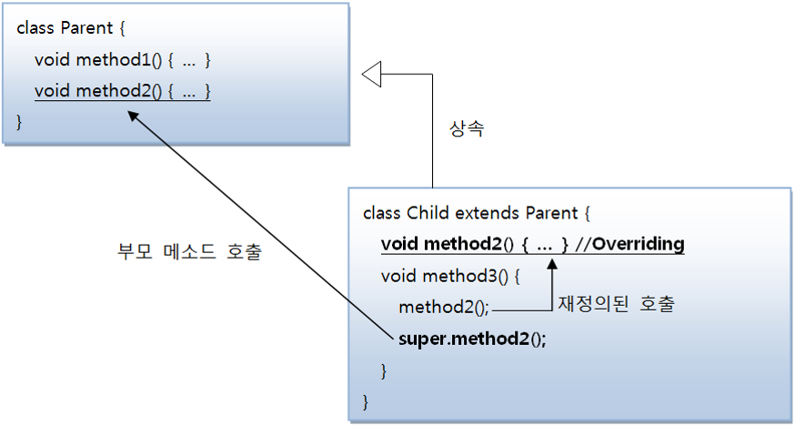

# 7. 상속

## 7.1 상속 개념

- **상속(Inheritance)** : 부모가 자식에게 물려주는 행위를 말한다.

  - 자식은 상속을 통해서 부모가 물려준 것을 자연스럽게 이용할 수 있다.

- 객체 지향 프로그램에서도 부모 클래스의 멤버를 자식 클래스에게 물려줄 수 있다.

  - 프로그램에서는 부모 클래스를 상위 클래스라고 부르기도 하고, 자식 클래스를 하위 클래스, 또는 파생 클래스라고 부른다.

  

<br>

- 상속은 이미 잘 개발된 클래스를 재사용해서 새로운 클래스를 만들기 때문에 코드의 중복을 줄여준다.

  

  ```java
  B b = new B();
  b.field1 = 10;
  b.method1();
  // A로부터 물려받은 필드와 메소드
  
  b.field2 = "홍길동";
  b.method2();
  // B가 추가한 필드와 메소드
  ```

- 상속을 해도 부모 클래스의 모든 필드와 메소드가 물려받는 것은 아니다.
  - 부모 클래스에서 private 접근 제한을 갖는 필드와 메소드는 상속 대상에서 제외된다.
  - 부모 클래스와 자식 클래스가 다른 패키지에 존재한다면 default 접근 제한을 갖는 필드와 메소드도 상속 대상에서 제외된다.
  - 그 이외의 경우는 모두 상속의 대상이 된다.
- 상속을 이용하면 클래스의 수정을 최소화시킬 수도 있다.
  
  - 부모 클래스의 수정으로 모든 자식 클래스들의 수정 효과를 가져오기 때문에 유지 보수 시간을 최소화시켜준다.

## 7.2 클래스 상속

- 프로그램에서 자식 클래스를 선언할 때 어떤 부모 클래스를 상속받을 것인지를 결정하고 선택된 부모 클래스는 extends 뒤에 기술한다.

  ```java
  class 자식클래스 extends 부모클래스 {
  	// 필드
      // 생성자
      // 메소드
  }
  ```

  ```java
  class SportsCar extends Car {
  
  }
  ```

- 다른 언어와 달리 자바는 다중 상속을 허용하지 않는다.

  - 즉 여러 개의 부모 클래스를 상속할 수 없다.
  - 그러므로 extends 뒤에는 단 하나의 부모 클래스만 와야 한다.

  ```java
  class 자식클래스 extends 부모클래스1, 부모클래스2 {
  
  }
  // 부모클래스2는 상속될 수 없기 때문에 컴파일 에러가 발생한다.
  ```

## 7.3 부모 생성자 호출

- 자바에서 자식 객체를 생성하면, 부모 객체가 먼저 생성되고 자식 객체가 그 다음에 생성된다.

  

<br>

- 모든 객체는 클래스의 생성자를 호출해야만 생성된다.

  - 부모 객체도 예외는 아니다.
  - 부모 생성자를 호출하기 위해 부모 생성자는 자식 생성자의 맨 첫 줄에서 호출된다.
    - 자식 생성자가 명시적으로 선언되지 않았다면 컴파일러는 기본 생성자를 생성해 낸다.

  ```java
  public DmbCellPhone() {
  	super();
  }
  ```

- **super()**는 부모의 기본 생성자를 호출한다.

  - 만약 부모 생성자를 선언하지 않았더라도 컴파일러에 의해 기본 생성자가 만들어지므로 문제없이 실행된다.

- 직접 자식 생성자를 선언하고 명시적으로 부모 생성자를 호출하고 싶다면 명시적인 생성자를 만들면 된다.

  ```java
  자식클래스( 매개변수선언, ...) {
  	super(매개값, ...);
      ...
  }
  ```

- super(매개값, ..)는 매개값의 타입과 일치하는 부모 생성자를 호출한다.
  
  - 매개값의 타입과 일치하는 부모 생성자가 없을 경우 컴파일 오류가 발생한다.
- super(매개값, ..)가 생략되면 컴파일러에 의해 super()가 자동적으로 추가되기 때문에 부모의 기본 생성자가 존재해야 한다.
  - 부모 클래스에 기본 생성자가 없고 매개 변수가 있는 생성자만 있다면 자식 생성자에서 반드시 부모 생성자 호출을 위해 super(매개값, ..)를 명시적으로 호출해야 한다.
  - super(매개값, ..)는 반드시 자식 생성자 첫 줄에 위치해야 한다. 그렇지 않으면 컴파일 에러가 난다.

## 7.4 메소드 재정의

- 부모 클래스의 모든 메소드가 자식 클래스에게 맞게 설계되어 있다면 가장 이상적인 상속이지만, 어떤 메소드는 자식 클래스가 사용하기에 적합하지 않을 수도 있다.
  - 이 경우 상속된 일부 메소드는 자식 클래스에서 다시 수정해서 사용해야 한다.
  - 자바는 이런 경우를 위해 메소드 오버라이딩(Overriding) 기능을 제공한다.

### 7.4.1 메소드 재정의(@Override)

- 메소드 오버라이딩은 상속된 메소드의 내용이 자식 클래스에 맞지 않을 경우, 자식 클래스에서 동일한 메소드를 재정의하는 것을 말한다.

  - 메소드 오버라이딩이 되었다면 부모 객체의 메소드는 숨겨지기 때문에, 자식 객체에서 호출하면 오버라이딩된 자식 메소드가 호출된다.

- 메소드를 오버라이딩할 때의 규칙

  > - 부모의 메소드와 동일한 시그너처(리턴 타입, 메소드 이름, 매개 변수 리스트)를 가져야 한다.
  > - 접근 제한을 더 강하게 오버라이딩할 수 없다.
  > - 새로운 예외(Exception)를 throw할 수 없다.

- 접근 제한을 더 강하게 오버라이딩할 수 없다는 것은 부모 메소드가 public 접근 제한을 가지고 있을 경우 오버라이딩하는 자식 메소드는 default나 private 접근 제한으로 수정할 수 없다는 뜻이다.
  
  - 하지만 반대로 부모 메소드가 default 접근 제한을 가지면 재정의되는 자식 메소드는 default 또는 public 접근 제한을 가질 수 있다.

### 7.4.2 부모 메소드 호출(super)

- 자식 클래스에서 부모 클래스의 메소드를 오버라이딩하게 되면, 부모 클래스의 메소드는 숨겨지고 오버라이딩된 자식 메소드만 사용된다.

  - 그러나 자식 클래스 ㄴ내부에서 오버라이딩된 부모 클래스의 메소드를 호출해야 하는 상황이 발생한다면 명시적으로 super 키워드를 붙여서 부모 메소드를 호출할 수 있다.
  - super는 부모 객체를 참조하고 있기 때문에 부모 메소드에 직접 접근할 수 있다.

  ```java
  super.부모메소드();
  ```

  

## 7.5 final 클래스와 final 메소드

- final 키워드는 클래스, 필드, 메소드 선언 시에 사용할 수 있다.
  - final 키워드는 해당 선언이 최종 상태이고, 결코 수정될 수 없음을 뜻한다.
  - 클래스와 메소드 선언 시에 final 키워드가 지정되면 상속과 관련이 있다.

### 7.5.1 상속할 수 없는 final 클래스

- 클래스를 선언할 때 final 키워드를 class 앞에 붙이게 되면 이 클래스는 최종적인 클래스이므로 상속할 수 없는 클래스가 된다.

  - 즉 final 클래스는 부모 클래스가 될 수 없어 자식 클래스를 만들 수 없다.

  ```java
  public final class 클래스 {...}
  ```

- final 클래스의 대표적인 예시는 자바 표준 API에서 제공하는 String 클래스이다.

  ```java
  public final class String {..}
  ```

### 7.5.2 오버라이딩할 수 없는 final 메소드

- 메소드를 선언할 때 final 키워드를 붙이게 되면 이 메소드는 최종적인 메소드이므로 오버라이딩(Overriding) 할 수 없는 메소드가 된다.

  - 즉 부모 클래스를 상속해서 자식 클래스를 선언할 때 부모 클래스에 선언된 final 메소드는 자식 클래스에서 재정의할 수 없다는 것이다.

  ```java
  public final 리턴타입 메소드( [매개변수, ...]) {...}
  ```

## 7.6 protected 접근 제한자

- 접근 제한자는 public, protected, default, private와 같이 네 가지 종류가 있다.

  

  

  <br>

- protected는 public과 default 접근 제한의 중간쯤에 해당한다.
  
- 같은 패키지에서는 default와 같이 접근 제한이 없지만 다른 패키지에서는 자식 클래스만 접근을 허용한다.
  
- protected는 필드와 생성자, 메소드 선언에 사용될 수 있다.

  ```java
  package package1;
  
  public class A{
  	protected String field;
      
      protected A() {
      }
      
      protected void method() {
      }
  }
  ```

  ```java
  package package1;
  
  public class B {
      public void method() {
          A a = new A();	// (o)
          a.field = "value";	// (o)
          a.method();	// (o)
      }
      // 같은 패키지에 존재하기 때문에 멤버들을 호출하는 것이 가능하다.
  }
  ```

  ```java
  package package2;
  
  public class C {
      public void method() {
          A a = new A();	// (x)
          a.field = "value";	// (x)
          a.method();	// (x)
      }
      // C 클래스는 다른 패키지에 존재하기 때문에 A 클래스를 생성하는 것과 멤버들을 호출하는 것이 불가능하다.
  }
  ```

  ```java
  package package2;
  
  import package1.A;
  
  public class D extends A {
      public D() {
          super();	// (o)
          this.field = "value";	// (o)
          this.method();	// (o)
      }
      // D 클래스는 다른 패키지에 있지만 A 클래스의 자식 클래스이므로 멤버들을 호출하는 것이 가능하다.
  }
  ```

## 7.7 타입 변환과 다형성

- **다형성** : 같은 타입이지만 실행 결과가 다양한 객체를 이용할 수 있는 성질을 말한다.

  - 코드 측면에서 보면 다형성은 하나의 타입에 여러 객체를 대입함으로써 다양한 기능을 이용할 수 있도록 해준다.
  - 다형성을 위해 자바는 부모 클래스로 타입 변환을 허용한다.
    - 즉 부모 타입에 모든 자식 객체가 대입될 수 있다.
    - 이것을 이용하면 객체는 부품화가 가능하다.

  

  ```java
  public class Car {
  	Tire t1 = new HankookTire();
      Trie t2 = new KumhoTire();
  }
  // 부모 객체에 자식 객체를 대입
  ```

- **타입 변환** : 데이터 타입을 다른 데이터 타입으로 변환하는 행위를 말한다.
  - 클래스 타입도 기본 타입들과 마찬가지로 타입 변환이 있다.
  - 클래스 타입의 변환은 상속 관계에 있는 클래스 사이에서 발생한다.
    - 자식 타입은 부모 타입으로 자동 타입 변환이 가능하다.

### 7.7.1 자동 타입 변환(Promotion)

- **자동 타입 변환(Promotion)** : 프로그램 실행 도중에 자동적으로 타입 변환이 일어나는 것을 말한다.

  ```java
  부모클래스 변수 = 자식클래스타입;
  // 부모 클래스 변수에 자식 클래스 타입을 대입 연산을 실행하면 자동 타입 변환이 실행된다.
  ```

- 자동 타입 변환의 개념은 자식은 부모의 특징과 기능을 상속받기 때문에 부모와 동일하게 취급될 수 있다는 것이다.

  

  ```java
  Cat cat = new Cat();
  Animal animal = cat;
  ```

  

  <br>

- 자동 타입 변환은 바로 위의 부모가 아니더라도 상속 계층에서 상위 타입이라면 자동 타입 변환이 일어날 수 있다.

  

  

  <br>

- 부모 타입으로 자동 타입 변환된 이후에는 부모 클래스에 선언된 필드와 메소드만 접근이 가능하다.
  
  - 비록 변수는 자식 객체를 참조하지만 변수로 접근 가능한 멤버는 부모 클래스 멤버로만 한정된다.
  - 그러나 예외가 있는데, 메소드가 자식 클래스에서 오버라이딩되었다면 자식 클래스의 메소드가 대신 호출된다.
    - 이것은 다형성(Polymorphism)과 관련된 매우 중요한 성질이다.

### 7.7.2 필드의 다형성

- **다형성** : 동일한 타입을 사용하지만 다양한 결과가 나오는 성질을 말한다.

  - 주로 필드의 값을 다양화함으로써 실행 결과가 다르게 나오도록 구현하는데, 필드의 타입은 변함이 없지만, 실행 도중에 어떤 객체를 필드로 저장하느냐에 따라 실행 결과가 달라질 수 있다.
    - 이것이 필드의 다형성이다.

- 프로그램은 수많은 객체들이 서로 연결되고 각자의 역할을 하게 되는데, 이 객체들은 다른 객체로 교체될 수 있어야 한다.

  `자동차에 타이어는 언제든지 성능이 좋은 다른 타이어로 교체할 수 있어야 한다. 새로 교체되는 타이어는 사용 방법은 동일하지만 실행 결과는 더 우수하게 나와야 할 것이다.`

  - 이것을 프로그램으로 구현하기 위해서는 상속과 오버라이딩, 그리고 타입 변환을 이용하는 것이다.

- 부모 클래스를 상속하는 자식 클래스는 부모가 가지고 있는 필드와 메소드를 가지고 있으니 사용 방법이 동일할 것이고, 자식 클래스는 부모의 메소드를 오버라이딩(재정의)해서 메소드의 실행 내용을 변경함으로써 더 우수한 실행 결과가 나오게 할 수 있다.

  - 자식 타입을 부모 타입으로 변환할 수 있다.

  ```java
  class Car {
  	// field
      Tire frontLeftTire = new Tire();
      Tire frontRightTire = new Tire();
      Tire backLeftTire = new Tire();
      Tire backRightTire = new Tire();
  }
  ```

  ```java
  Car myCar = new Car();
  myCar.frontRightTire = new HankookTire();
  myCar.backLeftTire = new KumhoTire();
  myCar.run();
  // 자식 클래스로 자동 타입 변환을 함으로써 더 우수한 실행 결과를 나오게 한다.
  ```

### 7.7.3 하나의 배열로 객체 관리

- 동일한 객체 필드들은 배열로 관리하는 것이 코드를 깔끔하게 한다.

  ```java
  class Car {
      Tire[] tires = {
          new Tire("앞왼쪽", 6),
          new Tire("앞오른쪽", 2),
          new Tire("뒤왼쪽", 3),
          new Tire("뒤오른쪽", 4)
      };
  }
  ```

  - 동일한 타입의 객체들을 배열로 관리하게 되면 인덱스로 해당 객체에 접근이 가능하므로 대입이나 제어문에서 활요하기 매우 쉽다.
    - 상속 관계에 객체들을 배열로 관리하면 제어문에서 가장 많이 혜택을 본다.

### 7.7.4 매개 변수의 다형성

- 자동 타입 변환은 필드의 값을 대입할 때에도 발생하지만, 주로 메소드를 호출할 때 많이 발생한다.

  - 메소드를 호출할 때에는 매개 변수의 타입과 동일한 매개값을 지정하는 것이 정석이지만, 매개값을 다양화하기 위해 매개 변수에 자식 타입 객체를 지정할 수도 있다.

  ```java
  class Driver {
      void drive(Vehicle vehicle) {
          vehicle.run();
      }
  }
  ...
  Driver driver = new Driver();
  Vehicle vehicle = new Vehicle();
  driver.drive(vehicle);
  // 일반적인 매개 변수 대입
  ```

  

<br>

- 메소드의 매개 변수로 자식 클래스의 객체를 넣어준다면 자동 타입 변환이 발생하여 매개 변수로 객체의 참조값이 주어지게 된다.
- 여기서 매우 중요한 사실은 매개 변수의 타입이 클래스일 경우, 해당 클래스의 객체뿐만 아니라 자식 객체까지도 매개값으로 사용할 수 있다는 것이다.
  - 매개값으로 어떤 자식 객체가 제공되느냐에 따라 메소드의 실행 결과는 다양해질 수 있다(매개 변수의 다형성).
  - 자식 객체가 부모의 메소드를 재정의(오버라이딩) 했다면 메소드 내부에서 오버라이딩된 메소드를 호출함으로써 메소드의 실행 결과는 다양해진다.

### 7.7.5 강제 타입 변환(Casting)

- **강제 타입 변환(Casting)** : 부모 타입을 자식 타입으로 변환하는 것을 말한다.

  - 모든 부모 타입을 자식 클래스 타입으로 강제 변환할 수 있는 것은 아니다.
  - 자식 타입이 부모 타입으로 자동 변환한 후, 다시 자식 타입으로 변환할 때 강제 타입 변환을 사용할 수 있다.

  

<br>

- 자식 타입이 부모 타입으로 자동 변환하면, 부모 타입에 선언된 필드와 메소드만 사용 가능하다는 제약 사항이 따른다.
  - 자식 타입에 선언된 필드와 메소드를 꼭 사용해야 한다면 강제 타입 변환을 해서 다시 자식 타입으로 변환한 다음 자식 타입의 필드와 메소드를 사용하면 된다.

### 7.7.6 객체 타입 확인(instanceof)

- 강제 타입 변환은 자식 타입이 부모 타입으로 변환되어 있는 상태에서만 가능하기 때문에 부모 타입의 변수가 부모 객체를 참조할 경우 자식 타입으로 변환할 수 없다.

  ```java
  Parent parent = new Parent();
  Child child = (Child)parent;	// 강제 타입 변환을 할 수 없다.
  ```

- 어떤 객체가 어떤 클래스의 인스턴스인지 확인하려면  instanceof 연산자를 사용할 수 있다.

- **instanceof** : 연산자의 좌항은 객체가 오고, 우항은 타입이 오는데, 좌항의 객체가 우항의 인스턴스이면 즉 우항의 타입으로 객체가 생성되었다면 true를 산출하고 그렇지 않으면 false를 산출한다.

  ```java
  boolean result = 좌항(객체) instanceof 우항(타입)
  ```

  - instanceof 연산자는 매개값이 타입을 조사할 때 주로 사용된다.
  - 메소드 내에서 강제 타입 변환이 필요할 경우 반드시 매개값이 어떤 객체인지 instanceof 연산자로 확인하고 안전하게 강제 타입 변환을 해야 한다.

  ```java
  public void method(Parent parent) {
      if(parent instanceof Child) {
          Child child = (Child)parent;
      }
  }
  ```

  - 만약 타입을 확인하지 않고 강제 타입 변환을 시도한다면 ClassCastException 예외가 발생할 수 있다.

## 7.8 추상 클래스

### 7.8.1 추상 클래스의 개념

- **추상(abstract)** : 실체 간에 공통되는 특성을 추출한 것을 말한다.

- 클래스에서도 추상 클래스가 존재하는데 객체를 직접 생성할 수 있는 클래스를 실체 클래스라고 한다면 이 클래스들의 공통적인 특성을 추출해서 선언한 클래스를 추상 클래스라고 한다.

  - 추상 클래스와 실체 클래스는 상속의 관계를 가지고 있다.

- 추상 클래스가 부모이고 실체 클래스가 자식으로 구현되어 실체 클래스는 추상 클래스의 모든 특성을 물려받고, 추가적인 특성을 가질 수 있다.

  - 여기서 특성이란 필드와 메소드들을 말한다.

  

<br>

- 추상 클래스는 실체 클래스의 공통되는 필드와 메소드를 추출해서 만들었기 때문에 객체를 직접 생성해서 사용할 수 없다.

  - 추상 클래스는 new 연산자를 사용해서 인스턴스를 생성시키지 못한다.

- 추상 클래스는 새로운 실체 클래스를 만들기 위해 부모 클래스로만 사용된다.

  - 코드상에서 extends 뒤에만 올 수 있는 클래스를 말한다.

  ```java
  class Ant extends Animal {...}
  ```

### 7.8.2 추상 클래스의 용도

#### 첫 번째, 실체 클래스들의 공통된 필드와 메소드의 이름을 통일할 목적

- 실체 클래스를 설계하는 사람이 여러 사람일 경우, 실체 클래스마다 필드와 메소드가 제각기 다른 이름을 가질 수 있다.
  - 동일한 데이터와 기능임에도 불구하고 이름이 다르다 보니, 객체마다 사용 방법이 달라진다.

#### 두 번째, 실체 클래스를 작성할 때 시간을 절약

- 공통적인 필드와 메소드는 추상 클래스에 모두 선언해 두고, 실체 클래스마다 다른 점만 실체 클래스에 선언하게 되면 실체 클래스를 작성하는데 시간을 절약할 수 있다.

- 개발 프로젝트에서 설계자와 코더(코드를 작성하는 사람)는 일반적으로 다른 사람이다.
  - 설계자는 코더에게 클래스는 어떤 구조로 작성해야 한다는 것을 알려줄 필요성이 있다.
  - 단순히 문서로 코더에게 전달한다면, 코더가 실수로 필드와 메소드 이름을 다르게 코딩할 수 있다.
  - 코더가 작성해야 할 클래스가 다수이고, 이 클래스들이 동일한 필드와 메소드를 가져야 할 경우, 설계자는 이 내용들을 추려내어 추상 클래스로 설계 규겻을 만드는 것이 좋다.
  - 코더에게 추상 클래스를 상속해서 구체적인 클래스를 만들도록 지시하면 된다.

### 7.8.3 추상 클래스 선언

- 추상 클래스를 선언할 때에는 클래스 선언에 abstract 키워드를 붙여야 한다.

  - abstract를 붙이게 되면 new 연산자를 이용해서 객체를 만들지 못하고 상속을 통해 자식 클래스만 만들 수 있다.

  ```java
  public abstract class 클래스 {
  	// 필드
      // 생성자
      // 메소드
  }
  ```

- 추상 클래스도 일반 클래스와 마찬가지로 필드, 생성자, 메소드 선언을 할 수 있다.

  - new 연산자로 직접 생성자를 호출할 수는 없지만 자식 객체가 생성될 때 super(...)를 호출해서 추상 클래스 객체를 생성하므로 추상 클래스도 생성자가 반드시 있어야 한다.

### 7.8.4 추상 메소드와 오버라이딩

- 추상 클래스는 클래스가 공통적으로 가져야 할 필드와 메소드들을 정의해 놓은 추상적인 클래스이므로 실체 클래스의 멤버(필드, 메소드)를 통일화하는데 목적이 있다.

  - 모든 실체들이 가지고 있는 메소드의 실행 내용이 동일하다면 추상 클래스에 메소드를 작성하는 것이 좋을 것이다.
  - 하지만 메소드의 선언만 통일화하고, 실행 내용은 실체 클래스마다 달라야 하는 경우가 있다.

  `동물은 소리를 내기 때문에 Animal 추상 클래스에서 sound()라는 메소드를 정의했다고 하였을 때 각각의 동물들은 내는 소리가 다르기 때문에 실체에서 직접 작성해야 한다.`

- 추상 클래스는 추상 메소드를 선언할 수 있다.

  - **추상 메소드** : 추상 클래스에서만 선언할 수 있는 메소드로, 메소드의 선언부만 있고 메소드 실행 내용인 중괄호 {}가 없는 메소드를 말한다.
  - 추상 클래스를 설계할 때 하위 클래스가 반드시 실행 내용을 채우도록 강요하고 싶은 메소드가 있을 경우, 해당 메소드를 추상 메소드로 선언하면 된다.
  - 자식 클래스는 반드시 추상 메소드를 재정의(오버라이딩)해서 실행 내용을 작성해야 하는데, 그렇지 않으면 컴파일 에러가 발생한다.

  ```java
  [public | protected] abstract 리턴타입 메소드명(매개변수, ...);
  ```

- 일반 메소드 선언과의 차이점은 abstract 키워드가 붙어 있고 메소드 중괄호 {}가 없다.

  