# 8. 인터페이스

## 8.1 인터페이스의 역할

- 자바에서 인터페이스(interface)는 객체의 사용 방법을 정의한 타입이다.

- 인터페이스는 객체의 교환성을 높여주기 때문에 다형성을 구현하는 매우 중요한 역할을 한다.

  - 특히 자바 8에서 인터페이스의 중요성은 더욱 커졌다.
  - 자바 8의 람다식은 함수적 인터페이스의 구현 객체를 생성하기 때문이다.

- **인터페이스(interface)** : 개발 코드와 객체가 서로 통신하는 접점 역할을 한다.

  - 개발 코드가 인터페이스의 메소드를 호출하면 인터페이스는 객체의 메소드를 호출시킨다.
  - 개발 코드는 객체의 내부 구조를 알 필요가 없고 인터페이스의 메소드만 알고 있으면 된다.

  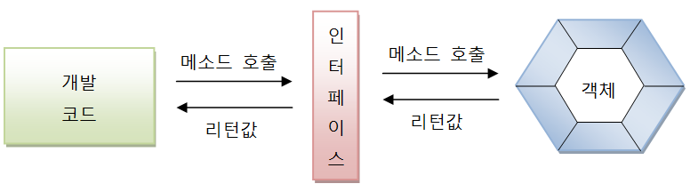

<br>

- 개발 코드가 직접 객체의 메소드를 호출하면 간단하지만, 개발 코드를 수정하지 않고, 사용하는 객체를 변경할 수 있도록 하기 위해 인터페이스를 사용한다.

- 인터페이스는 하나의 객체가 아니라 여러 객체들과 사용이 가능하므로 어떤 객체를 사용하느냐에 따라서 실행 내용과 리턴값이 다를 수 있다.

  - 따라서 개발 코드 측면에서도 코드 변경 없이 실행 내용과 리턴값을 다양화할 수 있다는 장점을 가지게 된다.

  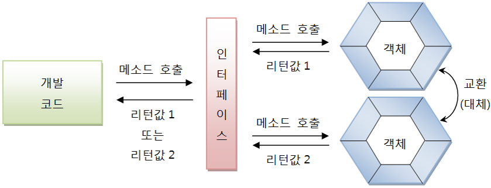

## 8.2 인터페이스 선언

**인터페이스는 "a.java" 형태의 소스 파일로 작성되고, 컴파일러(javac.exe)를 통해 "a.class" 형태로 컴파일되기 때문에 물리적 형태는 클래스와 동일하나, 차이점은 소스를 작성할 때 선언하는 방법이 다르다.**

### 8.2.1 인터페이스 선언

- 인터페이스 선언은 class 키워드 대신에 interface 키워드를 사용한다.

  ```java
  [public] interface 인터페이스명 {...}
  ```

- 인터페이스 이름은 클래스 이름을 작성하는 방법과 동일하다.

  - 영어 대소문자를 구분하며, 첫 문자를 대문자로 하고 나머지는 소문자로 작성하는 것이 관례이다.
  - public 접근 제한은 다른 패키지에서도 인터페이스를 사용할 수 있도록 해준다.

- 클래스는 필드, 생성자, 메소드를 구성 멤버로 가지는데 비해, 인터페이스는 상수와 메소드만을 구성 멤버로 가진다.

  - 인터페이스는 객체로 생성할 수 없기 때문에 생성자를 가질 수 없다.
  - 자바 7 이전 까지는 인터페이스의 메소드는 실행 블록이 없는 추상 메소드로만 선언이 가능했지만, 자바 8부터는 디폴트 메소드와 정적 메소드도 선언이 가능하다.

  ```java
  interface 인터페이스명 {
      // 상수
      타입 상수명 = 값;
      // 추상 메소드
      타입 메소드명(매개변수, ...);
      // 디폴트 메소드
      default 타입 메소드명(매개변수, ...) {...}
      // 정적 메소드
      static 타입 메소드명(매개변수) {...}
  }
  ```

#### 상수 필드(Constant Field)

- 인터페이스는 객체 사용 설명서이므로 런타임 시 데이터를 저장할 수 있는 필드를 선언할 수 없다.
  - 상수 필드 선언은 가능하다.
- 상수는 인터페이스에 고정된 값으로 런타임 시에 데이터를 바꿀 수 없다.
  - 상수를 선언할 때에는 반드시 초기값을 대입해야 한다.

#### 추상 메소드(Abstract Method)

- 추상 메소드는 객체가 가지고 있는 메소드를 설명한 것으로 호출할 때 어떤 매개값이 필요하고, 리턴 타입이 무엇인지만 알려준다.
  - 실제 실행부는 객체(구현 객체)가 가지고 있다.

#### 디폴트 메소드(Default Method)

- 디폴트 메소드는 인터페이스에 선언되지만 사실 객체(구현 객체)가 가지고 있는 인스턴스 메소드라고 생각해야 한다.
  - 자바 8에서 디폴트 메소드를 허용한 이유는 기존 인터페이스를 확장해서 새로운 기능을 추가하기 위해서이다.

#### 정적 메소드(Static Method)

- 정적 메소드 역시 자바 8부터 작성할 수 있는데, 디폴트 메소드와는 달리 객체가 없어도 인터페이스만으로 호출이 가능하다.

### 8.2.2 상수 필드 선언

- 인터페이스는 데이터를 저장할 수 없기 때문에 저장할 인스턴스 또는 정적 필드를 선언할 수 없다.

- 상수는 public static final로 선언한다.

  - 따라서 인터페이스에 선언된 필드는 모두 public static final의 특성을 갖는다.
  - public, static, final을 생략하더라도 자동적으로 컴파일 과정에서 붙게 된다.

  ```java
  [public static final] 타입 상수명 = 값;
  ```

- 상수명은 대문자로 작성하되, 서로 다른 단어로 구성되어 있을 경우에는 언더바(_)로 연결하는 것이 관례이다.
- 인터페이스 상수는 static {} 블록으로 초기화할 수 없기 때문에 반드시 선언과 동시에 초기값을 지정해야 한다.

### 8.2.3 추상 메소드 선언

- 인터페이스를 통해 호출된 메소드는 최종적으로 객체에서 실행된다.

  - 인터페이스의 메소드는 실행 블록이 필요 없는 추상 메소드로 선언한다.

- 추상 메소드는 리턴 타입, 메소드명, 매개변수만 기술되고 중괄호 {}를 붙이지 않는 메소드를 말한다.

  - 인터페이스에 선언된 추상 메소드는 모두 public abstract의 특성을 갖기 때문에 public abstract를 생략하더라도 자동적으로 컴파일 과정에서 붙게 된다.

  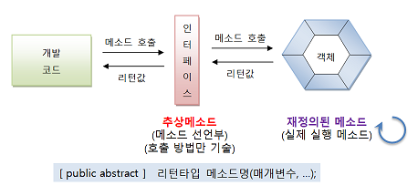

### 8.2.4 디폴트 메소드 선언

- 디폴트 메소드는 자바 8에서 추가된 인터페이스의 새로운 멤버이다.

- 인터페이스가 변경이 되면, 인터페이스를 구현하는 모든 클래스들이 해당 메소드를 구현해야 하는 문제가 있다.

  - 이런 문제를 해결하기 위하여 인터페이스에 메소드를 구현해 놓을 수 있도록 하였다.

- 디폴트 메소드의 형태는 클래스의 인스턴스 메소드와 동일하나, default 키워드가 리턴 타입 앞에 붙는다.

  - 디폴트 메소드는 public 특성을 갖기 때문에 public을 생략하더라도 자동적으로 컴파일 과정에서 붙게 된다.

  ```java
  [public] default 리턴타입 메소드명(매개변수, ...) {...}
  ```

### 8.2.5 정적 메소드 선언

- 정적 메소드는 디폴트 메소드와 마찬가지로 자바 8에서 추가된 인터페이스의 새로운 멤버이다.

  - 형태는 클래스의 정적 메소드와 완전 동일하다.

- 정적 메소드는 public 특성을 갖기 때문에 public을 생략하더라도 자동적으로 컴파일 과정에서 붙게 된다.

  ```java
  [public] static 리턴타입 메소드명(매개변수, ...) {...}
  ```

## 8.3 인터페이스 구현

- 개발 코드가 인터페이스 메소드를 호출하면 인터페이스는 객체의 메소드를 호출한다.

  - 객체는 인터페이스에서 정의된 주상 메소드와 동일한 메소드 이름, 매개 타입, 리턴 타입을 가진 실체 메소드를 가지고 있어야 한다.
  - 이러한 객체를 인터페이스의 구현(implement) 객체라고 하고, 구현 객체를 생성하는 클래스를 구현 클래스라고 한다.

  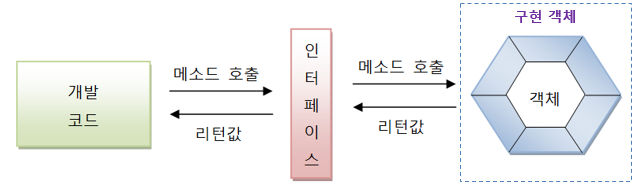

### 8.3.1 구현 클래스

- **구현 클래스** : 보통의 클래스와 동일한데, 인터페이스 타입으로 사용할 수 있음을 알려주기 위해 클래스 선언부에 implements 키워드를 추가하고 인터페이스명을 명시해야 한다.

  ```java
  public class 구현클래스명 implements 인터페이스명 {
      // 인터페이스에 선언된 추상 메소드의 실체 메소드 선언
  }
  ```

  - 인터페이스에 선언된 추상 메소드의 실제 메소드를 선언해야 한다.

**구현 클래스에서 인터페이스의 추상 메소드들에 대한 실제 메소드를 작성할 때 주의할 점** 

- 인터페이스의 모든 메소드는 기본적으로 public 접근 제한을 갖기 때문에 public 보다 더 낮은 접근 제한으로 작성할 수 없다.

  - public을 생략하면 "Cannot reduce this visibillity of the inherited method"라는 컴파일 에러를 만나게 된다.

- 만약 인터페이스에 선언된 추상 메소드에 대응하는 실체 메소드를 구현 클래스가 작성하지 않으면 구현 클래스는 자동적으로 추상 클래스가 된다.

  - 이 경우에 클래스 선언부에 abstract 키워드를 추가해야 한다.

  ```java
  public static class Television implements RemoteControl {
      public void turnOn() {...}
      public void turnOf() {...}
  }
  ```

- 구현 클래스가 작성되면 new 연산자로 객체를 생성할 수 있다.

  - 구현 클래스에 대한 변수를 생성하여 객체를 생성하는 것은 인터페이스를 사용하는 것이 아니다.

  ```java
  Television tv = new Television();
  // 인터페이스를 사용한 것이 아님
  ```

  - 인터페이스로 구현 객체를 사용하려면 인터페이스 변수를 선언하고 구현 객체를 대입해야 한다.
    - 인터페이스 변수는 참조 타입이기 때문에 구현 객체가 대입될 경우 구현 객체의 번지를 저장한다.

  ```java
  인터페이스 변수;
  변수 = 구현객체;
  ```

### 8.3.2 익명 구현 객체

- 구현 클래스를 만들어 사용하는 것이 일반적이고, 클래스를 재사용할 수 있기 때문에 편리하다.

  - 하지만 일회성의 구현 객체를 만들기 위해 소스파일을 만들고 클래스를 선언하는 것은 비효율적이다.

- **익명 구현 객체** : 자바에서 소스 파일을 만들지 않고도 구현 객체를 만들 수 있는 방법

  `자바는 UI 프로그래밍에서 이벤트를 처리하기 위해, 그리고 임시 작업 스레드를 만들기 위해 익명 구현 객체를 많이 활용한다.`

  - 자바 8에서 지원하는 람다식은 인터페이스의 익명 구현 객체를 만들기 때문에 익명 구현 객체의 코드 패턴을 잘 익혀두는 것이 좋다.

  ```java
  인터페이스 변수 = new 인터페이스() {
      // 인터페이스에 선언된 추상 메소드의 실체 메소드 선언
  };
  ```

- 일반적으로 객체를 생성하는 것은 new 연산자 뒤에 클래스 이름이 와야 하지만, 이름이 없는 형태로 구현된다.
  - 인터페이스() {}는 인터페이스를 구현해서 중괄호 {}와 같이 클래스를 선언하라는 뜻이고, new 연산자는 이렇게 선언된 클래스를 객체로 생성한다.
  - 중괄호 {}에는 인터페이스에 선언된 모든 추상 메소드들의 실체 메소드를 작성해야 한다.
    - 작성하지 않을 시에는 컴파일 에러가 발생한다.
  - 추가적으로 필드와 메소드를 선언할 수 있지만, 익명 객체 안에서만 사용할 수 있고 인터페이스 변수로 접근할 수 없다.
- 모든 객체는 클래스로부터 생성되는데, 익명 구현 객체도 예외는 아니다.

### 8.3.3 다중 인터페이스 구현 클래스

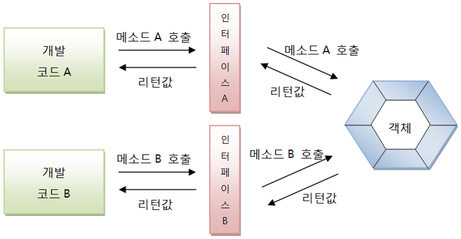

<br>

- 두 가지의 인터페이스에서 메소드를 호출할 수 있으려면 객체는 두 인터페이스를 모두 구현해야 한다.

  ```java
  public class 구현클래스명 implements 인터페이스A, 인터페이스B {
      // 인터페이스 A에 선언된 추상 메소드의 실체 메소드 선언
      // 인터페이스 B에 선언된 추상 메소드의 실체 메소드 선언
  }
  ```

- 다중 인터페이스를 구현할 경우, 구현 클래스는 모든 인터페이스의 추상 메소드에 대해 실체 메소드를 작성해야 한다.

  - 만약 하나라도 없다면 추상 클래스로 선언해야 한다.

## 8.4 인터페이스 사용

- 인터페이스로 구현 객체를 사용하려면 인터페이스 변수를 선언하고 구현 객체를 대입해야 한다.

  - 인터페이스 변수는 참조 타입이기 때문에 구현 객체가 대입될 경우 구현 객체의 번지를 저장한다.

- 개발 코드에서 인터페이스는 클래스의 필드, 생성자 또는 메소드의 매개 변수, 생성자 또는 메소드의 로컬 변수로 선언될 수 있다.

  ```java
  public class MyClass {
      // field
      RemoteControl rc = new Television();
      
      // constructor
      MyClass(RemoteControl rc) {
          this.rc = rc;
      }
      
      // method
      void methodA() {
          // local variable
          RemoteControl rc = new Audio();
      }
      
      void methodB(RemoteControl rc) {...}
  }
  ```

### 8.4.1 추상 메소드 사용

- 구현 객체가 인터페이스 타입에 대입되면 인터페이스에 선언된 추상 메소드를 개발 코드에서 호출할 수 있게 된다.

  ```java
  RemoteControl rc = new Television();
  rc.turnOn();
  rc.turnOff();
  ```

  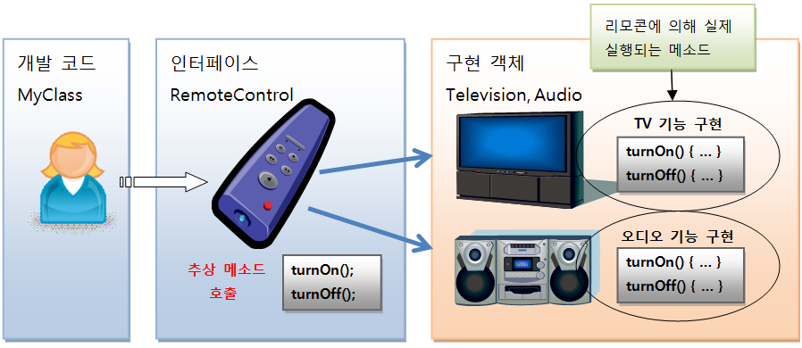

### 8.4.2 디폴트 메소드 사용

- 다폴트 메소드는 인터페이스에 선언되지만, 인터페이스에서 바로 사용할 수 없다.

  - 디폴트 메소드는 추상 메소드가 아닌 인스턴스 메소드이므로 구현 객체가 있어야 사용할 수 있다.

  ```java
  RemoteControl.setMute(true);
  ```

- 디폴트 메소드는 인터페이스의 모든 구현 객체가 가지고 있는 기본 메소드라고 생각하면 된다.
  - 그러나 어떤 구현 객체는 디폴트 메소드의 내용이 맞지 않아 수정이 필요할 수도 있다.
  - 구현 클래스를 작성할 때 디폴트 메소드를 재정의(오버라이딩)해서 자신에게 맞게 수정하면 디폴트  메소드가 호출될 때 자신을 재정의한 메소드가 호출된다.

### 8.4.3 정적 메소드 사용

- 인터페이스의 정적 메소드는 인터페이스로 바로 호출이 가능하다.

## 8.5 타입 변환과 다형성

- 인터페이스는 다형성을 구현하는 기술이 사용된다.
  - 요즘은 상속보다는 인터페이스를 통해서 다형성을 구현하는 구현하는 경우가 더 많다.
- **다형성** : 하나의 타입에 대입되는 객체에 따라서 실행 결과가 다양한 형태로 나오는 성질을 말한다.
  - 부모 타입에 어떤 자식 객체를 대입하느냐에 따라 실행 결과가 달라지듯이, 인터페이스 타입에 어떤 구현 객체를 대입하느냐에 따라 실행 결과가 달라진다.

**상속은 같은 종류의 하위 클래스를 만드는 기술이고, 인터페이스는 사용 방법이 동일한 클래스를 만드는 기술이라는 개념적 차이점은 있지만 둘 다 다형성을 구현하는 기술임에는 틀림없다.**

프로그램을 개발할 때 인터페이스를 사용해서 메소드를 호출하도록 코딩을 했다면, 구현 객체를 교체하는 것은 매우 손쉽고 빠르게 할 수 있다.

프로그램 소스 코드는 변함이 없는데, 구현 객체를 교체함으로써 프로그램의 실행 결과가 다양해진다.

이것이 인터페이스의 다형성이다.

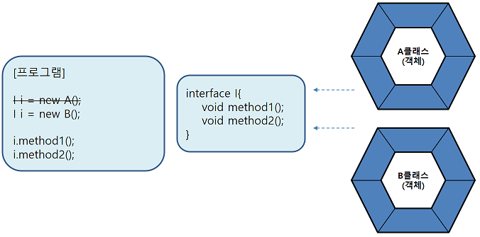

- 인터페이스는 메소드의 매개 변수로 많이 등장한다.
  - 인터페이스 타입으로 매개 변수를 선언하면 메소드 호출 시 매개값으로 여러 가지 종류의 구현 객체를 줄 수 있기 때문에 메소드 실행 결과를 다양하게 나온다.
  - 이것이 인터페이스 매개 변수의 다형성이다.

### 8.5.1 자동 타입 변환(Promotion)

- 구현 객체가 인터페이스 타입으로 변환되는 것은 자동 타입 변환(Promotion)에 해당한다.

  - 자동 타입 변환은 실행 도중에 자동적으로 타입 변환이 일어나는 것을 말한다.

  

  - 인터페이스 구현 클래스를 상속해서 자식 클래스를 만들었다면 자식 객체 역시 인터페이스 타입으로 자동 타입 변환시킬 수 있다.

  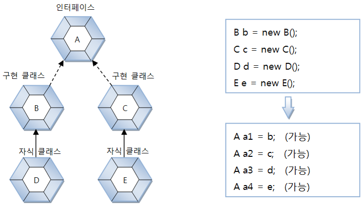

- 자동 타입 변환을 이용하면 필드의 다형성과 매개 변수의 다형성을 구현할 수 있다.
  
  - 필드와 매개 변수의 타입을 인터페이스로 선언하면 여기에 다양한 구현 객체를 대입해서 실행 결과를 다양하게 만들 수 있다.

### 8.5.2 필드의 다형성

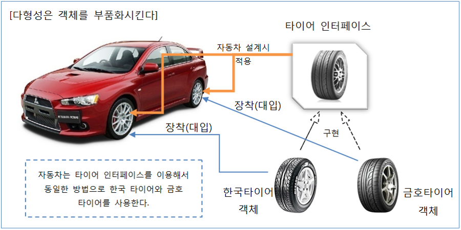

타이어라는 인터페이스를 선언하고 이에 맞는 한국타이어와 금호타이어 구현 클래스를 정의할 수 있다. 자동차라는 클래스에서 필드로 타이어 인터페이스를 선언하고 구현 객체를 한국타이어나 금호타이어를 사용할 수 있다.

```java
public class Car {
    Tire frontLeftTire = new HankookTire();
    Tire frontRightTire = new HankookTire();
    Tire backLeftTire = new HankookTire();
    Tire backRightTire = new HankookTire();
}
```

```java
Car myCar = new Car();
myCar.frontLeftTire = new KumhoTire();
myCar.frontRightTire = new KumhoTire();
```

### 8.5.3 인터페이스 배열로 구현 객체 관리

```java
Tire[] tires = {
    new HankookTire(),
    new HankookTire(),
    new HankookTire(),
    new HankookTire()
};
```

```java
void run() {
    for(Tire tire : tires) {
        tire.roll();
    }
}
```

### 8.5.4 매개 변수의 다형성

- 자동 타입 변환은 필드의 값을 대입할 때에도 발생하지만, 주로 메소드를 호출할 때 많이 발생한다.

  - 메소드의 매개값을 다양화하기 위해서 상속에서는 매개 변수를 인터페이스 타입으로 선언하고 호출할 때에는 구현 객체를 대입한다.

  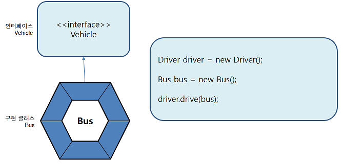

### 8.5.5 강제  타입 변환(Casting)

- 구현 객체가 인터페이스 타입으로 자동 변환하면, 인터페이스에 선언된 메소드만 사용 가능하다는 제약 사항이 따른다.

**하지만 경우에 따라서는 구현 클래스에 선언된 필드와 메소드를 사용해야 할 경우도 발생한다.**

- 이때 강제 타입 변환을 해서 다시 구현 클래스 타입으로 변환한 다음, 구현 클래스의 필드와 메소드를 사용할 수 있다.

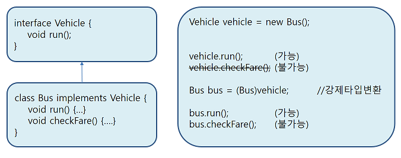

### 8.5.6 객체 타입 확인(instanceof)

- 강제 타입 변환은 구현 객체가 인터페이스 타입으로 변환되어 있는 상태에서 가능하다.

  - 그러나 어떤 구현 객체가 변환되어 있는지 알 수 없는 상태에서 무작정 변환을 할 경우 ClassCastException이 발생할 수도 있다.

  ```java
  Vehicle vehicle = new Taxi();
  Bus bus = (Bus)vehicle;
  ```

  - 메소드의 매개 변수가 인터페이스로 선언된 경우, 메소드를 호출할 때 다양한 구현 객체들을 매개값으로 지정할 수 있다(매개 변수의 다형성).

  ```java
  public void drive(Vehicle vehicle) {
      Bus bus = (Bus)vehicle;	// 어떤 타입으로 자동 타입 변환이 된지 모름
      bus.checkFare();
      vehicle.run();
  }
  ```

- 어떤 구현 객체가 인터페이스 타입으로 변환되었는지 확인하기 위해 instanceof를 사용할 수 있다.

  ```java
  if(vehicle instanceof Bus) {
      Bus bus = (Bus)vehicle;
  }
  ```

**인터페이스 타입으로 자동 변환된 매개값을 메소드 내에서 다시 구현 클래스 타입으로 강제 타입 변환해야 한다면 반드시 매개값이 어떤 객체인지 instanceof 연산자로 확인하고 안전하게 강제 타입 변환을 해야 한다.**

## 8.6 인터페이스 상속

- 인터페이스도 다른 인터페이스를 상속할 수 있다.

  - 인터페이스는 클래스와는 달리 다중 상속을 허용한다.
  - extends 키워드 뒤에 상속할 인터페이스들을 나열할 수 있다.

  ```java
  public interface 하위인터페이스 extends 상위인터페이스1, 상위인터페이스2 {...}
  ```

- 하위 인터페이스를 구현하는 클래스는 하위 인터페이스의 메소드뿐만 아니라 상위 인터페이스의 모든 추상 메소드에 대한 실체 메소드를 가지고 있어야 한다.

  - 그렇기 때문에 구현 클래스로부터 객체를 생성하고 나서 하위 및 상위 인터페이스 타입으로 변환이 가능하다.

  ```java
  하위인터페이스 변수 = new 구현클래스(...);
  상위인터페이스1 변수 = new 구현클래스(...);
  상위인터페이스2 변수 = new 구현클래스(...);
  ```

- 하위 인터페이스로 타입 변환이 되면 상, 하위 인터페이스에 선언된 모든 메소드를 사용할 수 있으나, 상위 인터페이스로 타입 변환되면 상위 인터페이스에 선언된 메소드만 사용 가능하고 하위 인터페이스에 선언된 메소드는 사용할 수 없다.

  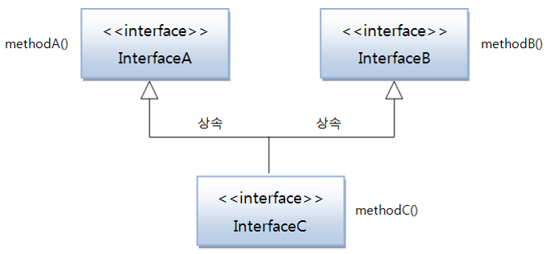

## 8.7 디폴트 메소드와 인터페이스 확장

- 디폴트 메소드는 인터페이스에 선언된 인스턴스 메소드이기 때문에 구현 객체가 있어야 사용할 수 있다.

### 8.7.1 디폴트 메소드의 필요성

- 인터페이스에서 디폴트 메소드를 허용한 이유는 기존 인터페이스를 확장해서 새로운 기능을 추가하기 위해서이다.

  - 기존 인터페이스의 이름과 추상 메소드의 변경 없이 디폴트 메소드만 추가할 수 있기 때문에 이전에 개발한 구현 클래스를 그대로 사용할 수 있으면서 새롭게 개발하는 클래스는 디폴트 메소드를 활용할 수 있다.

  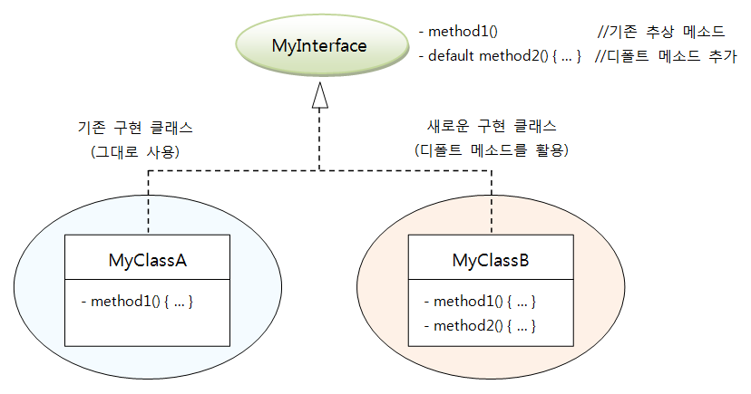

### 8.7.2 디폴트 메소드가 있는 인터페이스 상속

- 부모 인터페이스에 디폴트 메소드가 정의되어 있을 경우, 자식 인터페이스에서 디폴트 메소드를 활용하는 방법

  1. 디폴트 메소드를 단순히 상속만 받는다.
  2. 디폴트 메소드를 재정의(Override)해서 실행 내용을 변경한다.
  3. 디폴트 메소드를 추상 메소드로 재선언한다.

  